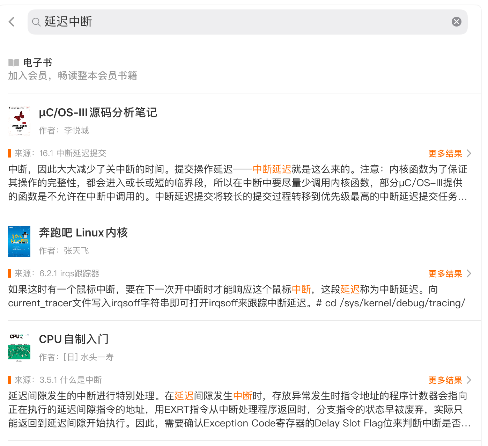
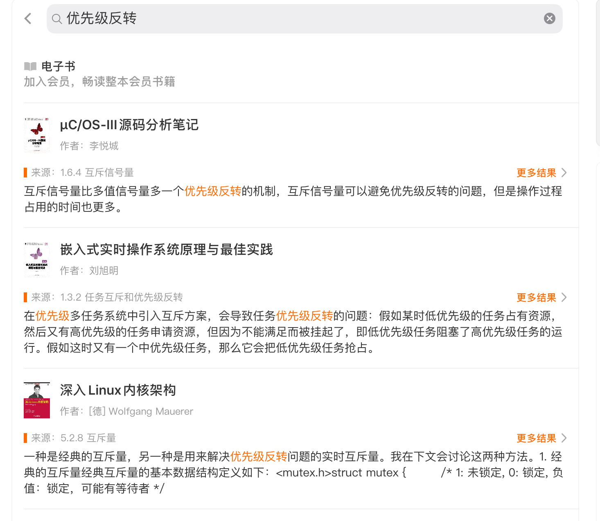
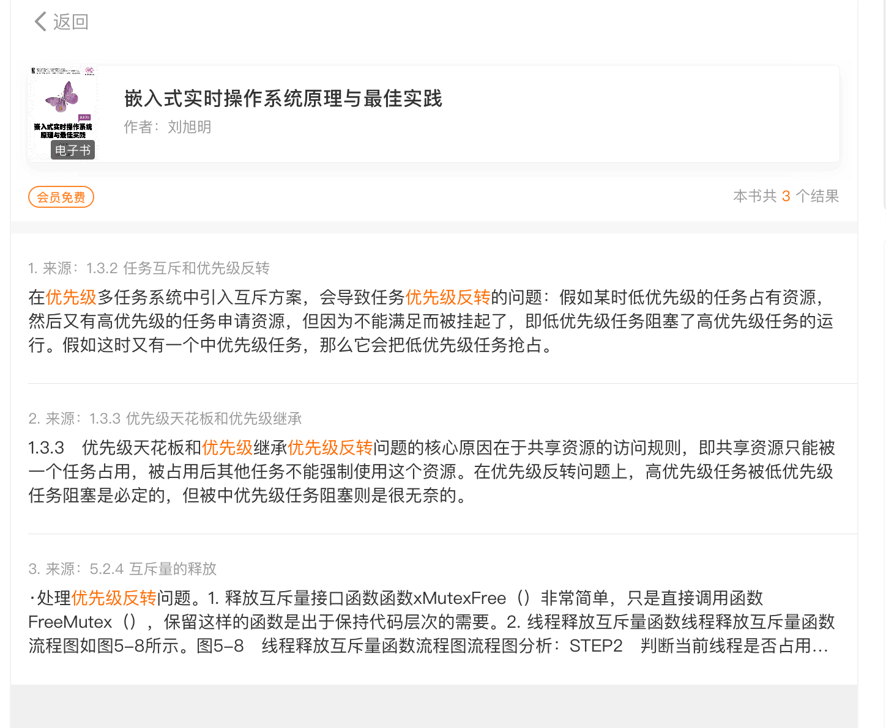
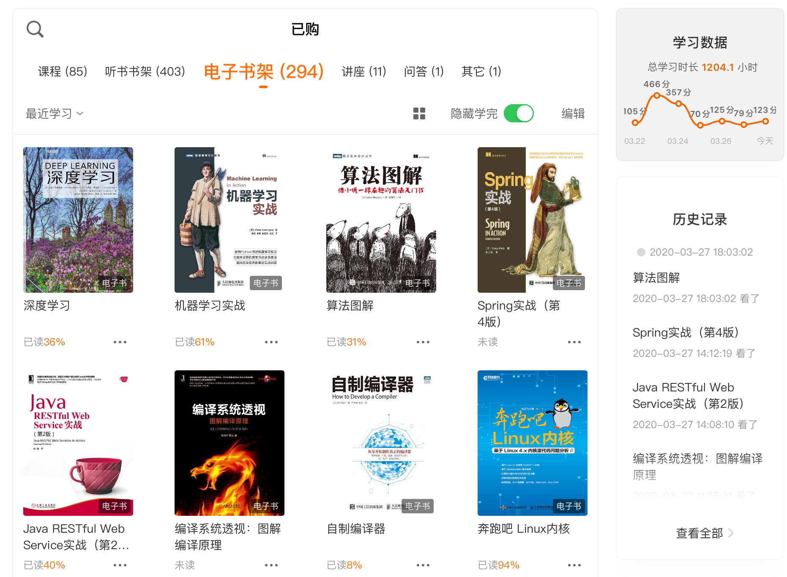
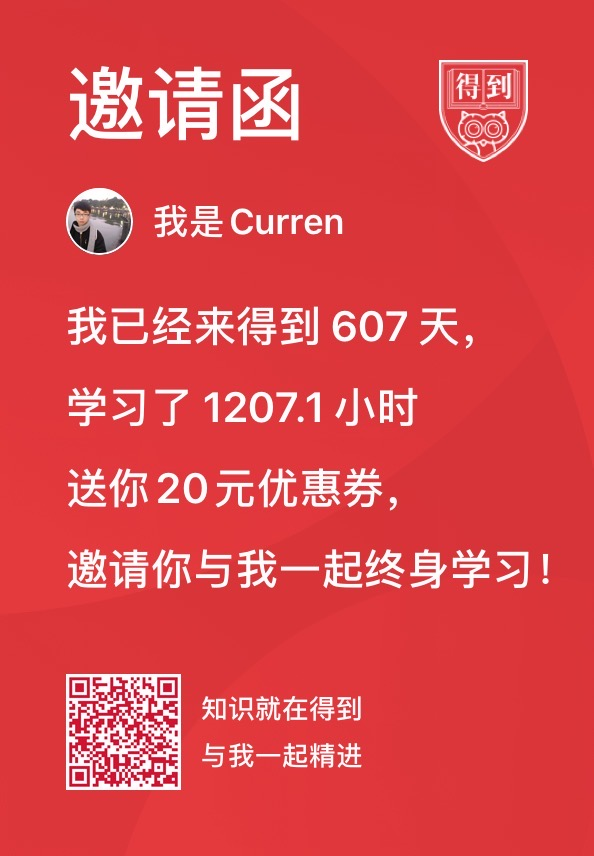

我为什么推荐程序员朋友使用得到APP
===

目录
---

[TOC]

## 1. 背景

前段时间我写了[几篇笔记](https://blog.csdn.net/qq_41729780/article/details/104998185)，文中提到了得到APP的搜索引擎，里面附上了我从得到APP里分享出来的电子书链接。而让我惊奇的是，有同学通过[我的链接](https://m.igetget.com/share/coupon/cover/?aid=1&cid=1&uid=dpkEVlQ1gGONjVMXZPpNj9n3xJ7vzr&source=invite&from=singlemessage)注册了得到。

于是，我就萌生了写一篇笔记来推荐得到APP给程序员朋友们的想法。

我推荐的理由主要有如下三点：

1. 使用得到APP能够对技术书籍内容进行搜索
2. 能够对知识面进行扩充
3. 对碎片时间进行利用

下面我们就一一道来。

## 2. 对技术书籍内容进行搜索

第一个理由是：使用得到APP能够对技术书籍内容进行搜索。

这是让我最喜欢的一个功能，**得到APP里有上万本电子书**，我们比较熟悉的人民邮电出版社《图灵系列丛书》，在得到里几乎都有电子版，而且可以免费浏览任意$10\%$的内容，如果花100多开通一年电子书会员更是**基本都能免费看**。

并且，得到建立了一个**知识搜索引擎**，也就是说，我们可以对得到APP内的课程内容、电子书内容、文章内容进行搜索。

对我们最具吸引力的当然是**对技术书籍进行搜索**了，在我们需要了解一个新概念，或者解决一个新问题的时候，通常需要借助搜索引擎。我们可能在CSDN上找一找博客、在知乎上搜索一下问答。

但是，网络上未经整理的内容质量往往参差不齐，需要花费不少的时间精力去筛选、甄别，并且到最后可能还是找不到一个让我们满意的答案。

但书籍里的内容就不一样了，经过作者的梳理和出版社编辑的筛选，里面的知识已经非常系统化，并且是更加可信的。

所以，在我想要学习一个新概念的时候，我会首先选择从得到的搜索引擎进行搜索。

比如，在写[《uC/OS的延迟中断提交为什么能提高效率》](https://blog.csdn.net/qq_41729780/article/details/105021405)这篇笔记的时候，通过网络搜索`延迟中断`这个关键词，出来的文章非常少，并且我感觉没有讲得非常清楚。而下面是我在得到的搜索引擎中进行搜索时的结果。

$$
\text{Figure 1. 延迟中断搜索}
$$

$$
\text{Figure 2. 延迟中断内容}
$$

搜索完以后，我就能直接通过看[《μC/OS-III源码分析笔记》](https://m.igetget.com/hybrid/v2/ebook/detail?bid=EJmMZXq1b8qOpBlD69XAdP7LEGaKJWEYBqWxRnme5vrVzo4QMZYgNyk2jNA5467K)进行学习了。

再举例来说，我在看[《μC/OS-III源码分析笔记》](https://m.igetget.com/hybrid/v2/ebook/detail?bid=EJmMZXq1b8qOpBlD69XAdP7LEGaKJWEYBqWxRnme5vrVzo4QMZYgNyk2jNA5467K)时，有一个优先级反转的问题不是很清楚，我又在得到里面进行了搜索，结果如下。

$$
\text{Figure 3. 优先级反转搜索}
$$

$$
\text{Figure 4. 优先级反转内容}
$$

我通过刘旭明老师写的[《嵌入式实时操作系统原理与最佳实践》](https://m.igetget.com/hybrid/v2/ebook/detail?bid=OAdXprx6N41dm9BQkayr8z7OqLGoE3lrd80YMlVAnxRZXK2Dg5pbevPJjjnQv2eb)这本书又对优先级反转、优先级继承策略和优先级天花板策略进行了学习，并且摘录了一部分内容在[《操作系统中的优先级反转与中断机制》](https://blog.csdn.net/qq_41729780/article/details/104977013)这篇笔记中。

除了利用得到的搜索引擎以外，直接在得到里看电子书的体验也非常好，而且能在iPad和手机上进行阅读并添加笔记、书签，再也不用拿出好几斤重的书出来翻了。

我之前一口气加了快300本电子书在书架上，也不知道啥时候能看完，哈哈。

$$
\text{Figure 5. 书架}
$$

总之，[得到的知识搜索引擎](https://m.igetget.com/share/coupon/cover/?aid=1&cid=1&uid=dpkEVlQ1gGONjVMXZPpNj9n3xJ7vzr&source=invite&from=singlemessage)能够给我们的学习带来很大的便利，省时高效还不贵。

## 3. 对知识面进行扩充

如果得到的知识搜索引擎还不够吸引你，那么我来为你介绍第二个推荐理由：对知识面进行扩充。

得到上除了有电子书以外，还有上百门课程和对上千本书的音频解读，内容涵盖[经济学](https://m.igetget.com/share/course/pay/detail?id=5zp9lB3q0breKZzSDKYjyWxG64dg2Q)、[金融学](https://m.igetget.com/share/course/pay/detail?id=9LZ1RgB0EW3NK0dSqKkP7vj68pDeAz)、[心理学](https://m.igetget.com/share/course/pay/detail?id=lZWyMAOLnR4xJ1OfNK65QaE8YG29kb)、[历史学](https://m.igetget.com/share/course/pay/detail?id=w0x1A7LvaogNXkbfOJPpql2WmznGDB)和[医学](https://m.igetget.com/share/course/pay/detail?id=LOx1El850jp9VaRfjJZg6MbrdvRBoA)等等各方面内容，甚至还有教你[怎么保护颈椎](https://m.igetget.com/share/course/pay/detail?id=ZWyMAOLnR4xJ1vqsvnX65QaE8YG29k)、[怎么获得职场竞争力](https://m.igetget.com/share/course/pay/detail?id=Em0GbPnO9NwlJ91f4YJ7p6kr5LQxRd)、[怎么处理职场关系](https://m.igetget.com/share/course/pay/detail?id=x9emjk1LQqzoK2Df11J2lbY6Pv0BDW)、[怎么做好一个产品](https://m.igetget.com/share/course/pay/detail?id=YPZNRwQ0qL1MVEpfzK3lmz4kgWEnxr)、[怎么获得用户增长](https://m.igetget.com/share/course/pay/detail?id=D75xge6dAqWVpPasOOVYRzmGO14jPZ)等等课程，每门课程价格在20-200元左右，20元的课大概有10节的内容，100元的课大概30-50节，200元的课就都是全年的了，200-300节的样子，能够帮你系统地了解一个领域内的知识。

在得到里最受程序员朋友欢迎的应该就是[吴军老师](https://m.igetget.com/share/course/pay/detail?id=Y9LnlWEqDj76VzDfwBXmOA4epMBPxa)了，他是谷歌中日韩搜索引擎的主要设计者。很多同学应该听说过吴军老师写的《数学之美》、[《浪潮之巅》](http://m.igetget.com/hybrid/v2/ebook/detail?bid=VEDA2bKO27MKbRardAGJ1N4ln9BLVwgRqD38ZQyXmYqg5PpkEjxovze6DB84dpj6)和《硅谷之谜》。

吴军老师在得到里讲[5G](https://m.igetget.com/share/course/pay/detail?id=alQr3o4dMw8ZKgafgrJ7N2xDyWeEq1)、讲[信息论](https://m.igetget.com/share/course/pay/detail?id=Y9LnlWEqDj76VzDfwBXmOA4epMBPxa)、讲[数学思维](https://m.igetget.com/share/course/pay/detail?id=lQr3o4dMw8ZKgdasrEV7N2xDyWeEq1)、讲[他在硅谷做投资人的经验](https://m.igetget.com/share/course/pay/detail?id=LOx1El850jp9VaYSGVZg6MbrdvRBoA)，收获了一众好评。

得到上像吴军老师这样的广受好评的老师还有很多，我感觉能跟着这样的老师学习，不光能够扩展视野、锻炼思维，而且还能够让我们短暂地从现实中抽离出来，了解外面的世界，**反思自己的生活**。再说了，通过这样比较轻松的方式了解来自不同行业的各种各样的知识，**本身也是一种享受**。

## 4. 对碎片时间进行利用

第三个推荐理由是：**对碎片时间进行利用**。

得到的课程有一个特点，里面都是专业的配音老师来录制的**音频课**，并且也配有文稿。可以随时随地戴起耳机听课，没有理解的地方可以看看文稿、看看里面的思维导图、其他同学的评论还有老师的解答。

我是在2018年暑假开始使用得到的，那时候我从罗振宇的[《知识就是力量》](http://www.iqiyi.com/a_19rrh5xzvl.html?vfm=2008_aldbd)节目里面了解到了得到，于是就下载下来尝试了一下，结果非常契合我当时的需要。

因为我当时暑假留在学校实习，每天要坐一两个小时的公交或者地铁去公司，每天**通勤**的时间经常还没有座位，站在车上看手机也不方便，听音乐听久了也比较烦躁。而这个时候听一听得到里的音频课就非常适合。老师讲课的内容也很有趣，不会很枯燥，听起来不会特别累。我一下就成为了得到的忠实用户。

在实习结束以后，我又养成了每天吃完晚饭以后还有睡觉以前各听半小时到一小时课的习惯。到现在，**我已经使用了得到607天、学习了1207.1小时**。使用了得到这么长时间，我们先不说它带来的一些思维方面的改变，我光是**和朋友聊天的谈资就多了不少**。在讨论一个问题的适合，我们可以借助听过的课程去进行不同角度的思考，还能**随时引用老师讲过的内容**，减少一些因为没有话题而导致的尬聊。

## 5. 得到是在贩卖焦虑吗

很多人说罗振宇在贩卖焦虑，也有人说或整个知识付费领域都是在贩卖焦虑、割韭菜。李诞还在奇葩说第六季第一期说罗振宇是“搞传销的“。

$$
\text{Figure 6. 奇葩说第六季第一期}
$$

但其实我觉得，什么叫做贩卖焦虑，我可以尝试着给他下一个定义：

1. 告诉你别人有光明伟大的前程，与你的蝇营狗苟形成鲜明的对照。
2. 给你灌输一些看似正确的抽象成功学，告诉你如果做不到这一点，你离成功就越来越远。

比如什么《成功人士必备的两个习惯》，《他如何轻轻松松年入百万》，结果点进去一看告诉你一要自律二要努力。这种文章纯粹就是为了让你点进去赚一点广告流量。

而得到不同，就像罗振宇在2020年跨年演讲上所说的，我们都是**做事的人**，要解决的是**具体的问题**。老师们带你抽象出一个个领域模型以后，又会带你回到现实，告诉你怎么用它来指导生活。最近得到还上线了“十万个怎么办”知识工程，由各行业的资深人士们来解答用户们一个个具体的问题。

我觉得这不是贩卖焦虑的态度，这是的的确确在做知识服务的态度。

好了，我的安利已经完成了。如果同学们感兴趣可以从应用商店下载得到试用一下，也可以通过[我分享的链接](https://m.igetget.com/share/coupon/cover/?aid=1&cid=1&uid=dpkEVlQ1gGONjVMXZPpNj9n3xJ7vzr&source=invite&from=singlemessage)注册，能够**额外获得20元优惠券**。

$$
\text{Figure 7. 邀请码}
$$

---

联系邮箱：curren_wong@163.com

Github：[https://github.com/CurrenWong](https://github.com/CurrenWong)

欢迎转载/Star/Fork，有问题欢迎通过邮箱交流。
