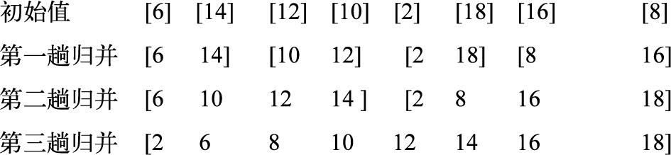
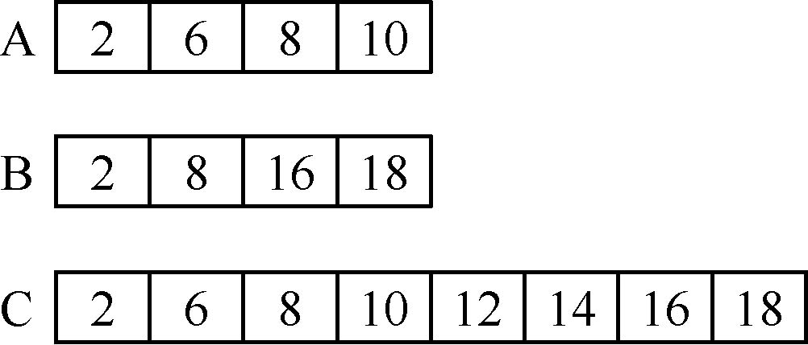

归并排序
===

目录
---

[TOC]

## 1. 背景

最近在做题的时候接触到求逆序数的这一类题目，比如 [51Nod-2134 逆序对个数1000](http://www.51nod.com/Challenge/Problem.html#problemId=2134)，我参考了网上的一些题解，发现大家普遍用归并排序来解决这一类问题，于是我想要学习一下归并排序的具体实现。我从[《算法学习与应用从入门到精通》](http://m.igetget.com/hybrid/v2/ebook/detail?bid=pqvNQ1KRJa7EmgG8MPKrzykNVbDpBWZQZB0QA1xO54nlvZq296YodejLXVJE5eAd) [<sup>1</sup>](#bib-1) 中摘录了归并排序这一部分的内容，形成了这篇笔记。

## 2. 归并排序

在使用归并排序法时，将两个或两个以上有序表`合并`成一个新的有序表。假设初始序列含有k个记录，首先将这`k`个记录看成`k`个有序的子序列，每个子序列的长度为`1`，然后两两进行归并，得到`k/2`个长度为`2`（`k`为奇数时，最后一个序列的长度为`1`）的有序子序列。最后在此基础上再进行两两归并，如此重复下去，直到得到一个长度为`k`的有序序列为止。上述排序方法被称作`二路归并排序法`。

### 2.1. 归并排序思想

归并排序就是利用归并过程，开始时先将`k`个数据看成`k`个长度为1的已排好序的表，将相邻的表成对合并，得到长度为`2`的`（k/2）`个有序表，每个表含有`2`个数据;进一步再`将相邻表成对合并`，得到长度为`4`的`（k/4）`个有序表……如此重复做下去，直到将所有数据均合并到一个长度为`k`的有序表为止，从而完成了排序。`图1`显示了二路归并排序的过程。



$$
\text{Figure 1. 二路归并排序过程}
$$

在`图2`中，假设使用函数`Merge()`将两个有序表进行归并处理，假设将两个待归并的表分别保存在数组`A`和`B`中，将其中一个的数据安排在下标从m到n单元中，另一个安排在下标从`（n+1）`到`h`单元中，将归并后得到的有序表存入到辅助数组`C`中。归并过程是依次比较这两个有序表中相应的数据，按照“取小”原则复制到`C`中。



$$
\text{Figure 2. 两个有序表的归并图}
$$

函数`Merge()`的功能只是归并两个有序表，在进行二路归并的每一趟归并过程中，能够将多对相邻的表进行归并处理。接下来开始讨论一趟的归并，假设已经将数组r中的`n`个数据分成成对长度为`s`的有序表，要求将这些表两两归并，归并成一些长度为`2s`的有序表，并把结果置入辅助数组`r2`中。如果`n`不是`2s`的整数倍，虽然前面进行归并的表长度均为`s`，但是最后还是能再剩下一对长度都是`s`的表。在这个时候，需要考虑如下两种情况。

1. 剩下一个长度为`s`的表和一个长度小于`s`的表，由于上述的归并函数`merge()`并不要求待归并的两个表必须长度相同，仍可将二者归并，只是归并后的表的长度小于其他表的长度`2s`。
2. 只剩下一个表，它的长度小于或等于`s`，由于没有另一个表与它归并，只能将它直接复制到数组`r2`中，准备参加下一趟的归并。

### 2.2. 两路归并算法的思路

假设将两个有序的子文件（相当于输入堆）放在同一向量中的相邻位置上，位置是`r[low…m]`和`r[m+1…high]`。可以先将它们合并到一个局部的暂存向量`r1`（相当于输出堆）中，当合并完成后将`r1`复制回`r[low…high]`中。

1. **合并过程**

    - 预先设置`3`个指针`i`、`j`和`p`，其初始值分别指向这3个记录区的起始位置。
    - 在合并时依次比较`r[i]`和`r[j]`的关键字，将关键字较小的记录复制到`r1[p]`中，然后将被复制记录的指针`i`或`j`加`1`，以及指向复制位置的指针`p`加`1`。
    - 重复上述过程，直到两个输入的子文件中有一个已全部复制完毕为止，此时将另一非空的子文件中剩余记录依次复制到`r1`中。

2. **动态申请**`r1`

在两路归并过程中，`r1`是动态申请的，因为申请的空间会很大，所以需要判断加入申请空间是否成功。二路归并排序法的操作目的非常简单，只是将待排序列中相邻的两个有序子序列合并成一个有序序列。二路归并排序法的具体算法描述如下所示。

```cpp
/* 已知r1[low…mid]和r1[mid+1…high]分别按关键字有序排列 */
/* 将它们合并成一个有序序列，存放在r[low…high] */
void Merge(RecordType r1[], int low, int mid, int high, RecordType r[])
{
    i = low;
    j = mid + 1;
    k = low;
    while ((i <= mid) && (j <= high)) {
        if (r1[i].key <= r1[j].key) {
            r[k] = r1[i];
            ++i;
        } else {
            r[k] = r1[j];
            ++j;
        }
        ++k;
    }
    while (i <= mid) {
        r[k] = r1[i];
        k++, i++;
    }
    while (j <= high)
    {
        r[k] = r1[j];
        k++;
        j++;
    }
}
```

在合并过程中，两个有序的子表被遍历了一遍，表中的每一项均被复制了一次。因此，合并的代价与两个有序子表的长度之和成正比，该算法的时间复杂度为`O(n)`。

可以采用递归方法实现二路归并排序，具体描述如下所示。

```cpp
/* r1[low…high]经过排序后放在r[low…high]中，r2[low…high]为辅助空间 */
void MergeSort(RecordType r1[], int low, int high, RecordType r[])
{
    RecordType* r2;
    r2 = (RecordType*)malloc(sizeof(RecordType) * (hight - low + 1));
    if (low == high)
        r[low] = r1[low];
    else {
        mid = (low + high) / 2;
        MergeSort(r1，low，mid, r2)
            MergeSort(r1，mid + 1，high, r2);
        Merge(r2，low，mid，high，r);
    }
    free(r2);
}
```

### 2.3. 实现归并排序

实现归并排序的方法有两种，分别是自底向上和自顶向下，具体说明如下所示。

#### 2.3.1. 自底向上的方法

1. **自底向上的基本思想**

自底向上的基本思想是，当第`1`趟归并排序时，将待排序的文件`R[1…n]`看作是`n`个长度为`1`的有序子文件，然后将这些子文件两两归并。

- 如果`n`为偶数，则得到`n/2`个长度为`2`的有序子文件;
- 如果`n`为奇数，则最后一个子文件轮空（不参与归并）。

所以当完成本趟归并后，前`[lgn]`个有序子文件长度为`2`，最后一个子文件长度仍为`1`。

第`2`趟归并的功能是，将第`1`趟归并所得到的`[lgn]`个有序的子文件实现`两两归并`。如此反复操作，直到最后得到一个长度为n的有序文件为止。

上述每次归并操作，都是将两个有序的子文件合并成一个有序的子文件，所以称其为“二路归并排序”。类似地还有`k(k>2)`路归并排序。

2. **一趟归并算法**

在某趟归并中，设各子文件长度为`length`（最后一个子文件的长度可能小于`length`），则归并前`R[1…n]`中共有`n`个有序的子文件：`R[1…length]，R[length+1…2length]，…，R[([n/length]−1)*length+1…n]`。

注意：调用归并操作将相邻的一对子文件进行归并时，必须对子文件的个数可能是奇数、以及最后一个子文件的长度小于length这两种特殊情况进行特殊处理。

- 如果子文件个数为奇数，则最后一个子文件无须和其他子文件归并（即本趟轮空）。
- 如果子文件个数为偶数，则要注意最后一对子文件中后一子文件的区间上界是n。

使用C语言实现一趟归并算法的具体代码如下所示。

```cpp
void MergePass(SeqList R，int length)
{ //对R[1…n]做一趟归并排序
    int i;
    for (i = 1; i + 2 * length - 1 <= n; i = i + 2 * length)
        Merge(R，i，i + length - 1，i + 2 * length - 1);
    //归并长度为length的两个相邻子文件
    if (i + length - 1 < n) //尚有两个子文件，其中后一个长度小于length
        Merge(R，i，i + length - 1，n); //归并最后两个子文件
    //注意：若i n且i+length-1n时，则剩余一个子文件轮空，无须归并
} //MergePass
```

3. **二路归并排序算法**

二路归并排序具体代码的算法如下。

```cpp
void MergeSort(SeqList R)
{ //采用自底向上的方法，对R[1…n]进行二路归并排序
    int length;
    for (length = 1; length < n; length *= 2) //做两趟归并
        MergePass(R，length); //有序段长度n时终止
}
```

自底向上的归并排序算法虽然效率较高，但可读性较差。

#### 2.3.2. 自顶向下的方法

用分治法进行自顶向下的算法设计，这种形式更为简洁。

1. **分治法的3个步骤**

设归并排序的当前区间是`R[low…high]`，分治法的3个步骤如下。

- 分解：将当前区间一分为二，即求分裂点。
- 求解：递归地对两个子区间`R[low..mid]`和`R[mid+1…high]`进行归并排序。
- 组合：将已排序的两个子区间`R[low..mid]`和`R[mid+1…high]`归并为一个有序的区间`R[low…high]`。
- 递归的终结条件：子区间长度为`1`。

2. **具体算法**

```cpp
void MergeSortDC(SeqList R，int low，int high)
{ //用分治法对R[low…high]进行二路归并排序
    int mid;
    if (low < high) { //区间长度大于1
        mid = (low + high) / 2; //分解
        MergeSortDC(R，low，mid); //递归地对R[low…mid]排序
        MergeSortDC(R，mid + 1，high); //递归地对R[mid+1…high]排序
        Merge(R，low，mid，high); //组合，将两个有序区归并为一个有序区
    }
} //MergeSortDC
```

例如，已知序列`{26,5,77,1,61,11,59,15,48,19}`写出采用归并排序算法排序的每一趟的结果。

归并排序各趟的结果如下所示。

```cpp
  [26] [5] [77] [1] [61] [11] [59] [15] [48] [19]
  [5 26] [1 77] [11 61] [15 59] [19 48]
  [1 5 26 77 ] [11 15 59 61] [19 48]
  [1 5 11 15  26 59 61 77] [19 48]
  [1 5 11 15 19 26 48 59 61 77]
```

## 3. 参考文献

<div id="bib-1"></div>

[1] [张玲玲. 算法学习与应用从入门到精通 [M]. 北京 : 人民邮电出版社, 2016.](http://m.igetget.com/hybrid/v2/ebook/detail?bid=pqvNQ1KRJa7EmgG8MPKrzykNVbDpBWZQZB0QA1xO54nlvZq296YodejLXVJE5eAd)

---

联系邮箱：curren_wong@163.com

Github：[https://github.com/CurrenWong](https://github.com/CurrenWong)

欢迎转载/Star/Fork，有问题欢迎通过邮箱交流。
