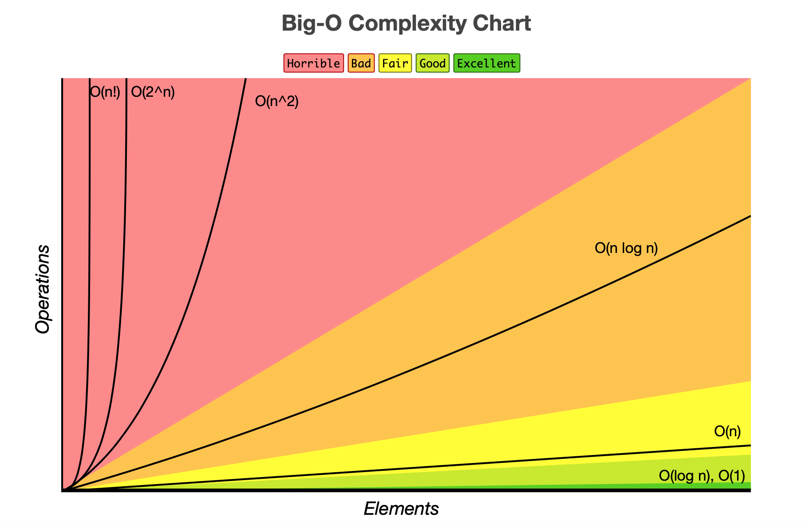
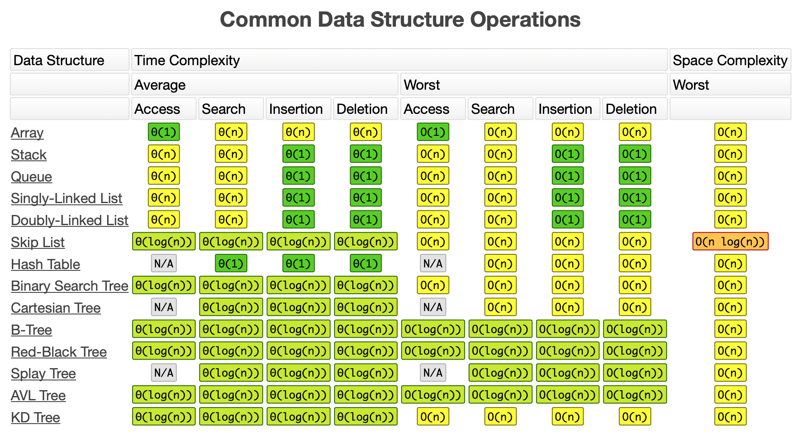
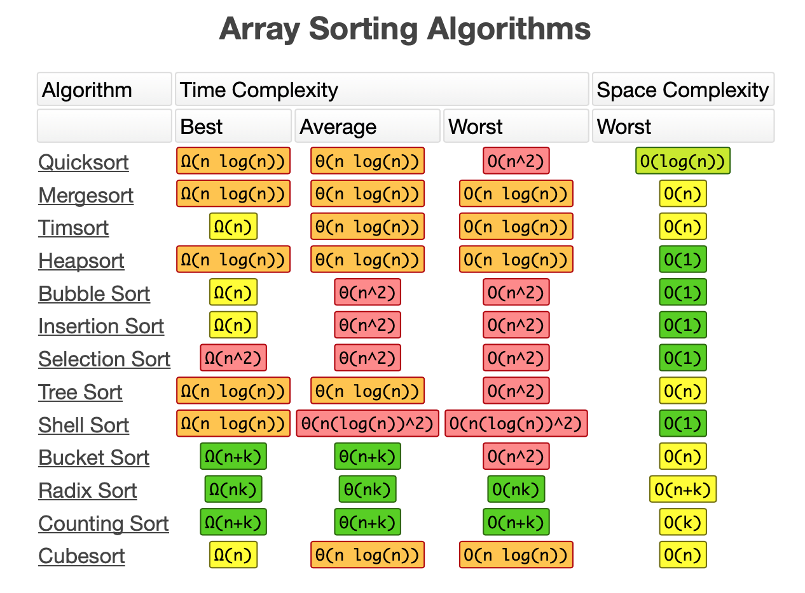

算法复杂度速查表
===

目录
---

[TOC]

## 1. 背景

最近看到一篇总结算法复杂度的博客，原作者Eric是为了面试方便而总结出了一份算法复杂度速查表，在此转载一下。

原文链接：[https://www.bigocheatsheet.com](https://www.bigocheatsheet.com)

---

Hi there!  This webpage covers the space and time Big-O complexities of common algorithms used in Computer Science.  When preparing for technical interviews in the past, I found myself spending hours crawling the internet putting together the best, average, and worst case complexities for search and sorting algorithms so that I wouldn't be stumped when asked about them.  Over the last few years, I've interviewed at several Silicon Valley startups, and also some bigger companies, like Google, Facebook, Yahoo, LinkedIn, and Uber, and each time that I prepared for an interview, I thought to myself "Why hasn't someone created a nice Big-O cheat sheet?".  So, to save all of you fine folks a ton of time, I went ahead and created one.  Enjoy! - Eric

## 2. Big-O Complexity Chart

$$
\text{Figure 1. Big-O Complexity Chart}
$$

## 3. Common Data Structure Operations

$$
\text{Figure 2. Common Data Structure Operations}
$$

## 4. Array Sorting Algorithms

$$
\text{Figure 3. Array Sorting Algorithms}
$$
