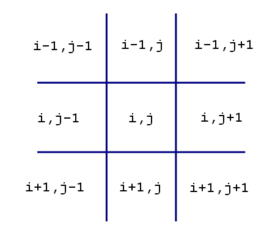
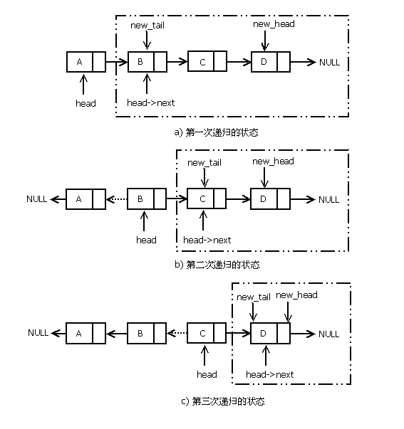

常用技巧
===

目录
---

[TOC]

## 1. 背景

最近学习了一下Gitchat在热推的[《算法设计实战50讲》](https://gitbook.cn/gitchat/column/5b6d05446b66e3442a2bfa7b)专栏，在[基础开胃菜](https://gitbook.cn/gitchat/column/5b6d05446b66e3442a2bfa7b/topic/5b9fa617f7356128d41187c1)这一章，王晓华老师讲了一些算法设计的常用技巧，我觉得很有意思，所以摘录了一部分形成了这篇笔记。

## 2. 哨兵位

设置哨兵位是程序设计中常用的技巧之一，常用在线性表的处理过程中，比如查找和移动数据操作。

哨兵位通常起到两个作用：

1. 作为一个临时存储空间使用，
2. 减少不必要的越界判断，简化算法代码复杂度。

比如环形链表通常会设置一个表头节点，无论向前或向后遍历，均以这个表头节点为遍历越界（重复）的依据，这样维护链表的时候就不需要专门存储一个表头指针，这个表头节点可以理解为哨兵位。

插入排序算法中也会利用表中的 0 号位置作为哨兵位使用，这个位置不仅起到一个临时存储空间的作用，还可以简化插入后移动数据的判断条件。

注意下面的插入排序代码，内层 `while` 循环移动数据的时候，只需判断当前位置的数是否比 `ls[0]` 位置大即可，不需要关心 `j` 的位置是否小于 `1` 而越界，因为当 `j=1` 的时候，`ls[j - 1] > ls[0]` 的条件肯定不满足，`while` 循环就会终止。如果不使用哨兵位，内层移动数据的循环处理代码就需要增加 `j` 是否越界的判断。

```cpp
//带哨兵位的插入排序，ls[0]是哨兵位，数据从 ls[1]开始存放
void insert_sort(int *ls, int n)
{
    for (int i = 2; i <= n; ++i)
    {
        if (ls[i] < ls[i - 1])
        {
            //i位置的数存入哨兵位，因为 i 位置会被后面的移动数据操作覆盖
            ls[0] = ls[i];
            int j = i;
            //不用再判断 j 是否越界，直接判断当前位置的值是否大于哨兵位
            while(ls[j - 1] > ls[0])
            {
                ls[j] = ls[j - 1];
                j--;
            }
            ls[j] = ls[0];
        }
    }
}
```

和不使用哨兵位的插入排序进行对比

```cpp
// 如果不使用哨兵位
void insert_sort_mine(int* ls, int n){
    for (int i = 2; i <= n; ++i) {
        if (ls[i] < ls[i - 1]) {
             //i位置的数存入mark，因为 i 位置会被后面的移动数据操作覆盖
            int mark = ls[i];
            int j;
            //在判断前一位是否大于mark的同时还需要判断j是否越界
            for (j = i; j > 1 && ls[j - 1] > mark; j--) {
                ls[j] = ls[j - 1];
            }
            ls[j] = mark;
        }
    }
}
```

在一些查找操作中，有时候也会用到哨兵位，比如要查找某个值，可以在表中适当的位置预置一个等于这个值的哨兵位，这样在查找过程中就不用考虑边界越界，也不用考虑找不到的情况，查找遍历的算法实现就可以很简洁，只需在查找结束的时候，判断一下结果是否是哨兵位，如果是哨兵位，则说明没有找到。

## 3. 一重循环遍历二维数组

二维表的遍历一般需要两重循环来实现，但是两重循环的代码不如一重循环的代码清爽，很多情况下用一重循环遍历二维表也是一种不错的选择。用一重循环遍历二维表关键是对下标的处理，对于一个 $M × N$ 的二维表，可用以下方法解出对应的二维下标：
```cpp
int row = i / M
int col = i % N
```

反过来，也可以用以下公式将二维坐标还原为一维坐标：

```cpp
int i = row * N + col
```

很多九宫格类型的游戏棋盘的初始化就是用的这种方法。

```cpp
for(int i = 0; i < 9; i++)
{
    int row = i / 3;
    int col = i % 3;
    game->cells[row][col].fixed = false;
}
```

## 4. 棋盘（迷宫）类算法方向遍历

棋盘或迷宫类游戏常常需要配合各种搜索算法，二维棋盘和迷宫的搜索常常是沿着与某个位置相临的 4 个或 8 个方向展开，对这些方向的遍历就是搜索算法的主要结构。我常常看到一些朋友给出的算法用了长长的 `if-else` 或 `switch-case` 语句，无非是这样的结构：

```cpp
switch(direction)
{
case UP:
……
case DOWN:
……
case LEFT:
……
case RIGHT:
……
}
```



$$
\text{Figure 1. 方向数组坐标偏移关系}
$$

观察每一个 case 分支，除了数组下标计算不同，其他代码都是雷同的重复代码，其实这种情况下最常用的方法是使用方向偏移数组，用一个循环对这个方向数组遍历一遍就可完成对各个方向的搜索。以二维数组定义的棋盘为例，如果从 i 行 j 列开始向上、下、左、右四个方向搜索，则这四个方向可转换为以下行、列坐标关系：

- 向左搜索：行坐标 i 不变，列坐标 j-1
- 向上搜索：行坐标 i-1，列坐标不变
- 向右搜索：行坐标 i 不变，列坐标 j+1
- 向下搜索：行坐标 i+1，列坐标不变

根据以上关系，首先定义二维数组下标偏移量，然后定义一个偏移量数组，分别表示向四个方向的数组下标偏移量：

```cpp
typedef struct
{
   int x_off;
   int y_off;
}OFFSET;

OFFSET dir_offset[] = {{0,-1},{-1,0},{0,1},{1,0}};
```

假设当前位置的二维数组下标是 x、y，则对此位置开始向四个方向搜索的代码可以如此实现：

```cpp
for(int i = 0; i < count_of(dir_offset); i++)
{
    int new_x = x + dir_offset[i].x_off;
    int new_y = y + dir_offset[i].y_off;
    ……
}
```

这种算法实现避免了对每个方向都进行下标计算，即便是增加两个斜线方向，从 4 个方向搜索扩展到 8 个方向搜索，只需调整`dir_offset`数组即可，摆脱了冗长的 `switch-case` 代码结构。《算法的乐趣》[<sup>1</sup>](#bib-1)第 14 章介绍光栅填充算法时用到了方向数组，第 20 章介绍华容道游戏时再次使用了方向数组，都是类似情况下很典型的应用。

## 5. 单链表

### 5.1. 判断单链表是否有环

单链表有很多有意思的问题，比如“判断单链表是否有环”、“如何一次遍历就找到链表中间位置节点”、“单链表中倒数第 k 个节点”等问题，解决这三个问题需要使用双指针的技巧，比如第一个问题，设置一个“慢指针”和一个“快指针”，从链表头开始遍历，慢指针一次向后移动一个节点，快指针一次移动两个节点。如果链表没有环，则快指针会先到达最后一个节点（NULL），否则的话，快指针会追上慢指针（相遇）。

第二个问题同样设置一快一慢两个指针，慢指针一次移动一个节点，快指针一次移动两个节点，当快指针移动到结尾时，慢指针指向的就是中间节点。第三个问题也是双指针，其中一个先移动 k 个节点，然后两个指针以相同的速度一起移动，当先移动的指针移动到结尾的时候，后移动的指针指向的就是倒数第 k 个节点。

### 5.2. 单链表逆序

单链表还有一个经常被面试到的题目，就是单链表逆序。很多公司的面试题库中都有这道题，有的公司明确题目要求不能使用额外的节点存储空间，有的没有明确说明，但是如果面试者使用了额外的节点存储空间做中转，会得到一个比较低的分数。不使用额外存储节点的情况下使一个单链表的所有节点逆序可以采用递归的方法，也可以采用循环迭代的方法，这里我们只介绍递归的方式，因为这种方法比较容易理解，算法代码的实现也很简单。



$$
\text{Figure 2. 单链表逆序递归状态图}
$$

递归方法的核心就是确定递归子问题，链表类的问题找递归子问题的方法基本固定，就是每次除去链表头部第一个节点，剩下的序列作为分解的子问题。主要的算法实现思路是先将当前的表头节点从链表中拆出来，然后对剩余的节点组成的子链表进行逆序，最后将当前的表头节点连接到新链表的尾部。

如图（2）所示，每一轮递归都是先对子链表逆序，然后将拆出来的 head 节点附加到新的子链表的尾部。虽然递归调用的顺序是从 `a` 到 `c` 的顺序，但是递归逆序的实际操作过程需要从 `c` 到 `a` 反着来理解。图（2-c）就是递归符合退出条件时的状态，此时子链表只剩一个节点，直接返回这个节点作为子链表的 `new_head` 节点。随后的递归操作将子链表的 head 节点附加到 `new_head` 节点的尾部，如代码所示：

```cpp
LINK_NODE *reverse_link(LINK_NODE *head)
{
    LINK_NODE *newHead;

    if ((head == nullptr) || (head->next == nullptr))
        return head;

    newHead = reverse_link(head->next); /*递归逆转子链表部分*/
    head->next->next = head; /*回朔部分*/
    head->next = nullptr;

    return newHead;
}
```

这段代码的关键点是头节点 `head` 的下一个节点 `head`$\to$`next` 将是逆序后的新链表的尾节点，也就是说，被摘除的头接点 head 需要被链接到 `head`$\to$`next` 才能完成整个链表的逆序。

王晓华老师的[《算法设计实战50讲》](https://gitbook.cn/gitchat/column/5b6d05446b66e3442a2bfa7b)专栏中还讲了很多其他有意思的内容，感兴趣的同学可以在GitChat搜索这个专栏订购。

## 6. 参考文献

<div id="bib-1"></div>

[1] [王晓华. 算法的乐趣. 人民邮电出版社, 2017.](https://m.igetget.com/hybrid/v2/ebook/detail?bid=xGM6Evn5byxq2PnXBz71AjZaol6R8WJ86bwOKpGkd4gmMLEJrYNQe9VvD8P4jLkK)
