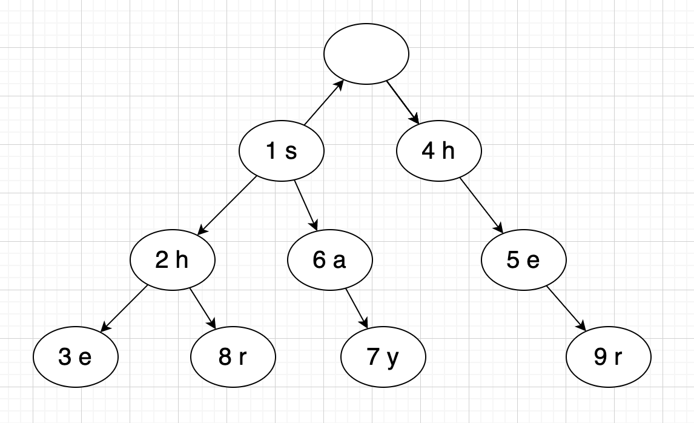

HDU 2222 Keywords Search
===

目录
---

[TOC]

## 1. 题目描述

### 1.1. Limit

>Time Limit: 2000/1000 MS (Java/Others)  

>Memory Limit: 131072/131072 K (Java/Others)

### 1.2. Problem Description

In the modern time, Search engine came into the life of everybody like Google, Baidu, etc.
Wiskey also wants to bring this feature to his image retrieval system.

Every image have a long description, when users type some keywords to find the image, the system will match the keywords with description of image and show the image which the most keywords be matched.

To simplify the problem, giving you a description of image, and some keywords, you should tell me how many keywords will be match.

---

### 1.3. Input

First line will contain one integer means how many cases will follow by.

Each case will contain two integers $N$ means the number of keywords and $N$ keywords follow. $(N \le 10000)$

Each keyword will only contains characters 'a'-'z', and the length will be not longer than $50$.

The last line is the description, and the length will be not longer than $1000000$.

---

### 1.4. Output

Print how many keywords are contained in the description.

---

### 1.5. Sample Input

```cpp
1
5
she
he
say
shr
her
yasherhs
```

### 1.6. Sample Output

```cpp
3
```

### 1.7. Source

[HDU 2222 Keywords Search](http://acm.hdu.edu.cn/showproblem.php?pid=2222)

---

## 2. 解读

`AC自动机 (Aho-Corasick automaton)`的模板题。

`AC自动机` 使用了 `Trie树` 的结构和 `KMP算法` 的思想，将所有模式串 $P$ 用`Trie树`进行存储，并且对每个节点，构造 `Fail数组`，这个 `Fail数组`和 `KMP算法` 中的 `Next数组` 有些类似，但不完全一样。

$$
Fail[x + i] = k
$$

其中 $x$ 表示模式串 $\alpha$ 在 `Trie树` 中的开始位置， $i$ 表示我们判断的是当前模式串分支 $\alpha$ 的第 $i$ 个节点，$k$ 表示 $\alpha$ 中以 $i$ 为终点的最长后缀与 `Trie树` 中的第 $k$ 个位置对应的模式串 $\beta$ 的前缀相匹配。

$$
\alpha[i-len:i + 1] = \beta[0:len + 1]
$$

$$
max(len)
$$

$[a:b]$ 为左闭右开区间，$len + 1$ 为后缀的长度，$max(len)$ 表示我们要找的是最长匹配后缀。

---

使用以下输入为例

```cpp
1
5
she
he
say
shr
her
yasherhs
```

首先构建 `Trie树` ，如`图1`。每个节点左边的数字为节点序号，右边为节点存储的字符。



$$
\text{Figure 1. Trie树}
$$

然后通过 `DFS` 获取 $Fail$ 数组，标号为 `1-2` 的子串 `sh`，其后缀 `h` 与标号为 `4` 的前缀相匹配；标号为 `1-3` 的子串 `she`，其后缀 `he` 与标号为 `4-5` 的前缀相匹配。

$$Fail[2] = 4, Fail[3] = 5$$

$Fail$ 数组中的其他成员都指向根结点，即 $Fail[x_i] = 0$。

在代码中加入输出语句，可以看到 `DFS` 构建$Fail$ 数组的具体过程。

```cpp
front: 4
char: e fail: 0
front: 1
char: a fail: 0
char: h fail: 4
front: 5
char: r fail: 0
front: 6
char: y fail: 0
front: 2
char: e fail: 5
char: r fail: 0
front: 9
front: 7
front: 3
front: 8
```

## 3. 代码

```cpp
#include <iostream>
#include <queue>
#include <string.h>
using namespace std;
const int maxN = 5e5 + 1; // 模式串长度 * 模式串数量
const int maxM = 1e6 + 1; // 目标串长度
const int chSize = 26; // 字符集大小

class AcAutomaton {
public:
    int trie[maxN][chSize];
    int vis[maxN], fail[maxN];
    int tot;
    // 初始化
    void init()
    {
        memset(vis, 0, sizeof vis);
        memset(trie, 0, sizeof trie);
        tot = 0;
    }
    // 插入
    void insert(char* str)
    {
        int len = strlen(str);
        int pos = 0;
        for (int i = 0; i < len; i++) {
            int c = str[i] - 'a';
            if (!trie[pos][c])
                trie[pos][c] = ++tot;
            pos = trie[pos][c];
        }
        vis[pos]++;
    }
    // DFS获取Fail数组
    void build()
    {
        queue<int> q;
        // 根结点下的元素入队
        for (int i = 0; i < chSize; i++) {
            if (trie[0][i]) {
                fail[trie[0][i]] = 0;
                q.push(trie[0][i]);
            }
        }
        // DFS
        while (!q.empty()) {
            // 获取队首元素
            int pos = q.front();
            // 输出队首元素
            // cout << "front: " << pos << endl;
            // 队首出队
            q.pop();
            // 遍历队首元素的子节点
            for (int i = 0; i < chSize; i++) {
                // 若元素ch存在
                if (trie[pos][i]) {
                    // 将fail数组的值置为fail[队首元素]的下一个ch对应的值
                    fail[trie[pos][i]] = trie[fail[pos]][i];
                    // 输出构建fail数组的过程
                    // cout << "True char: " << (char)('a' + i) << " fail: " << trie[fail[pos]][i] << endl;
                    // 元素入队
                    q.push(trie[pos][i]);
                } else {
                    // 若不存在，将trie的值置为fail[队首元素]的下一个ch对应的值
                    // 方便下次计算
                    trie[pos][i] = trie[fail[pos]][i];
                }
            }
        }
    }
    // 查询
    int query(char* str)
    {
        int len = strlen(str);
        int pos = 0, ans = 0;
        for (int i = 0; i < len; i++) {
            int c = str[i] - 'a';
            pos = trie[pos][c];
            for (int j = pos; j && vis[j] != -1; j = fail[j]) {
                ans += vis[j];
                vis[j] = -1;
            }
        }
        return ans;
    }
};

AcAutomaton ac;

int main()
{
    int t;
    scanf("%d", &t);
    while (t--) {
        ac.init();
        char str[maxM];
        int n;
        scanf("%d", &n);
        for (int i = 0; i < n; i++) {
            scanf("%s", str);
            ac.insert(str);
        }
        ac.build();
        scanf("%s", str);
        printf("%d\n", ac.query(str));
    }
}
```

_注：代码参考自哈尔滨理工大学ACM-ICPC集训队常用代码库_

链接：[https://pan.baidu.com/s/1eJwyrqCDQOAlPWC1mbPRKQ](https://pan.baidu.com/s/1eJwyrqCDQOAlPWC1mbPRKQ)

密码：gv5k

---

联系邮箱：curren_wong@163.com

CSDN：[https://me.csdn.net/qq_41729780](https://me.csdn.net/qq_41729780)

知乎：[https://zhuanlan.zhihu.com/c_1225417532351741952](https://zhuanlan.zhihu.com/c_1225417532351741952)

公众号：复杂网络与机器学习

欢迎关注/转载，有问题欢迎通过邮箱交流。


