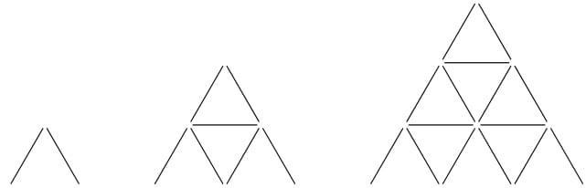

CodeForces 1345 B Card Constructions
===

目录
---

[TOC]

## 1. 题目描述

### 1.1. Limit

>Time Limit: 1000 ms

>Memory Limit: 256 MB

### 1.2. Problem Description

A card pyramid of height $1$ is constructed by resting two cards against each other. For $(h >1)$, a card pyramid of height $h$ is constructed by placing a card pyramid of height $h - 1$ onto a base.A base consists of $h$ pyramids of height $1$, and $h - 1$ cards on top. For example, card pyramids of heights $1$, $2$, and $3$ look as follows:



You start with $n$ cards and build the tallest pyramid that you can. If there are some cards remaining, you build the tallest pyramid possible with the remaining cards. You repeat this process until it is impossible to build another pyramid. In the end, how many pyramids will you have constructed?

---

### 1.3. Input

Each test consists of multiple test cases. The first line contains a single integer $t( \le t \le 1000)$ — the number of test cases. Next $t$ lines contain descriptions of test cases.

Each test case contains a single integer $n(1 \le n \le 10^9)$  — the number of cards.

It is guaranteed that the sum of $n$ over all test cases does not exceed $10^9$.

---

### 1.4. Output

For each test case output a single integer — the number of pyramids you will have constructed in the end.

---

### 1.5. Sample Input

```cpp
5
3
14
15
24
1
```

### 1.6. Sample Output

```cpp
1
2
1
3
0
```

### 1.7. Note

In the first test, you construct a pyramid of height 1 with 2 cards. There is 1 card remaining, which is not enough to build a pyramid.

In the second test, you build two pyramids, each of height 2, with no cards remaining.

In the third test, you build one pyramid of height 3, with no cards remaining.

In the fourth test, you build one pyramid of height 3 with 9 cards remaining. Then you build a pyramid of height 2 with 2 cards remaining. Then you build a final pyramid of height 1 with no cards remaining.

In the fifth test, one card is not enough to build any pyramids.

### 1.8. Source

[CodeForces 1345 B Card Constructions](https://codeforces.com/problemset/problem/1345/B)

---

## 2. 解读

通过递推方程 $f(x) = f(x-1) + 3x - 1$ 推导构建 $x$ 层金字塔需要多少张卡牌。计算出来以后存储在 $list$ 中，$10^9$ 内最多 25820 层卡牌金字塔，计算到这里即可。

然后对每个输入 $m$，对 $list$ 进行循环二分查找，找到 $list[x] \le m < list[x+1]$，然后 $m = m - list[x]$，直到 $m<2$，不再能搭建金字塔。输出循环二分查找的次数 $ans$，即最多能搭建多少金字塔。

## 3. 代码

```cpp
#include <iostream>
#include <map>
#include <math.h>
#include <string.h>
using namespace std;

// 10^9 内最多 25820 层卡牌金字塔
const int NUM = 25821;

// 存储
int list[NUM];
// 存储结果
int ans;
// 存储
map<int, int> mp;
// 计算
void claculate(int m)
{
    list[1] = 2;
    for (int i = 2; i <= m; i++) {
        // 递推方程
        list[i] = list[i - 1] + 3 * i - 1;
    }
}

// 二分查找
int binary_search(int array[], int low, int high, int target)
{
    while (low <= high) {
        int mid = low + (high - low) / 2;
        if (array[mid] <= target && array[mid + 1] > target) {
            return mid;
        } else if (array[mid] > target) {
            high = mid - 1;
        } else if (array[mid] < target) {
            low = mid + 1;
        }
    }
    return -1;
}

int main()
{
    // test case
    int t;
    scanf("%d", &t);
    // 卡片数量
    int m, buffer;
    // 初始化
    memset(list, 0, sizeof(list));
    // 计算
    claculate(NUM - 1);
    // test case
    for (int i = 0; i < t; i++) {
        ans = 0;
        // 卡片数量
        scanf("%d", &m);
        buffer = m;
        if (mp.find(m) == mp.end()) {
            // 查找
            while (buffer >= 2) {
                buffer -= list[binary_search(list, 0, (NUM - 1), buffer)];
                ans++;
            }
            // 存储结果
            mp[m] = ans;
        } else {
            ans = mp[m];
        }
        // 输出
        printf("%d\n", ans);
    }
}
```

---

联系邮箱：curren_wong@163.com

Github：[https://github.com/CurrenWong](https://github.com/CurrenWong)

欢迎转载/Star/Fork，有问题欢迎通过邮箱交流。
