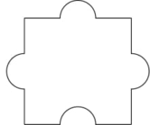
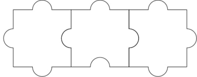
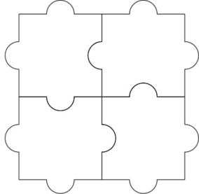

CodeForces 1345 A Puzzle Pieces
===

目录
---

[TOC]

## 1. 题目描述

### 1.1. Limit

>Time Limit: 1000 ms

>Memory Limit: 256 MB

### 1.2. Problem Description

You are given a special jigsaw puzzle consisting of $n \cdot m$ identical pieces. Every piece has three tabs and one blank, as pictured below.



The jigsaw puzzle is considered solved if the following conditions hold:

1. The pieces are arranged into a grid with $n$
rows and $m$ columns.
2. For any two pieces that share an edge in the grid, a tab of one piece fits perfectly into a blank of the other piece.

Through rotation and translation of the pieces, determine if it is possible to solve the jigsaw puzzle.

---

### 1.3. Input

The test consists of multiple test cases. The first line contains a single integer $t( \le t \le 1000)$ — the number of test cases. Next $t$ lines contain descriptions of test cases.

Each test case contains two integers $n$ and $m$ $(1 \le n, m \le 1000)$.

---

### 1.4. Output

For each test case output a single line containing "YES" if it is possible to solve the jigsaw puzzle, or "NO" otherwise. You can print each letter in any case (upper or lower).

---

### 1.5. Sample Input

```cpp
3
1 3
100000 100000
2 2
```

### 1.6. Sample Output

```cpp
YES
NO
YES
```

### 1.7. Note

For the first test case, this is an example solution:



For the second test case, we can show that no solution exists.

For the third test case, this is an example solution:



### 1.8. Source

[CodeForces 1345 A Puzzle Pieces](https://codeforces.com/problemset/problem/1345/A)

---

## 2. 解读

要将 $n \cdot m$ 个拼图组合起来，形成 $m$ 行 $n$ 列的图形，则会有 $m \times (n - 1) + n \times (m - 1)$ 个连接处，每个连接处需要一个凸起和一个凹陷的接口。由于每个拼图只有一个凹陷，那么要成功将拼图进行拼接，则需要 $n \times m \ge m \times (n - 1) + n \times (m - 1)$。

## 3. 代码

```cpp
#include <iostream>
using namespace std;

int main()
{
    // test case
    int t;
    scanf("%d", &t);
    // 行列数列
    long long line, row;
    // 连接处数量
    long long edges;
    // test case
    for (int i = 0; i < t; i++) {
        // 行列数量
        scanf("%lld %lld", &line, &row);
        // 计算连接处
        edges = (line) * (row - 1) + row * (line - 1);
        // 输出
        printf("%s\n", edges <= (line * row) ? "YES" : "NO");
    }
}
```

---

联系邮箱：curren_wong@163.com

Github：[https://github.com/CurrenWong](https://github.com/CurrenWong)

欢迎转载/Star/Fork，有问题欢迎通过邮箱交流。
