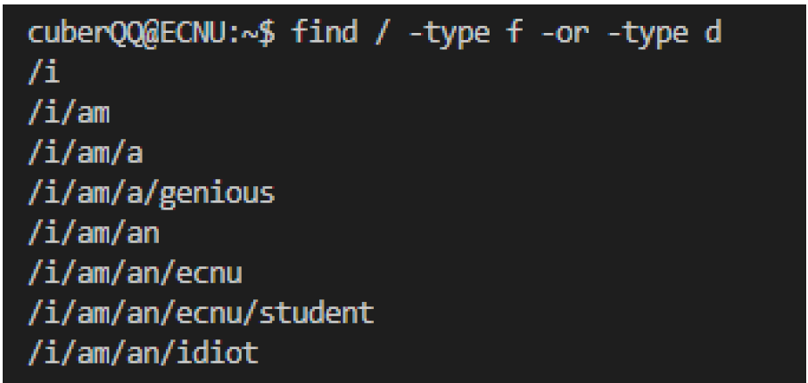
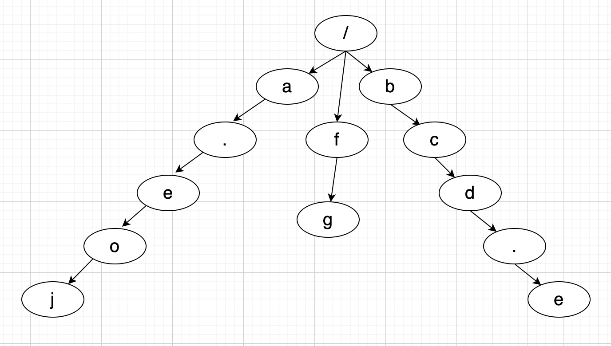

2020 ECNU Campus Online Invitational Contest Problem F. Find / -type f -or -type d
===

目录
---

[TOC]

## 1. 题目描述

### 1.1. Limit

>Time Limit: 1.5 sec

>Memory Limit: 1024 MB

### 1.2. Problem Description

Cuber QQ wants to know the number of files with extension .eoj in his computer. This can be easily done with a command find / -type f | grep ’n.eoj$’ | wc -l. However, Cuber QQ is a grep-hater, who would rather write his own program than using grep. So he decides to take a detour: what if the command starts with something else? Is it still possible to recover the results?

If you are not familiar with command usages in Linux, all you need to know is that ls and find are two easy-to-use commands to inspect files and subdirectories a directory contains. For example, when you are trying to get a list of everything in your computer, you might try to use: find / -type f -or -type d, which will give you a list like:



$$
\text{Figure 1. Example}
$$

To make the problem even more interesting, Cuber QQ adds another shuf after find, so that the list is shuffled into a random order and his secrets will stay covered. Cuber QQ is wondering whether it’s possible to write a program cuber-qq-grep that filters out all the files with extension .eoj from the given shuffled list, which is his initial intention. Still, instead of giving the filtered list directly, Cuber QQ wants to know the length of this list, i.e., the number of files found. In other words, the following two commands will be almost equivalent:

- find / -type f | grep ’n.eoj$’ | wc -l

- find / -type f -or -type d | shuf | cuber-qq-grep

Well, there can be some subtle differences in input/output formats, but that’s not essential.

One more thing, on your file system, directory is only a logical concept. This means, a directory is created only when there is a file which relies on this directory is created and a directory cannot exist without files.

TL;DR, given the randomly shuffled list of all directories and files on a computer, count the number of files that ends with .eoj.

### 1.3. Input

The input starts with a line of one number $n (1 \le n \le 10^5)$, which is the length of the following list.

In the following n lines, each line contains one string, which is an absolute path to a file or a directory.

The path starts with /, and is composed of multiple tokens (file names and directory names) concatenated with /. The tokens always start with a lowercase letter, followed by no more than 9 lowercase letters or dots. The root folder alone will not be included in this list.

It is guaranteed that the total length of n lines will be no longer than $10^6$.

### 1.4. Output

Output the number of files satisfying the above-mentioned condition, in one line.

### 1.5. Sample Input 1

```cpp
3
/secret/eoj
/secret
/secret.eoj
```

### 1.6. Sample Onput 1

```cpp
1
```

### 1.7. Sample Input 2

```cpp
8
/i/am/an/ecnu/student
/i/am/an/ecnu
/i
/i/am/a
/i/am/an/idiot
/i/am/an
/i/am/a/genious
/i/am
```

### 1.8. Sample Onput 2

```cpp
0
```

### 1.9. Sample Input 3

```cpp
2
/cuber.eoj/qq.eoj
/cuber.eoj
```

### 1.10. Sample Onput 3

```cpp
1
```

### 1.11. Source

[2020 ECNU Campus Online Invitational Contest Problem F. Find / -type f -or -type d](https://acm.ecnu.edu.cn/contest/273/problem/F/)

## 2. 解读

题目要求找出所有 `.eoj` 后缀的文件数量，不过如果存在 `xxx.eoj/www` 这样的路径，说明 `xxx.eoj` 是一个文件夹，需要把它从答案中去除掉。

使用字典树进行存储，将所有 `.eoj` 后缀的路径存进一个 `set` 当中，最后对 `set` 进行遍历，如果在字典数中以 `set[i]` 为前缀的文件数量大于 `1`，即   `set[i]` 是一个文件夹，则把它从答案中去除。

用以下输入为例。

```cpp
/a.eoj
/fg
/bcd.e
```

构建出的字典树结构如图2所示。



$$
\text{Figure 2. 字典树}
$$

## 3. 代码

```cpp
#include <iostream>
#include <set>
#include <string.h>
using namespace std;

const int NUM = 1e6 + 1;

// 用数组定义字典树，存储下一个字符的位置
int trie[NUM][28];
// 以某一字符串为前缀的单词的数量
int num[NUM] = { 0 };
// 当前新分配的存储位置
int pos = 1;
// 存储结果
set<string> st;

// 在字典数中插入某个单词
void trieInsert(string str)
{
    int p = 0;
    for (int i = 0; str[i]; i++) {
        int n;
        if (str[i] == '/') {
            n = 26;
        } else if (str[i] == '.') {
            n = 27;
        } else {
            n = str[i] - 'a';
        }
        if (trie[p][n] == 0) {
            // 如果对应字符没有值，存储下一个索引的值
            trie[p][n] = pos++;
        }
        p = trie[p][n];
        num[p]++;
    }
}

// 返回以某个字符串为前缀的单词的数量
int trieFind(string str)
{
    int p = 0;
    for (int i = 0; str[i]; i++) {
        int n;
        if (str[i] == '/') {
            n = 26;
        } else if (str[i] == '.') {
            n = 27;
        } else {
            n = str[i] - 'a';
        }
        if (trie[p][n] == 0) {
            return 0;
        }
        p = trie[p][n];
    }
    return num[p];
}

// 先插入trie树，再找每个.eoj结尾的文件是否有后缀，若有则删去
int main()
{
    int t, length, ans = 0;
    cin >> t;
    string str;
    while (t--) {
        cin >> str;
        // 插入trie树
        trieInsert(str);
        if ((length = str.length()) >= 4 && str.substr(length - 4, length) == ".eoj") {
            st.insert(str);
            ans++;
        }
    }
    // 去除文件夹
    for (auto it = st.begin(); it != st.end(); it++) {
        if (trieFind(*it) > 1) {
            // 这里不能用st.erase，推测是因为set使用的是类似链表的存储结构
            // 把这个元素去除以后，就找不到下一个元素指针了
            // st.erase(it);
            ans--;
        }
    }
    cout << ans << endl;

    return 0;
}

```

---

联系邮箱：curren_wong@163.com

CSDN：[https://me.csdn.net/qq_41729780](https://me.csdn.net/qq_41729780)

知乎：[https://zhuanlan.zhihu.com/c_1225417532351741952](https://zhuanlan.zhihu.com/c_1225417532351741952)

公众号：复杂网络与机器学习

欢迎关注/转载，有问题欢迎通过邮箱交流。


