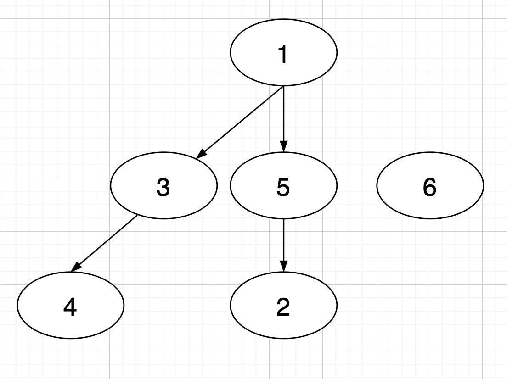
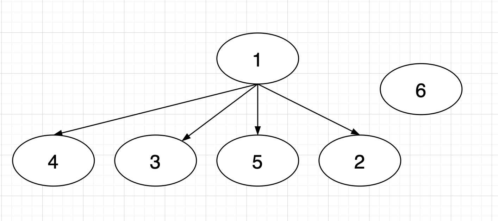

牛客网 NC200435 找朋友
===

目录
---

[TOC]

## 1. 题目描述

### 1.1. Limit

>Time Limit: C/C++ 1秒，其他语言2秒

>Memory Limit: C/C++ 65536K，其他语言131072K

### 1.2. Problem Description

——你要是愿意，我就永远存在。

某人的朋友圈实在是过于庞大且复杂，要判断两个人是不是朋友，那还真不容易。现给出某个朋友圈关系图，求任意给出的两个人是否是朋友。规定：如果x和y是朋友，y和z是朋友，那么x和z也是朋友。如果x和y是朋友，那么x的朋友都是y的朋友，y的朋友也都是x的朋友。

### 1.3. Input

第一行，三个整数 $n,m,p,(n \le 50000,m \le 50000,p\le50000)$，分别表示有n个人，m个朋友关系，询问p对朋友关系。

以下m行：每行两个数$M_i, M_j，1 \le M_i, M_j \le n$，表示 $M_i$ 和 $M_j$ 具有朋友关系。

接下来 $p$ 行：每行两个数 $P_i ,P_j$,询问 $P_i ,P_j$ 是否具有盆友关系

### 1.4. Output

$P$ 行，每行一个“Yes”或“No”(不包含引号)。表示第 $i$ 个询问的答案为“具有”或“不具有”朋友关系。

### 1.5. Sample Input

```cpp
6 5 3
1 2
1 5
3 4
5 2
1 3
1 4
2 3
5 6
```

### 1.6. Sample Output

```cpp
Yes
Yes
No
```

### 1.7. Source

[牛客网 NC200435 找朋友](https://ac.nowcoder.com/acm/problem/200435)

## 2. 解读

使用并查集进行求解。

以如下输入为例

```cpp
6 5 3
1 2
1 5
3 4
5 2
1 3
1 4
2 3
5 6
```

用 $group[i]$ 存储第 $i$ 个点所在的集团，如图1所示。



$$
\text{Figure 1. 初始状态}
$$

每次查询，只要判断其根节点是否相同，即可判断其是否属于同一个集团。并且，每次对 $group[i]$ 进行查询过后，进行路径压缩，也就是将根节点赋值给 $group[i]$，减少下一次的查询时间。如图2所示。



$$
\text{Figure 2. 路径压缩}
$$

## 3. 代码

```cpp
#include <iostream>
#include <string.h>
using namespace std;
const int num = 5e4 + 1;

int group[num];
int height[num];

// 初始化
void init_set()
{
    for (int i = 1; i < num; i++) {
        group[i] = i;
        // 树的高度
        height[i] = 0;
    }
}

// 查找
int find_set(int x)
{
    // 路径压缩
    if (x != group[x]) {
        group[x] = find_set(group[x]);
    }
    return group[x];
}

void union_set(int x, int y)
{
    x = find_set(x);
    y = find_set(y);
    if (height[x] == height[y]) {
        // 合并，树的高度加1
        height[x] = height[x] + 1;
        group[y] = x;
    } else {
        // 矮树合并到高树上，高树的高度保持不变
        if (height[x] < height[y]) {
            group[x] = y;
        }else{
            group[y] = x;
        }
    }
}

int main()
{
    int n, m, p, x, y;
    cin >> n >> m >> p;
    // 初始化
    init_set();
    // 输入
    for (int i = 0; i < m; i++) {
        cin >> x >> y;
        union_set(x, y);
    }
    //
    for (int i = 0; i < p; i++) {
        cin >> x >> y;
        if (find_set(x) == find_set(y)) {
            cout << "Yes" << endl;
        } else {
            cout << "No" << endl;
        }
    }

    return 0;
}

```

**联系邮箱**：curren_wong@163.com

**CSDN**：[https://me.csdn.net/qq_41729780](https://me.csdn.net/qq_41729780)

**知乎**：[https://zhuanlan.zhihu.com/c_1225417532351741952](https://zhuanlan.zhihu.com/c_1225417532351741952)

**公众号**：**复杂网络与机器学习**

欢迎关注/转载，有问题欢迎通过邮箱交流。


