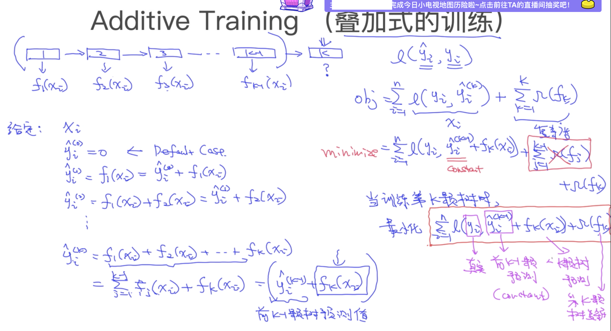

XGBoost原理简介
===

目录
---

[TOC]

## 1. 背景

今天听了[贪心学院](https://www.greedyai.com/h5/pages/semCourse/mlIndex.html?utm_source=baidu&plan=PC-ppc&unit=ppc&keyword=txxy&e_keywordid=161349696748&e_keywordid2=161349696748&renqun_youhua=2052306&bd_vid=8398392434228986151)主办，李文哲老师主讲的[《XGBoost的技术剖析》直播](https://space.bilibili.com/326267739/)，让我对XGB的原理有了一些了解。于是我想写一篇笔记整理一下听课的内容。

老师讲得挺通俗易懂的，不过由于XGB本身具有一定的复杂性，需要看懂这篇笔记需要有如下的背景知识：

1. 决策树的原理
2. 泰勒级数
3. 损失函数
4. 惩罚函数

如果对这些概念不太了解，推荐阅读复旦大学邱锡鹏老师的开源书[《神经网络与深度学习》](https://nndl.github.io)还有人民邮电出版社的[《机器学习实战》](https://m.igetget.com/hybrid/v2/ebook/detail?bid=Jjrvne28LQ2OjoRqkgdnmJX6NADGlWxv59wx1KvbBz97eaMP4VZrpEYy5VB6adNX)，泰勒级数可以参考高数课本和网络资料。

## 2. Boosting

从 `XGBoost` 这个名字就能看出来，这个模型使用了 `Boosting` 的方法，那么我们就来先了解一下 `Boosting` 它是个啥玩意儿。

$$
\text{Figure 1. Bagging vs Boosting}
$$

老师的PPT中对比了 `Bagging` 和 `Boosting` 两种常用的集成学习方法。

- **Bagging**：利用多个过拟合的弱学习器来获得更好的效果。典型的算法有随机森林。

- **Boosting**：利用多个欠拟合的弱学习器来获得更好的效果。典型的算法有GBDT/GBRT，Adaboost，XGBoost和LightGBM。

`Boosting` 本身在不同算法中的具体应用也不完全相同，而从 `XGBoost` [1](#bib-1)的[论文](https://arxiv.org/abs/1603.02754)  中我们能够了解到，它主要借鉴了 `GBDT` 的 `Boosting` 方法

为了加深对 `Boosting` 的了解，我把 `GBDT` [2](#bib-2) 的[论文](https://projecteuclid.org/euclid.aos/1013203451)也找出来看了一下。

### 2.1. 建立映射

首先，我们通过公式$(1)$建立从 $\mathbf{x}$ 到 $y$ 的映射。

$$
\widehat{y} = F\left(\mathbf{x} ;\left\{\beta_{m}, \mathbf{a}_{m}\right\}_{1}^{M}\right)=\sum_{m=1}^{M} \beta_{m} h\left(\mathbf{x} ; \mathbf{a}_{m}\right)
\tag{1}
$$

这里的 $\mathbf{x}$ 和 $\mathbf{a}_{m}$ 用粗体显示，表示它们都是向量，$\widehat{y}$ 表示模型的预测值。

公式$(1)$中的 $h\left(\mathbf{x} ; \mathbf{a}_{m}\right)$ 表示一个个弱分类器， $\mathbf{a}_{m}$ 是弱分类器的参数，$\beta_m$ 是其权重，$\left\{\beta_{m}, \mathbf{a}_{m}\right\}_{1}^{M}$ 是 $\mathbf{a}_{m}$ 和 $\beta_m$ 的 $M$ 个组合。$M$表示弱分类器的数量。

公式$(1)$表示 `GBDT` 是通过对多个弱分类器结果进行线性加权求和从而求出最终结果的。

### 2.2. 计算参数

建立了$\mathbf{x}$ 到 $y$ 的映射之后，我们就需要考虑如何去计算函数中的参数。

$$
\left(\beta_{m}, \mathbf{a}_{m}\right)=\arg \min _{\beta, \mathbf{a}} \sum_{i=1}^{N} L\left(y_{i}, F_{m-1}\left(\mathbf{x}_{i}\right)+\beta h\left(\mathbf{x}_{i} ; \mathbf{a}\right)\right)
\tag{2}
$$

公式 $(2)$ 中，$\displaystyle\arg \min _{\beta, \mathbf{a}}$ 表示使其右边的表达式最小的 $(\beta, \mathbf{a})$ 组合，$L(y_i, \hat{y_i})$ 为损失函数。

公式 $(2)$ 说明参数 $\left(\beta_{m}, \mathbf{a}_{m}\right)$是通过使得损失函数最小化计算出来的，具体如何计算就取决于我们使用什么具体的损失函数和优化器了。

同时， 我们还可以推出公式 $(3)$。

$$
F_{m}(\mathbf{x})=F_{m-1}(\mathbf{x})+\beta_{m} h\left(\mathbf{x} ; \mathbf{a}_{m}\right)
\tag{3}
$$

公式 $(3)$ 中 $F_{m}(\mathbf{x})$ 是训练完 $m$ 个弱分类器以后，模型的输出结果。

公式 $(3)$ 说明 `GBDT` 在训练每第 $m$ 个弱分类器时，我们需要先将前 $m-1$ 个弱分类器的预测结果求和，从而获得一个新的预测结果，在此基础上对第 $m$ 个弱分类器进行训练和预测。即新的弱分类器是在已有模型的[残差](https://baike.baidu.com/item/残差/5162512?fr=aladdin)上进行训练的。

可理解为如下公式。

$$
\beta_{m} h\left(\mathbf{x} ; \mathbf{a}_{m}\right) \to  (y_i - \sum_{k=1}^{m-1} \beta_{k} h\left(\mathbf{x} ; \mathbf{a}_{k}\right))
\tag{4}
$$

即第 $m$ 个弱分类器的训练目标是输出趋近于 $y_i$ 和 前$m - 1$ 个弱分类器的结果之和的差值。

再结合老师PPT中的例子，应该就能够很好地理解 `Boosting` 的作用。

$$
\text{Figure 2. Boost Tree}
$$

$$
\text{Figure 3. Model Predict}
$$

## 3. XGBoost的目标函数

了解了 `Boosting` 之后，我们就可以开始学习 `XGBoost` 了，首先从它的目标函数开始分析。

$$
\text{Figure 4. Object Function}
$$

我们一般使用树模型来作为弱分类器，假设有 $K$ 颗树，对第 $i$ 个输入，它们的预测值为 $\widehat{y}_i$。

$$
\widehat{y}_{i}=\sum_{k=1}^{K} f_{k}\left(\mathbf{x}_{i}\right),\ \ f_{k} \in {\mathcal{F}}
\tag{5}
$$

公式 $(5)$ 中 $f_k(\mathbf{x}_i)$ 表示第 $k$ 颗树对第 $i$ 个输入向量的预测输出。

而 `XGBoost` 的目标函数由损失函数和惩罚函数组成，这一点大多数机器学习模型都差不多。通过最小化损失函数来提高预测精度，引入惩罚函数来控制模型复杂度，防止过拟合。

$$
Obj = \sum_{i = 1}^n {l(y_i, \widehat{y}_{i})} + \sum_{k = 1}^K \Omega (f_k)
\tag{6}
$$

公式 $(6)$ 中的 $n$ 表示输入数据的总数目，我们的优化目标就是最小化目标函数。

$$
\min Obj
\tag{7}
$$

## 4. 化简目标函数

有了目标函数以后，我们还没有好的办法直接对它进行求解，还需要进行化简。图5是老师的PPT。

$$
\text{Figure 5. Additive Traning}
$$

图5的左半部分主要在解释Additive Traning，和我们在 `Boosting` 部分提到的类似。我们主要关注右半部分的化简过程。

通过将 $\widehat{y}_{i}$ 展开，去除常数项，可以将目标函数化简为

$$
{ \begin{aligned}
Obj &= \sum_{i = 1}^n {l(y_i, \widehat{y}_{i}^{(k)})} + \sum_{k = 1}^K \Omega (f_k) & \\
&= \sum_{i = 1}^n {l(y_i, \widehat{y}_{i}^{(k-1)} + f_k(\mathbf{x}_i) )} + \Omega (f_k) & \\
\end{aligned} }
\tag{8}
$$

此处利用了公式 $(5)$ 将 $\widehat{y}_{i}^{(k)}$ 中前 $k-1$ 项分离了出来。因为前 $k-1$ 项已经在各自的训练过程中优化过了，在这里可以视为常数项，所以我们将惩罚函数中的前 $k-1$ 项去除，仅考虑要优化的 $f_k$ 部分。

## 5. 使用泰勒级数近似目标函数

尽管我们对目标函数进行了化简，但直接对目标函数进行求解，运算的复杂度会非常高，所以我们选择对目标函数进行二级泰勒展开，提高模型的训练速度。

$$
\text{Figure 6. Taylor Expansion}
$$

根据公式 $(9)$ 中的二级泰勒展开式。

$$
f(x + \Delta x) \approx f(x) + f'(x) \cdot \Delta x + \frac{1}{2} f''(x) \cdot \Delta x^2
\tag{9}
$$

对目标函数进行展开：

$$
{ \begin{aligned}
Obj &= \sum_{i = 1}^n {l(y_i, \widehat{y}_{i}^{(k-1)} + f_k(\mathbf{x}_i) )} + \Omega (f_k) & \\
&= \sum_{i=1}^{n}\left[l\left(y_{i}, \hat{y}^{(k-1)}\right)+g_{i} f_{k}\left(\mathbf{x}_{i}\right)+\frac{1}{2} h_{i} f_{k}^{2}\left(\mathbf{x}_{i}\right)\right]+\Omega\left(f_{k}\right) &\\
\end{aligned} }
\tag{10}
$$

其中 $g_{i}=\partial_{\hat{y}(k-1)} l\left(y_{i}, \hat{y}^{(k-1)}\right)$ 且 $h_{i}=\partial_{\hat{y}(k-1)}^{2} l\left(y_{i}, \hat{y}^{(k-1)}\right)$， 对应二级泰勒展开式中的一阶导数和二阶导数，由于它们都是基于前 $k - 1$ 个模型的，所以在训练第 $k$ 个模型时也是已知的，可以视为常数项。

公式 $(10)$ 中，$l(y_{i}, \hat{y}^{(k-1)})$ 也可视为常数项，并且这一项没有和变量 $f_k(\mathbf{x}_i)$相乘，所以我们可以将展开后的目标函数再次进行化简，结果为：

$$
Obj =\sum_{i=1}^{n}\left[g_{i} f_{k}\left(\mathbf{x}_{i}\right)+\frac{1}{2} h_{i} f_{k}^{2}\left(\mathbf{x}_{i}\right)\right]+\Omega\left(f_{k}\right)
\tag{11}
$$

## 6. 模型参数化

在公式 $(5)$ 中 ，我们提到$f_k(\mathbf{x}_i)$ 表示第 $k$ 颗树对第 $i$ 个输入向量的预测输出。那么我们又应该如何在公式中将 $f_k(\mathbf{x}_i)$ 展开，从而进行训练和调优，最终达到优化模型的目的呢。这里我们就需要将模型参数化，将问题转化为参数优化的问题。

那么我们这一节要解决的子问题就是，如何用参数的形式来表示一颗决策树，或者说，如何将决策树的模型参数化。

我们参考周志华老师[《机器学习》](https://book.douban.com/subject/26708119/) [3](#bib-3) 书中的一个例子。

$$
\text{Figure 7. Decision Tree}
$$

设 $\widehat{y}_i = 1$表示模型预测第 $i$ 个瓜为好瓜，$\widehat{y}_i = 0$表示模型预测第 $i$ 个瓜为坏瓜。叶子节点标签后的数字为叶子节点的标号。

设 $I_j = \{i | q(\mathbf{x}_{i}) = j\}$ 为被分到第 $j$ 个叶子节点中的 $\mathbf{x}_{i}$ 的序号集合。$q(\mathbf{x}_{i})$ 为输入 $\mathbf{x}_{i}$到叶子节点序号的映射。

设 $w_j = \alpha (j)$ 为第 $j$ 个叶子节点的 $\widehat{y}$ 值。取样例数据进行说明：

$$
\text{Table 1. Sample Data}
$$

| 序号  | 纹理  | 触感  | 密度  | 好瓜  |
| :---: | :---: | :---: | :---: | :---: |
|   1   | 清晰  | 硬滑  | 0.697 |  是   |
|   2   | 清晰  | 软粘  | 0.267 |  否   |
|   3   | 稍糊  | 硬滑  | 0.091 |  否   |

则

$$
{ \begin{aligned}
f_k(\mathbf{x}_{1}) = \alpha (q(\mathbf{x}_{1})) =\alpha(2)=1 = w_2 & \\
f_k(\mathbf{x}_{2}) = \alpha (q(\mathbf{x}_{2})) =\alpha(1)=0 = w_1 & \\
f_k(\mathbf{x}_{3}) = \alpha (q(\mathbf{x}_{3})) =\alpha(3)=0 = w_3 & \\
\end{aligned} }
$$

---

根据上面的定义，我们继续对目标函数进行化简。

首先展开惩罚函数:

$$
\Omega(f)=\gamma T+\frac{1}{2} \lambda\|w\|^{2}
\tag{12}
$$

$$
\begin{aligned}
Obj &=\sum_{i=1}^{n}\left[g_{i} f_{k}\left(\mathbf{x}_{i}\right)+\frac{1}{2} h_{i} f_{k}^{2}\left(\mathbf{x}_{i}\right)\right]+\gamma T+\frac{1}{2} \lambda \sum_{j=1}^{T} w_{j}^{2}\\
\end{aligned}
\tag{13}
$$

公式 $(12)$ 中 $\gamma$ 为树的深度，$T$ 为叶子节点个数，$\lambda$ 为惩罚项系数。$\|w\|^{2}$ 为L2正则化项。公式 $(13)$ 为将惩罚函数带入后的目标函数。

下面将$f_{k}\left(\mathbf{x}_{i}\right)$ 从对每一项输入数据的输出求和，转为对每一个叶子节点的输出求和。

$$
Obj=\sum_{j=1}^{T}\left[\left(\sum_{i \in I_{j}} g_{i}\right) w_{j}+\frac{1}{2}\left(\sum_{i \in I_{j}} h_{i}+\lambda\right) w_{j}^{2}\right]+\gamma T
\tag{14}
$$

公式 $(14)$ 中 $I_j = \{i | q(\mathbf{x}_{i}) = j\}$ 是被分到第 $j$ 个叶子节点中的 $\mathbf{x}_{i}$ 的序号集合。

## 7. 寻找最佳分裂点

我们假设树的结构 $q(\mathbf{x}_{i})$ 是确定的，即公式 $(13)$ 中，$\gamma$ 和 $T$ 两个参数是确定的，$I_j$ 也是确定的，剩下的自变量就只有 $w_j^2$，我们就得到了一个一元二次方程。

要使这个一元二次方程最小，我们就需要找到它的极值点。

首先考虑二次项系数的正负性。$\lambda$ 是惩罚项系数，是非负的，而
$h_{i}=\partial_{\hat{y}(k-1)}^{2} l\left(y_{i}, \hat{y}^{(k-1)}\right)$，是损失函数的二阶导数。

我们参考[《神经网络与深度学习》](https://nndl.github.io) [4](#bib-4) 中给出的常用损失函数。

$$
\text{Figure 8. Loss Function}
$$

`XGBoost` 常用的是平方损失，它的二阶导函数恒为正数。所以目标函数二次项系数也恒为正。

所以我们根据一元二次方程的性质，求解目标函数的最小值。

$$
w_{j}^{*}=-\frac{\sum_{i \in I_{j}} g_{i}}{\sum_{i \in I_{j}} h_{i}+\lambda}
\tag{15}
$$

带入公式 $(14)$ 可求得

$$
Obj(q)=-\frac{1}{2} \sum_{j=1}^{T} \frac{\left(\sum_{i \in I_{j}} g_{i}\right)^{2}}{\sum_{i \in I_{j}} h_{i}+\lambda}+\gamma T
\tag{16}
$$

公式 $(16)$ 中 $q$ 为某一确定的树结构。$Obj(q)$ 可以作为评分函数，用来计算树结构的得分。类似于决策树模型中的信息熵(Information Entropy)。

由于遍历所有的树结构是一个 $NP$ 问题，所以 `XGBoost` 采用了贪心算法来求得树结构的局部最优解。

假设 $I_L$ 和 $I_R$ 是分割后的左节点和右节点的$\mathbf{x}_{i}$ 的序号集合，$I = I_L \bigcup I_R$，那么每次分裂后 $Obj(q)$ 的减少值为：

$$
\mathcal{L}_{s p l i t}=\frac{1}{2}\left[\frac{\left(\sum_{i \in I_{L}} g_{i}\right)^{2}}{\sum_{i \in I_{L}} h_{i}+\lambda}+\frac{\left(\sum_{i \in I_{R}} g_{i}\right)^{2}}{\sum_{i \in I_{R}} h_{i}+\lambda}-\frac{\left(\sum_{i \in I} g_{i}\right)^{2}}{\sum_{i \in I} h_{i}+\lambda}\right]-\gamma
\tag{17}
$$

这个公式可以用来搜索最佳的分裂点，类似于决策树中的信息增益(Information Gain)。

接下来的过程就和一般的决策树训练过程类似了，论文中也给了两个搜索最佳分裂点的算法，我们就不做详细讨论了。

$$
\text{Figure 9. Algorithm 1}
$$

$$
\text{Figure 10. Algorithm 2}
$$

 `XGBoost` 主要的内容大概就是这些，希望了解更加详细内容的同学可以查看[原始论文](http://arxiv.org/abs/1603.02754)。

## 8. 参考文献

[1] [T. Chen, C. Guestrin, Xgboost: A scalable tree boosting system, CoRR abs/1603.02754. arXiv:1603.02754.](http://arxiv.org/abs/1603.02754)

[2] [J. Friedman, Greedy function approximation: A gradient boosting machine, The Annals of Statistics 29. doi:10.1214/aos/1013203451.](https://projecteuclid.org/euclid.aos/1013203451)

[3] [周志华, 机器学习, no. 84-85, 清华大学出版社, 2016.](https://book.douban.com/subject/26708119/)

[4] [邱锡鹏, 神经网络与深度学习, no. 74, Github, 2020.](https://nndl.github.io)

---

联系邮箱：curren_wong@163.com

Github：[https://github.com/CurrenWong](https://github.com/CurrenWong)

欢迎转载/Star/Fork，有问题欢迎通过邮箱交流。
