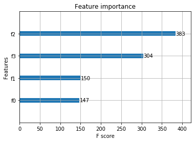

XGBoost的纯Python实现
===

目录
---

[TOC]

## 1. 背景

在[上一期的笔记中](https://blog.csdn.net/qq_41729780/article/details/105172787)，我们主要讨论了`XGBoost`的原理，最近我在公众号[机器学习实验室](https://mp.weixin.qq.com/s/C565yhe4OTqSgt687JtaZg)看到一篇文章，里面给出了`XGBoost`的纯python实现，刚好能够作为补充，于是我将代码摘录了过来，方便学习和记录。

## 2. XGBoost的纯Python实现

定义XGBoost单棵树模型如下：

```python
class XGBoostTree(Tree):
    # 结点分裂
    def _split(self, y):
        col = int(np.shape(y)[1]/2)
        y, y_pred = y[:, :col], y[:, col:]
        return y, y_pred

    # 信息增益计算公式
    def _gain(self, y, y_pred):
        Gradient = np.power((y * self.loss.gradient(y, y_pred)).sum(), 2)
        Hessian = self.loss.hess(y, y_pred).sum()
        return 0.5 * (Gradient / Hessian)

    # 树分裂增益计算
    def _gain_by_taylor(self, y, y1, y2):
        # 结点分裂
        y, y_pred = self._split(y)
        y1, y1_pred = self._split(y1)
        y2, y2_pred = self._split(y2)

        true_gain = self._gain(y1, y1_pred)
        false_gain = self._gain(y2, y2_pred)
        gain = self._gain(y, y_pred)
        return true_gain + false_gain - gain

    # 叶子结点最优权重
    def _approximate_update(self, y):
        # y split into y, y_pred
        y, y_pred = self._split(y)
        # Newton's Method
        gradient = np.sum(y * self.loss.gradient(y, y_pred), axis=0)
        hessian = np.sum(self.loss.hess(y, y_pred), axis=0)
        update_approximation =  gradient / hessian

        return update_approximation

    # 树拟合方法
    def fit(self, X, y):
        self._impurity_calculation = self._gain_by_taylor
        self._leaf_value_calculation = self._approximate_update
        super(XGBoostTree, self).fit(X, y)
```

然后根据前向分步算法定义XGBoost模型：

```python
class XGBoost(object):

    def __init__(self, n_estimators=200, learning_rate=0.001, min_samples_split=2,
                 min_impurity=1e-7, max_depth=2):
        self.n_estimators = n_estimators            # Number of trees
        self.learning_rate = learning_rate          # Step size for weight update
        self.min_samples_split = min_samples_split  # The minimum n of sampels to justify split
        self.min_impurity = min_impurity            # Minimum variance reduction to continue
        self.max_depth = max_depth                  # Maximum depth for tree


        # 交叉熵损失
        self.loss = LogisticLoss()

        # 初始化模型
        self.estimators = []
        # 前向分步训练
        for _ in range(n_estimators):
            tree = XGBoostTree(
                    min_samples_split=self.min_samples_split,
                    min_impurity=min_impurity,
                    max_depth=self.max_depth,
                    loss=self.loss)

            self.estimators.append(tree)

    def fit(self, X, y):
        y = to_categorical(y)

        y_pred = np.zeros(np.shape(y))
        for i in range(self.n_estimators):
            tree = self.trees[i]
            y_and_pred = np.concatenate((y, y_pred), axis=1)
            tree.fit(X, y_and_pred)
            update_pred = tree.predict(X)
            y_pred -= np.multiply(self.learning_rate, update_pred)

    def predict(self, X):
        y_pred = None
        # 预测
        for tree in self.estimators:
            update_pred = tree.predict(X)
            if y_pred is None:
                y_pred = np.zeros_like(update_pred)
            y_pred -= np.multiply(self.learning_rate, update_pred)

        y_pred = np.exp(y_pred) / np.sum(np.exp(y_pred), axis=1, keepdims=True)
        # 将概率预测转换为标签
        y_pred = np.argmax(y_pred, axis=1)
        return y_pred
```

使用sklearn数据作为示例：

```python
from sklearn import datasets
data = datasets.load_iris()
X = data.data
y = data.target

X_train, X_test, y_train, y_test = train_test_split(X, y, test_size=0.4, seed=2)  

clf = XGBoost()
clf.fit(X_train, y_train)
y_pred = clf.predict(X_test)

accuracy = accuracy_score(y_test, y_pred)
print ("Accuracy:", accuracy)
```

```python
Accuracy: 0.9666666666666667
```

## 3. 调用XGBoost库函数

XGBoost也提供了原生的模型库可供我们调用。pip安装xgboost即可：

```python
pip install xgboost
```

同样使用sklearn数据集进行测试：

```python
import xgboost as xgb
from xgboost import plot_importance
from matplotlib import pyplot as plt

# 设置模型参数
params = {
    'booster': 'gbtree',
    'objective': 'multi:softmax',
    'num_class': 3,
    'gamma': 0.1,
    'max_depth': 2,
    'lambda': 2,
    'subsample': 0.7,
    'colsample_bytree': 0.7,
    'min_child_weight': 3,
    'silent': 1,
    'eta': 0.001,
    'seed': 1000,
    'nthread': 4,
}

plst = params.items()

dtrain = xgb.DMatrix(X_train, y_train)
num_rounds = 200
model = xgb.train(plst, dtrain, num_rounds)

# 对测试集进行预测
dtest = xgb.DMatrix(X_test)
y_pred = model.predict(dtest)

# 计算准确率
accuracy = accuracy_score(y_test, y_pred)
print ("Accuracy:", accuracy)
# 绘制特征重要性
plot_importance(model)
plt.show();
```

```python
Accuracy: 0.9166666666666666
```



_注：以上代码转自公众号 [机器学习实验室](https://mp.weixin.qq.com/s/C565yhe4OTqSgt687JtaZg) 的文章[《数学推导+纯Python实现机器学习算法17：XGBoost》](https://mp.weixin.qq.com/s/C565yhe4OTqSgt687JtaZg)_

---

联系邮箱：curren_wong@163.com

Github：[https://github.com/CurrenWong](https://github.com/CurrenWong)

欢迎转载/Star/Fork，有问题欢迎通过邮箱交流。
