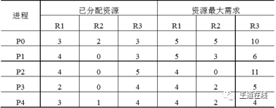

计算机网络每日一题 2020 July
===

目录
---

[TOC]

## 1. Week 3

### 1.1. Wed

设文件索引节点中有7 个地址项,其中4 个地址项是直接地址索引,2 个地址项是一级间接地址索引,1 个地址项是二级间接地址索引,每个地址项大小为4 字节。若磁盘索引块和磁盘数据块大小均为256 字节,则可表示的单个文件最大长度是               。［吉林大学］

A.33 KB

B.519 KB

C.1057 KB

D.16513 KB

答案

答案：C 
每个直接地址索引可以存储 256B 数据，4个可以存储 1KB 数据。 
一级间接地址索引可以存储 256 / 4 = 64 个地址项，对应 64 x 256 = 16 KB，2个为 32KB。 
二级地址索引可以存储 64 * 64  = 4K 个地址项，对应 4K x 256 = 1024 KB 数据。 
累加为 1057 KB。

### 1.2. Thu

下列关于虚拟存储器的叙述中，正确的是          。［中山大学］

A．虚拟存储只能基于连续分配技术

B．虚拟存储只能基于非连续分配技术

C．虚拟存储容量只受外存容量的限制

D．虚拟存储容量只受内存容量的限制

答案

答案：B 
解析：虚拟内存的实现需要建立在离散分配的内存管理方式的基础上，有以下三种实现方式：①请求分页存储管理；②请求分段存储管理；③请求段页式存储管理。虚拟存储器容量既不受外存容量限制，也不受内存容量限制，而是由CPU 的寻址范围决定的。虚拟存储器的实现受外存容量、内存容量的限制。

### 1.3. Fri

若某单处理器多进程系统中有多个就绪态进程，则下列关于处理机调度的叙述中，错误的是        。［中山大学］
A．在进程结束时能进行处理机调度

B．创建新进程后能进行处理机调度

C．在进程处于临界区时不能进行处理机调度

D．在系统调用完成并返回用户态时能进行处理机调

答案

答案：C 
解析：选项A、B、D 显然是可以进行处理机调度的情况。对于C，当进程处于临界区时，说明进程正在占用处理机，只要不破坏临界资源的使用规则，是不会影响处理机调度的，比如，通常访问临界资源可能是慢速的外设（如打印机），如果在进程访问打印机时，不能处理机调度，那么系统的性能将是非常低的。几种不适合进行处理机调度的情况：①在处理中断的过程中；②进程在操作系统内核程序临界区中；③其他需要完全屏蔽中断的原子操作过程中。

### 1.4. Sat

设系统缓冲区和用户工作区均采用单缓冲，从外设读入1 个数据块到系统缓冲区的时间为100，从系统缓冲区读入1 个数据块到用户工作区的时间为5，对用户工作区中的1 个数据块进行分析的时间为90。进程从外设读入并分析2 个数据块的最短时间是        。［武汉理工大学］

A.200

B.295

C.300

D.390

_注：数据向外传输完毕以后才能接收新的数据传入_

答案

答案：C 
解析：
100+5+MAX(90,100)+5+90==100+5+100+5+90=300
注：第1 次分析与第二次读外设并行执行。 数据块1 从外设到用户工作区的总时间为 105，在这段时间中，数据块2 没有进行操 作。在数据块1 进行分析处理时，数据块2 从外设到用户工作区的总时间为105，这段时 间是并行的。再加上数据块2 进行处理的时间90，总共是300.

### 1.5. Sun

某计算机采用二级页表的分页存储管理方式，按字节编址，页大小为2^10字节，页表项大小为2 字节，逻辑地址结构为：

逻辑地址空间大小为2^16页，则表示整个逻辑地址空间的页目录表中包含表项的个数至少是______。［西北大学］

A.64

B.128

C.256

D.512

答案

答案：B 
解析：1 页为1KB，一页可存储512 个页地址（页表项大小为2 字节），逻辑地址空间大小为2^16页，页表占用2^16/512=128 页，所以页目录中至少要有128 个表项。

## 2. Week 4

### 2.1. Mon

下列关于进程和线程的叙述中，正确的是         。［西北大学］

A．不管系统是否支持线程，进程都是资源分配的基本单位

B．线程是资源分配的基本单位，进程是调度的基本单位

C．系统级线程和用户级线程的切换都需要内核的支持

D．同一进程中的各个线程拥有各自不同的地址空间

答案

答案：A
解析：在用户级线程中，有关线程管理的所有工作都由应用程序完成，无需内核
的干预，内核意识不到线程的存在。关于进程和线程的其他区别见下表所示：

|   类型   |                            进程                            |                              线程                              |
| :------: | :--------------------------------------------------------: | :------------------------------------------------------------: |
| 资源分配 |               进程是资源分配和拥有的基本单位               | 线程自己基本不拥有系统资源，但它可以访问所属进程拥有的全部资源 |
|   调度   | 在没有引入线程的操作系统中，进程是独立调度和分派的基本单位 |     引入线程后的操作系统中，线程是独立调度和分派的基本单位     |
| 地址空间 |                 进程的地址空间之间相互独立                 |              同一进程的各线程间共享进程的地址空间              |

### 2.2. Tue

在支持多线程的系统中，进程P 创建的若干个线程不能共享的是       ［西北大学]

A．进程P 的代码段

B．进程P 中打开的文件

C．进程P 的全局变量

D．进程P 中某线程的栈指针

答案

答案：D 
解析：进程中某线程的栈指针，对其它线程透明，不能与其它线程共享。

### 2.3. Wed

下列选项中，不能改善磁盘设备I/O 性能的是        。［电子科技大学］

A．重排I/O 请求次序

B．在一个磁盘上设置多个分区

C．预读和滞后写

D．优化文件物理块的分布

答案

答案：B 
解析：对于A，重排I/O 请求次序也就是进行I/O 调度，从而使进程之间公平地共享磁盘访问，减少I/O 完成所需要的平均等待时间。对于C，缓冲区结合预读和滞后写技术对于具有重复性及阵发性的I/O 进程改善磁盘I/O 性能很有帮助。对于D，优化文件物理块的分布可以减少寻找时间与延迟时间，从而提高磁盘性能。

### 2.4. Thu

文件系统用位图法表示磁盘空间的分配情况，位图存于磁盘的32～127 号块中，每个盘块占1024 个字节，盘块和块内字节均从0 开始编号。假设要释放的盘块号为409612，则位图中要修改的位所在的盘块号和块内字节序号分别是        ［电子科技大学］

A．81，1

B．81，2

C．82，1

D．82，2

答案

答案：C 
解析：一个盘块有8192 位，409612/8192=50，409612%8192= 12，所以，盘块号为409612 对应位图中的盘块号为32+50=82，块内字节序号floor(12/8) = 1 (0~7位块内字节序号为0, 8~15块内字节序号为1)

### 2.5. Fri

假设5 个进程P0、P1、P2、P3、P4 共享三类资源R1、R2、R3，这些资源总数分别为18、6、22。T0 时刻的资源分配情况如下表所示，此时存在的一个安全序列是         ［电子科技大学］

A. P0, P2, P4, P1, P3

B. P1, P0, P3, P4, P2

C. P2, P1, P0, P3, P4

D. P3, P4, P2, P1, P0

答案

答案：D 
解析：初始时进程P1 与P3 可满足需求，排除A、C。尝试给P1 分配资源，则P1
完成后Available 将变为（6,3,6），无法满足P0 的需求，排除B。尝试给P3 分配资源，则P3 完成后Available 将变为（4,3,7），该向量能满足其他所有进程的需求。所以，以P3 开头的所有序列都是安全序列。

