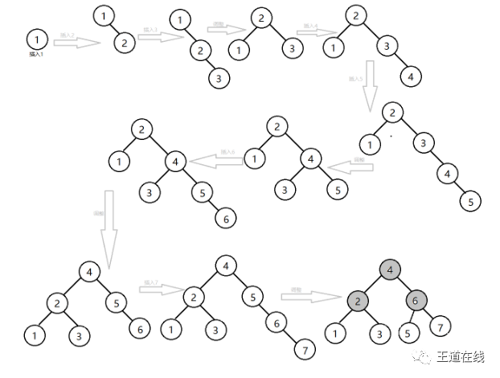

数据结构每日一题 2020 July
===

目录
---

[TOC]

## 1. Week 3

### 1.1. Wed

对一组数据(2，12，16，88，5，10)进行排序，若前三趟排序结果如下

```cpp
第一趟：2，12，16，5，10，88
第二趟：2，12，5，10，16，88
第三趟：2，5，10，12，16，88
```

则采用的排序方法可能是          [哈尔滨工业大学]

A．起泡排序

B．希尔排序

C．归并排序

D．基数排序

<details>
<summary>答案</summary>
<math-details>

答案：A<br>
解析：考查各排序算法的特点；
第一趟：2，12，16，5，10，88，是88到了序列的末尾；
第二趟：2，12，5，10，16，88，是16到了序列的倒数第二个位置；
第三趟：2，5，10，12，16，88，是12到了序列的倒数第三个位置；
根据这三趟排序时，均是大数排到末尾的特点可以知道，本题目中可能采用了起泡排序。
</math-details>
</details>

### 1.2. Thu

设一棵非空完全二叉树T的所有叶结点均位于同一层，且每个非叶结点都有2个子结点。若T有k个叶结点，则T的结点总数是         [哈尔滨工业大学]

A.2k-1

B.2k

C.k^2

D.2^k-1

<details>
<summary>答案</summary>
答案：A<br>
解析：首先，一棵非空完全二叉树T的所有叶结点均位于同一层，且每个非叶结点都有2个子结点就是满二叉树。于是我们设树高为h，有 k = 2^(h-1)，h=log2k+1,总结点数为2^h-1 = 2^(log2k+1)-1 = 2*2^(log2k)-1 = 2k-1。
</details>

### 1.3. Fri

下列选项中，不能构成折半查找中关键字比较序列的是        。[哈尔滨工业大学]

A.  500,200,450,180

B.  500,450,200,180

C.  180,500,200,450

D.  180,200,500,450

<details>
<summary>答案</summary>
答案：A<br>
解析：折半查找的判定树是一棵二叉排序树，四个选项中，只有A选项的对应判定树不满足二叉排序树的特点。如图，180不满足小于200。
</details>


### 1.4. Sat

现有一棵无重复关键字的平衡二叉树（AVL 树）,对其进行中序遍历可得到一个降序序列。下列关于该平衡二叉树的叙述中，正确的是          [哈尔滨工业大学]

A.   根结点的度一定为2

B.  树中最小元素一定是叶结点

C.  最后插入的元素一定是叶结点

D.  树中最大元素一定是无左子树

_注：前序遍历-根左右，中序遍历-左根右，后序遍历-左右根_

<details>
<summary>答案</summary>
答案：D<br>
解析：<br>
A. 只有一个根节点也可以称之为平衡二叉树，此时度不为2<br>
B. 中序遍历：LPR。当没有R的时候，最小元素是P，它不是叶子结点<br>
C. 因为要进行平衡调整，所以不一定。LR旋转和RL旋转，最后插入的结点都可能成为根节点<br>
D. 中序遍历：LPR。如果有左子树，则P比左子树更小，不会是最大元素<br>
</details>

### 1.5. Sun

要使一棵非空二叉树的先序序列与中序序列相同，其所有非叶结点须满足的条件是           [哈尔滨工业大学]

A.  只有左子树

B.  只有右子树

C.  结点的度均为1

D.  结点的度均为2

<details>
<summary>答案</summary>
答案：B<br>
解析：先序序列是先父结点，接着左子树，然后右子树。中序序列是先左子树，接着父结点，然后右子树，递归进行。如果所有非叶结点只有右子树，先序序列和中序序列都是先父结点，然后右子树，递归进行，因此B正确。
</details>

## 2. Week 4

### 2.1. Mon

若将关键字1，2，3，4，5，6，7 依次插入到初始为空的平衡二叉树T 中，则T 中平衡因子为0 的分支结点的个数是        [吉林大学]

A.  0

B.  1

C.  2

D.  3

<details>
<summary>答案</summary>
答案：D<br>
解析：注意，问的是分支结点，不包括叶子结点的平衡因子。
</details>



### 2.2. Tue

先序序列为a,b,c,d 的不同二叉树的个数是         [哈尔滨工业大学]

A.  13

B.  14

C.  15

D.  16

_注：卡特兰数为 1, 1, 2, 5, 14, 42, 132, ..._

$$
f(n)=\frac{C_{2 n}^{n}}{n+1}
$$

$$
f(n)=\sum_{i=0}^{n-1} f(i) \times f(n-i-1)
$$

$$
f(n)=C_{2 n}^{n}-C_{2 n}^{n-1}
$$

$$
C_{n+1}=C_{0} C_{n}+C_{1} C_{n-1}+\cdots+C_{n} C_{0}
$$

<details>
<summary>答案</summary>
答案：B<br>
解析：根据二叉树前序遍历和中序遍历的递归算法中递归工作栈的状态变化得出：前序序列和中序序列的关系相当于以前序序列为入栈次序，以中序序列为出栈次序。因为前序序列和中序序列可以唯一地确定一棵二叉树，所以题意相当于“以序列a,b,c,d 为入栈次序，则出栈序列的个数为？”，根据卡特兰数，得14种不同的出栈序列个数。
</details>

### 2.3. Wed

一个高度为h的满二叉树共有n个结点，其中有m个叶子结点，则       成立。  [哈尔滨工业大学]

A.  n=h+m

B.  h+m=2n

C.  m=h-1

D.  n=2m-1

<details>
<summary>答案</summary>
答案：D<br>
解析：满二叉树的高度和节点总数满足下列关系n = 2^h - 1;而且叶子节点全都位于第H 层，所以又有m = 2^(h-1);易知n = 2*m-1。
</details>

### 2.4. Thu

一个空栈，如果有顺序输入：a1，a2，a3。。。an（个数大于3），而且输出第一个为an-1,那么所有都出栈后，             [吉林大学]

A.  输出的最后元素一定为an

B.  输出的最后元素一定为a1

C.  不能确定元素a1~an-2输出顺序

D.  an-2一定比an-3先出

<details>
<summary>答案</summary>
答案：D<br>
解析：a1~an必须是按顺序入栈的。题目最后说第一个出栈的是an-1,由这里可以推测，a1-an-1都是顺序入栈了，至于an，他可以在a1~an-1任意一个元素出栈的过程入栈的，所以an输出的顺序不能确定，故A，B都错（对于B，若an始终不进栈，a1~an-2都出栈了以后再进栈，这时候弹出的是an为最后一个）。C选项错误，a1~an-2输出顺序是逆序的，而an可能穿插在这个序列中的任意一个位置。所以an-2一定比an-3先出是正确的，选D。
</details>

### 2.5. Fri

以下说法错误的是       [南京大学]

A.  一般在哈夫曼树中，权值越大的叶子离根结点越近

B.  哈夫曼树中没有度数为1的分支结点

C.  若初始森林中共有n棵二叉树，最终求得的哈夫曼树共有2n-1个结点

D.  若初始森林中共有n棵二叉树，进行2n-1次合并后才能剩下一棵最终的哈夫曼树

_注：结点度数为其子结点的个数_
<details>
<summary>答案</summary>
答案：D<br>
解析：根据哈夫曼树的性质，A，B显然正确，初始森林中的n棵二叉树，每棵树有一个孤立的结点，它们既是根，又是叶子。n个叶子的哈夫曼树要经过n-1次合并，产生n-1个新结点。最终求得的哈夫曼树有2n-1个结点，所以C正确。哈夫曼树每次合并都会少一颗二叉树，所以进行n-1次合并即可，D错误。
</details>
