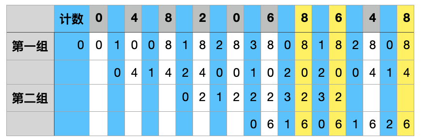
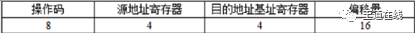

计算机组成每日一题 2020 July
===

目录
---

[TOC]

## 1. Week 3

### 1.1. Wed

程序P 在机器M 上的执行时间是20 秒，编译优化后，P 执行的指令数减少到原来的70%，而CPI 增加 到原来的1.2 倍，则P 在M 上的执行时间是       [北京科技大学]

A．8.4 秒

B．11.7 秒

C．14 秒

D．16.8 秒

_注：CPI表示执行一条指令所需要的时钟周期数 = 总时钟周期数/IC；IC表示总指令数_

答案

<math-details>

答案：D 
解析：设程序P有i 条指令， 则编译优化前，CPI0＝20/i。编译优化后， 指令条数为i x 70% ，CPI＝1.2 x 20/i ， 因而编译优化后，P 在M 上的执行时间＝i x 70% x 1.2 x 20/i ＝16.8 秒。
</math-details>

### 1.2. Thu

假定基准程序A 在某计算机上的运行时间为100 秒，其中90 秒为CPU 时间，其余为I/O 时间。若CPU 速度提高50%，I/O 速度不变，则运行基准程序A 所耗费的时间是         [北京科技大学]

A．55 秒

B．60 秒

C．65 秒

D．70 秒

答案

答案：D 
解析：CPU 速度提高50%，即CPU 性能提高比为1.5，改进之后的CPU 运行时间＝90÷1.5＝60 秒。I/O 速度不变，仍维持10 秒，所以运行基准程序A 所耗费的时间为70 秒。

### 1.3. Fri

假设某计算机按字编址，Cache有4 个行，Cache 和主存之间交换的块大小为1 个字。若Cache 的内容初 始为空，采用2 路组相联映射方式和LRU 替换算法，当访问的主存地址依次为0，4，8，2，0，6，8，6，4，8 时，命中Cache 的次数为            [杭州电子科技大学]

A．1

B．2

C．3

D．4

答案

答案：C 
解析：Cache 有4 个行，2 路组相联，即Cache 被分成2 组，每组2 行。主存地址为0～1、4～5、8～9 可映射到第0 组Cache中，主存地址为2～3、6～7 可映射到第1 组 Cache中。Cache 初始为空，采用LRU 替换 算法，当访问主存的10 个地址依次为0，4，8，2，0，6，8，6，4，8 时，命中Cache的次数共有3 次，分别发 生在第7、8 和10 步时。

_注：计数器的变化规则_

1. 命中时，所命中的行的计数器清零，比其低的计数器加1，其余不变。
2. 未命中且还有空闲行时，新装入的行的计数器置0，其余全加1。
3. 未命中且无空闲行时，计数值为3的信息块被淘汰，新装入的块的计数器置0，其余全加1。

### 1.4. Sat

在计算机体系结构中，CPU 内部包括程序计数器PC、存储器数据寄存器MDR、指令寄存器IR 和存 储器地址寄存器MAR 等。若CPU 要执行的指令为：MOV R0 ，100（即将数值100 传送到寄存器R0 中），则CPU 首先要完成的操作是       。[杭州电子科技大学]

A．100→R0

B．100→MDR

C．PC→MAR

D．PC→IR

答案

答案：C 
解析：无论运行什么类型的指令，CPU 首先需要取指令，取指令阶段的第一个操作就是将指令地址（程序计数器PC 中的内容）送往存储器地址寄存器。

### 1.5. Sun

浮点数加减运算过程一般包括对阶、尾数运算、规格化、舍人和判断溢出等步骤。设浮点数的阶码和 尾数均采用补码表示，且位数分别为5 位和7 位（均含2 位符号位）。若有两个数X＝2^7×29/32，Y＝2^5×5/8， 则用浮点加法计算X＋Y 的最终结果是        。[杭州电子科技大学]

A．001111100010

B．001110100010

C．010000010001

D．发生溢出

答案

答案：D 
解析：根据题意，X 可记为00,111;00,11101（分号前为阶码，分号后为尾数） ，Y 可记为00,101;00,10100；首先对阶，X、Y 阶码相减，即00,111 一00,101＝00,111＋11,011＝00,010（最高位进位自然丢弃） ，可知X 的阶 码比Y 的阶码大2，根据小阶向大阶看齐的原则，将Y 的阶码加2，尾数右移2 位，得Y 为00,111;00,00101；尾数相加，即00,11101＋00,00101＝01,00010，尾数相加结果符号位为01，故需进行右规；规格化，将尾数右移1 位，阶码加1，得X＋Y 为01,000;00,10001 ，阶码符号位为01，说明发生溢出。

## 2. Week 4

### 2.1. Mon

若x＝103，y＝－25，则下列表达式采用8 位定点补码运算实现时，会发生溢出的是        [杭州电子科技大学]

A．x＋y

B．－x＋y

C．x－y

D．－x－y

_注：$n$位补码定点整数表示范围为$[-2^n, 2^n-1]$_

答案

答案：C 
解析：8位定点补码能表示的数的范围为：－128～127。A 项，结果为78，B 项，结果为－128，D 项， 结果为－78 都在此范围内。C 项，结果128 超过了8 位定点补码能表示的数的范围，会发生溢出。

### 2.2. Tue

由3 个“1”和5 个“ 0”组成的8 位二进制补码，能表示的最小整数是        [杭州电子科技大学]

A．－126

B．－125

C．－32

D．－3

答案

答案：B 
解析：能表示的最小整数一定是负数，符号位占用1 个“1”；负数的补码和原码的转化是：原码符号位不 变，数值部分按位取反，末位加“ 1”。因此最小的整数的补码是“ 10000011”，原码为“ 11111101”，即(－125)。

### 2.3. Wed

设在网络中传送采用偶校验的ASCII 码，当收到的数据位为1101 0100 时，可以断定          [杭州电子科技大学]

A．未出错

B．出现偶数位错

C．未出错或出现偶数位错

D．出现奇数位错

答案

答案：C 
解析：一位奇偶校验码只能发现奇数位错误。本题中，收到的数据中有偶数个1，这样可能没有出错，也可能是出现了偶数位错误（奇偶校验码无法发现偶数位错）。

### 2.4. Thu

若[x] 补＝$(1 x_1 x_2 x_3 x_4 x_5 x_6)_B$，其中 $x_i$ 取 0 或1，若要 $x > -32$，应当满足      。 [杭州电子科技大学]

A．x1为0，其他各位任意

B．x1 为1，其他各位任意

C．x1 为1，x2,x6中至少有一位为1

D．x1为0 , x2,x6 中至少有一位为1

答案

答案：C 
解析：[x]补的符号位为1，所以x 一定是负数。绝对值越小，数值越大，所以，要满足x＞－32，则x 的 绝对值必须小于32。因此，x1为1，x2, x6 中至少有一位为1，这样，各位取反末尾加1 后，x1 一定为0，x2, x6 中至少有一位为1，这使得x 的绝对值保证小于32。

### 2.5. Fri

某计算机有16 个通用寄存器，采用32 位定长指令字。操作码字段（含寻址方式位）为8 位，Store 指令的 源操作数和目的操作数分别采用寄存器直接寻址和基址寻址方式，若基址寄存器可使用任一通用寄存器，且偏移量用补码表示，则Store 指令中偏移量的取值范围是          。 [北京科技大学]

A．－32768～＋32767

B．－32767～＋32768

C．－65536～＋65535

D．－65535～＋65536

答案

答案：A 
解析：采用32位定长指令字，其中操作码为8位，两个地址码共占用 32-8=24 位，而 Store 指令的源操作数和目的操作数分别采用寄存器直接寻址和基址寻址，机器中共有16个通用寄存器，因此一个寄存器需要log2(16)=4位，源操作数中的寄存器直接寻址用掉4位，而目的操作数采用基址寻址也要指定一个寄存器，同样用掉4位，则留给偏移址的位数为16位。指令编址方式如下所示 
16 位补码取值范围为－32768～＋32767，所以偏移量取值范围为－32768～＋32767。

