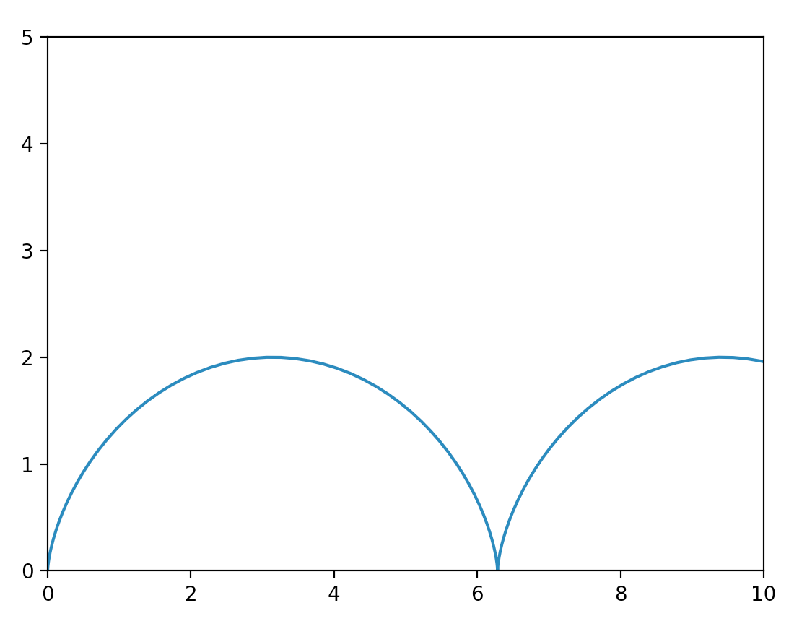

第六章 定积分的应用
===

## 1. 目录

[TOC]

## 2. 背景

前段时间复习完了高数第六章的内容，我参考《复习全书·基础篇》和老师讲课的内容对这一章的知识点进行了整理，形成了这篇笔记，方便在移动设备上进行访问和后续的补充修改。

## 3. 几何应用

### 3.1. 平面图形的面积

可通过二重积分 $S = \iint_D 1 d \sigma$ 进行计算。

1. 若平面域 $D$ 由曲线 $y = f(x), y=g(x), (f(x) \ge g(x)), x = a, x = b, )a < b)$ 所围成，则平面域 $D$ 的面积为

$$
S = \int_{a}^{b} [f(x) - g(x)] dx
\tag{6.1}
$$

2. 若平面域 $D$ 由曲线 $\rho = \rho(\theta), \theta = \alpha, \theta = \beta(\alpha < \beta)$ 所围成，则其面积为

$$
S = \frac{1}{2} \int_{\alpha}^{\beta} \rho^2(\theta) d\theta
\tag{6.2}
$$

### 3.2. 旋转体体积

可通过二重积分 $V =  2\pi \iint_D y d \sigma$ 和 $V =  2\pi \iint_D x d \sigma$ 进行计算。被积函数表示旋转点的半径，$2\pi r$ 表示该点旋转的周长，对 $x$ 和 $y$ 进行积分后 $V =  2\pi \iint_D r d \sigma$ 表示区域旋转体的体积。

若区域 $D$ 由 $y = f(x), (f(x) \ge 0)$ 和直线 $x = a, x = b, (0 \le a \le b)$ 及 $x$ 轴所围成的，则

1. 区域 $D$ 绕 $x$ 轴旋转一周所得到的旋转体体积为

$$
V_x = \pi \int_{a}^{b} f^2(x) dx
\tag{6.3}
$$

2. 区域 $D$ 绕 $y$ 轴旋转一周所得到的旋转体体积为

$$
V_y = 2\pi \int_{a}^{b} xf(x) dx
\tag{6.4}
$$

若区域 $D$ 由 $y = f(x), (f(x) \ge 0)$ 和直线 $x = a, x = b, (0 \le a \le b)$ 及 $y = a$ 所围成的，则

3. 区域 $D$ 绕 $y = a(a > \max y)$ 旋转一周所得到的旋转体体积为

$$
V_x = \pi \int_{a}^{b} [a  - f(x)]^2 dx
\tag{6.9}
$$

若区域 $D$ 由 $y = f(x), (f(x) \ge 0)$ 和直线 $x = a, x = b, (0 \le a \le b)$ 及 $x = a$ 所围成的，则

4. 区域 $D$ 绕 $x = a (a < \min x)$ 旋转一周所得到的旋转体体积为

$$
V_y = 2\pi \int_{a}^{b} (x-a)f(x) dx
\tag{6.10}
$$

若区域 $D$ 由 $x = \varphi(y)$ 和直线 $y = c, y = d, (c \le d)$ 及 $y$ 轴所围成的，则

5. 区域 $D$ 绕 $y$ 轴旋转一周所得到的旋转体体积为

$$
V_y = \pi \int_{c}^{d} [\varphi(y)]^2 dy
\tag{6.11}
$$

6. 曲线弧长

$C: y = y(x), a \le x \le b$

$$
s = \int_{a}^{b} \sqrt[]{1 + y'^2}  dx
\tag{6.5}
$$

$C: \left\{\begin{array}{l}x\;=\;x(t)\\y\;=\;y(t)\end{array},\;\alpha\;\leq t\;\leq\beta\right.$

$$
s = \int_{\alpha}^{\beta} \sqrt[]{x'^2 + y'^2}  dt
\tag{6.6}
$$

$C: \rho = \rho(\theta), \alpha \le \theta \le \beta$

$$
s = \int_{\alpha}^{\beta} \sqrt[]{\rho^2 + \rho'^2}  d\theta
\tag{6.7}
$$

### 3.3. 旋转体侧面积

曲线 $y = f(x), (f(x) \ge 0)$ 和 直线 $x = a, x = b, (0 \le a \le b)$ 及 $x$ 轴所围成区域绕 $x$ 轴旋转所得旋转体的侧面积为

$$
S = 2 \pi \int_{a}^{b} f(x) \sqrt[]{1 + f'^2(x)}  dx
\tag{6.8}
$$

## 4. 物理应用

1. 压力
2. 变力做功
3. 引力

## 5. 补充知识

摆线，又称旋轮线、圆滚线，在数学中，摆线（Cycloid）被定义为，一个圆沿一条直线运动时，圆边界上一定点所形成的轨迹。

$$
{\left\{ \begin{aligned}
x=r \times (t-sint) & \\
y=r \times (1-cost) & \\
\end{aligned}\right. }
$$

$r$为圆的半径，$t$ 是圆的半径所经过的弧度（滚动角），当 $t$ 由 $0$ 变到 $2\pi$时，动点就画出了摆线的一支，称为一拱。

$$
r = 1 的\text{摆线方程}
$$
