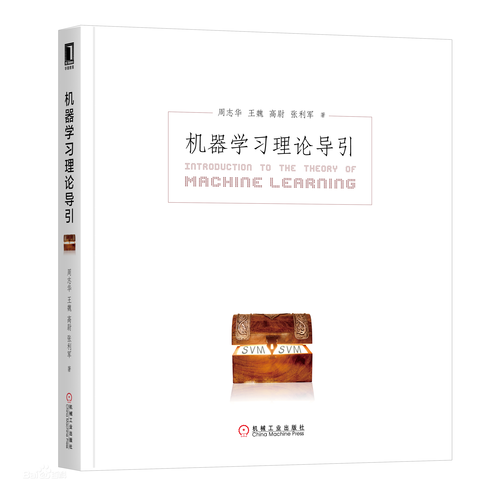
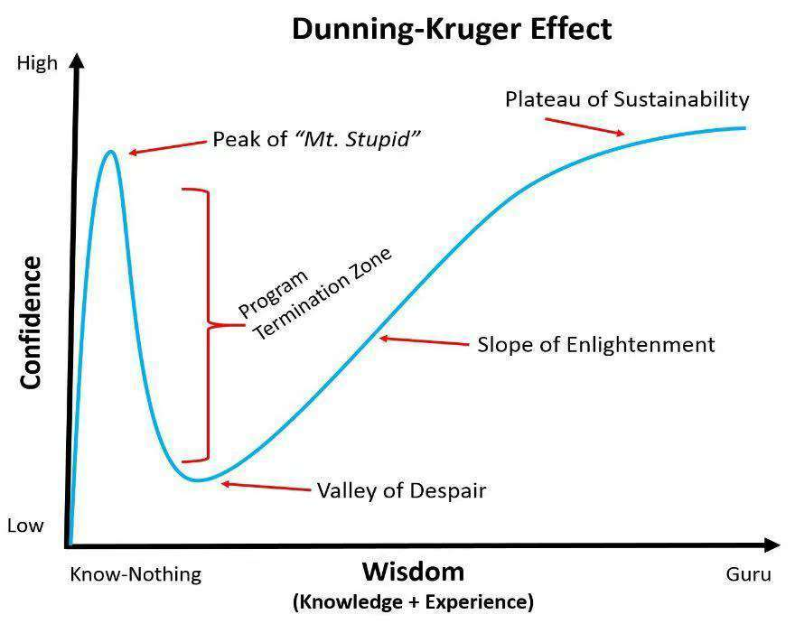

机器学习理论导引
=====

目录
---

[TOC]

## 1. 背景

最近看到了周志华老师出了新书《机器学习理论导引》，我抱着不能错过的心态买来看了一看，发现新书与以前看过的机器学习方面的书所讲述的内容完全不一样，于是想写一篇笔记记录一下。

## 2. 概述



这是一本让人自省并且发现自己的无知的书。

我大概是一年前开始了解机器学习的，也就是那个 `不学AI，无以言` 的时候。周志华老师的《**机器学习**》，李航老师的《**统计学习方法**》，拿在手上好像走路带风，有了这两本书，好像就把自己和熙熙攘攘的人群区分了开来，我们是`知道AI的人`，他们是 `不知道AI的人`。

我在淘宝搜了一下，《**深度学习**》没有上面两本书卖得好，为什么呢？主要是太重了不好带着出门。

刚开始学的时候，`sklearn` 一调，两手一叉，再喝口茶，看着屏幕上输出的 `loss` 逐渐降低，感觉自己就是 `AI` 的 `Master`。

后来陆陆续续看了一点`CV`、`NLP`、`GAN`、`知识图谱`，虽然公式很多看不懂，但许多时候也就是这样的`网络` 和那样的 `卷积` 的一些组合。再加上可以 `import tensorflow as tf`，`from torch import nn`，`import mxnet as mx`，哪里不会点哪里，想要什么网络都有现成的。

于是，`AI` 工具的低使用门槛和 `AI` 岗位的高收益形成了鲜明的对比，这就是金融界苦苦追寻的**无风险套利**啊。一时间搞生物的、搞机械的、搞通讯的都开始学起了 `AI`，其中当然少不了我们搞计算机的，字节跳动甚至因为**收到的算法工程师简历的数量远超需求**，给求职者发邮件建议大家转投开发岗位。与此同时，我们也学会了一个名词叫**人才内卷**。

质疑的声音也总会有的，一个跑出来的结果好，但是你根本不知道为什么好的模型，真的会有不错的应用前景吗？

在这样的环境下，潜心搞理论研究的人少，赶紧调个参发两篇论文的人多。

我学得也很浮躁，因为别人在宣扬 `AI` 会推翻人类对世界的统治的时候，我默默地看了一眼屏幕中的神经网络，低下了自己的头。

---

从京东小哥手里拿过书的时候，我掂量了一下，不重，适合带出门。拆掉外包装之后，发现页面有一点褶皱，不要紧，再过一年可能就看起来跟新买的一样了。

看书先看目录，可是一看目录我就傻了，预想之中的熟悉感没有到来，很多东西见都没见过。

我们来看看《**机器学习**》的目录。

```cpp
├── 第1章 绪论
├── 第2章 模型评估与选择
├── 第3章 线性模型
├── 第4章 决策树
├── 第5章 神经网络
├── 第6章 支持向量机
└── ...
```

是不是觉得都比较熟悉，起码有个大概的`idea`，知道这些是什么东西。

再来看看《**机器学习理论导引**》的目录。

```cpp
├── 第1章 预备知识
├── 第2章 可学性
├── 第3章 复杂度
├── 第4章 泛化界
├── 第5章 稳定性
├── 第6章 一致性
├── 第7章 收敛率
└── 第8章 遗憾界
```

阿Sir，这些都是啥呀。什么是`PAC可学`、`VC维`、`Natarajan维`、`线性超平面`、`在线强凸优化`？

我再翻到序言部分，老师从2017年开始试讲本书，期间多次调整内容，在2018年给南京大学研究生讲完一轮后，有 $1/3$ 的学生感觉难度较大。再次调整内容后，在2019年春季又讲授一轮，学生反馈情况大致符合预期。

我们可以再拿周志华老师之前的作品来进行对比。在《机器学习》一书中，周志华老师提到这是一本**面向理工科高年级本科生和研究生的教科书**，并且给出了如果作为本科生教材，讲授进度上的一些建议。

而在《**机器学习理论导引**》中，老师说，本书读者必须具备**较为扎实的理工科高年级本科生的数学知识**，还**必须具备机器学习的基础知识**，至少应该系统性地学习过机器学习的专门性教科书。

由此我们大概可以认为，《**机器学习理论导引**》是《**机器学习**》一书的后续进阶读物，涉及理论研究方面的内容，主要面向的群体应该还是研究生。

对于我这个刚接触机器学习一年的普通本科生来说，里面是全新的内容，粗看下来更像是一本数学和统计方面的书，同时也意味着我有不少的数学知识需要补充。

**这就是为什么我在一开始说到，这是一本让人自省并且发现自己的无知的书。**

有了黑箱工具的支持，我们站在应用的层面上，很容易觉得机器学习不过如此，但是机器学习真的不过如此吗？有时候，我们产生**不过如此**的感觉，是因为我们知道的东西太少。

有一种认知偏差叫做`达克效应（D-K effect）`，全称为`邓宁-克鲁格效应（Dunning-Kruger effect）`。能力欠缺者们沉浸在自我营造的虚幻的优势之中，常常高估自己的能力水平。



这本书也许就能让人从愚昧山峰上走下来，意识到自己的无知。

如果说《**机器学习**》与讲`TensorFlow`的书相比，前者是道，后者是器，那么《**机器学习理论导引**》可能就是道之道，用来研究机器学习理论的理论。

## 3. 第一章 预备知识

老师在这一章讲解了一些本书的预备知识，有函数的性质、重要不等式、最优化基础、支持向量机、理论的作用等内容。

我想要先看后面的内容，在需要的时候再翻阅第一章，所以在这里只列举两个我们需要知道的知识点。

### 3.1. 函数的凹凸性

**定义** 设函数$f(x)$ 在区间 $I$ 上连续，如果对 $I$ 上任意两点 $x_1, x_2$，恒有

$$
f(\frac{x_1 + x_2}{2}) < \frac{f(x_1) + f(x_2)}{2}
$$

则称$f(x)$ 为凸函数。如果恒有

$$
f(\frac{x_1 + x_2}{2}) \ge \frac{f(x_1) + f(x_2)}{2}
$$

则称$f(x)$ 是凹函数。

典型的凸函数有 $f(x) = \frac{1}{2}x^2$，典型的凹函数有 $f(x) = - \frac{1}{2}x^2$。

需要说明的是，这个定义与国际通行的定义一致，但和我们的高数课本是相反的。

### 3.2. 学习理论的作用

1. 首先，学习理论能告诉我们：某件事能做吗？
2. 学习理论可以告诉我们：什么因素重要？
3. 学习理论可以告诉我们：能否做得更好？

_注：此处的 `学习理论` 指 `机器学习理论`。_

我认为本书后面的内容基本上就是围绕这样的三个问题展开。

- 第`2-3`章回答的是能不能做的问题
- 第`4-5`章回答的是什么因素重要的问题。
- 第`6-8`章回答的是能否做得更好的问题。

## 4. 可学性

### 4.1. 基本概念

#### 4.1.1. 独立同分布

独立同分布（iid，independently identically distribution） 在概率统计理论中，指随机过程中，任何时刻的取值都为随机变量，如果这些随机变量服从同一分布，并且互相独立，那么这些随机变量是独立同分布。

#### 4.1.2. 泛化误差

#### 4.1.3. 经验误差

#### 4.1.4. 误差参数

#### 4.1.5. 不合

#### 4.1.6. 概念与概念类

#### 4.1.7. 假设空间

#### 4.1.8. 可分与不可分

### 4.2. PAC学习

### 4.3. 分析实例

---

**联系邮箱**：curren_wong@163.com

**CSDN**：[https://me.csdn.net/qq_41729780](https://me.csdn.net/qq_41729780)

**知乎**：[https://zhuanlan.zhihu.com/c_1225417532351741952](https://zhuanlan.zhihu.com/c_1225417532351741952)

**公众号**：**复杂网络与机器学习**

欢迎关注/转载，有问题欢迎通过邮箱交流。


