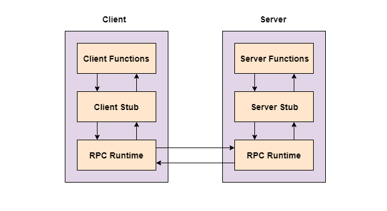

Remote Procedure Call (RPC)
===

[https://www.tutorialspoint.com/remote-procedure-call-rpc](https://www.tutorialspoint.com/remote-procedure-call-rpc)

A remote procedure call is an interprocess communication technique that is used for client-server based applications. It is also known as a subroutine call or a function call.

A client has a request message that the RPC translates and sends to the server. This request may be a procedure or a function call to a remote server. When the server receives the request, it sends the required response back to the client. The client is blocked while the server is processing the call and only resumed execution after the server is finished.

- The sequence of events in a remote procedure call are given as follows:
- The client stub is called by the client.
- The client stub makes a system call to send the message to the server and puts the parameters in the message.
- The message is sent from the client to the server by the client’s operating system.
- The message is passed to the server stub by the server operating system.
- The parameters are removed from the message by the server stub.
- Then, the server procedure is called by the server stub.

A diagram that demonstrates this is as follows:

$$
\text{Figure 1. RMI应用程序}
$$

## Advantages of Remote Procedure Call

Some of the advantages of RPC are as follows:

- Remote procedure calls support process oriented and thread oriented models.
- The internal message passing mechanism of RPC is hidden from the user.
- The effort to re-write and re-develop the code is minimum in remote procedure calls.
- Remote procedure calls can be used in distributed environment as well as the local environment.
- Many of the protocol layers are omitted by RPC to improve performance.

## Disadvantages of Remote Procedure Call

Some of the disadvantages of RPC are as follows:

- The remote procedure call is a concept that can be implemented in different ways. It is not a standard.
- There is no flexibility in RPC for hardware architecture. It is only interaction based.
- There is an increase in costs because of remote procedure call.
