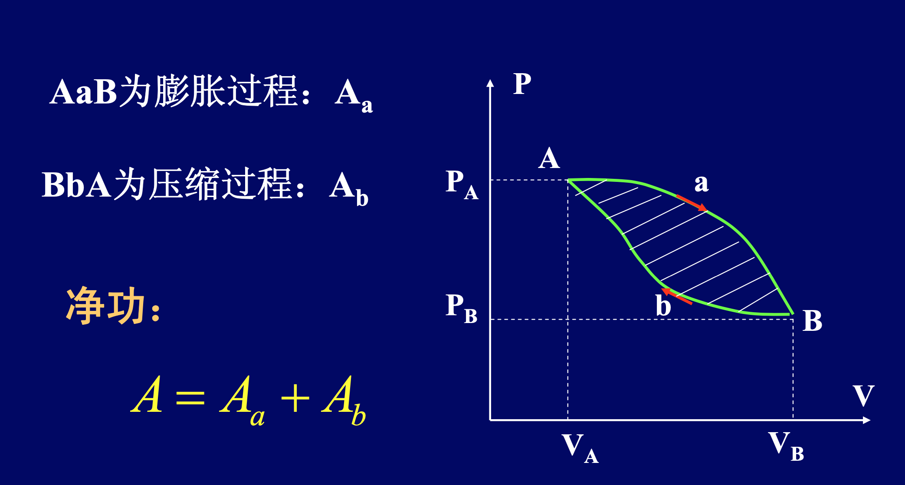
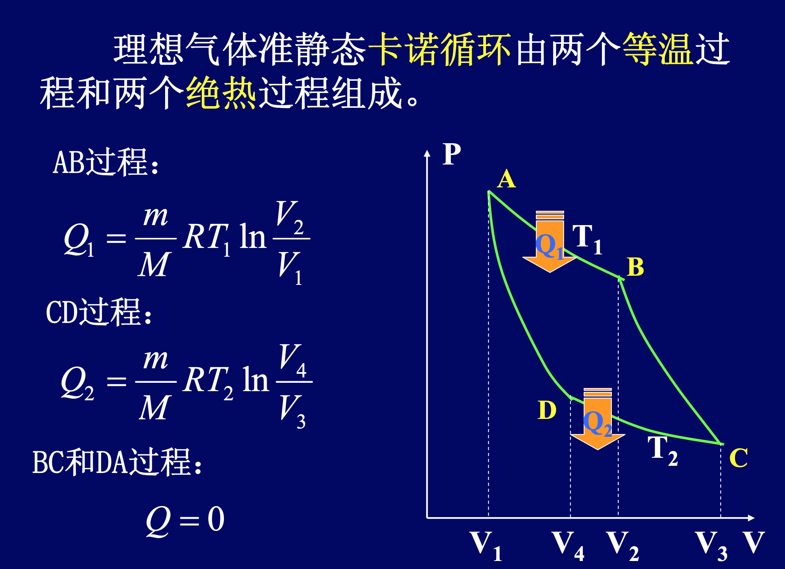

热力学基础
===

目录
---

[TOC]

## 1. 热力学第一定律

包括热现象在内的能量守恒和转换定律。

$$
Q= (E_2 - E_1) + A
$$

$Q$表示系统吸收的热量，$A$表示系统对外所作的 功，$\Delta E$表示系统内能的增量。

热力学第一定律微分形式:

$$
d Q = dE + dA
$$

理想气体状态方程

$$
PV = \frac{m}{M} R T
$$

理想气体内能公式

$$
E = \frac{m}{M} \frac{i}{2} RT
$$

## 2. 热力学第一定律的应用

### 2.1. 等容过程

气体在状态变化过程中体积保持不变。

$$
V = \text{恒量}, dV = 0, dA = P dV = 0
$$

等容过程的热力学第一定律

$$
dQ_v = dE
$$

在等容过程中，系统吸收的热量完全用来 增加自身的内能。

摩尔定容热容，是指 1 $mol$ 气体在体积不变的条件下，温度改变 1 $K$ 或 1 $\degree C$ 所吸收或放出的热量。用$C_v$ 表示。

$$
C_v = \frac{i}{2}R
$$

等容过程系统的吸热

$$
Q_v = \frac{m}{M} \frac{i}{2} R(T_2 - T_1)
$$

等容过程系统内能的增量

$$
\Delta E = \frac{m}{M} \frac{i}{2} R(T_2 - T_1)
$$

等容过程系统作功

$$
A = 0
$$

### 2.2. 等压过程

等压过程:气体在状态变 化过程中压强保持不变。

$$
P = \text{恒量}, dp = 0
$$

等压过程的热力学第一定律:

$$
dQ_p = dE + pdV
$$

$$
Q_p = \Delta E + p(V_2 - V_1)
$$

摩尔定压热容，迈耶公式

$$
C_p = C_v + R = \frac{i}{2}R + R
$$

摩尔定压热容 $C_p$ 与 摩尔定容热容 $C_v$ 之比，用 $\gamma$ 表示，叫做摩尔热容比或绝热系数。

$$
\gamma = \frac{C_p}{C_v} = \frac{i + 2}{i}
$$

单原子气体: $i = 3, \gamma = \displaystyle\frac{5}{3} = 1.67 $

单原子气体: $i = 5, \gamma = \displaystyle\frac{7}{5} = 1.4 $

单原子气体: $i = 6, \gamma = \displaystyle\frac{8}{6} = 1.33 $

等压过程系统的吸热

$$
Q_{p}=\frac{m}{M} C_{p}\left(T_{2}-T_{1}\right)=\frac{m}{M} \frac{i+2}{2} R\left(T_{2}-T_{1}\right)
$$

等压过程系统内能的增量

$$
\Delta E=\frac{m}{M} \frac{i}{2} R\left(T_{2}-T_{1}\right)
$$

等压过程系统作功

$$
A = P(V_2 - V_1) = \frac{m}{M} R\left(T_{2}-T_{1}\right)
$$

### 2.3. 等温过程

等温过程：气体在状态变 化过程中温度保持不变。

$$
T = \text{恒量}, dE = 0
$$

等温过程的热力学第一定律：

$$
dQ_T = dA
$$

等温过程系统作功和吸热：

$$
Q_{T}=A=\frac{m}{M} R T \ln \frac{V_{2}}{V_{1}}=\frac{m}{M} R T \ln \frac{P_{1}}{P_{2}}
$$

等温过程系统内能的增量：

$$
\Delta E = 0
$$

## 3. 理想气体的绝热过程

### 3.1. 绝热过程

绝热过程：气体在状态变 化过程中系统和外界没有 热量的交换的过程。

$$
dQ = 0
$$

绝热过程的热力学第一定律：

$$
0 = dA_Q + dE_Q
$$

$$
A + \Delta E = 0
$$

绝热过程内能增加：

$$
\Delta E_Q = \frac{m}{M} \frac{i}{2} R\left(T_{2}-T_{1}\right)
$$

绝热过程的功：

$$
A_Q = -\frac{m}{M} \frac{i}{2} R\left(T_{2}-T_{1}\right)
$$

绝热过程方程：

$$
PV^\gamma = C_1
$$

$$
TV^{\gamma - 1} = C_2
$$

$$
P^{\gamma - 1}V^{-\gamma} = C_3
$$

### 3.2. 多方过程

$$
PV^n = \text{常数}
$$

- 等压过程：$n = 0$
- 等温过程：$n = 1$
- 等容过程：$n = \infin$
- 绝热过程：$n = \gamma$

摩尔热容量

$$
C = \frac{n - \gamma}{n - 1}C_V
$$

功

$$
C = \frac{P_1 V_1 - P_2 V_2}{n - 1}
$$

## 4. 循环过程和卡诺循环

### 4.1. 循环过程

循环过程：系统经历一系列的变化过程又回到初 始状态的过程。

循环特征：经历一个循环过程后，内能不变。

结论：在任何一个循环过程中，系统所作的净功 在数值上等于P-V图上循环曲线所包围的面积。

#### 4.1.1. 循环过程的分类

- 正循环：在P-V图上循环过程按顺时针进行
- 逆循环：在P-V图上循环过程按逆时针进行
- 热机：工作物质作正循环的机器
- 致冷机：工作物质作逆循环的机器

设:系统吸热$Q_1$，系统放热$Q_2$。

循环过程的热力学第一定律

$$
Q_1 + Q_2 = A
$$

#### 4.1.2. 热机效率

在一次循环过程中，工作物质对外作的净功与它从高温热源吸收的热量之比。

$$
\because |Q_1|  - |Q_2| = A
$$

$$
\eta=\frac{A}{Q_{1}}=1-\frac{\left|Q_{2}\right|}{Q_{1}}
$$

#### 4.1.3. 致冷过程

外界作功 $A$，系统吸热 $Q_2$，放热$Q_1$。

$$
A = |Q_2| - |Q_1|
$$

$$
w = \frac{Q_2}{|A|} = \frac{Q_2}{|Q_1| - |Q_2|}
$$

### 4.2. 卡诺循环

卡诺循环效率

$$
\eta=1-\frac{T_{2}}{T_{1}}
$$

结论：卡诺循环的效率仅仅由两热源的温度决定。

卡诺致冷系数：

$$
w = \frac{Q_2}{|A|} = \frac{Q_2}{|Q_1| - |Q_2|} = \frac{T_2}{T_1 - T_2}
$$
