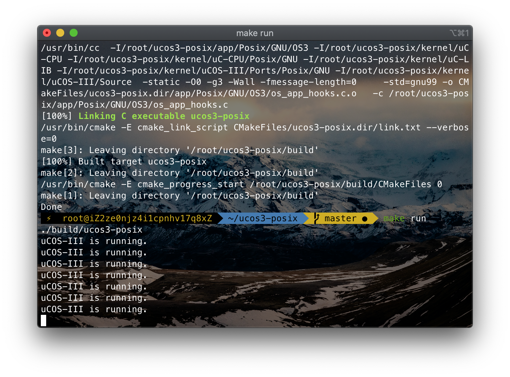
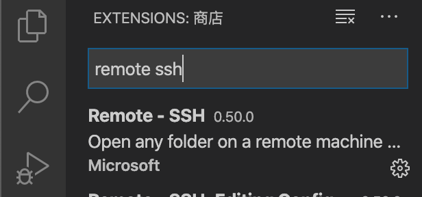
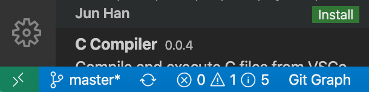
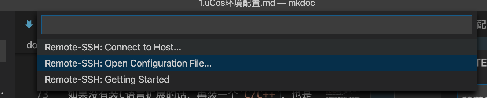
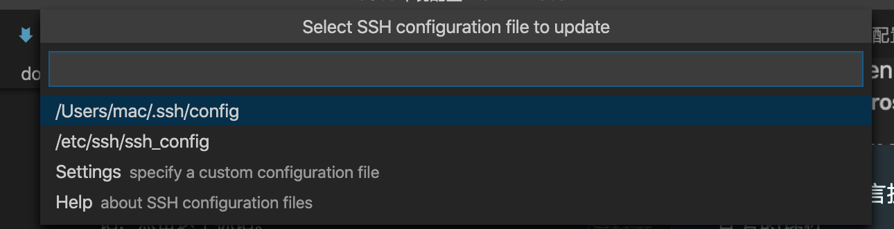
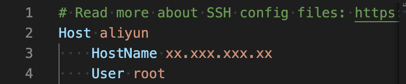
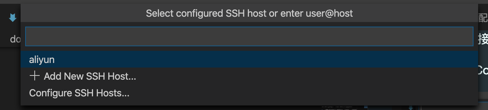
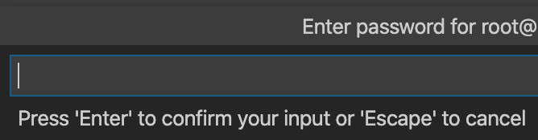

uC/OS环境配置
====

基于Mac OS、VS Code Remote和阿里云Ubuntu服务器的uC/OS-III仿真环境配置

目录
---

[TOC]

## 1. 背景

这学期选了一门课叫《嵌入式系统》，老师让我们用[a系统](https://www.micrium.com)来做仿真。但我发现现有的仿真平台都是基于Windows的，比如[Keil](http://www.keil.com)，uC/OS官方也出了[基于Linux的系统版本](https://www.micrium.com/downloadcenter/download-results/?searchterm=hm-linux&supported=true)，但是给的文件是一个Eclipse Project，所以需要安装了GUI界面才比较好打开，用服务器也不好操作，总之对Mac十分地不友好:imp:。

于是我进行了一番搜索，搜索范围囊括了百度、CSDN、知乎、BiliBili、XXXXHub等众多程序员经常出没的地方，都没有找到一个比较好的解决方案。最后，还是在大型交友社区Github上找到了一位[上海的Cisco工程师](https://github.com/zhanwwan)开源的项目，他基于uC/OS官方的Linux版本仿真代码，写了一个[可以用命令行操作的版本](https://github.com/zhanwwan/ucos3-posix)。

我看到之后都快哭了，终于不用退课了:sob:。把这位大佬的项目Fork过来以后，因为做实验需要经常调试，我把命令行用Makefile再简化了一点，放在了[我的Github上](https://github.com/CurrenWong/ucos3-posix)。欢迎大家Star/Fork，~~求你们了~~。

## 2. 准备工作

要完成本篇文章中所说的配置工作，你需要有

1. 一台MacBook。其实啥电脑都行，但我们主要想解决的还是在Mac上进行uC/OS仿真的问题。
2. [VS Code](https://code.visualstudio.com)。其实其他IDE、编辑器只要支持SSH连接也都可以，~~但我觉得VS Code天下第一~~。
3. VS Code 插件 [Remote - SSH](https://marketplace.visualstudio.com/items?itemName=ms-vscode-remote.remote-ssh)，微软官方开发的SSH插件。
4. 一台Ubuntu服务器。我使用的是阿里云的[学生服务器](https://promotion.aliyun.com/ntms/act/campus2018.html?spm=5176.13735996.J_7116760870.3.683d3b5aGqQLKI&userCode=2yfpwghd&aly_as=UspolMloT)，一年只要100多，你买了不吃亏，你买了不上当。

## 3. 配置步骤

### 3.1. 配置服务器

1. 安装CMake

```cmd
sudo apt install cmake
```

2. 从Github上下载源代码到服务器。

在你想要安装的目录下输入命令

```cmd
git clone https://github.com/CurrenWong/ucos3-posix.git
```

3. 进入项目文件夹

```cmd
cd ucos3-posix
```

4. 构建项目

```cmd
make
```

构建完成以后会在最后一行输出`Done`。

4. 运行项目检查是否安装成功

```cmd
make run
```



看到`uCos-III is running`时就说明配置完成了:sparkles:。用Ctrl-C停掉运行中的项目就可以了。

但是，在命令行界面里写代码体验还是稍微差了一点，除非是精通Vim的大佬。所以接下来我们会通过配置VS Code来实现远程SSH，这样就能够在本地的VS Code上写代码，并且在服务器上运行了。

### 3.2. 配置VS Code

1. 下载Remote ssh插件

在扩展商店中搜索`remote ssh`，出来第一个就是我们需要的插件，点击Install安装即可。



如果没有装C语言扩展的话，再装一个`C/C++`，也是微软官方的插件。

2. 配置ssh连接

下载好remote ssh以后，左下角会有一个绿色的标记，点击这个标记。



这时会弹出一个菜单，让你选择做什么操作。为了之后连接方便，我们直接把用户名和服务器IP写在配置文件中。

- 首先选择Open Configure File



- 然后选择`xxx/.ssh/config`



- 在配置文件中填入你的主机昵称（Host）、服务器IP（HostName）和登陆用户名（User）



- 保存以后，再点击一下窗口左下角的绿色标记，弹出Vs Code的命令窗口，选择`Connect to Host`，在选择我们刚刚创建的主机。



- 这时会弹出一个新的窗口，输入连接密码以后，我们就大功告成了。



进入我们在服务器上配置的uC/OS路径，编辑app.c，愉快地进行uC/OS仿真吧！:+1:。

---

联系邮箱：curren_wong@163.com

Github：[https://github.com/CurrenWong](https://github.com/CurrenWong)

欢迎转载/Star/Fork，有问题欢迎通过邮箱交流。
