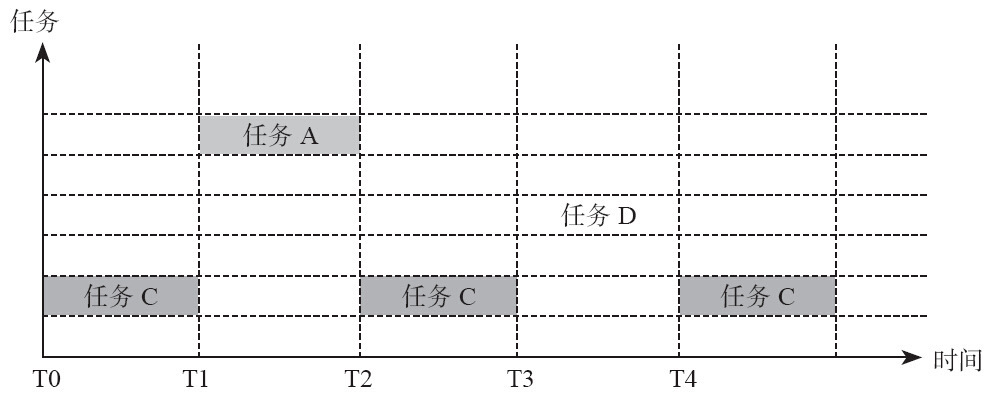
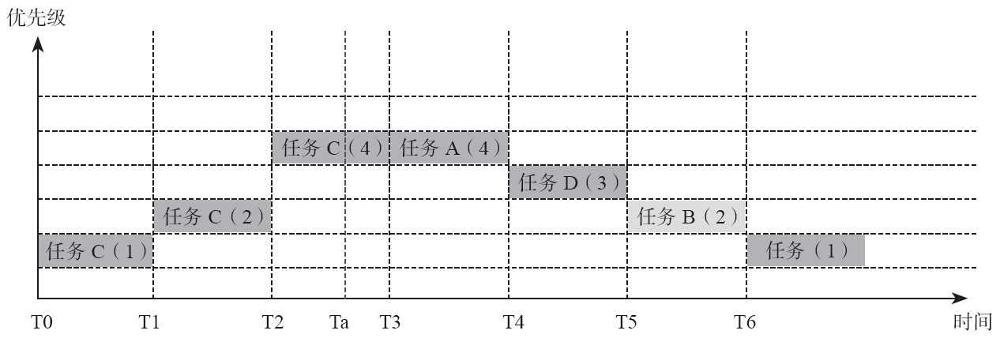
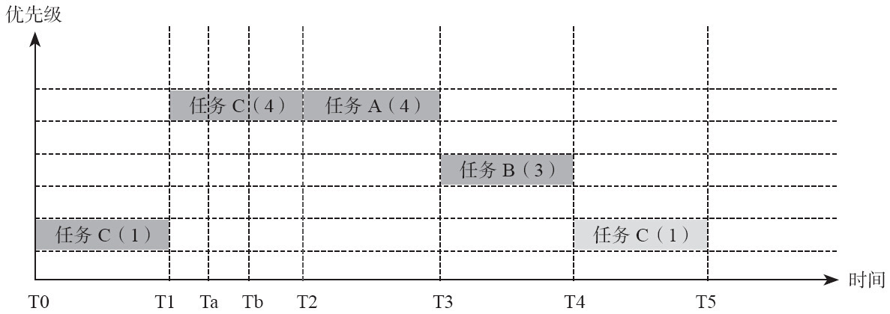

优先级反转与中断机制
===

目录
---

[TOC]

## 1. 背景

今天看[《μC/OS-III源码分析笔记》](https://m.igetget.com/hybrid/v2/ebook/detail?bid=EJmMZXq1b8qOpBlD69XAdP7LEGaKJWEYBqWxRnme5vrVzo4QMZYgNyk2jNA5467K)的时候学了**优先级反转**的概念，书中没有详细介绍，于是我在[得到APP](https://www.igetget.com)的搜索引擎中进行了搜索，看到刘旭明老师写的[《嵌入式实时操作系统原理与最佳实践》]((https://m.igetget.com/hybrid/v2/ebook/detail?bid=OAdXprx6N41dm9BQkayr8z7OqLGoE3lrd80YMlVAnxRZXK2Dg5pbevPJjjnQv2eb))中讲得很清楚，于是我把原文摘录了下来，方便学习和记录，版权归原作者刘旭明老师所有。

## 2. 优先级反转

### 2.1. 优先级反转

(Priority inversion)

> 在系统中，有些资源必须是独占使用的，多个任务对这样的资源的并发访问将导致错误的发生。一般来说，对需要独占使用的资源必须使用互斥方法将对其的并发访问串行化[1](#bib-1)。

> 在优先级多任务系统中引入互斥方案，会导致任务优先级反转的问题：假如某时低优先级的任务占有资源，然后又有高优先级的任务申请资源，但因为不能满足而被挂起了，即**低优先级任务阻塞了高优先级任务的运行**。假如这时又有一个中优先级任务，那么它会把低优先级任务抢占。最终高优先级任务会间接地被中优先级任务抢占了。这种现象叫作**优先级反转**。举例说明：

> 假如A、D、C三个任务优先级从高到低排列，任务A和C共享互斥信号量R，如果某一时刻任务C已经获得互斥信号量R，而任务A此时尝试占用R，那么任务A会因为得不到R而阻塞在R的**任务等待队列**中。再假设此时任务D因为优先级高于任务C从而抢占了C，进而长期占有处理器资源，那么就相当于中优先级的任务D间接阻塞了高优先级任务A的运行。

$$
\text{Figure 1. 优先级反转}
$$

> - T0时刻，任务C处于运行状态，运行过程中，任务C获得了共享资源R。

> - T1时刻，任务A就绪。由于任务A优先级高于任务C，所以它抢占了任务C，任务A被调度执行。

> - T2时刻，任务A需要共享资源R，但R被更低优先级的任务C所拥有，所以任务A被阻塞等待该资源。任务C得到执行。

> - T3时刻，此时任务D就绪，由于任务D优先级高于任务C，所以它抢占了任务C，任务D被调度执行。

> 从整个流程上看，T3时刻，高优先级任务A被低优先级任务D间接地抢占了。此时优先级最高的任务A不仅要等任务C运行完，还要等优先级低的任务D运行完才能被调度，如果任务D和任务C需要执行很长时间，那么任务A的执行就不能得到保证，整个系统的实时性能很差。

> 优先级反转现象对基于优先级调度的实时系统有很大的影响。在基于优先级调度的系统中，处理器资源是按照优先级分配给任务的，就绪的高优先级任务必须实时获得处理器。系统中的各种资源，如果采用按照任务优先级分配的原则，那么高优先级的任务应该是首先被考虑的。优先级反转的问题将打乱这些原则。

### 2.2. 优先级继承和优先级天花板策略

>优先级反转问题的核心原因在于共享资源的访问规则，即共享资源只能被一个任务占用，被占用后其他任务不能强制使用这个资源。在优先级反转问题上，高优先级任务被低优先级任务阻塞是必定的，但被中优先级任务阻塞则是很无奈的。为了避免因为中优先级任务挟持低优先级任务从而阻塞高优先级任务的现象，可以采用一些必要的算法。

> 有两种经典的防止优先级反转的算法：

> - 优先级继承策略（Priority inheritance）：当一个任务占有了资源并且随后阻塞了其他申请该资源的任务时，该任务将临时改变它的优先级为所有申请该资源的任务中的最高优先级，并以这个临时优先级在临界区执行。当任务释放资源后，则恢复它原有的优先级。从行为上看，占有资源的任务的优先级将是“水涨船高”式的多次改变，因为它的优先级最高，所以它不会被曾经比它优先级高的那些任务抢占。操作系统从优先级角度安排它尽快执行，尽快释放资源，但是这样做操作系统却牺牲了中等优先级任务的调度机会。

> - 优先级天花板策略（Priority ceilings）：将申请（占有）资源的任务的优先级提升到可能访问该资源的所有任务的最高优先级（这个最高优先级称为该资源的优先级天花板）。

#### 2.2.1. 优先级继承

$$
\text{Figure 2. 优先级继承策略}
$$

_初始优先级：$ A > D > B > C $（从高到低排序）_

> - T0时刻，只有任务C处于运行状态，在运行过程中，任务C得到共享资源R。

> - T1时刻，任务B抢占任务C，并尝试获得资源R，因为优先级继承的原因，任务C的优先级被提升到任务B的优先级；任务B被阻塞。

> - T2时刻，任务A抢占任务C，并尝试获得资源R，因为优先级继承的原因，任务C的优先级被提升到任务A的优先级；任务A被阻塞。

> - 在Ta时刻，任务D就绪，但因为此时任务C的优先级已经被提升并且比任务D优先级高，所以任务D不能抢占任务C，任务C继续运行。

> - T3时刻，任务C释放资源，它的优先级恢复到原有优先级。任务A得到资源，并因为优先级原因抢占任务C。

> - T4时刻，任务A释放资源，结束运行。任务B得到资源。但此时因为任务D优先级高于任务B，所以任务D开始运行。

> - T5时刻，任务D结束运行，任务B开始执行。

#### 2.2.2. 优先级天花板

$$
\text{Figure 3. 优先级天花板策略}
$$

> - T0时刻，只有任务C处于运行状态。

> - T1时刻，任务C得到共享资源R，因为优先级天花板策略的原因，任务C的优先级提升到全部可能访问该资源的任务的最高优先级。

> - Ta时刻，任务A抢占任务C执行，随后尝试获得资源R，但是失败并阻塞。任务C继续运行。

> - Tb时刻，任务B就绪，但是因为任务C优先级更高，所以只能等待执行。

> - T2时刻任务C释放资源R，任务A得到资源R。因为使用优先级天花板策略，任务C优先级恢复到原有优先级。任务A抢占任务C开始运行。

> - T3时刻，任务A结束运行。任务B开始运行。

> - T4时刻，任务B结束运行。任务C开始继续运行。

> 优先级继承策略对任务执行流程的影响相对较小，因为只有当高优先级任务申请已被低优先级任务占有的共享资源这一事实发生时，才提升低优先级任务的优先级。而天花板策略是谁占有就直接升到最高。形象地说，优先级继承策略是“水涨船高”，而优先级天花板策略则是“一次到位”。

## 3. 中断机制

> 中断机制是处理器的重要基础设施，用来应对各种事件的响应和处理。当外设或者处理器自身有事件发生时，处理器会暂停执行当前的代码，并转向处理这些中断事务。在处理器与外设间的交互大多采用中断来完成，中断系统能极大提高系统的效率。
发出中断请求的来源叫作中断源。根据中断源的不同，可以把中断分为以下三类：

### 3.1. 外部中断

> 外部中断是指由系统外设发出的中断请求，如串口数据的接收、键盘的敲击、打印机中断、定时器时间到达等。外部中断大多是可以屏蔽的，程序可以根据具体需要，通过中断控制器来屏蔽这些中断请求。

### 3.2. 内部中断

> 内部中断指因处理器自身的原因引起的异常事件，如非法指令、总线错误（取指）或者运算出错（除0）等。内部中断基本是不可屏蔽的中断。

### 3.3. 软件中断

> 软件中断是一种特殊的中断，它是程序通过软件指令触发的，从而主动引起程序流程的变化。比如在用户级运行的程序在某时刻需要访问处理器中受到保护的寄存器，则可以通过软件中断进入系统级，实现权限的提升[1](#bib-1)。

_注：版权归原作者刘旭明老师所有_

## 4. 参考文献

1. [刘旭明. 嵌入式实时操作系统原理与最佳实践. 机械工业出版社, 2014.](https://m.igetget.com/hybrid/v2/ebook/detail?bid=OAdXprx6N41dm9BQkayr8z7OqLGoE3lrd80YMlVAnxRZXK2Dg5pbevPJjjnQv2eb)

联系邮箱：curren_wong@163.com

Github：[https://github.com/CurrenWong](https://github.com/CurrenWong)

欢迎转载/Star/Fork，有问题欢迎通过邮箱交流。
