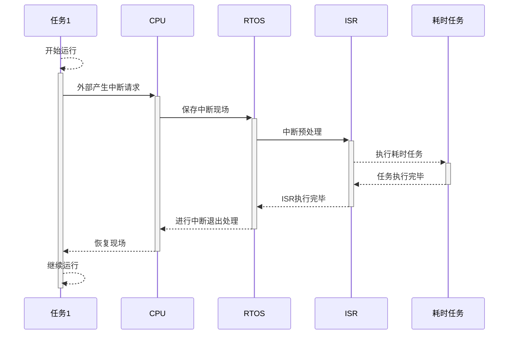
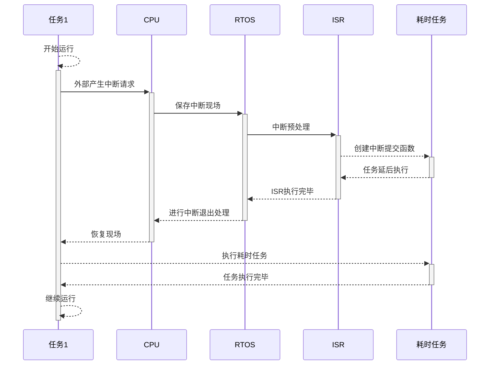

uCos的延迟中断提交为什么能提高效率
===

目录
---

[TOC]

## 1. 背景

在写上一篇笔记的时候，我学习了[uCos中的锁调度器为什么比关中断效率更高](3.uCos中锁调度器为什么比关中断效率更高.md)，在讨论锁调度器和关中断时，提到了在uC/OS中，需要将`OS_CFG_ISR_POST_DEFERRED_EN`标记置为`True`，开启延迟中断提交，才能够在锁调度器的同时打开中断。而开启延迟中断提交，本身也能够**减少关中断的时间**，从而提高系统运行效率。我就想写一篇笔记来分析一下延迟中断提交的实现机制。

## 2. 概念

先看一看[《μC/OS-III源码分析笔记》](https://m.igetget.com/hybrid/v2/ebook/detail?bid=EJmMZXq1b8qOpBlD69XAdP7LEGaKJWEYBqWxRnme5vrVzo4QMZYgNyk2jNA5467K)中对延迟中断提交的说明。

> 中断中如果使用相关的提交函数，例如OSSemPost，OSQPost等，则这些函数涉及让任务就绪等操作。如果没有使用延迟中断，则进入一段很长的临界段，也就是要关中断很长时间。如果使用延迟中断，OS就会将这些提交函数必要的信息保存到延迟中断提交的变量中去。

> 为了配合延迟中断，μC/OS-III还将创建优先级最高（优先级为0）的任务——中断提交函数OS_IntQTask。退出中断后根据之前保存的参数，后面再次进行提交相关操作。这个过程其实就是把中断中的临界段放到任务中来实现，进入临界段就可以采用锁调度器的方式代替关中断，因此大大减少了关中断的时间。提交操作延迟——延迟中断就是这么来的。

> 延迟中断提交将较长的提交过程转移到优先级最高的延迟中断提交任务，提交的过程就可以采用关调度器的方式，而不用关中断，因而节省了关中断的时间。但是整个过程并不影响提交的效果。我们已经设定延迟中断提交任务的优先级为最高，在退出中断后一样会进行提交操作[<sup>1</sup>](#bib-1)。

简单来说，延迟中断提交能够减少关中断的时间，让系统能够响应中断，从而提高了系统运行效率。下面用图示来分析一下。

## 3. 图表分析

### 3.1. 一般情况

**不使用**延迟中断提交时，中断响应的过程如下图所示，耗时任务在ISR中执行，这会使得系统进入一段很长的临界段。



$$
\text{Figure 1. 不使用延迟中断提交时的中断响应过程}
$$

- **RTOS**：实时操作系统（Real Time Operating System）

- **ISR**：中断服务程序（Interrupt Service Routine）

- **耗时任务**：中断服务程序中较为耗时、可延迟处理的部分。

### 3.2. 使用延迟中断提交

**使用**延迟中断提交时，中断响应的过程如下图所示。耗时任务在中断结束之后开始执行。因为它的优先级最高，不会被其他任务抢占，所以中断处理的实时性也能够得到保证。



$$
\text{Figure 2. 使用延迟中断提交时的中断响应过程}
$$

## 4. 源码分析

从下面的源代码中我们可以看出，延迟中断提交函数需要传入一组**内核对象**（由延迟提交初始化函数`OS_IntQTaskInit()`生成）。将它们放入延迟提交信息队列后，函数将就绪优先级最高的延迟提交任务，接着继续执行中断。在退出所以中断嵌套后，第一个执行的任务就是延迟提交任务。

```cpp
// os_int.c
void  OS_IntQPost (OS_OBJ_TYPE   type,
                   void         *p_obj,
                   void         *p_void,
                   OS_MSG_SIZE   msg_size,
                   OS_FLAGS      flags,
                   OS_OPT        opt,
                   CPU_TS        ts,
                   OS_ERR       *p_err)
{
    CPU_SR_ALLOC();

#if (OS_CFG_TS_EN == DEF_DISABLED)
    (void)ts;
    /* Prevent compiler warning for not using 'ts'*/
#endif
    // 进入临界段
    CPU_CRITICAL_ENTER();
    // 检测是否超过了延迟中断提交内核对象的最大数量
    if (OSIntQNbrEntries < OSCfg_IntQSize) {
    /* Make sure we haven't already filled the ISR queue*/
        // 记录当前要延迟提交的内核对象数目
        OSIntQNbrEntries++;

        // 更新延迟提交内核对象的最大数目
        if (OSIntQNbrEntriesMax < OSIntQNbrEntries) {
            OSIntQNbrEntriesMax = OSIntQNbrEntries;
        }
        // 将要重新提交的内核对象的信息，放入队列入口的延迟提交信息记录块
        OSIntQInPtr->Type       = type;
        /* 保存内核对象的类型*/
        OSIntQInPtr->ObjPtr     = p_obj;
        /* 保存内核对象变量指针*/
        OSIntQInPtr->MsgPtr     = p_void;
        /* 保存消息的指针（如果提交的是消息或者任务消息）*/
        OSIntQInPtr->MsgSize    = msg_size;
        /* 保存消息的大小（如果提交的是消息或者任务消息）*/
        OSIntQInPtr->Flags      = flags;
        /* 保存要设置的标志（如果提交的是事件标志）*/
        OSIntQInPtr->Opt        = opt;
        /* 保存提交时的选项*/
#if (OS_CFG_TS_EN == DEF_ENABLED)
        OSIntQInPtr->TS         = ts;
        /* 保存提交时的时间戳*/
#endif

        // 更新延迟提交信息队列入口，指向下一个延迟提交信息记录块
        OSIntQInPtr             = OSIntQInPtr->NextPtr;
        /* Point to the next interrupt handler queue entry*/
#if (OS_CFG_DBG_EN == DEF_ENABLED)
        // 就绪延迟提交任务
        // 1. 更新就绪列表上的任务数量为1
        OSRdyList[0].NbrEntries = 1u;
        /* Make the interrupt handler task ready to run*/
#endif
        // 2. 就绪列表的头指针和尾指针都指向任务控制块指针
        OSRdyList[0].HeadPtr    = &OSIntQTaskTCB;
        OSRdyList[0].TailPtr    = &OSIntQTaskTCB;
        // 3. 在优先级表中添加任务优先级0
        OS_PrioInsert(0u);
        /* Add task priority 0 in the priority table*/
        if (OSPrioCur != 0) {
        // 记录就绪延迟提交任务之前运行的任务，方便后面进行任务调度
        /* Chk if OSIntQTask is not running*/
            OSPrioSaved         = OSPrioCur;
            /* Save current priority*/
        }

       *p_err                   = OS_ERR_NONE;
    } else {
        // 如果已经超过延迟提交信息队列的长度，就将OSIntQOvfCtr加1，代表因队列已满，没有被重新提交的内核对象个数
        OSIntQOvfCtr++;
        /* Count the number of ISR queue overflows*/
       *p_err                   = OS_ERR_INT_Q_FULL;
    }
    // 退出临界段
    CPU_CRITICAL_EXIT();
}

```

_代码注释参考自uCOS注释和[《μC/OS-III 源码分析笔记》](https://m.igetget.com/hybrid/v2/ebook/detail?bid=EJmMZXq1b8qOpBlD69XAdP7LEGaKJWEYBqWxRnme5vrVzo4QMZYgNyk2jNA5467K)。_

另外，在浏览源代码的时候还发现了一个注释，延迟中断提交已经不被推荐使用了。

> This function is DEPRECATED and is not recommended for new designs. Deferred ISRs is a deprecated feature of the kernel. It remains fully functional and supported but should not be used for new applications.

于是我去官网浏览了一下更新记录，我使用的源码版本是V3.05.01，而我看到在uC/OS-III v3.06.00发布的[更新记录](https://www.micrium.com/ucos-iii-v3-06-00/)中，已经将延迟中断提交列为了过时的方法并且去除了，推测可能是出于实时性和稳定性的考虑。

> Deferred interrupt processing is now obsolete and has been removed.

## 5. 参考文献

<div id="bib-1"></div>

[1] [李悦城. μC/OS-III 源码分析笔记. 机械工业出版社, 2016.](https://m.igetget.com/hybrid/v2/ebook/detail?bid=EJmMZXq1b8qOpBlD69XAdP7LEGaKJWEYBqWxRnme5vrVzo4QMZYgNyk2jNA5467K)

联系邮箱：curren_wong@163.com

Github：[https://github.com/CurrenWong](https://github.com/CurrenWong)

欢迎转载/Star/Fork，有问题欢迎通过邮箱交流。
