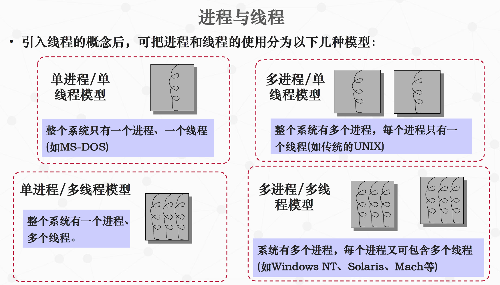
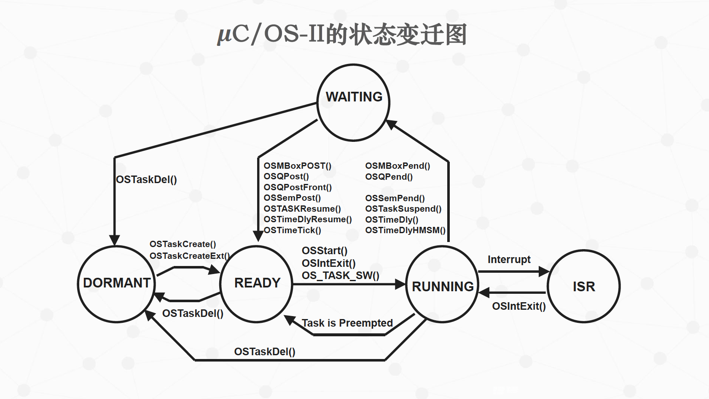

uCos中的任务机制和优先级位图算法
===

目录
---

[TOC]

## 1. 背景

今天老师上课讲到了uC/OS中的任务机制，所以我想要结合[《μC/OS-III源码分析笔记》](https://m.igetget.com/hybrid/v2/ebook/detail?bid=EJmMZXq1b8qOpBlD69XAdP7LEGaKJWEYBqWxRnme5vrVzo4QMZYgNyk2jNA5467K)和中国大学MOOC-电子科技大学[《嵌入式系统及应用》](https://www.icourse163.org/learn/UESTC-1206862805?tid=1450357492#/learn/announce)PPT写一篇笔记对这部分的内容进行总结。

## 2. 任务概述

### 2.1. 进程与线程

#### 2.1.1. 从进程到线程

- **定义**：进程最初由Multics的设计者在20世纪60年代提出来的，主要包括以下内容：
    - 一个正在执行的程序
    - 计算机中正在运行的程序的一个实例
    - 可以分配给处理器，并由处理器执行的一个实体
    - 由一个顺序的执行线程、一个当前状态和一组相关的系统资源所刻画的活动单元

- **组成**：进程由代码、数据、堆栈和进程控制块构成
    - 进程控制块包含了操作系统用来控制进程所需要的信息
    - 包括进程状态和调度信息、CPU寄存器信息、内存管理信息和I/O状态信息。

- **作用**：早期的进程，包含了以下两个方面的内容
    - 资源。进程是资源分配的基本单位，一个进程包括一个保存进程映像的虚拟地址空间、主存、I/O设备和文件等资源。
    - 调度执行。进程作为操作系统的调度实体，是调度的基本单位。

- **演变**：随着操作系统的发展，进程所包含的两个方面的内容逐渐被分开：
    - 轻量级进程或线程：调度执行的单位
    - 进程：资源分配的单位
    - 线程是进程内部一个相对独立的控制流，由线程上下文和需要执行的一段程序指令构成
    - 在进程中，所有线程共享该进程的状态和资源，可以访问相同的数据

- **线程的优势**：
    - **创建**：在一个已有进程中创建一个新线程比创建一个全新的进程所需的时间开销少
    - **终止**：终止一个线程比终止一个进程所花费的时间少
    - **切换**：线程切换比进程切换所花费的时间少
    - **通信**：使同一进程内部不同线程之间的通信效率得到显著提高。
        - 在大多数操作系统中，不同进程之间的通信需要内核的干预，而同一进程内部不同线程之间则可直接通信

---

#### 2.1.2. 进程/线程模型

- **模型**：引入线程的概念后，可把进程和线程的使用分为以下几种模型:



$$
\text{Figure 1. 模型}
$$

- **单进程/多线程模型**：大多数嵌入式实时内核使用了单进程/多线程模型，或简单地称为**任务模型**
    - 把整个应用当作一个没有定义的进程来对待
    - 应用则被划分为多个任务的形式来进行处理
    - 适用于实时性要求较高的、相对简单的应用

- **多进程/多线程模型**：也有一些嵌入式实时操作系统采用了多进程/多线程模型
    - 系统中包含多个进程，每个进程对应又包含多个线程
    - 适合于处理复杂的应用

## 3. 任务概述

### 3.1. 任务定义

- **定义**：任务是嵌入式实时操作系统内核的基本调度单位。

- **内容**：任务主要包含以下内容
    - **代码**：一段可执行的程序
    - **数据**：程序所需要的相关数据（变量、工作空间、缓冲区等）
    - **堆栈**：局部变量，子程序调用，任务上下文等
    - **上下文**：程序执行的上下文环境

_注：任务通常包含一个具有无限循环的程序_

### 3.2. 任务的优势


$$
\text{Figure 2. 任务的优势}
$$

### 3.3. 任务的分类


$$
\text{Figure 3. 任务的分类-按到达情况的可预测性}
$$


$$
\text{Figure 4. 任务的分类-按重要程度划分}
$$

## 4. 任务参数

1. 优先级

- **定义**：表示任务对应工作内容在处理上的优先程度
- **作用**：优先级越高，表明任务越需要得到优先处理
    - 飞行器中处理稳定性控制的任务，就需要具有较高的优先级，一旦执行条件得到满足，应及时得到执行
- **分类**：任务的优先级分为静态优先级和动态优先级。
    - **静态优先级**：任务的优先级被确定后，在系统运行过程中将不再发生变化
    - **动态优先级**：系统运行过程中，任务的优先级是可以动态变化的
- **数量**：uCOS-II中共可管理64个任务，每个任务必须有不同的优先级。uCOS-III中已经可以支持同一优先级有多个任务，且可以自行设置优先级的个数

2. 周期

- **周期**：周期任务所具有的参数，表示任务周期性执行的间隔时间

3. 任务的计算时间

- 任务在**特定硬件环境**下被完整执行所需要的时间，也被称为是任务的执行时间（execution time）
- 由于任务每次执行的软件环境的**差异性**，导致任务在各次具体执行过程中的计算时间各有不同。
- 通常用**最坏情况下**的执行时间（worst case time）或是需要的**最长执行时间**来表示，也可用**统计时间**（statistical time）来表示。

4. 任务的就绪时间

- 任务具备了在处理器上被执行所需要条件时的时间

5. 截止时间

- 定义：意味着任务需要在该时间到来之前被执行完成。
- 分类：
    - 截止时间可以通过绝对截止时间（absolute deadline）和相对截止时间（relative time）两种方式来表示。相对截止时间为任务的绝对截止时间减去任务的就绪时间。
    - 截止时间可以分为强截止时间（hard deadline）和弱截止时间（soft deadline）两种情况：
        - 具有强截止时间的任务即为关键任务，如果截止时间不能得到满足，就会出现严重的后果。
        - 拥有关键任务的实时系统又被称为强实时（hard real-time）
系统，否则称为弱实时（soft real-time）系统。

## 5. 任务的状态与变迁

任务拥有的资源情况是不断变化的，导致任务状态也表现出不断变化的特性。

不同的实时内核实现方式对任务状态的定义不尽相同，但是都可以概括为三种基本
的状态

- **等待**（waiting）：任务在等待某个事件的发生；
- **就绪**（ready）： 任务等待获得处理器资源；
- **执行**（running）：任务获得处理器资源，所包含的代码内容正在被执行。

---

- 单处理器系统中任务的特点：
    - 任何时候都只有一个任务在CPU中执行。无事时就运行空闲任务执行空操作。
    - 任何一个可以执行的任务都必须处于就绪状态。
        - 调度程序从任务的就绪队列中选择下一个需要执行的任务。
        - 处于就绪状态的任务拥有除CPU以外的其他所有需要的资源。
    - 如果任务在需要等待I/O设备或其他任务提供的数据，就处于等待状态。

---


$$
\text{Figure 5. 任务的状态与变迁}
$$


$$
\text{Figure 6. 三个任务进行状态转换的过程}
$$



$$
\text{Figure 7. 状态变迁图}
$$

## 6. 任务控制块

- **定义**：任务控制块是包含任务相关信息的数据结构，它包含了任务执行过程中所需要的所有信息

- **作用**：任务管理是通过对任务控制块（Task Control Block，TCB）的操作来实现的。

- **内容**：任务控制块大都包括以下信息：
    - 任务的名字
    - 任务执行的起始地址
    - 任务的优先级
    - 任务的状态
    - 任务的硬件上下文
        - 堆栈指针、PC和寄存器等
    - 任务的队列指针等内容

## 7. 就绪算法

当有多个任务同时就绪时，内核利用特定的算法求出当前具有最高优先级的就绪任务。

在嵌入式实时操作系统中，常用的就绪算法是优先级位图算法。我们以uC/OS-II中的实现为例来进行讲述。

### 7.1. 就绪表


$$
\text{Figure 8. 就绪表}
$$

### 7.2. 优先级位图算法

#### 7.2.1. 优先级位图


$$
\text{Figure 9. 优先级位图算法}
$$

#### 7.2.2. 任务进入就绪态


$$
\text{Figure 10. 任务进入就绪态}
$$

```cpp
// 任务进入就绪态
OSRdyGrp |= OSMapTbl[priority >> 3];
OSRdyTbl[priority >> 3] |= OSMapTbl[priority & 0x07];
```

我们先来分析一下第一行代码。如图10中所示，任务优先级为35时，首先将35化为二进制

$$
priority = (00100011)_B
$$

将 $priority$ 右移三位，则得到35在 `OSMapTbl` 中的对应位置

$$
priority \gg 3 = (00100)_B = (4)_D
$$

从 `OSMapTbl` 表中进行索引

$$
\text{OSMapTbl[4]} = (00010000)_B
$$

假设`OSRdyGrp`为全$0$，$\text{OSMapTbl[4]}$和 `OSRdyGrp` 做或运算

$$
OSRdyGrp ｜ (00010000)_B = (00010000)_B
$$

`OSRdyGrp` 标示了某个或多个就绪任务的优先级在`OSRdyTbl[4]` 这一行中。

---

接着看第二行代码

```cpp
// 任务进入就绪态
OSRdyTbl[priority >> 3] |= OSMapTbl[priority & 0x07];
```

$$
\text{0x07} = (00000111)_B
$$

$priority$ 和 $\text{0x07}$ 相与，即取 $priority$ 的后三位二进制，此处为 $(011)_B$，即$(3)_D$，查表可得

$$
\text{OSMapTbl}[3] = (00001000)_B
$$

假设`OSRdyTbl[4]` 为全0，$\text{OSMapTbl}[3]$与`OSRdyTbl[4]` 相或

$$
\text{OSRdyTbl[4]} \ | \ (00001000)_B = (00001000)_B
$$

再放入 `OSRdyTbl[4]` 中，标示了就绪的任务优先级为35。

#### 7.2.3. 任务退出就绪态


$$
\text{Figure 11. 任务退出就绪态}
$$

```cpp
if((OSRdyTbl[priority >> 3] &= ~OSMapTbl[priority & 0x07]) == 0)
OSRdyGrp &= ~OSMapTbl[priority >> 3];
```

接着上面的例子，当任务退出就绪态时

$$
\text{OSMapTbl}[3] = (00001000)_B
$$

`~`放在数字前表示取反

$$
～\text{OSMapTbl}[3] = (11110111)_B
$$

与  `OSRdyTbl[4]` 相与

$$
\text{OSRdyTbl[4]} \ \& \  (11110111)_B = (00000000)_B = (0)_D
$$

满足 `if` 语句中的条件，则

$$
{ \begin{aligned}
\text{OSRdyGrp} &= \text{OSRdyGrp}\ \&  ~(00010000)_B & \\
&= (00010000)_B \ \& \ (11101111)_B & \\
&= (00000000)_B \ & \\
&= (0)_D \ & \\
\end{aligned} }
$$

#### 7.2.4. 优先级判定表


$$
\text{Figure 12. 优先级判定表}
$$

#### 7.2.5. 获取进入就绪态的最高优先级

```cpp
y = OSUnMapTbl[OSRdyGrp];
x = OSUnMapTbl[OSRdyTbl[y]];
priority = (y << 3) + x;
```


$$
\text{Figure 13. 获取进入就绪态的最高优先级}
$$

## 8. 任务调度

### 8.1. 概述

- uC/OS-II总是选择就绪态任务中优先级最高的任务执行
- 由调度器来确定哪个任务优先级最高和进行调度切换
- 任务级调度是由函数`OS_Sched()`完成
- 中断级的调度是由函数`OSIntExit()`完成的
- 需要注意的是，uC/OS-II的调度执行时间是确定的常数，与应用程序建立的任务数量以及当前最高优先级任务的位置没有关系

### 8.2. 任务切换


$$
\text{Figure 14. 任务切换}
$$

### 8.3. 任务切换的基本步骤

1. 保存任务**上下文**环境
2. 更新当前运行任务的**控制块**内容，将其状态改为就绪或等待状态
3. 将任务控制块移到相应队列（就绪队列或等待队列，或进行位图操作）
4. 选择另一个任务进行执行(调度)
5. 改变需投入运行任务的控制块内容，将其状态变为**运行状态**
6. 恢复需投入运行任务的上下文环境

### 8.4. 任务切换的时机

1. 中断、自陷(Traps)
2. 正在运行任务因缺乏资源而阻塞
3. 时间片轮转调度时时间片用尽
4. 更高优先级任务就绪

## 9. 任务管理机制

### 9.1. 主要任务管理功能

- **创建任务**的过程即为分配任务控制块的过程。
    - 在创建任务时，通常需要确定任务的名字和任务的优先级等内容，
确立任务所能使用的堆栈区域。
    - 任务创建成功后，通常会为用户返回一个标识该任务的ID，以实
现对任务的引用管理。

- **删除任务**把任务从系统中去掉，释放对应的任务控制块。

- **挂起/唤醒任务**把任务变为等待状态，可通过唤醒任务操作把任务转
换为就绪状态。

- **设置任务属性**可以用来设置任务的抢占、时间片等特性，以确定是
否允许任务在执行过程中被抢占或是对同优先级任务采用时间片轮
转方式运行等。

- **改变任务优先级**用来根据需要改变任务的当前优先级。

- **获取任务信息**获得任务的当前优先级、任务的属性、任务的名字、
任务的上下文、任务的状态等内容，便于用户进行决策。

### 9.2. 创建任务

任务可以在多任务调度开始之前创建，也可以在其它任务的执
行过程中创建。但不能在中断服务程序中创建。开始多任务调
度之前，必须至少创建一个任务。

- **定义**：任务创建为任务分配和初始化相关的数据结构。

- **所需信息**：**任务创建**时通常需要使用如下**信息**：
    - 任务的名字和初始优先级
    - 任务栈
    - 任务属性
    - 任务对应的函数入口地址
    - 任务对应函数的参数等

- **过程**：任务创建通常需要**完成以下工作**：
    - 获得任务控制块TCB
    - 根据实时内核用户提供的信息初始化TCB
    - 为任务分配一个可以唯一标识任务的ID
    - 使任务处于就绪状态，把任务放置到就绪队列
    - 进行任务调度处理

### 9.3. 堆栈空间


$$
\text{Figure 15. 堆栈空间}
$$

### 9.4. 删除任务

- **定义**：内核**根据任务创建时获得的ID删除指定的任务**。
- **要点**：任务删除时需要**释放该任务所拥有的资源**。这通常由**内核和任务共同完成**。

- **过程**：任务删除通常需要进行以下工作：
    - 根据指定的ID，获得对应任务的TCB
    - 把任务的TCB从队列中取出来，挂入空闲TCB队列释放任务所占用的资源

### 9.5. 挂起任务

- **功能**：挂起指定任务，直到通过唤醒任务对任务进行解挂。
    - 一个任务可以**把自己挂起**。
    - 当任务把自己挂起后，会引起**任务的调度**，实时内核将选取另外一个合适的任务进行执行。
    - 任务被挂起后，该任务将处于**等待状态（或挂起状态）**。
- **过程**：挂起任务通常需要进行以下工作：
    - 根据指定的ID，获得对应任务的TCB；
    - 把任务的状态变为等待状态，并把任务从就绪队列或就绪表中移除；
    - 如果任务自己挂起自己，进行任务调度

### 9.6. 解挂任务

- **功能**：根据任务ID解挂指定的任务。
    - 如果**任务还在等待其他资源**，任务解挂后仍然处于等待状态;
    - 否则，解挂后的任务将处于就绪状态。
- **过程**：解挂任务通常需要进行以下工作：
    - 根据指定的ID，获得对应任务的TCB
    - 如果任务在等待其他资源，任务将仍然处于等待状态；否则，把任务的状态变为就绪状态，并把TCB放置到就绪队列
    - 进行任务调度

### 9.7. 一些特殊的系统任务

- **空闲任务**：是由内核创建的在没有其它任务就绪时运行的一种任务。它的优先级是最低的，不能被应用软件删除。

- **统计任务**：通常是由内核创建的统计运行时间的任务。它告诉用户应用程序使用了多少CPU时间，通常用百分比来表示。（_注： uC/OS-II 中可利用OSIdleCtr变量来实现这个功能_）

## 10. 源码分析

以下内容参考自[《μC/OS-III 源码分析笔记》](https://m.igetget.com/hybrid/v2/ebook/detail?bid=EJmMZXq1b8qOpBlD69XAdP7LEGaKJWEYBqWxRnme5vrVzo4QMZYgNyk2jNA5467K)。

### 10.1. 任务调度函数

首先看任务调度函数`OSSched()`

```cpp
void  OSSched (void)
 {
     CPU_SR_ALLOC();

     // 还在中断中，不能进行任务调度
     if (OSIntNestingCtr > (OS_NESTING_CTR)0) {
         return;
     }

     // 调度器锁住了，不能进行任务调度
     if (OSSchedLockNestingCtr > (OS_NESTING_CTR)0) {
         return;
     }

     // 关中断
     CPU_INT_DIS();
     // 找出就绪列表中优先级最高的任务的优先级
     OSPrioHighRdy   = OS_PrioGetHighest();
     // 找到该优先级下对应的第一个任务
     OSTCBHighRdyPtr = OSRdyList[OSPrioHighRdy].HeadPtr;
     // 判断该任务是否跟当前运行任务是一样的
     if (OSTCBHighRdyPtr == OSTCBCurPtr) {
         CPU_INT_EN();
         return;
     }

 #if OS_CFG_TASK_PROFILE_EN > 0u
     // 被切换到的任务的切换次数加1
     OSTCBHighRdyPtr->CtxSwCtr++;
 #endif
     // 总得任务切换次数加1
     OSTaskCtxSwCtr++;

     // 调用任务切换的宏
     OS_TASK_SW();
     // 使能中断
     CPU_INT_EN();
 }
```

> 首先如果是在中断中或者调度器被锁住，就不能直接进行调度直接退出。中断的代码一般做的都是重要并且比较简单的事情，中断必须先执行完再去执行任务相关代码。如果在中断中进行任务调度，不仅仅会影响系统的实时性，中断服务程序不能及时运行，而且可能会产生异常（关于中断中进行任务切换引发的异常在网上有相关的文章——《破坏STM32中断机制引发的异常》进行分析，大家可以去看下）。

> 根据前面的第12章第13章关于就绪列表的知识很容易就找出就绪列表中哪一个优先级最高，且该优先级哪个任务应该进行切换执行，然后判断该任务是不是跟当前运行任务相同。如果相同就不用进行调度，如果不同先对任务切换的次数`OSTCBHighRdyPtr->CtxSwCtr`跟系统总的任务切换的次数`OSTaskCtxSwCtr`进行更新，接着执行调度，这个时候只是调用了宏`OS_TASK_SW()`。

> 有些读者可能会想，原来任务切换这么简单，就是调用了一个宏，看似简单的东西其实不简单，因为这个宏只是相当一个导火索，后面会“引爆”其他的操作 [<sup>1</sup>](#bib-1)。

### 10.2. 任务初始化函数

任务创建函数OSTaskCreate

```cpp
 void  OSTaskCreate (OS_TCB        *p_tcb,
                     CPU_CHAR      *p_name,
                     OS_TASK_PTR    p_task,
                     void          *p_arg,
                     OS_PRIO        prio,
                     CPU_STK       *p_stk_base,
                     CPU_STK_SIZE   stk_limit,
                     CPU_STK_SIZE   stk_size,
                     OS_MSG_QTY     q_size,
                     OS_TICK        time_quanta,
                     void          *p_ext,
                     OS_OPT         opt,
                     OS_ERR        *p_err)
 {
     CPU_STK_SIZE   i;
 #if OS_CFG_TASK_REG_TBL_SIZE > 0u
     OS_OBJ_QTY     reg_nbr;
 #endif
     CPU_STK       *p_sp;
     CPU_STK       *p_stk_limit;
     CPU_SR_ALLOC();


 // 是否定义安全检查的宏
 #ifdef OS_SAFETY_CRITICAL
     if (p_err == (OS_ERR *)0) {
     // 如果传入的参数p_err是空指针，那么将进入安全关键异常，这部分需要用户自己编写
         OS_SAFETY_CRITICAL_EXCEPTION();
         return;
     }
 #endif

 // 是否启动安全关键
 #ifdef OS_SAFETY_CRITICAL_IEC61508
     /* 一旦调用OSSafetyCriticalStart，OSSafetyCriticalStartFlag就被置为36
       DEF_TRUE,不再允许创建内核对象。*/
     if (OSSafetyCriticalStartFlag == DEF_TRUE) {
         *p_err = OS_ERR_ILLEGAL_CREATE_RUN_TIME;
         return;
     }
 #endif

 // 不能在中断中调用创建任务函数
 #if OS_CFG_CALLED_FROM_ISR_CHK_EN > 0u
     if (OSIntNestingCtr > (OS_NESTING_CTR)0) {
         *p_err = OS_ERR_TASK_CREATE_ISR;
         return;
     }
 #endif

 // 进行参数检测
 #if OS_CFG_ARG_CHK_EN > 0u
     // 检测参数p_tcb是否为空指针
     if (p_tcb == (OS_TCB *)0) {
         *p_err = OS_ERR_TCB_INVALID;
         return;
     }

     // 检测参数p_task是否为空指针
     if (p_task == (OS_TASK_PTR)0) {
         *p_err = OS_ERR_TASK_INVALID;
         return;
     }

     // 检测参数p_stk_base是否为空指针
     if (p_stk_base == (CPU_STK *)0) {
         *p_err = OS_ERR_STK_INVALID;
         return;
     }

     // 堆栈至少应该大于我们设定的最小值OSCfg_StkSizeMin
     if (stk_size < OSCfg_StkSizeMin) {
         *p_err = OS_ERR_STK_SIZE_INVALID;
         return;
     }

     // 限制的堆栈大小肯定不能超过整个堆栈的大小
     if (stk_limit >= stk_size) {
         *p_err = OS_ERR_STK_LIMIT_INVALID;
         return;
     }

     // 任务优先级不能大于设置的最大优先级
     if (prio >= OS_CFG_PRIO_MAX) {
         *p_err = OS_ERR_PRIO_INVALID;
         return;
     }
 #endif


 // 如果允许延迟提交，那么优先级为0的任务是延迟提交的，任务不能设置为此优先级
 #if OS_CFG_ISR_POST_DEFERRED_EN > 0u
     if (prio == (OS_PRIO)0) {
         if (p_tcb != &OSIntQTaskTCB) {
             *p_err = OS_ERR_PRIO_INVALID;
             return;
         }
     }
 #endif

     // 最低优先级为空闲任务，任务不能设置为此优先级
     if (prio == (OS_CFG_PRIO_MAX - 1u)) {
         if (p_tcb != &OSIdleTaskTCB) {
             *p_err = OS_ERR_PRIO_INVALID;
             return;
         }
     }

     // 初始化任务控制块
     OS_TaskInitTCB(p_tcb);

     *p_err = OS_ERR_NONE;

     // 创建任务的时候，如果有选项OS_OPT_TASK_STK_CHK和OS_OPT_TASK_STK_CLR，
     // 则从低地址开始将所有的堆栈空间初始化为0，后面可以计算最大的堆栈使用情况
     if ((opt & OS_OPT_TASK_STK_CHK) != (OS_OPT)0) {
         if ((opt & OS_OPT_TASK_STK_CLR) != (OS_OPT)0) {
             p_sp = p_stk_base;
             for (i = 0u; i < stk_size; i++) {
                 *p_sp = (CPU_STK)0;
                 p_sp++;
             }
         }
     }

 // 根据堆栈增长方向，计算限制堆栈的那个地址
 #if (CPU_CFG_STK_GROWTH == CPU_STK_GROWTH_HI_TO_LO)
     p_stk_limit = p_stk_base + stk_limit;
 #else
     p_stk_limit = p_stk_base + (stk_size - 1u) - stk_limit;
 #endif

     // 对堆栈进行初始化，初始化的内容将在第一次进行任务切换的时候恢复为寄存器的值
     // 最后返回初始化堆栈后返回堆栈指针。
     p_sp = OSTaskStkInit(p_task,
                          p_arg,
                          p_stk_base,
                          p_stk_limit,
                          stk_size,
                          opt);

     // 保存任务地址到任务控制块元素TaskEntryAddr
     p_tcb->TaskEntryAddr = p_task;

     // 保存任务参数到任务控制块元素TaskEntryArg
     p_tcb->TaskEntryArg  = p_arg;

     // 保存任务的名称到任务控制块元素NamePtr
     p_tcb->NamePtr       = p_name;

     // 保存任务的优先级到任务控制块元素Prio
     p_tcb->Prio          = prio;

     // 保存任务的堆栈指针到任务控制块元素StkPtr
     p_tcb->StkPtr        = p_sp;

     // 保存任务的堆栈限制增长地址到任务控制块元素StkLimitPtr
     p_tcb->StkLimitPtr   = p_stk_limit;


     // 保存任务的时间片到任务控制块元素time_quanta
     p_tcb->TimeQuanta    = time_quanta;

 // 允许进行时间片轮转调度
 #if OS_CFG_SCHED_ROUND_ROBIN_EN > 0u
     // 如果设置时间片time_quanta为0，参数时间片计数值为默认的OSSchedRoundRobinDfltTimeQuanta
     // 为OSCfg_TickRate_Hz/10u，即100，否则为参数的设置。
     if (time_quanta == (OS_TICK)0) {
         p_tcb->TimeQuantaCtr = OSSchedRoundRobinDfltTimeQuanta;
     } else {
         p_tcb->TimeQuantaCtr = time_quanta;
     }
 #endif

     // 保存任务的拓展内容到任务控制块元素ExtPtr，该参数为无确切类型指针
     p_tcb->ExtPtr        = p_ext;
     // 保存任务堆栈的低地址到任务控制块元素StkBasePtr
     p_tcb->StkBasePtr    = p_stk_base;
     // 保存任务堆栈的大小到任务控制块元素StkSize
     p_tcb->StkSize       = stk_size;
     // 保存任务创建时的选项到任务控制块元素Opt
     p_tcb->Opt           = opt;

 // 如果允许使用任务“寄存器”
 #if OS_CFG_TASK_REG_TBL_SIZE > 0u

     // 初始化任务的OS_CFG_TASK_REG_TBL_SIZE个“寄存器”都为0。
     // OS_CFG_TASK_REG_TBL_SIZE默认值为1
     for (reg_nbr = 0u; reg_nbr < OS_CFG_TASK_REG_TBL_SIZE; reg_nbr++) {
         p_tcb->RegTbl[reg_nbr] = (OS_REG)0;
     }
 #endif

 // 如果允许使用任务消息队列
 #if OS_CFG_TASK_Q_EN > 0u

     // 初始化任务消息队列
     OS_MsgQInit(&p_tcb->MsgQ,
                 q_size);
 #endif

     // 调用任务创建时的回调函数OSTaskCreateHook，用户可以对函数
     // OS_AppTaskCreateHookPtr进行编写
     OSTaskCreateHook(p_tcb);

     OS_CRITICAL_ENTER();

     // 置就绪优先级位映像表中相应优先级处于就绪状态
     OS_PrioInsert(p_tcb->Prio);

     // 将新创建的任务插入就绪列表末尾
     OS_RdyListInsertTail(p_tcb);

 // 如果允许调试的宏（主要将各种内核对象串成双向链表，以方便调试）
 #if OS_CFG_DBG_EN > 0u
     // 就将任务添加到任务的双向链表中
     OS_TaskDbgListAdd(p_tcb);
 #endif

     // 更新任务数目
     OSTaskQty++;                          /* Increment the #tasks counter */

     // 只有系统启动了才开始后面的任务调度
     if (OSRunning != OS_STATE_OS_RUNNING) {
            // Return if multitasking has not started
         OS_CRITICAL_EXIT();
         return;
     }

     OS_CRITICAL_EXIT_NO_SCHED();

     // 进行任务调度
     OSSched();
 }
```

### 10.3. 任务挂起函数

任务挂起函数OSTaskSuspend

```cpp
 // 是否包含挂起任务或者取消挂起任务的相关代码
 #if OS_CFG_TASK_SUSPEND_EN > 0u
 void   OSTaskSuspend (OS_TCB  *p_tcb,
                       OS_ERR  *p_err)
 {
     CPU_SR_ALLOC();

 // 是否定义安全检查的宏
 #ifdef OS_SAFETY_CRITICAL
     if (p_err == (OS_ERR *)0) {
     // 如果传入的参数p_err是空指针，那么将进入安全关键异常，这部分需要用户自己编写
         OS_SAFETY_CRITICAL_EXCEPTION();
         return;
     }
 #endif

 // 中断中不允许调用任务挂起函数
 #if OS_CFG_CALLED_FROM_ISR_CHK_EN > 0u
     if (OSIntNestingCtr > (OS_NESTING_CTR)0) {
         *p_err = OS_ERR_TASK_SUSPEND_ISR;
         return;
     }
 #endif

     // 不能挂起空闲任务
     if (p_tcb == &OSIdleTaskTCB) {
         *p_err = OS_ERR_TASK_SUSPEND_IDLE;
         return;
     }

 // 是否允许中断延迟提交
 #if OS_CFG_ISR_POST_DEFERRED_EN > 0u

     // 如果挂起的是中断延迟提交任务，则返回错误
     if (p_tcb == &OSIntQTaskTCB) {
         *p_err = OS_ERR_TASK_SUSPEND_INT_HANDLER;
         return;
     }
 #endif

     // 进入临界段
     CPU_CRITICAL_ENTER();

     // 如果p_tcb参数为空指针，则默认挂起的是当前任务
     if (p_tcb == (OS_TCB *)0) {
         p_tcb = OSTCBCurPtr;
     }

     // 如果挂起的是当前任务，后面就要进行任务调度，所以要检查调度器是否被锁住
     if (p_tcb == OSTCBCurPtr) {
         if (OSSchedLockNestingCtr > (OS_NESTING_CTR)0) {
             CPU_CRITICAL_EXIT();
             *p_err = OS_ERR_SCHED_LOCKED;
             return;
         }
     }

     *p_err = OS_ERR_NONE;

     // 针对挂起任务的不同状态进行不同的处理
     switch (p_tcb->TaskState) {

     // 就绪状态
     case OS_TASK_STATE_RDY:

         /*在允许中断延迟的情况下，开中断并且锁住调度器，因为下面操作的变量
         不可能在中断中被使用，所以只需要锁住调度器即可。如果不允许中断
         延迟，这里会变成什么都不做，实际上这是个空宏，因为前面已经关中断*/
         OS_CRITICAL_ENTER_CPU_CRITICAL_EXIT();

         // 任务状态变为挂起状态
         p_tcb->TaskState  =  OS_TASK_STATE_SUSPENDED;

         // 挂起的嵌套层数变为1，之前没有被挂起
         p_tcb->SuspendCtr = (OS_NESTING_CTR)1;

         // 将任务从就绪列表中脱离
         OS_RdyListRemove(p_tcb);

         // 退出临界段
         OS_CRITICAL_EXIT_NO_SCHED();
         break;


     // 延迟状态
     case OS_TASK_STATE_DLY:
         p_tcb->TaskState  = OS_TASK_STATE_DLY_SUSPENDED;
         p_tcb->SuspendCtr = (OS_NESTING_CTR)1;
         CPU_CRITICAL_EXIT();
         break;


     // 挂起的状态
     case OS_TASK_STATE_PEND:
         p_tcb->TaskState  = OS_TASK_STATE_PEND_SUSPENDED;
         p_tcb->SuspendCtr = (OS_NESTING_CTR)1;
         CPU_CRITICAL_EXIT();
         break;


     // 正在等待事件发生，并且有时间限制的时候
     // 注：OS_STATUS_PEND_TIMEOUT跟OS_TASK_STATE_PEND_TIMEOUT的含义不同
     case OS_TASK_STATE_PEND_TIMEOUT:
         p_tcb->TaskState  = OS_TASK_STATE_PEND_TIMEOUT_SUSPENDED;
         p_tcb->SuspendCtr = (OS_NESTING_CTR)1;
         CPU_CRITICAL_EXIT();
         break;


     // 之前已经是挂起状态，只需将嵌套层数+1
     case OS_TASK_STATE_SUSPENDED:
     case OS_TASK_STATE_DLY_SUSPENDED:
     case OS_TASK_STATE_PEND_SUSPENDED:
     case OS_TASK_STATE_PEND_TIMEOUT_SUSPENDED:
         p_tcb->SuspendCtr++;
         CPU_CRITICAL_EXIT();
         break;

     default:
         CPU_CRITICAL_EXIT();
         *p_err = OS_ERR_STATE_INVALID;
         return;
     }

     // 进行任务调度
     OSSched();
 }
 #endif
```

### 10.4. 恢复任务挂起函数

恢复挂起任务函数OSTaskResume

```cpp

 // 是否包含挂起任务或者取消挂起任务的相关代码
 #if OS_CFG_TASK_SUSPEND_EN > 0u
 void  OSTaskResume (OS_TCB  *p_tcb,
                     OS_ERR  *p_err)
 {
     CPU_SR_ALLOC();


 // 是否定义安全检查的宏
 #ifdef OS_SAFETY_CRITICAL
     if (p_err == (OS_ERR *)0) {

        // 如果传入的参数p_err是空指针，那么将进入安全关键异常，这部分需要用户自己编写
         OS_SAFETY_CRITICAL_EXCEPTION();
         return;
     }
 #endif

 // 中断中不允许调用任务挂起函数
 #if OS_CFG_CALLED_FROM_ISR_CHK_EN > 0u
     if (OSIntNestingCtr > (OS_NESTING_CTR)0) {
         *p_err = OS_ERR_TASK_RESUME_ISR;
         return;
     }
 #endif

     // 进入临界段
     CPU_CRITICAL_ENTER();

 // 是否进行参数检测
 #if OS_CFG_ARG_CHK_EN > 0u
     /*如果参数p_tcb是空指针或者指向当前任务的指针，那么不能继续进行恢复操作
       因为当前任务正在运行，没有处于挂起状态。*/
     if ((p_tcb == (OS_TCB *)0) ||
         (p_tcb == OSTCBCurPtr)) {
         CPU_CRITICAL_EXIT();
         *p_err = OS_ERR_TASK_RESUME_SELF;
         return;
     }
 #endif

     *p_err  = OS_ERR_NONE;

     // 根据任务的状态进行操作
     switch (p_tcb->TaskState) {

     // 如果任务没有处于挂起的相关状态，就直接退出
     case OS_TASK_STATE_RDY:
     case OS_TASK_STATE_DLY:
     case OS_TASK_STATE_PEND:
     case OS_TASK_STATE_PEND_TIMEOUT:
         CPU_CRITICAL_EXIT();
         *p_err = OS_ERR_TASK_NOT_SUSPENDED;
         break;

     // 如果任务只是处于挂起状态
     case OS_TASK_STATE_SUSPENDED:

         // 开中断然后锁住调度器
         OS_CRITICAL_ENTER_CPU_CRITICAL_EXIT();

         // 挂起的嵌套层数减1
         p_tcb->SuspendCtr--;

         // 如果挂起的嵌套层数为0，那么就将任务置于就绪状态
         if (p_tcb->SuspendCtr == (OS_NESTING_CTR)0) {
             p_tcb->TaskState = OS_TASK_STATE_RDY;
             OS_TaskRdy(p_tcb);
         }

         // 减少调度器嵌套层数，即退出临界段
         OS_CRITICAL_EXIT_NO_SCHED();
         break;

     // 任务处于延时和挂起两种状态
     case OS_TASK_STATE_DLY_SUSPENDED:

         // 挂起的嵌套层数减1
         p_tcb->SuspendCtr--;
         // 如果嵌套层数已经为0，说明已经脱离挂起状态，剩下等待状态
         if (p_tcb->SuspendCtr == (OS_NESTING_CTR)0) {
             p_tcb->TaskState = OS_TASK_STATE_DLY;
         }

         // 退出临界段
         CPU_CRITICAL_EXIT();
         break;

     /*任务处于挂起和等待两种状态，仍然是先将嵌套层数减1，然后检查
       挂起嵌套的层数是否为0，为0就只剩下等待状态了*/
     case OS_TASK_STATE_PEND_SUSPENDED:
         p_tcb->SuspendCtr--;
         if (p_tcb->SuspendCtr == (OS_NESTING_CTR)0) {
             p_tcb->TaskState = OS_TASK_STATE_PEND;
         }
         CPU_CRITICAL_EXIT();
         break;

     /*任务处于挂起和超时等待两种状态，仍然是先将嵌套层数减1，然后检查
       挂起嵌套的层数是否为0，为0就只剩下超时等待状态了*/
     case OS_TASK_STATE_PEND_TIMEOUT_SUSPENDED:
         p_tcb->SuspendCtr--;
         if (p_tcb->SuspendCtr == (OS_NESTING_CTR)0) {
             p_tcb->TaskState = OS_TASK_STATE_PEND_TIMEOUT;
         }
         CPU_CRITICAL_EXIT();
         break;

     default:
         CPU_CRITICAL_EXIT();
         *p_err = O

```

## 11. 参考文献

<div id="bib-1"></div>

[1] [李悦城. μC/OS-III 源码分析笔记. 机械工业出版社, 2016.](https://m.igetget.com/hybrid/v2/ebook/detail?bid=EJmMZXq1b8qOpBlD69XAdP7LEGaKJWEYBqWxRnme5vrVzo4QMZYgNyk2jNA5467K)

---

联系邮箱：curren_wong@163.com

Github：[https://github.com/CurrenWong](https://github.com/CurrenWong)

欢迎转载/Star/Fork，有问题欢迎通过邮箱交流。
