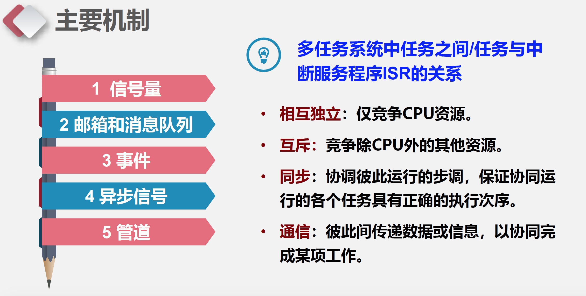
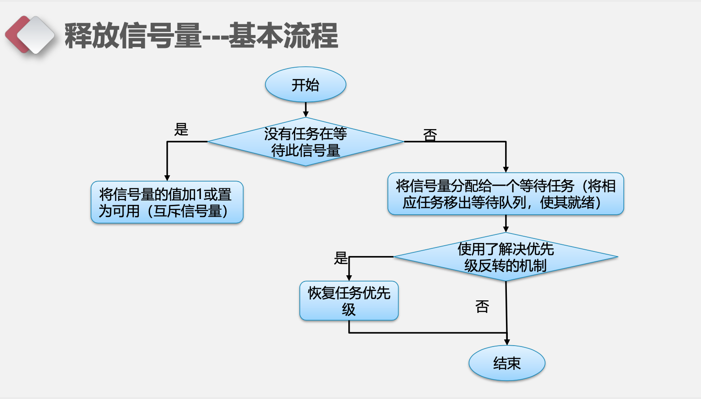

uCos中的信号量机制
===

目录
---

[TOC]

## 1. 背景

前段时间老师上课讲到了uC/OS中的信号量机制，所以我想要结合[《μC/OS-III源码分析笔记》](https://m.igetget.com/hybrid/v2/ebook/detail?bid=EJmMZXq1b8qOpBlD69XAdP7LEGaKJWEYBqWxRnme5vrVzo4QMZYgNyk2jNA5467K)和中国大学MOOC-电子科技大学[《嵌入式系统及应用》](https://www.icourse163.org/learn/UESTC-1206862805?tid=1450357492#/learn/announce)PPT写一篇笔记对这部分的内容进行总结。

## 2. 概述

### 2.1. 主要机制及应用



$$
\text{Figure 1. 模型}
$$

- 在单处理器平台上，嵌入式操作系统内核提供的同步、互斥与通信机制
主要包括：
    - **信号量**（semaphore），用于互斥与同步。
    - **事件（组）**（event group），用于同步。
    - **邮箱**（mailbox）、消息队列（message queue），用于消息通信。
    - **异步信号**（asynchronous signal），用于同步。
    - **管道**（pipe），提供非结构化数据交换（通信）和实现同步。
- 单处理器或多处理器系统中，还有其它一些机制也可用于同步与通信：
    - 全局变量
    - 共享内存
    - Sockets
    - 远程过程调用（Remote Procedure Call）

### 2.2. 同步或通信的基本方式


$$
\text{Figure 2. 同步或通信的基本方式}
$$

## 3. 信号量

### 3.1. 主要机制及应用

- 在单处理器平台上，嵌入式操作系统内核提供的同步、互斥与通信机制 主要包括:
    - **信号量**(semaphore)，用于互斥与同步。
    - **事件(组)**(event group)，用于同步。
    - **邮箱**(mailbox)、**消息队列**(message queue)，用于消息通信。
    - **异步信号**(asynchronous signal)，用于同步。
    - **管道**(pipe)，提供非结构化数据交换(通信)和实现同步。
- 单处理器或多处理器系统中，还有其它一些机制也可用于同步与通信: 全局变量、共享内存、Sockets、远程过程调用(Remote Procedure Call)。

### 3.2. 分类

信号量用于实现任务与任务之间、任务与中断处理程序之间的同步与 互斥。信号量一般分为三种:

- 互斥信号量:用于解决互斥问题，可能会引起优先级反转问题。
- 二值信号量:用于解决同步问题
- 计数信号量:用于解决资源计数问题

### 3.3. 互斥信号量

- 用互斥信号量保护的代码区称作`临界区`，临界区代码通常用 于对共享资源的访问。
- **共享资源**可能是一段存储器空间、一个数据结构或I/O设备，也 可能是被两个或多个并发任务共享的任何内容。
- 使用`互斥信号量可以实现对共享资源的串行访问`，保证只有成功 地获取互斥信号量的任务才能够释放它。
- 互斥信号量基本特点:互斥信号量的值被初始化成1，最多只有 一个任务可以进入`临界区`。


$$
\text{Figure 3. 互斥信号量状态图}
$$

- 互斥信号量是一种**特殊**的二值信号量，一般它`支持所有权、递归访 问、任务删除安全`和一些避免`优先级反转、饥饿、死锁等`互斥所固 有问题的协议。
- **所有权**:当一个任务通过获取互斥信号量而将其锁定时，得到该互 斥信号量的所有权。相反，当一个任务释放信号量时，失去对其的 所有权。

#### 3.3.1. 嵌套(递归)资源访问

- **嵌套(递归)资源访问**:如果Task1调用RoutineA，而RoutineA 又调用RoutineB，并且三者访问相同的共享资源，就发生了递归共 享资源的访问同步问题。
- 一个递归的**互斥信号量允许嵌套锁定**互斥信号量，而不引起死锁。
- 每个获取信号量的调用必须与释放信号量的**调用相匹配**。
- 用于`同步的信号量不支持嵌套访问`，否则任务会被永久阻塞。

#### 3.3.2. 删除安全

- **删除安全**:在一个受信号量保护的临界区，经常需要保护在临界区执行的任务不会被意外地删除。
- 删除一个在临界区执行的任务可能引起意想不到的后果，造成信号量不可用或资源破坏。
- **解决方法**:提供`任务保护`和`解除任务保护`原语对。

### 3.4. 各种互斥机制的比较


$$
\text{Figure 4. 各种互斥机制的比较}
$$

### 3.5. 二值信号量

二值信号量主要用于任务与任务之间、任务与中断服务程序之间的 同步。二值信号量的初始值为0，表示同步事件尚未产生。


$$
\text{Figure 5. 二值信号量状态图}
$$

用二值信号量实现任务间双向同步时，申请者和释放者不是同一个任务，与互斥信号量不同。互斥信号量必须谁申请，谁释放。


$$
\text{Figure 6. 用二值信号量实现任务间双向同步}
$$

### 3.6. 计数信号量

- 计数信号量用于控制系统中共享资源的多个实例的使用，允许多个 任务同时访问同一种资源的多个实例。
- 计数信号量被初始化为一个非负整数n，即该种共享资源的数目。


$$
\text{Figure 7. 计数信号量状态图}
$$


$$
\text{Figure 8. 有界缓冲问题1}
$$


$$
\text{Figure 9. 有界缓冲问题}
$$

## 4. uC/OS-II中实现

### 4.1. 创建信号量

```cpp
OS_EVENT* OSSemCreate(INT16U cnt)
{
    OS_EVENT* pevent;
    pevent = OSEventFreeList; //从空闲事件控制块链中取得一个ECB
    if (OSEventFreeList != (OS_EVENT*)0) {
        OSEventFreeList = (OS_EVENT*) { OSEventFreeList->OSEventPtr; }
        if (pevent != (OS_EVENT*)0) { //初始化ECB的各个域
            pevent->OSEventType = OS_EVENT_TYPE_SEM; //事件类型为信号量
            //信号量的初始计数值
            pevent->OSEventCnt = cnt;
            pevent->OSEventPtr = (void*)0;
            OS_EventWaitListInit(pevent); //初始化等待任务列表
        }
    }
    return (pevent); //调用者需检查返回值，如果为NULL则表示建立失败
}
```

说明：这是针对计数信号量和二值信号量的实现。 μC/OS-II中互斥 信号量的实现参见源码os_mutex.c文件。


$$
\text{Figure 10. 基本流程}
$$

### 4.2. 获取(申请)信号量

```cpp
void OSSemPend(OS_EVENT* pevent, INT16U timeout, INT8U* err)
{
    //信号量值大于0，成功获得信号量并返回
    if (pevent->OSEventCnt > 0) {
        pevent->OSEventCnt--;
        *err = OS_NO_ERR;
        return;
    }
    //设置任务状态为等待信号量
    OSTCBCur->OSTCBStat |= OS_STAT_SEM;
    //设置等待时限
    OSTCBCur->OSTCBDly = timeout;
    //将任务放置到信号量的等待列表中
    OS_EventTaskWait(pevent);
    //内核实施任务调度，系统切换到另一就绪任务执行
    OS_Sched();
    //判断任务恢复执行的原因，如果等待时限超时但仍然未获得信号量，则返回超时信息
    if (OSTCBCur->OSTCBStat & OS_STAT_SEM) {
        OSEventTO(pevent);
        *err = OS_TIMEOUT;
        return;
    }
    OSTCBCur->OSTCBEventPtr = (OS_EVENT*)0;
    *err = OS_NO_ERR; //任务由于获得信号量而恢复执行，本调用成功返回
}
```

说明：这里同样是针对计数信号量和二值信号量的实现。

---

`OSSemAccept`也可以实现获取(申请)信号量的功能。

```cpp
INT16U OSSemAccept(OS_EVENT* pevent)
{
    INT16U cnt;
    cnt = pevent->OSEventCnt;
    if (cnt > 0) {
        pevent->OSEventCnt--;
        }
    return (cnt);
}
```

- 功能：无等待的获取或申请一个信号量。
- 注意：即使不能成功获得信号量(返回值为0)，调用者也不 会被阻塞。此函数**可以在中断处理程序中使用**。

### 4.3. 释放信号量



$$
\text{Figure 12. 释放信号量}
$$

```cpp
INT8U OSSemPost(OS_EVENT* pevent)
{

    if (pevent->OSEventGrp != 0x00) { //如果有任务在等待该信号量
        OS_EventTaskRdy(pevent, (void*)0, OS_STAT_SEM); //使等待列表中优先级最高的任务就绪
        OS_Sched(); //内核实施任务调度
        return (OS_NO_ERR); //成功返回
    }
    if (pevent->OSEventCnt < 65535) { //如果没有任务等待该信号量，并且信号量的值未溢出
        pevent->OSEventCnt++; //信号量的值加1
        return (OS_NO_ERR); //成功返回
    }
    return (OS_SEM_OVF); //信号量溢出
}
```

### 4.4. 删除信号量


$$
\text{Figure 13. 删除信号量}
$$

```cpp

OS_EVENT* OSSemDel(OS_EVENT* pevent, INT8U opt, INT8U* err)
{
    BOOLEAN tasks_waiting;
    if(pevent->OSEventGrp!=0x00{//根据是否有任务在等待信号量设置等待标志
            tasks_waiting = TRUE;
    }else{
            tasks_waiting = FALSE;
    }
    switch(opt){
        case OS_DEL_NO_PEND: //如果有任务等待信号量则不删除信号量
            if(task_waiting==FALSE{ //没有任务等待，释放ECB回空闲链
                pevent->OSEventType = OS_EVENT_TYPE_UNUSED;
                pevent->OSEventPtr = OSEventFreeList;
                OSEventFreeList = pevent; //调整空闲ECB链头指针
                *err = OS_NO_ERR;
                return ((OS_EVENT)0);
            }else{
                *err = OS_ERR_TASK_WAITING; //有任务等待，删除信号量失败
                return (pevent);
            }
        case OS_DEL_ALWAYS: //无论有无任务等待都删除信号量
                //将等待列表中的每个任务都设置成就绪
                while (pevent->OSEventGrp != 0x00) {
                OS_EventTaskRdy(pevent, (void*)0, OS_STAT_SEM);
                }
                pevent->OSEventType = OS_EVENT_TYPE_UNUSED;
                pevent->OSEventFreeList;
                OSEventFreeList = pevent; //释放该信号量的ECB回空闲控制块链
                if (tasks_waiting == TRUE) {
                OS_Sched();
                } //如果之前有任务等待信号量，内核实施任务调度
                *err = OS_NO_ERR;
                return ((OS_EVENT*)0);
        default:
                *err = OS_ERR_INVALID_OPT;
                return (pevent);
        }
}
```

---

**联系邮箱**：curren_wong@163.com

**CSDN**：[https://me.csdn.net/qq_41729780](https://me.csdn.net/qq_41729780)

**知乎**：[https://zhuanlan.zhihu.com/c_1225417532351741952](https://zhuanlan.zhihu.com/c_1225417532351741952)

**公众号**：**复杂网络与机器学习**

欢迎关注/转载，有问题欢迎通过邮箱交流。


