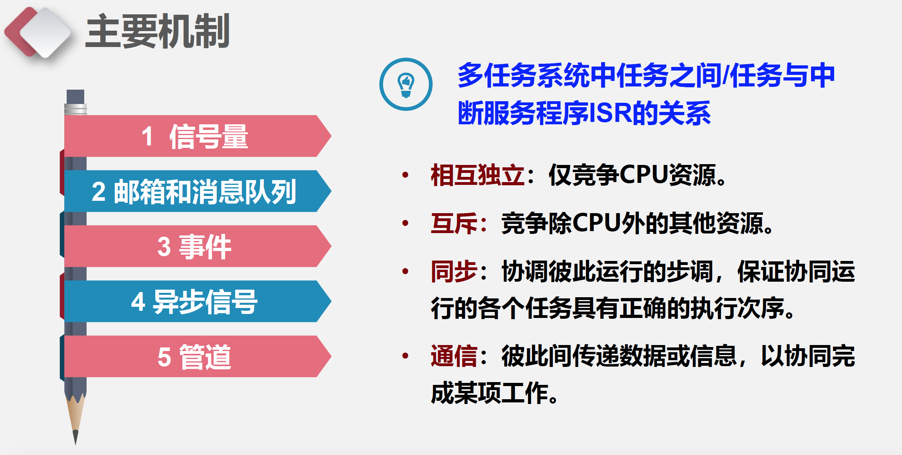
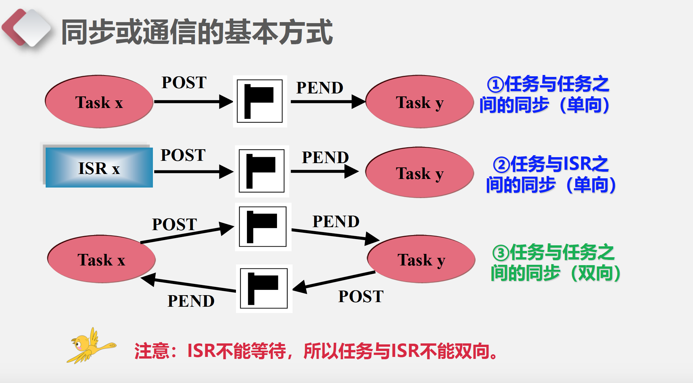

uCos中的同步互斥和通信
===

目录
---

[TOC]

## 1. 背景

今天老师上课讲到了uC/OS中的同步互斥和通信，所以我想要结合[《μC/OS-III源码分析笔记》](https://m.igetget.com/hybrid/v2/ebook/detail?bid=EJmMZXq1b8qOpBlD69XAdP7LEGaKJWEYBqWxRnme5vrVzo4QMZYgNyk2jNA5467K)和中国大学MOOC-电子科技大学[《嵌入式系统及应用》](https://www.icourse163.org/learn/UESTC-1206862805?tid=1450357492#/learn/announce)PPT写一篇笔记对这部分的内容进行总结。

## 2. 概述

### 2.1. 主要机制及应用

$$
\text{Figure 1. 模型}
$$

- 在单处理器平台上，嵌入式操作系统内核提供的同步、互斥与通信机制
主要包括：
    - **信号量**（semaphore），用于互斥与同步。
    - **事件（组）**（event group），用于同步。
    - **邮箱**（mailbox）、消息队列（message queue），用于消息通信。
    - **异步信号**（asynchronous signal），用于同步。
    - **管道**（pipe），提供非结构化数据交换（通信）和实现同步。
- 单处理器或多处理器系统中，还有其它一些机制也可用于同步与通信：
    - 全局变量
    - 共享内存
    - Sockets
    - 远程过程调用（Remote Procedure Call）

### 2.2. 同步或通信的基本方式

$$
\text{Figure 2. 同步或通信的基本方式}
$$

## 3. 信号量
