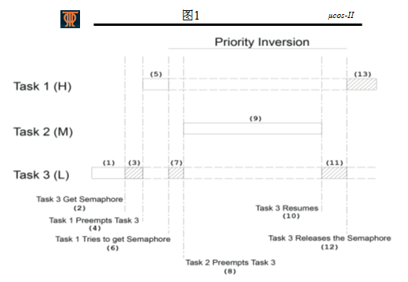
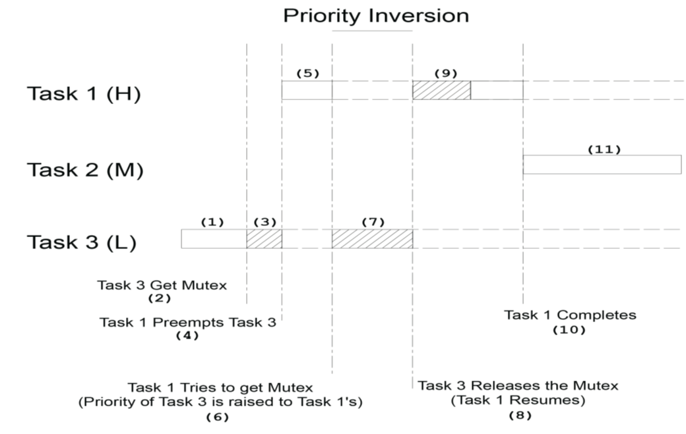

嵌入式系统复习题
===

目录
---

[TOC]

## 1. 背景

最近快要期末考试了，我把嵌入式系统的习题整理了一下，整理成了这篇笔记。

## 2. 题目

### 2.1. 嵌入式系统基础

1. 什么是嵌入式系统？举例说明嵌入式系统的典型应用。

嵌入式系统是“用于控制、监视或者辅助操作机器和设备的装置”（原文为devices used to control, monitor, or assist the operation of equipment, machinery or plants）。

典型的应用如：冰箱、洗衣机、空调、工业机器人、智能门禁、汽车电子、共享单车等等。

2. 嵌入式微处理器有哪两种架构？区别是什么。

冯·诺伊曼结构和哈佛结构。

冯·诺伊曼结构较为简单，成本低，运算速度比哈佛结构慢。

哈佛结构能够高速处理数据，可以同时读取分开存储的指令和数据，但结构比较复杂，成本高。

---

冯·诺依曼理论的要点是：数字计算机的数制采用二进制；计算机应该按照程序顺序执行。人们把冯诺依曼的这个理论称为冯诺依曼体系结构。从ENIAC到当前最先进的计算机都采用的是冯诺依曼体系结构。所以冯诺依曼是当之无愧的数字计算机之父。

数学家冯·诺依曼提出了计算机制造的三个基本原则，即采用二进制逻辑、程序存储执行以及计算机由五个部分组成（运算器、控制器、存储器、输入设备、输出设备），这套理论被称为冯·诺依曼体系结构。

根据冯诺依曼体系结构构成的计算机，必须具有如下功能：

1. 把需要的程序和数据送至计算机中；
2. 必须具有长期记忆程序、数据、中间结果及最终运算结果的能力；
3. 能够完成各种算术、逻辑运算和数据传送等数据加工处理的能力；
4. 能够根据需要控制程序走向，并能根据指令控制机器的各部件协调操作；
5. 能够按照要求将处理结果输出给用户。

**哈佛结构是为了高速数据处理而采用的，因为可以同时读取指令和数据（分开存储的）。大大提高了数据吞吐率，缺点是结构复杂**。通用微机指令和数据是混合存储的，结构上简单，成本低。假设是哈佛结构：你就得在电脑安装两块硬盘，一块装程序，一块装数据，内存装两根，一根储存指令，一根存储数据……

哈佛结构处理器有两个明显的特点：使用两个独立的存储器模块，分别存储指令和数据，每个存储模块都不允许指令和数据并存；使用独立的两条总线，分别作为CPU与每个存储器之间的专用通信路径，而这两条总线之间毫无关联。

改进的哈佛结构，其结构特点为：以便实现并行处理；具有一条独立的地址总线和一条独立的数据总线，利用公用地址总线访问两个存储模块（程序存储模块和数据存储模块），公用数据总线则被用来完成程序存储模块或数据存储模块与CPU之间的数据传输。

是什么结构要看总线结构的。51单片机虽然数据指令存储区是分开的，但总线是分时复用的，所以顶多算改进型的哈佛结构。ARM9虽然是哈佛结构，但是之前的版本也还是冯·诺依曼结构。早期的X86能迅速占有市场，一条很重要的原因，正是靠了冯·诺依曼这种实现简单，成本低的总线结构。处理器虽然外部总线上看是诺依曼结构的，但是由于内部CACHE的存在，因此实际上内部来看已经算是改进型哈佛结构的了。

3. 比较ucos和uClinux的内核特点，举例说明其各自适用的场合。

uc/os适合小型控制系统，具有执行效率高、占用空间小、实时性能优良和可扩展性强等特点，最小内核可编译至2k。

uclinux则是继承标准linux的优良特性，针对嵌入式处理器的特点设计的一种操作系统，具有内嵌网络协议、支持多种文件系统，开发者可利用标准linux先验知识等优势。

小型控制系统可充分利用uc/os小巧且实时性强的优势，如果开发pda和互联网连接终端等较为复杂的系统则uclinux是不错的。

### 2.2. 任务管理与调度

1. 每一个任务都是是一个死循环 `True`
2. 嵌入式linux是基于时间片调度的内核 `True`
3. ucos-ii是占先式的内核，不支持时间片管理。实时性高于嵌入式linux内核。 `True`
4. 所有的任务都是周期性执行的 `True`
5. 每个任务都有自己的堆栈和任务控制块。这些资源占用的是RAM资源。 `True`
6. 任务的状态有哪些？

- 休眠态
- 就绪态
- 运行态
- 等待态
- 中断服务态

7. 简述ucos-II 任务的切换过程
    1. 调用任务切换函数OSSched()
    2. 检查当前是否在中断中，检查调度器是否被锁
    3. 关中断
    4. 找出就绪列表中优先级最高的任务的优先级和该优先级下对应的第一个任务
    5. 判断该任务是否跟当前运行任务是一样的
    6. 被切换到的任务的切换次数加一
    7. 总的任务切换次数加一
    8. 调用任务切换的宏OS_TASK_SW()
    9. 开中断

---

8. Q：Explain the principle of priority inversion according to the figure above。



Task 1 has a higher priority

Task 2 has a middle priority

Task 3 has a lower priority

答案：

优先级反转：低优先级任务阻塞了高优先级任务的运行。

从图中看，三个任务优先级排列是 Task 1 > Task 2 > Task 3。

在(3)阶段，任务3占据了信号量，在(4)阶段，优先级更高的任务1抢占了任务3，并在(6)尝试获取信号量，

但由于信号量已被任务3占据，资源不足，任务1被挂起，优先级降低。

而在(8)阶段任务2因为优先级更高，抢占了任务3，因为不需要获取信号量，成功运行。

所以，这就造成了只有中优先级的任务2阻塞了高优先级的任务1运行。

这与我们所期望的，优先级高的任务先运行的目标不相符，所以就产生了问题。

9. To avoid priority inversion，the Kernel has the feature "Mutual Exclusion Semaphores", explain how it works according to the following sequence diagram.



答案：

要解决优先级反转的问题，有两种方案，分别是优先级继承和优先级天花板。

这里使用了优先级继承的策略，在任务3占有了互斥信号量并阻塞了任务1的时候，任务3的优先级被提高到和任务1相同。

所以任务3执行过程中不会被任务2抢占。

当任务3执行完毕，释放互斥信号量时，优先级最高的任务1获取了信号量，开始运行。

10. 有关任务的控制块(TCB)描述，正确的是：

- A. 每个任务都有自己的控制块。
- B. TCB是一个数据结构，保存任务的信息。
- C. ucos中，TCB是双联表管理的。创建任务时从空闲链获得一个TCB分配给当前任务
- D.任务切换时，当前任务的TCB是不用保护的。

答案：ABC

11. 任务的信息包括：

- A. 保存每个任务的信息所用的内存大小都是相同的。

- B. 信息中包括任务的ID

- C. 任务的状态

- D. 任务的堆栈指针

答案： ABCD

12. 占先式内核正确的描述是：

- A. 可以被中断打断

- B. 从中断返回时，可以发生任务调度

- C. 从中断返回时，返回到断点，即被中断的任务处，继续执行

- D. 有优先级高的任务就绪时，低优先级任务被抢占

答案： ABD

13. 有关临界资源正确的描述是：

- A. 临界资源即为临界区

- B. 可以通过互斥机制保护临界资源

- C. 不可以由多个任务同时访问的资源

- D. 临界资源可以是定义的一个变量

答案： BCD

14. ucos有关任务的创建，正确的是：

- A. 创建任务前必须为任务分配堆栈。

- B. 创建任务时必须指定其优先级，且必须唯一。

- C. 创建任务后，该任务即处于就绪态。

- D. 创建任务时，从空闲链表获得一个TCB，进行初始化

答案： ABCD

15. 信号量的释放是由内核实现的 `False`
16. 任务可以自己挂起，并实现调度 `True`
17. 挂起任务和解挂任务的函数必须是成对出现的，否则会造成死锁 `True`
18. 任务调度以调度函数实现。任务调度是系统的一个任务。 `False`
19. 任务的唤醒是不需要调度的。 `False`
20. ucos的每一个任务都是一个死循环 `True`
21. ucos的任务可以有返回值。如可以定义为 int task_A｛｝。 `False`
22. ucos的任务是可以删除自己的。即把任务代码从内存中删除掉。 `False`
23. ucos中任务优先级为0的任务，优先级是最高的。 `True`

---

24. ucos就绪表中就绪的任务的优先级为20、30、40，写出OSRdyGrp和对应的OSRdyTbl的二进制值。

答案：

```cpp
OSRdyGrp=00101100B;

OSRdyTbl[2]=00010000B;

OSRdyTbl[3]=01000000B;

OSRdyTbl[5]=00000001B;
```

25. 根据就绪表确定最高优先级

```cpp
OSRdyGrp=0x24=00100 100B

OSRdyTbl[2]=00100 100B

OSRdyTbl[5]=00101 110B
```

写出当前优先级最高的任务的优先级。

答案：$prio=2*8+2=18$

26. 有关任务管理，正确的是：

- A. 任务可以在main函数中创建。

- B. 任务可以在其他任务运行过程中由任务创建。

- C. 任务可以在中断服务程序中创建。

- D. main函数中至少要创建一个任务。

答案： ABD

27. 有关任务的堆栈，正确的是：

- A. ucos中的任务都必须分配堆栈。

- B. ucos中任务的堆栈大小都是相同的。

- C. 可以通过malloc函数动态为任务分配堆栈。

- D. ucos在任务切换过程中，被挂起的任务使用的CPU寄存器是保存在该任务的堆栈中的。

答案： ACD

28. 有关空闲任务，正确的是：

- A. 系统任务。

- B. 优先级最低。

- C. 永远不会被放入到等待列表，而处于等待状态。

- D. 空闲任务也可以被删除。

答案： ABC

29. ucos是基于时间片的内核。`False`
30. ucos任务被删除后，它所占用的资源会自动释放。 `False`
31. ucos可以在中断处理中删除任务。 `False`
32. ucos中任务可以自己挂起也可以由其他任务使它挂起。 `True`
33. 如果任务正在等待信号量，此时解挂，任务也不会马上执行或者进入就绪态，直到获得信号量或者等待超时才能进入就绪态，如果处于就绪表中优先级最高，则进入运行态。 `True`

### 2.3. 中断

1. 中断服务程序需要做的事情包括：

- A. 保护上下文，即保护现场

- B. 查找中断向量表，把中断服务的入口地址取出送给指令指针

- C. 恢复上下文，即恢复现场

- D. 编写具体操作程序

答案： ACD

2. 有关中断的堆栈，正确的描述是：

- A. 中断不需要堆栈

- B. 中断可以使用被中的那个任务的堆栈

- C. 中断可以使用单独的中断栈，而不使用任务的堆栈

- D. 中断使用的堆栈可以随时动态分配

答案： BC

3. 影响实时嵌入式系统的实时性能的是：

- A. 中断的响应时间

- B. 任务的切换时间

- C. 嵌入式操作系统的时钟节拍

- D. 开、关中断的时间

答案： ABCD

4. 非屏蔽中断源一旦产生中断申请，CPU在执行完当前指令后必须响应。 `True`
5. 中断服务程序是可以发送信号量给某一个任务的 `True`
6. 中断服务程序可以等待一个信号量 `False`
7. 中断服务程序中可以创建任务 `False`
8. 中断服务程序中可以动态的分配内存或者释放内存 `False`
9. 中断服务程序中尽量做最少的事情，尽快完成 `True`
10. 有中断嵌套的情况下，需要编写可重入型函数 `True`

### 2.4. 同步互斥和通信

1. ucos中信号量的初值可以是：

- A. 0

- B. 1

- C. 0～65535之间的任意数

- D. 任意值

答案： ABC

2. 用信号量标识事件的发生时，初值一般设置为

- A. 1

- B. 0

- C. 0～65535之间

- D. 任意值

答案： B

3. 下列哪些可以用于实现共享资源的同步访问

- A. 二值信号量

- B. 互斥信号量MUTEX

- C. 初值为n的信号量（n为0～65535之间的值）

- D. 都不能

答案： AB

4. 中断服务程序中可以调用的函数为

- A. OSSemCreate（）

- B. OSSemPend（）

- C. OSSemAccept（）

- D. OSSemPost（）

答案： CD

5. 假如一个AD任务需要将采集的数据发送给显示任务，可以实现这个功能的机制有

- A. 信号量

- B. 邮箱

- C. 消息队列

- D. MUTEX和全局变量组合使用

答案： BD

6. 可以在下列哪种情况下创建消息队列？

- A. main（）函数中

- B.for循环之前

```cpp
taskA(){
    for(,,){}
    }
```

- C. 中断服务程序中

- D.for循环中

```cpp
taskA(){
    for(,,){}
    }
```

答案： AB

### 2.5. 内核移植

1. ARM Cortex M3的堆栈是向下增长的 `False`

可以自主定义

2. Cortex M3移植ucos-II，上下文切换实际上是模拟了一次PendSV中断。 `True`

3. BSP（Board Support Package）的功能可以包括：

- A. 外部设备初始化

- B. 板级初始化

- C. 系统级初始化

- D. 芯片级初始化

答案：BCD

BSP主要功能为屏蔽硬件，提供操作系统及硬件驱动，具体功能包括：

1. 单板硬件初始化，主要是CPU的初始化，为整个软件系统提供底层硬件支持
2. 为操作系统提供设备驱动程序和系统中断服务程序
3. 定制操作系统的功能，为软件系统提供一个实时多任务的运行环境
4. 初始化操作系统，为操作系统的正常运行做好准备。

---

4. 对于ARM Cortex M3微处理器，用OS_STK为任务分配堆栈时，即

`OS _STK  Task_STK[256];`

- A. 分配了256个BYTE
- B. 堆栈的栈顶指针为Task_STK
- C. 分配了256*4个BYTE
- D. 分配了256*2个BYTE

答案：BD

typedef unsigned int OS_STK; /* Each stack entry is 16-bit wide */

---

5. 满足ucos-ii移植的条件有：

- A. 处理器支持硬件中断

- B. 处理器有足够的硬件堆栈

- C. 编译器支持可重入型函数

- D. 微处理器具有PUSH和POP指令，操作堆栈

答案：BCD

---

移植uC/OS-II到处理器上必须满足以下条件。

1. 处理器的 C 编译器能产生可重入代码。
2. 用 C 语言可打开和关闭中断。
3. 处理器支持中断并且能产生定时中断。
4. 处理器支持能够容纳一定量数据的硬件堆栈。
5. 处理器有将堆栈指针和其他 CPU 寄存器读出和存储到堆栈(或内存)的指令。

---

**联系邮箱**：curren_wong@163.com

**CSDN**：[https://me.csdn.net/qq_41729780](https://me.csdn.net/qq_41729780)

**知乎**：[https://zhuanlan.zhihu.com/c_1225417532351741952](https://zhuanlan.zhihu.com/c_1225417532351741952)

**公众号**：**复杂网络与机器学习**

欢迎关注/转载，有问题欢迎通过邮箱交流。


