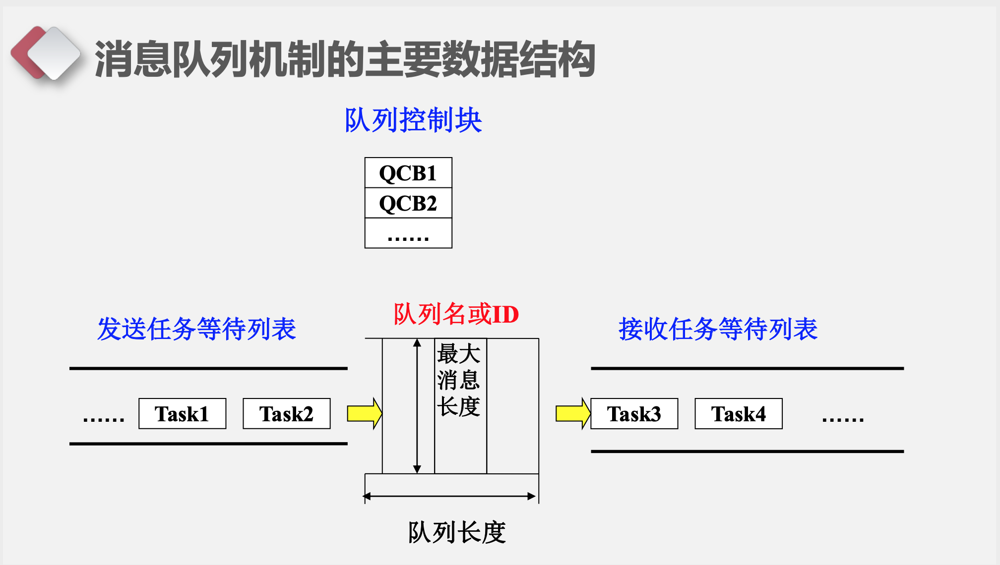
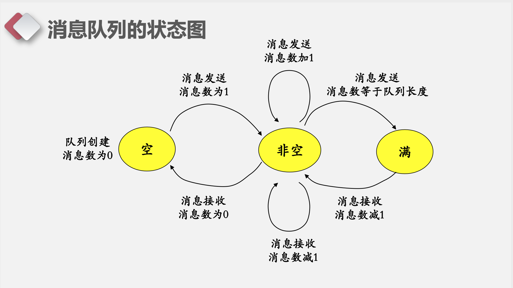
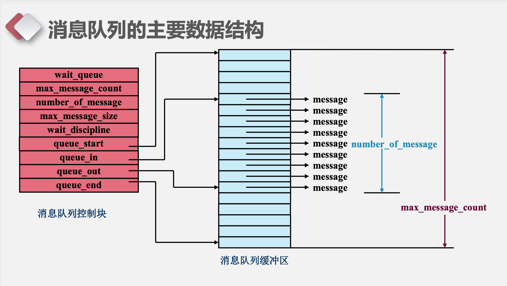
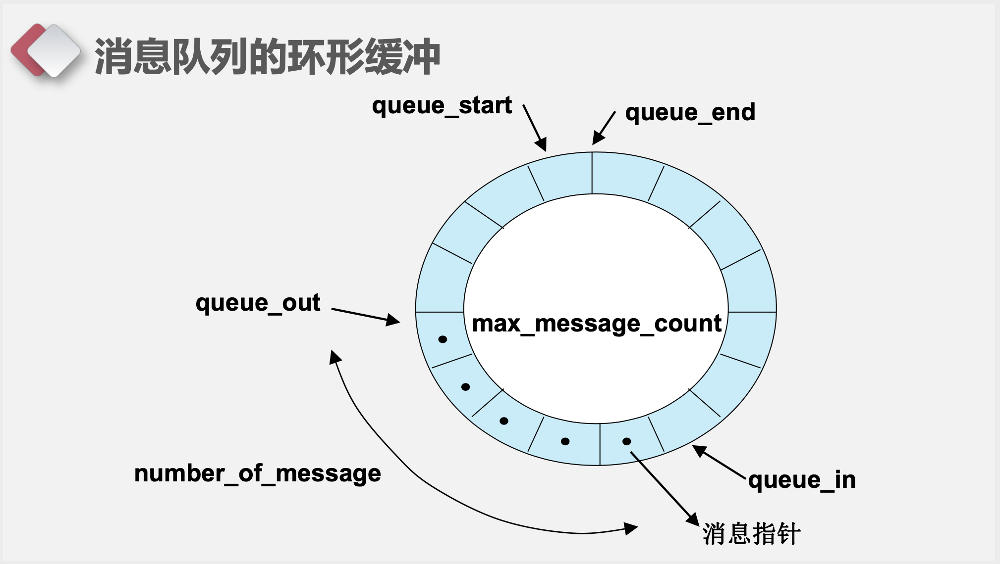
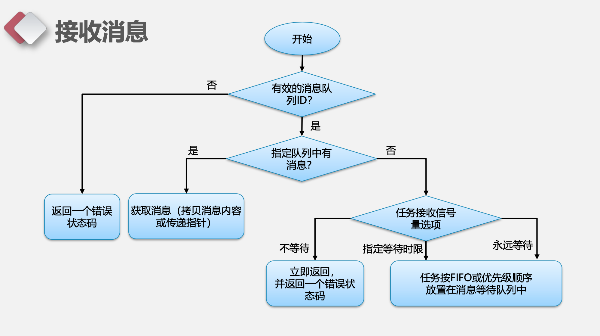
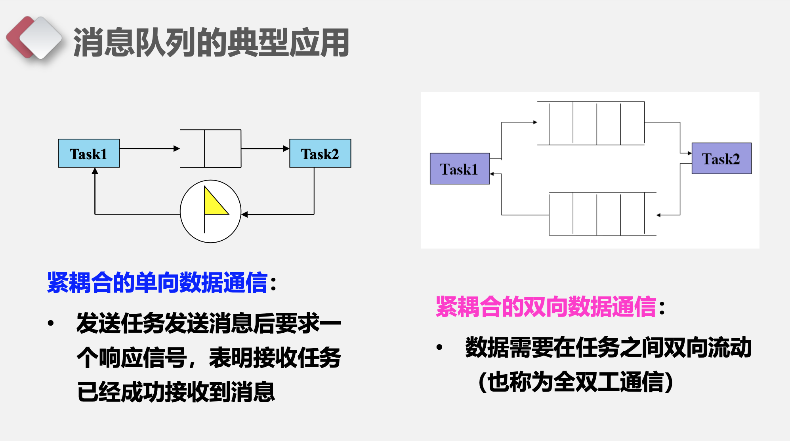

uCos中的邮箱和消息队列
===

目录
---

[TOC]

## 1. 背景

前段时间老师上课讲到了uC/OS中的邮箱和消息队列，所以我想要结合[《μC/OS-III源码分析笔记》](https：//m.igetget.com/hybrid/v2/ebook/detail?bid=EJmMZXq1b8qOpBlD69XAdP7LEGaKJWEYBqWxRnme5vrVzo4QMZYgNyk2jNA5467K)和中国大学MOOC-电子科技大学[《嵌入式系统及应用》](https：//www.icourse163.org/learn/UESTC-1206862805?tid=1450357492#/learn/announce)PPT写一篇笔记对这部分的内容进行总结。

## 2. 直接通信与间接通信

- 直接通信：在通信过程中双方必须明确地知道(命名)彼此。
    - Send (P，message) – 发送一个消息到任务P
    - Receive(Q，message) – 从任务Q接收一个消息

- 间接通信：通信双方不需要指出消息的来源或去向，而通过中间机 制来通信
    - send(A，message) – 发送一个消息给邮箱A
    - receive(A，message) – 从邮箱A接收一个消息

## 3. 消息机制

- 消息队列：属于间接通信方式
    - 消息：内存空间中一段长度可变的缓冲区，其长度和内容均可以由用户定义和解释，其`内容可以是实际的数据、数据块的指针或空`。
    - 从操作系统观点看，消息没有定义的格式，所有的消息都是字节流，没有特定的含义。
    - 应用可以只把消息当成一个标志，这时消息机制用于实现同步。
- 消息机制可进一步分为：**邮箱和消息队列**。**邮箱仅能存放单条消息， 消息队列可存放若干消息**。
- 消息机制可**支持定长与可变长度**两种模式的消息。

## 4. 消息队列



$$
\text{Figure 1. 消息队列机制的主要数据结构}
$$

- 消息队列控制块:管理所有创建的消息队列，系统运行时动态分配和 回收消息队列控制块。
- 消息队列缓冲区:存放该队列的消息内容。
- 如何进行消息的发送或接收?`完整的消息内容拷贝` or`传递指针`(效率高、系统性能好、空间占用小)?



$$
\text{Figure 2. 消息队列的状态图}
$$



$$
\text{Figure 3. 消息队列的主要数据结构}
$$



$$
\text{Figure 4. 消息队列的环形缓冲}
$$



$$
\text{Figure 5. 接收消息流程图}
$$



$$
\text{Figure 6.消息队列的典型应用}
$$

## 5. ucos-ii中实现

### 5.1. 任务创建

```cpp
OS_EVENT  *OSQCreate (void **start, INT16U size)
{
#if OS_CRITICAL_METHOD == 3                      /* Allocate storage for CPU status register           */
    OS_CPU_SR  cpu_sr;
#endif
    OS_EVENT  *pevent;
    OS_Q      *pq;


    if (OSIntNesting > 0) {                      /* See if called from ISR ...                         */
        return ((OS_EVENT *)0);                  /* ... can't CREATE from an ISR                       */
    }
    OS_ENTER_CRITICAL();
    pevent = OSEventFreeList;                    /* Get next free event control block                  */
    if (OSEventFreeList != (OS_EVENT *)0) {      /* See if pool of free ECB pool was empty             */
        OSEventFreeList = (OS_EVENT *)OSEventFreeList->OSEventPtr;
    }
    OS_EXIT_CRITICAL();
    if (pevent != (OS_EVENT *)0) {               /* See if we have an event control block              */
        OS_ENTER_CRITICAL();
        pq = OSQFreeList;                        /* Get a free queue control block                     */
        if (pq != (OS_Q *)0) {                   /* Were we able to get a queue control block ?        */
            OSQFreeList         = OSQFreeList->OSQPtr;    /* Yes, Adjust free list pointer to next free*/
            OS_EXIT_CRITICAL();
            pq->OSQStart        = start;                  /*      Initialize the queue                 */
            pq->OSQEnd          = &start[size];
            pq->OSQIn           = start;
            pq->OSQOut          = start;
            pq->OSQSize         = size;
            pq->OSQEntries      = 0;
            pevent->OSEventType = OS_EVENT_TYPE_Q;
            pevent->OSEventCnt  = 0;
            pevent->OSEventPtr  = pq;
            OS_EventWaitListInit(pevent);                 /*      Initalize the wait list              */
        } else {
            pevent->OSEventPtr = (void *)OSEventFreeList; /* No,  Return event control block on error  */
            OSEventFreeList    = pevent;
            OS_EXIT_CRITICAL();
            pevent = (OS_EVENT *)0;
        }
    }
    return (pevent);
}
```

### 5.2. 发送消息

```cpp
INT8U  OSQPost (OS_EVENT *pevent, void *msg)
{
#if OS_CRITICAL_METHOD == 3                      /* Allocate storage for CPU status register           */
    OS_CPU_SR  cpu_sr;
#endif
    OS_Q      *pq;


#if OS_ARG_CHK_EN > 0
    if (pevent == (OS_EVENT *)0) {                    /* Validate 'pevent'                             */
        return (OS_ERR_PEVENT_NULL);
    }
    if (msg == (void *)0) {                           /* Make sure we are not posting a NULL pointer   */
        return (OS_ERR_POST_NULL_PTR);
    }
    if (pevent->OSEventType != OS_EVENT_TYPE_Q) {     /* Validate event block type                     */
        return (OS_ERR_EVENT_TYPE);
    }
#endif
    OS_ENTER_CRITICAL();
    if (pevent->OSEventGrp != 0x00) {                 /* See if any task pending on queue              */
        OS_EventTaskRdy(pevent, msg, OS_STAT_Q);      /* Ready highest priority task waiting on event  */
        OS_EXIT_CRITICAL();
        OS_Sched();                                   /* Find highest priority task ready to run       */
        return (OS_NO_ERR);
    }
    pq = (OS_Q *)pevent->OSEventPtr;                  /* Point to queue control block                  */
    if (pq->OSQEntries >= pq->OSQSize) {              /* Make sure queue is not full                   */
        OS_EXIT_CRITICAL();
        return (OS_Q_FULL);
    }
    *pq->OSQIn++ = msg;                               /* Insert message into queue                     */
    pq->OSQEntries++;                                 /* Update the nbr of entries in the queue        */
    if (pq->OSQIn == pq->OSQEnd) {                    /* Wrap IN ptr if we are at end of queue         */
        pq->OSQIn = pq->OSQStart;
    }
    OS_EXIT_CRITICAL();
    return (OS_NO_ERR);
}
```

### 5.3. 等待消息

```cpp
void  *OSQPend (OS_EVENT *pevent, INT16U timeout, INT8U *err)
{
#if OS_CRITICAL_METHOD == 3                      /* Allocate storage for CPU status register           */
    OS_CPU_SR  cpu_sr;
#endif
    void      *msg;
    OS_Q      *pq;


    if (OSIntNesting > 0) {                      /* See if called from ISR ...                         */
        *err = OS_ERR_PEND_ISR;                  /* ... can't PEND from an ISR                         */
        return ((void *)0);
    }
#if OS_ARG_CHK_EN > 0
    if (pevent == (OS_EVENT *)0) {               /* Validate 'pevent'                                  */
        *err = OS_ERR_PEVENT_NULL;
        return ((void *)0);
    }
    if (pevent->OSEventType != OS_EVENT_TYPE_Q) {/* Validate event block type                          */
        *err = OS_ERR_EVENT_TYPE;
        return ((void *)0);
    }
#endif
    OS_ENTER_CRITICAL();
    pq = (OS_Q *)pevent->OSEventPtr;             /* Point at queue control block                       */
    if (pq->OSQEntries > 0) {                    /* See if any messages in the queue                   */
        msg = *pq->OSQOut++;                     /* Yes, extract oldest message from the queue         */
        pq->OSQEntries--;                        /* Update the number of entries in the queue          */
        if (pq->OSQOut == pq->OSQEnd) {          /* Wrap OUT pointer if we are at the end of the queue */
            pq->OSQOut = pq->OSQStart;
        }
        OS_EXIT_CRITICAL();
        *err = OS_NO_ERR;
        return (msg);                            /* Return message received                            */
    }
    OSTCBCur->OSTCBStat |= OS_STAT_Q;            /* Task will have to pend for a message to be posted  */
    OSTCBCur->OSTCBDly   = timeout;              /* Load timeout into TCB                              */
    OS_EventTaskWait(pevent);                    /* Suspend task until event or timeout occurs         */
    OS_EXIT_CRITICAL();
    OS_Sched();                                  /* Find next highest priority task ready to run       */
    OS_ENTER_CRITICAL();
    msg = OSTCBCur->OSTCBMsg;
    if (msg != (void *)0) {                      /* Did we get a message?                              */
        OSTCBCur->OSTCBMsg      = (void *)0;     /* Extract message from TCB (Put there by QPost)      */
        OSTCBCur->OSTCBStat     = OS_STAT_RDY;
        OSTCBCur->OSTCBEventPtr = (OS_EVENT *)0; /* No longer waiting for event                        */
        OS_EXIT_CRITICAL();
        *err                    = OS_NO_ERR;
        return (msg);                            /* Return message received                            */
    }
    OS_EventTO(pevent);                          /* Timed out                                          */
    OS_EXIT_CRITICAL();
    *err = OS_TIMEOUT;                           /* Indicate a timeout occured                         */
    return ((void *)0);                          /* No message received                                */
}
```

---

**联系邮箱**：curren_wong@163.com

**CSDN**：[https://me.csdn.net/qq_41729780](https://me.csdn.net/qq_41729780)

**知乎**：[https://zhuanlan.zhihu.com/c_1225417532351741952](https://zhuanlan.zhihu.com/c_1225417532351741952)

**公众号**：**复杂网络与机器学习**

欢迎关注/转载，有问题欢迎通过邮箱交流。


