数字电子技术复习大纲
===

目录
-----

[TOC]

## 1. 数字运算基础

### 1.1. 进制

2、8、16、10进制及相互转换。

### 1.2. 编码

$(\cdots)_{8421BCD}$, $(\cdots)_{5421BCD}$, $(\cdots)_{2421 BCD}$

| 十进制数 | 8421码 | 5421码 | 2421码 | 余3码 | 余3循环码 | 4位典型格雷码 |
| :------: | :----: | :----: | :----: | :---: | :-------: | :-----------: |
|    0     |  0000  |  0000  |  0000  | 0011  |   0010    |     0000      |
|    1     |  0001  |  0001  |  0001  | 0100  |   0110    |     0001      |
|    2     |  0010  |  0010  |  0010  | 0101  |   0111    |     0011      |
|    3     |  0011  |  0011  |  0011  | 0110  |   0101    |     0010      |
|    4     |  0100  |  0100  |  0100  | 0111  |   0100    |     0110      |
|    5     |  0101  |  1000  |  1011  | 1000  |   1100    |     0111      |
|    6     |  0110  |  1001  |  1100  | 1001  |   1101    |     0101      |
|    7     |  0111  |  1010  |  1101  | 1010  |   1111    |     0100      |
|    8     |  1000  |  1011  |  1110  | 1011  |   1110    |     1100      |
|    9     |  1001  |  1100  |  1111  | 1100  |   1010    |     1101      |
|    10    |        |        |        |       |           |     1111      |
|    11    |        |        |        |       |           |     1110      |
|    12    |        |        |        |       |           |     1010      |
|    13    |        |        |        |       |           |     1011      |
|    14    |        |        |        |       |           |     1001      |
|    15    |        |        |        |       |           |     1000      |

1. 余 3 码

余3码是8421 BCD码的每个码组加3(0011)形成的。常用于BCD码的运算电路中。

2. 余3循环码

余3循环码是无权码，即每个编码中的1和0没有确切的权值，整个编码直接代表一个数值。主要优点是相邻编码只有一位变化，避免了过渡码产生的 `噪声` 。十进制数的余3循环码就是取4位格雷码中的十个代码组成的。

3. 格雷码

在一组数的编码中，若任意两个相邻的代码只有一位二进制数不同，则称这种编码为格雷码（Gray Code），另外由于最大数与最小数之间也仅一位数不同，即 `首尾相连` ，因此又称循环码或反射码。 在数字系统中，常要求代码按一定顺序变化。例如，按自然数递增计数，若采用8421码，则数0111变到1000时四位均要变化，而在实际电路中，4位的变化不可能绝对同时发生，则计数中可能出现短暂的其它代码（1100、1111等）。在特定情况下可能导致电路状态错误或输入错误。使用格雷码可以避免这种错误。格雷码有多种编码形式。

### 1.3. 反函数、对偶式的定义及求法

1. **对偶式**

在逻辑代数中的对偶式：如果将逻辑函数表达式 $F$ 中所有的 `·` (与) 变成 `+`（或） ， `+` 变成 `·` ， `0` 变成 `1` ， `1` 变成 `0` ，并保持原函数中的运算顺序不变，则所得到的新的逻辑表达式称为函数 $F$ 的对偶式，并记作 $F'$。

如

$$
F = A(\bar{B} + C)
$$

$$
F' = A + \bar{B}C
$$

2. **反函数**

在对偶式的基础上，每个原变量变成其反变量。

$$
\bar{F} = \bar{A} + B\bar{C}
$$

### 1.4. 代数法化简

|  名称  |                        公式1                         |                公式2                |
| :----: | :--------------------------------------------------: | :---------------------------------: |
| 0-1律  |                   $A \cdot 1 = A$                    |             $A + 0 = A$             |
| 0-1律  |                   $A \cdot 0 = 0$                    |             $A + 1 = 1$             |
| 互补律 |                    $A\bar{A} = 0$                    |          $A + \bar{A} = 1$          |
| 重叠律 |                       $AA = A$                       |             $A + A = A$             |
| 交换律 |                      $AB = BA$                       |           $A + B = B + A$           |
| 结合律 |                   $A(BC) = (AB)C$                    |     $A + (B + C) = (A + B) + C$     |
| 分配律 |                 $(A + B)C = AC + BC$                 |      $AB+ C = (A + C)(B + C)$       |
| 反演律 |         $\overline{AB} = \bar{A} + \bar{B}$          | $\overline{A + B} = \bar{A}\bar{B}$ |
| 吸收律 |                    $A(A +B) = A$                     |            $A + AB = A$             |
| 吸收律 |                 $A(\bar{A} +B) = AB$                 |       $A + \bar{A}B = A + B$        |
| 吸收律 | $(A + B)(\bar{A} + C)(B + C) = (A + B)(\bar{A} + C)$ | $AB + \bar{A}C + BC= AB + \bar{A}C$ |
| 对合律 |             $\overline{\overline A} = A$             |                                     |

### 1.5. 卡诺图化简

1. 3个表达式

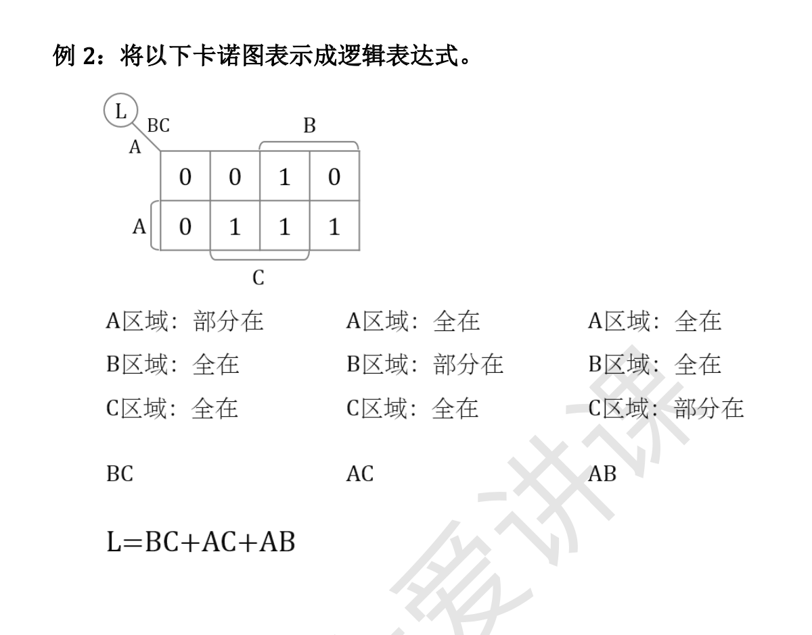

2. 4个表达式

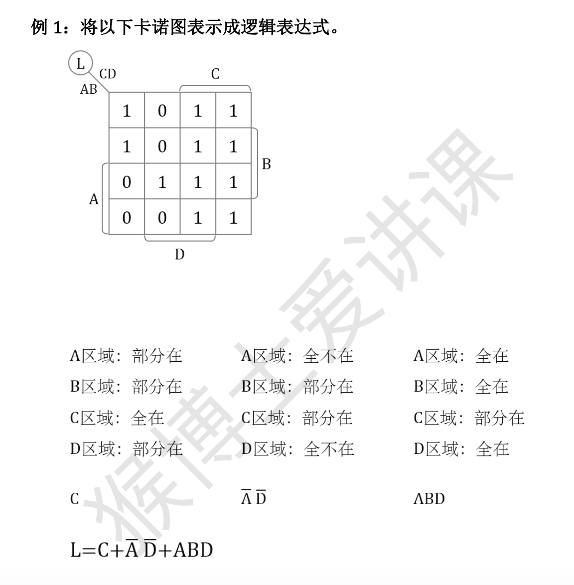

### 1.6. 门电路及符号、逻辑关系

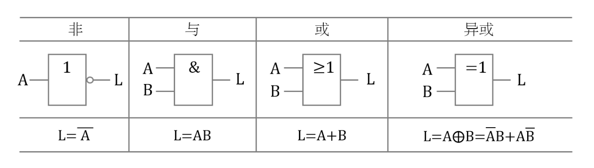

异或：$L = A \oplus B = \bar{A}B + A\bar{B}$

## 2. 组合逻辑电路

### 2.1. 分析

一般步骤：逻辑图 $\to$ 表达式 $\to$ 化简 $\to$ 真值表

### 2.2. 设计

一般步骤：波形图或逻辑命题 $\to$ 真值表 $\to$ 表达式 $\to$ 化简（变换） $\to$ 逻辑图

### 2.3. 中规模集成电路的应用

#### 2.3.1. 编码器

$8$线-$3$线优先编码器 $CD4532$ 的功能表如下图所示。

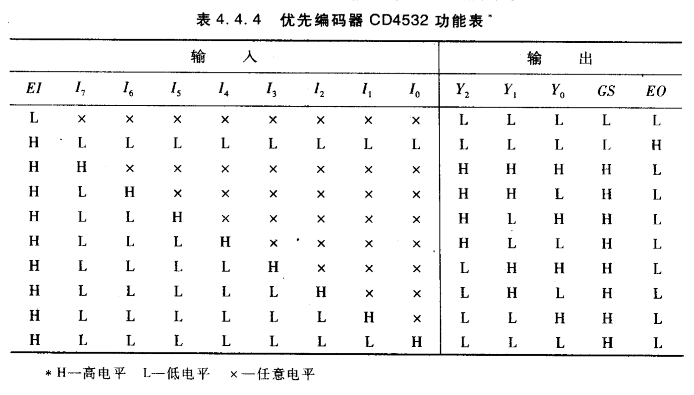

CD4532的逻辑符号图和引脚图。

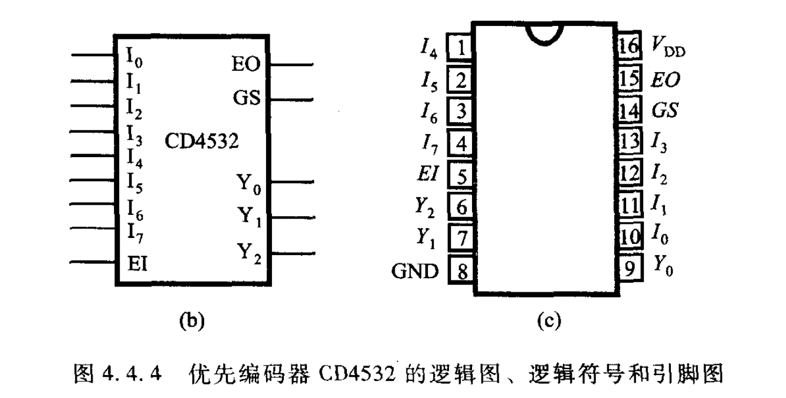

考察输入输出的高低电平有效的含义。

#### 2.3.2. 译码器

1. 2线-4线译码器（139）

2. 3线-8线译码器（138）

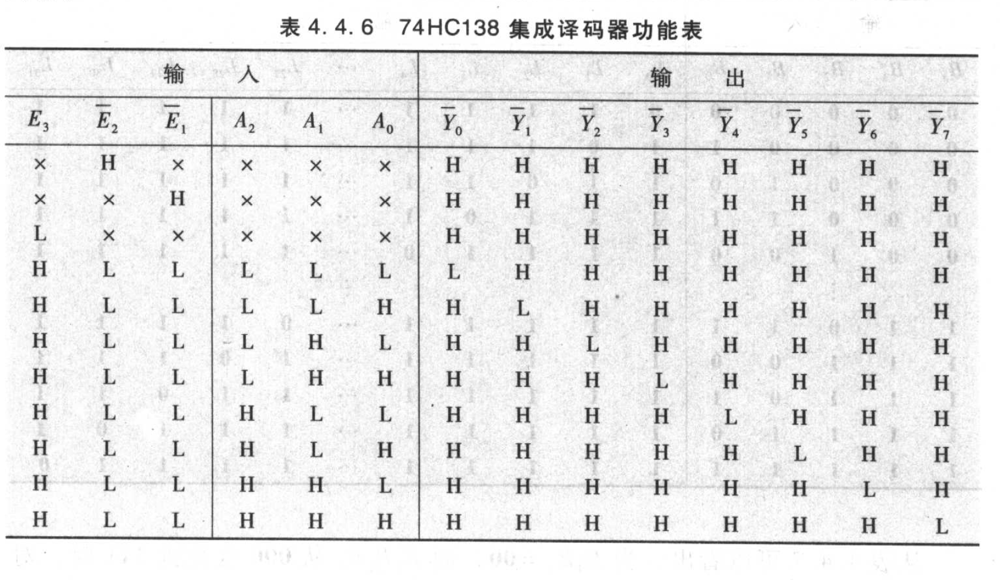

当输入超过 $8421BCD$ 码的表示范围时（即 $1010 \sim 1111$），输出为全部高电平，即没有有效译码输出。

#### 2.3.3. 数据选择器

1. 4选1数据选择器（153）

2. 8选1数据选择器（151）

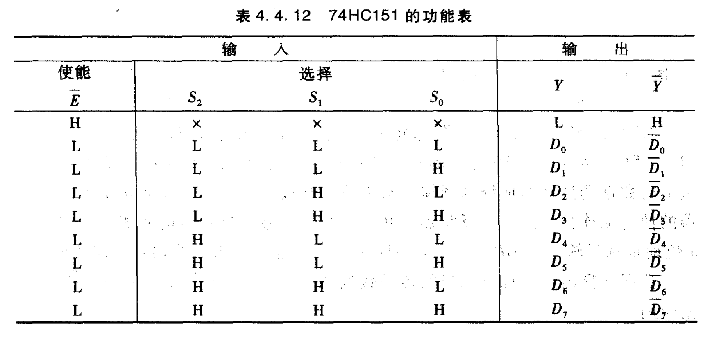

#### 2.3.4. 使能端（片选端）的用途

1. 扩展

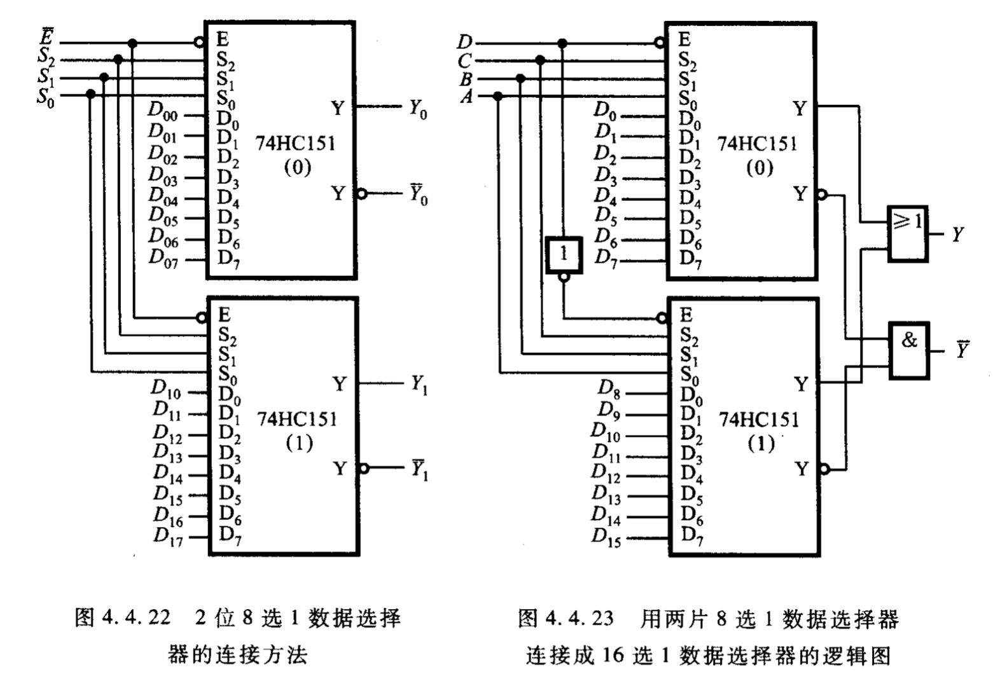

2. 排除冒险

**竞争**：当一个逻辑门电路的两个输入端的信号同时向相反方向变化，而变化的时间有差异的现象，成为竞争。

**冒险**：由竞争而可能产生输出干扰脉冲波形的现象成为冒险。

消去竞争冒险的方法：

1. 发现并消除互补相乘项
2. 增加乘积项以避免互补项相加
3. 输出端并联电容器

## 3. 时序逻辑电路

### 3.1. 锁存器、触发器

1. $SR$ 锁存器

电路有两个输入端，其中S端称为置位（1）端，R端称为复位端或清零（0）端，输出端$Q$和 $\bar{Q}$表达式为

$$
Q = \overline{R + \bar{Q}}
$$

$$
\bar{Q} = \overline{S + Q}
$$

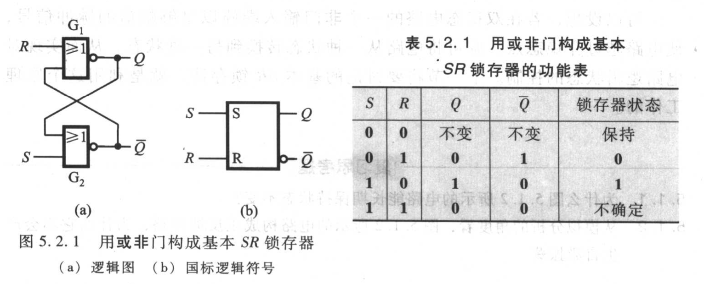

用来实现对输入的存储功能。

2. $D$ 锁存器

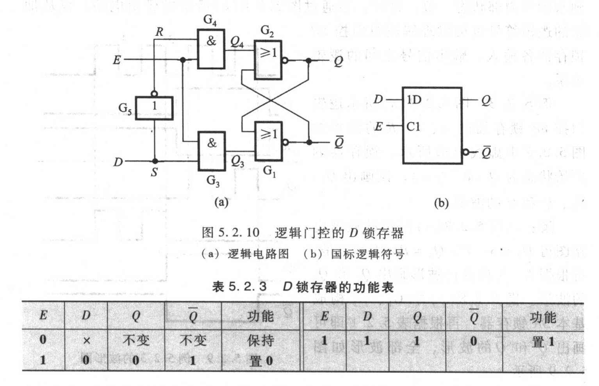

3. 触发

在时钟脉冲边沿作用下的状态刷新称为触发，具有这种特性的存储单元电路称为触发器。

4. $D$触发器

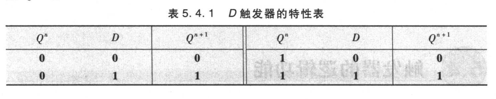

特性方程：

$$
Q ^ {n + 1} = D
$$

5. $JK$触发器

$$
Q ^ {n + 1} = J \bar{Q^n} + \bar{K} Q^n
$$

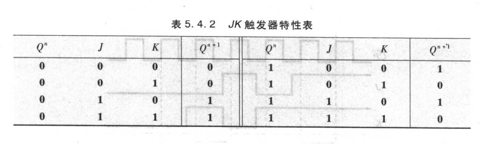

- $J= 1, K = 0$时，触发器的下一状态被置 $1$
- $J= 0, K = 1$时，触发器的下一状态被置 $0$
- $J= 0, K = 0$时，触发器状态保持不变
- $J= 1, K = 1$时，触发器翻转

6. $T$ 触发器

$Toggle$触发器，当控制信号 $T = 1$ 时，每来一个 $CP$（或$\overline{CP}$）脉冲，它的状态翻转一次；而当 $T = 0$ 时，则保持不变。

$$
Q ^ {n + 1} = T \overline{Q^n} + \bar{T} Q^n = T \oplus Q^n
$$

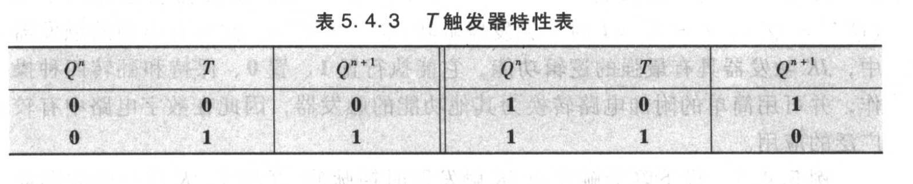

7. $T'$ 触发器

当 $T$ 触发器的 $T$ 输入端固定接高电平时（即T= 1），则

$$
Q ^ {n + 1} = \overline{Q^n}
$$

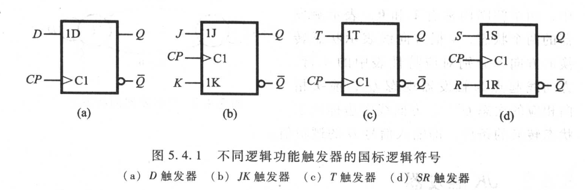

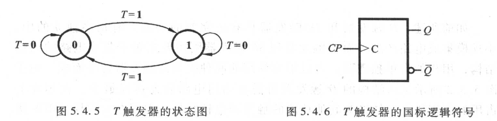

画时序图，时序脉冲（上升沿\下降沿）触发，对齐线。

初态，有时画时序图可以加入中间参量的波形。

### 3.2. 同步时序逻辑电路分析

一般步骤：

1. 分析逻辑图。
2. 对应每个输出变量导出输出方程，组成输出方程组。
3. 对每个触发器导出激励方程，组成激励方程组。
4. 将各触发器的激励方程带入相应触发器的特性方程，得到各触发器的状态方程，从而组成状态方程组。
5. 根据状态方程组和输出方程组，列出电路的状态表，画出状态图和时序图。
6. 确定电路的逻辑功能，必要的话，可用文字详细描述。
7. 如果有无效状态，检查能否自启动。

### 3.3. 异步时序逻辑电路分析

### 3.4. 同步时序逻辑电路设计

一般步骤：

1. 由给定的逻辑功能建立原始状态图和原始状态表
2. 状态化简
3. 状态分配
4. 选择触发器类型
5. 确定激励方程组和输出方程组
6. 画出逻辑图并检查自启动能力

### 3.5. 74161应用

74LVC161是4位同步二进制加计数器。

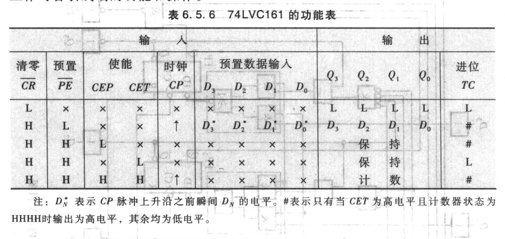

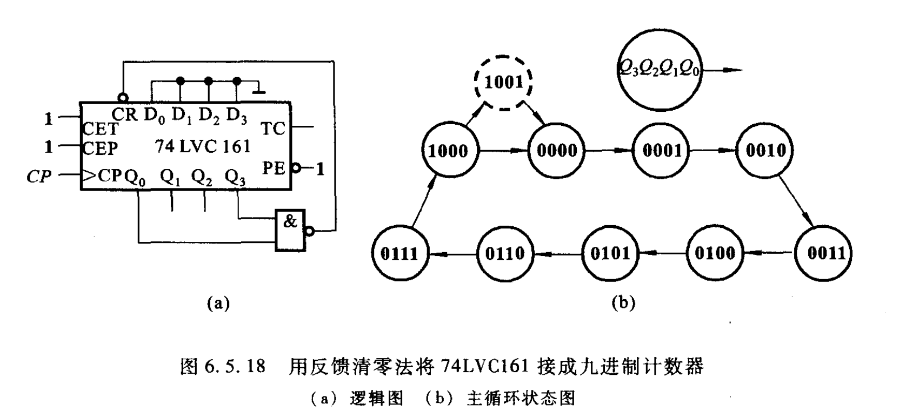

## 4. 脉冲波形的产生与变换

### 4.1. 单稳态触发器

单稳态触发器具有如下的工作特性：

1. 没有触发脉冲作用时电路处于一种稳定状态。
2. 在触发脉冲作用下，电路由稳态翻转到暂稳态。暂稳态是一种不能长久保持的状态。
3. 由于电路中 $RC$ 延时环节的作用，电路的暂稳态在维持一段时间后，会自动返回到稳态。暂稳态的持续时间决定于电路中的 $RC$ 参数值。

### 4.2. 施密特触发器

施密特触发器在电子电路中常用来完成波形变换、幅度鉴别等工作。

### 4.3. 多谐振荡器

多谐振荡器是一种在接通电源后，就能产生一定频率和一定幅值矩形波的自激振荡器，常作为脉冲信号源。由于多谐振荡器在工作过程中没有稳定状态，故又称为无稳态电路。

### 4.4. 555定时器及其应用

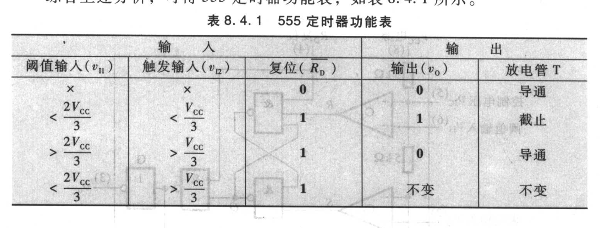
