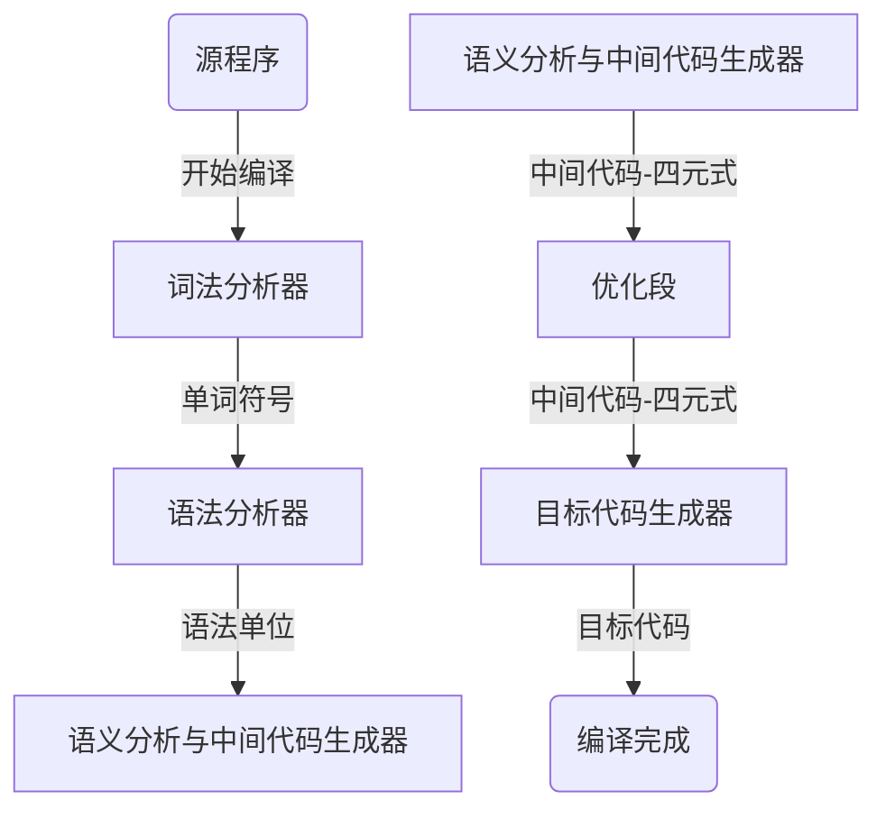
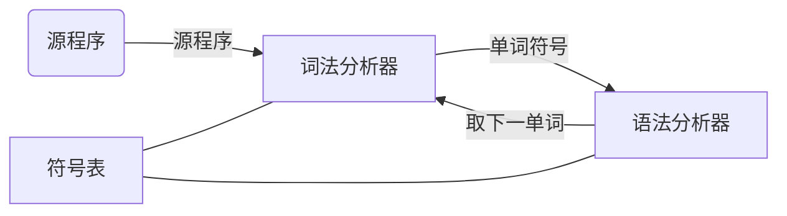

词法分析
===

目录
---

[TOC]

---

## 1. 编译流程

```mermaid
graph TB
    A(源程序) -->|开始编译| B[词法分析器]
    B --> |单词符号|C[语法分析器]
    C -->|语法单位| D[语义分析与中间代码生成器]
    W[语义分析与中间代码生成器] -->|中间代码-四元式| E[优化段]
    E -->|中间代码-四元式| F[目标代码生成器]
    F -->|目标代码|G(编译完成)

```

### 词法分析器的协作

```mermaid
graph LR
    O(源程序) --> |源程序|A
    A[词法分析器] -->|单词符号| B[语法分析器]
    B --> |取下一单词|A
    C[符号表] --- A
    C[符号表] --- B

```
