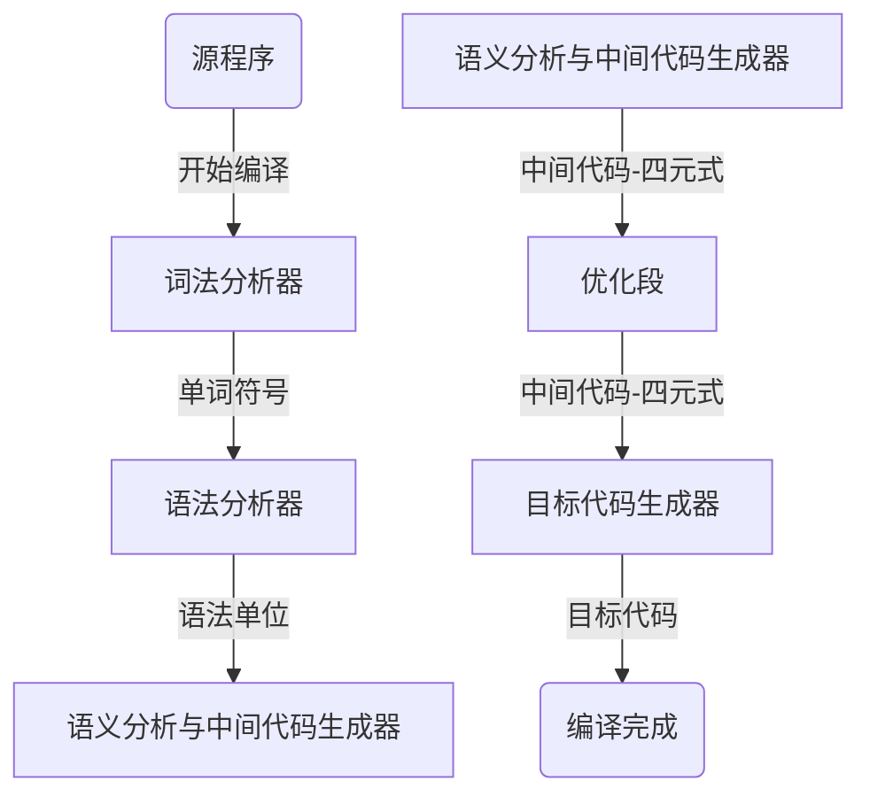
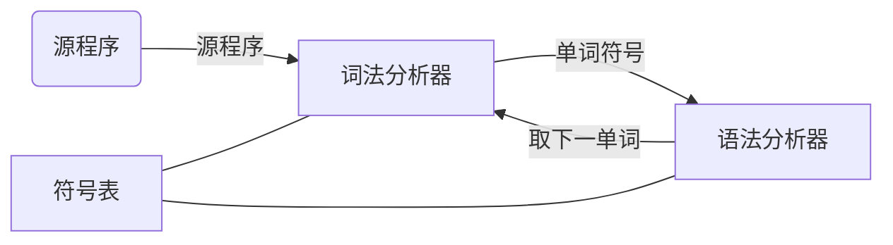
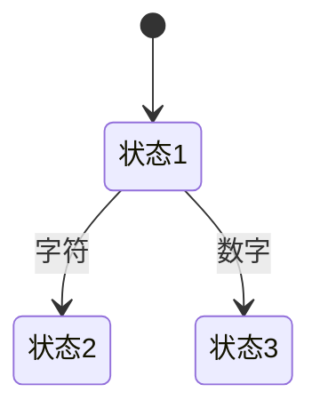

词法分析
===

目录
---

[TOC]

---

## 1. 背景

今天学习了编译原理中的`词法分析`这一章节，我参考了国防工业出版社[《编译原理》](https://baike.baidu.com/item/编译原理/3668951?fr=aladdin)教材[1](#bib-1) 和中国大学MOOC-[国防科技大学《编译原理》](https://www.icourse163.org/course/NUDT-1003101005)的PPT，整理了这一章的内容，希望能够理解这部分的知识。

## 2. 词法分析

### 2.1. 编译流程

$$
\text{Figure 1. 编译流程}
$$

### 2.2. 词法分析的任务

- 词法分析的任务
    - 从左至右逐个字符地对源程序进行扫描，产生一个个单词符号
- 词法分析器(Lexical Analyzer)
    - 扫描器(Scanner)
    - 执行词法分析的程序

### 2.3. 词法分析器的功能

- 功能
    - 输入源程序、输出单词符号
- 单词符号的种类
    - **基本字**:如 begin，repeat，for，...
    - **标识符**:用来表示各种名字，如变量名、数组名和过程名
    - **常数**:各种类型的常数
    - **运算符**: $ +，-，*，/， \cdots $
    - **界符**:逗号、分号、括号和空白

### 2.4. 词法分析器的输出

- 输出的单词符号的表示形式
    - (**单词种别，单词自身的值**)
- 单词种别通常用整数编码表示
    - 若一个种别只有一个单词符号，则种别编码就代表该单词符号。假定**基本字、运算符**和**界符**都是一符一种。
    - 若一个种别有多个单词符号，则对于每个单词符号，给出种别**编码**和**自身的值**。
        - **标识符**单列一种;标识符自身的值表示成按机器字节划分的内部码
        - **常数**按类型分种;常数的值则表示成标准的二进制形式

### 2.5. 词法分析器在编译器中地位

$$
\text{Figure 2. 词法分析器在编译器中地位}
$$

## 3. 词法分析器的设计

### 3.1. 输入、预处理

词法分析器工作的第一步是输入源程序文本。输入串一般是放在一个缓冲区中，这个缓冲区称`输入缦冲区`。词法分析的工作（单词符号的识别）可以直接在这个`缓冲区`中进行。但在许多情况下，把输入串预处理一下，对单词符号的识别工作将是比较方便的。

我们可以设想一个`预处理子程序`，它能够完成去除空白符、换行符和注释还有合并界符等任务。

每当词法分析器调用它时，它就处理出一串确定长度（如120个字符）的输入字符，并将其装进词法分析器所指定的缓冲区中（称为`扫描缓冲区`）。这样，分析器就可以在此缓冲区中直接进行单词符号的识别，而不必管其他繁琐事物。

$$
\text{Figure 3. 词法分析器的结构}
$$

分析器对扫描缓冲区进行扫描时一般用两个`指示器`，一个指向当前正在识别的单词的`开始位置`（指向新单词的首字符），另一个用于向前搜索以寻找单词的终点。

不论`扫描缓冲区`设得多大都不能保证单词符号不会被它的边界所打断。因此，扫描缓冲区最好使用一个`一分为二的区域`。并对标识符和常数的长度`加以限制`（例如，不得多于120个字符）。否则，即使缓冲区再大也无济于事。

$$
\text{Figure 4. 扫描缓冲区}
$$

### 3.2. 超前搜索

- 定义：词法分析过程中，有时为了确定词性，需超前扫描若干个字符。

如以下FORTRAN语句，用户可以重新定义关键字，编译器就需要超前扫描都关键字后的数字格式才能知道其词性。

$$
\text{Figure 5. 超前搜索}
$$

除了关键字需要超前搜索，标识符、常数、算符和界符等也可能会需要超前搜索。

1. 标识符识别

字母开头的字母数字串，后跟界符或算符

2. 常数识别

识别出算术常数并将其转变为二进制内码表示，如

$$
5.EQ.M
$$

$$
5.E08
$$

3. 算符和界符的识别

把多字符组成的算符和界符拼合成一个单词符号

$$
:=， **， .EQ. ， ++，--，>=
$$

---

由于超前搜索这个问题的存在，现在的编程语言大多加入了一些限制，从而避免超前搜索。

1. 所有基本字都是保留字;用户不能用它们作自己的标识符
2. 基本字作为特殊的标识符来处理，使用保留字表
3. 如果基本字、标识符和常数(或标号)之间没有确定的运算符或界符作间隔，则必须使用一个空白符作间隔，如：

$$
DO99K=1，10
$$

要写成

$$
DO \hspace*{0.2cm} 99 \hspace*{0.2cm} K=1，10
$$

## 4. 状态转换图

使用状态转换图是设计词法分析器的一种好途径。转换图是一张有限方向图，可用于识别(或接受)一定的字符串。

在状态转换图中，

- 节点代表状态，用圆圈表示
- 状态之间用箭弧连接。箭弧上的标记（字符）代表在射出结点（即箭弧始结点）状态下可能出现的输出字符或字符类
- 一张转换图只包含有限个状态，其中有一个为初态，至少要有一个终态

例如，图6表示，从初态进入状态1，若读入字符则进入状态2，若读入数字则进入状态3。

$$
\text{Figure 6. 状态转换图}
$$

图7中终态节点右上角的星号表示读入其他字符后需要回退到上一个输入，即最终识别出的结果不包含除数字以外的其他字符。

$$
\text{Figure 7. 识别整常数的状态转换图}
$$

图8是一个词法分析器的设计示例

$$
\text{Figure 8. 词法分析器的设计示例}
$$

_注：部分内容整理自国防工业出版社[《编译原理》](https://baike.baidu.com/item/编译原理/3668951?fr=aladdin)教材和中国大学MOOC-[国防科技大学《编译原理》](https://www.icourse163.org/course/NUDT-1003101005)PPT_

## 5. 参考文献

[1] 陈火旺. 编译原理 [M]. 北京 : 国防工业出版社, 2010.

---

联系邮箱：curren_wong@163.com

Github：[https://github.com/CurrenWong](https://github.com/CurrenWong)

欢迎转载/Star/Fork，有问题欢迎通过邮箱交流。
