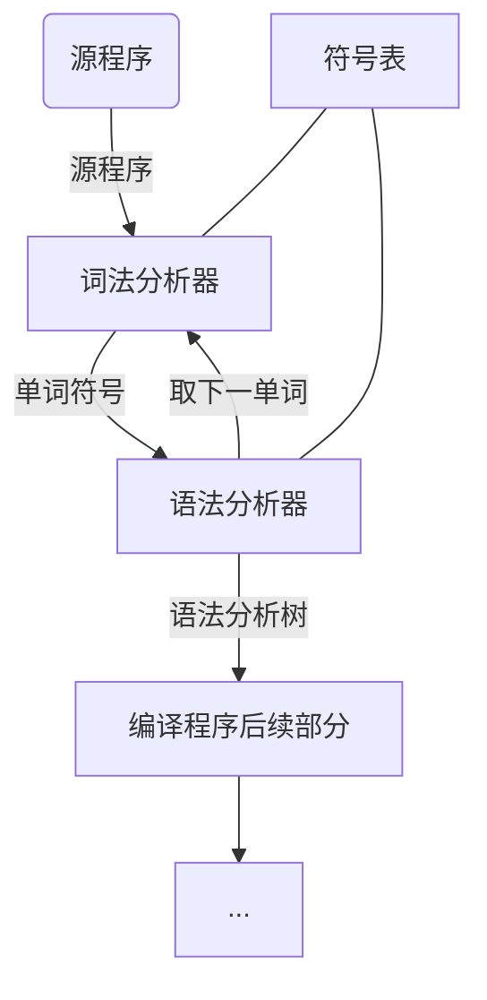

语法分析-自上而下分析的基本问题
===

目录
---

[TOC]

## 1. 背景

今天学习了编译原理中的`语法分析-自上而下分析的基本问题`这一章节，我参考了国防工业出版社[《编译原理》](https://baike.baidu.com/item/编译原理/3668951?fr=aladdin)教材[<sup>1</sup>](#bib-1) 和中国大学MOOC-[国防科技大学《编译原理》](https://www.icourse163.org/course/NUDT-1003101005)的PPT，整理了这一章的内容，希望能够理解这部分的知识。

## 2. 语法分析

### 2.1. 语法分析的前提

- 对语言的语法结构进行描述

1. 采用**正规式**和**有限自动机**描述和识别语言的**单词符号**

2. 用**上下文无关文法**来描述语法规则

### 2.2. 语法分析的任务

- 语法分析的任务
    - 分析一个文法的句子的结构

- 语法分析器的功能
    - 按照文法的产生式(语言的语法规则)，识别输入符号串是否为一个句子(合式程序)  

### 2.3. 语法分析器在编译器中的地位



### 2.4. 语法分析的方法

#### 2.4.1. 自下而上(Bottom-up)

- 定义：从输入串开始，逐步进行归约，直到文法的开始符号

- 归约：根据文法的产生式规则，把串中出现的产生式的右部替换成左部符号

- 特点：从树叶节点开始，构造语法树

- 方法：算符优先分析法、LR分析法

#### 2.4.2. 自上而下(Top-down)

- 定义：从文法的开始符号出发，反复使用各种产生式，寻找"匹配"的推导

- 推导：根据文法的产生式规则，把串中出现的产生式的左部符号替换成右部

- 特点：从树的根开始，构造语法树

- 方法：递归下降分析法、预测分析程序

### 2.5. 自上而下分析方法的问题

#### 2.5.1. 文法左递归问题

- 定义：一个文法是含有左递归的，如果存在非终结符P

$$
P \Rightarrow P \alpha
$$

含有左递归的文法使上述的自上而下分析过程陷入无限循环。

#### 2.5.2. 回溯问题

- 定义：分析过程中，当一个非终结符用某一个候选匹配成功时，这种匹配可能是暂时的。出错时，不得不“**回溯**”。


## 3. 消除文法的左递归

### 3.1. 直接左递归的消除

- 假定P关于的全部产生式是

$$
P - P \alpha_1 | P \alpha_2 | \cdots | P \alpha_m | \beta_1 | \beta_2|\cdots|\beta_n
$$

(每个$\alpha$都不等于$\epsilon$，每个$\beta$都不以$P$开头)

- 左递归变右递归

$$
P \rightarrow \beta_1 P' | \beta_2 P' | \cdots | \beta_n P'
$$

$$
P' \rightarrow \alpha_1 P' | \alpha_2 P' |\cdots | \alpha_m P' | \epsilon
$$

### 3.2. 间接左递归的消除

- 间接左递归定义：给定文法$G(S)$:

$$
S\rightarrow Qc|c
$$

$$
Q\rightarrow Rb|b
$$

$$
R\rightarrow Sa|a
$$

虽然不存在直接左递归，但$S、Q、R$都是左递归的，例如有

$$
S \Rightarrow Qc \Rightarrow Rbc \Rightarrow Sabc
$$

---

- 一个文法消除左递归的条件
    - 不含以ε为右部的产生式
    - 不含回路$P \Rightarrow P$

---

- 消除左递归的算法：

1. 把文法G的所有非终结符按任一种顺序排列$P_1， P_2，\cdots，P_n；$
2. 按此顺序执行如下伪代码

```cpp
FOR i:=1 TO n DO
BEGIN
    FOR j:=1 TO i-1 DO
        (1)
    (2)
END
```

_(1) 把形如$P_i \rightarrow P_j \gamma$的规则改写成$Pi \rightarrow \delta_1 \gamma | \delta_2 \gamma | … | \delta_k \gamma ;$_

_( 其中$P_j \rightarrow \delta_1 | \delta_2 | \cdots | \delta_k$是关于$P_j$的所有规则 )_

_(2) 消除关于$P_i$规则的直接左递归性_

3. 化简由 2 所得的文法，去除从开始符号出发永远无法到达的非终结符的产生规则。

---

- 举例：给定文法$G(S)$如下

$$
S\rightarrow Qc|c
$$

$$
Q\rightarrow Rb|b
$$

$$
R\rightarrow Sa|a
$$

1. 将非终结符排序为$R、Q、S$。对于 $R$，不存在直接左递归。
2. 把 $R$带入到 $Q$ 的有关候选后，我们把 $Q$ 的规则变为

$$
Q\rightarrow Sab|ab|b
$$

现在 $Q$ 同样不包含直接左递归，把它带入到 $S$ 的有关候选后，$S$ 变成

$$
S \rightarrow Sabc|abc|bc|c
$$

接着消除 $S$ 的直接左递归，最后得到的文法为

$$
S \rightarrow abcS'|bcS'|cS'
$$

$$
S' \rightarrow abcS' | \epsilon
$$

$$
Q\rightarrow Sab|ab|b
$$

$$
R\rightarrow Sa|a
$$

3. 显然，其中关于$Q$ 和$R$ 的规则已经多余了，我们可以对它们进行化简，最后得到的结果如下。

$$
S \rightarrow abcS'|bcS'|cS'
$$

$$
S' \rightarrow abcS' | \epsilon
$$

- _注意：由于对非终结符排序的不同，最后所得的文法在形式上可能不一样。但不难证明，它们都是等价的。_

## 4. 消除回溯

- 条件：
    - 对文法的任何非终结符，当要它去匹配输入串时，能够根据它所面临的输入符号准确地指派它的一个候选去执行任务，并且此候选的工作结果应是确信无疑的。

即假设现在轮到非终结符 $A$ 去执行匹配任务，$A$ 共有 $n$ 个候选，即

$$
A \rightarrow \alpha_1| \alpha_2| \cdots | \alpha_n
$$

$A$ 面临一个输入符号 $x$时，如果输入串是一个合法的句子，那么 $A$ 能够指派某个唯一确定的候选 $\alpha_i$ 来匹配 $x$，若不能匹配 $x$，说明输入串不是合法的句子。

### 4.1. FIRST集合

- 定义：令 $G$ 是一个不含左递归的文法，对 $G$ 的所有非终结符的每个候选 $\alpha$ 定义它的终结首符集$FIRST(\alpha)$为：

$$
FIRST(\alpha) = \{ a| \alpha \Rightarrow a, \cdots  a \in V_T \}
$$

特别是，若 $a \Rightarrow \epsilon$, 则规定:

$$
\epsilon \in FIRST(\alpha)
$$

换句话说，$FIRST(\alpha)$是$\alpha$ 的所以可能推导的开头终结符 或可能的 $\epsilon$ 。 如果非终结符 $A$ 的所有候选首符集两两不相交，即 $A$ 的任何两个不同候选 $\alpha_i$ 和 $\alpha_j$

$$
FIRST(\alpha_i) \bigcap FIRST(\alpha_j) = \varnothing
$$

那么，当要求 $A$ 匹配输入串时，$A$ 就能根据它所面临的第一个输入符号$a$，准确地指派某一个候选前去执行任务。这个候选就是那个终结首符集含 $a$ 的 $\alpha$.

### 4.2. 提取公共左因子

假定关于A的规则是

$$
A \rightarrow \delta \beta_1 | \delta \beta_2 | …| \delta \beta_n | \gamma_1 | \gamma_2 | … | \gamma_m
$$

(其中，每个$\gamma$ 不以$\delta$开头)

那么，可以把这些规则改写成

$$
A \rightarrow \delta A' | \gamma_1 | \gamma_2 | \cdots | \gamma_m
$$

$$
A' \rightarrow \beta_1 | \beta_2 | \cdots | \beta_n
$$

经过反复提取左因子，就能够把每个非终结符(包括新引进者)的所有候选首符集变成为两两不相交。

如果空字 $\epsilon$ 属于某个非终结符的候选首符集，那么问题就比较复杂。引入Follow集合。

### 4.3. FOLLOW集合

假定$S$是文法$G$的开始符号，对于$G$的任何非终结符$A$，我们定义$A$的FOLLOW集合

$$
FOLLOW(A) = \{a|S \Rightarrow ...Aa..., a \in V_T \}
$$

特别是，若

$$
S \Rightarrow \cdots A
$$

则规定

$$
\# \in FOLLOW(A)
$$

表示若$A$在句子的末尾，则标示句子末尾的$\#$ 在 $A$的 $Follow$ 集合中。

_注：部分内容整理自国防工业出版社[《编译原理》](https://baike.baidu.com/item/编译原理/3668951?fr=aladdin)教材和中国大学MOOC-[国防科技大学《编译原理》](https://www.icourse163.org/course/NUDT-1003101005)PPT_

## 5. 参考文献

<div id="bib-1"></div>

[1] 陈火旺. 编译原理 [M]. 北京 : 国防工业出版社, 2010.

---

联系邮箱：curren_wong@163.com

Github：[https://github.com/CurrenWong](https://github.com/CurrenWong)

欢迎转载/Star/Fork，有问题欢迎通过邮箱交流。
