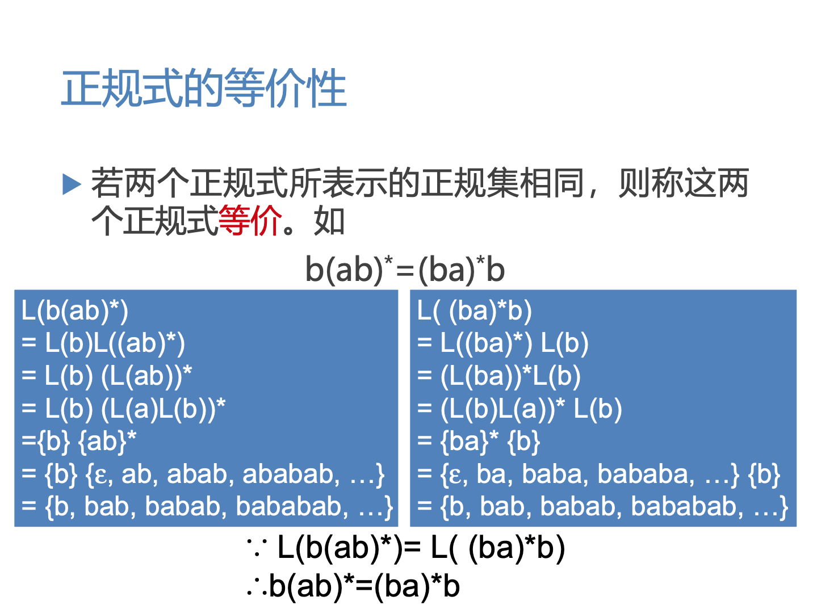
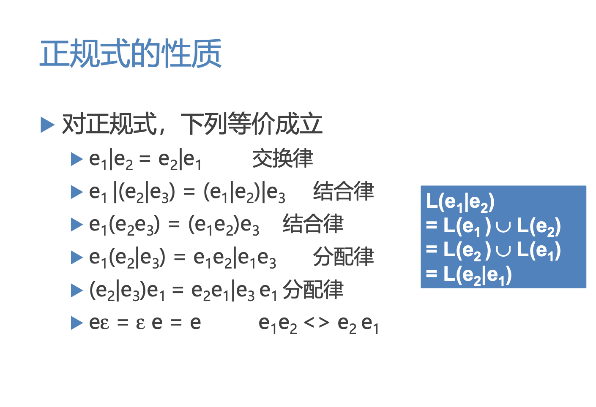

词法分析
===

目录
---

[TOC]

---

## 1. 背景

今天学习了编译原理中的`语法分析-自上而下分析的基本问题`这一章节，我参考了国防工业出版社[《编译原理》](https://baike.baidu.com/item/编译原理/3668951?fr=aladdin)教材[1](#bib-1) 和中国大学MOOC-[国防科技大学《编译原理》](https://www.icourse163.org/course/NUDT-1003101005)的PPT，整理了这一章的内容，希望能够理解这部分的知识。

## 2. 正规式和正规集

### 2.1. 定义

对给定的字母表$\sum$

1. $\epsilon$ 和 $\empty$ 都是$\sum$上的正规式，它们所表示的正规集为$\{\epsilon\}$ 和 $\empty$ ;

2. 任何 $a \in \sum$ ，$a$ 是 $\sum$ 上的正规式，它所表示的正规集为 $\{a\}$ ;

3. 假定$e_1$ 和 $e_2$ 都是$\sum$上的正规式，它们所表示 的正规集为$L(e_1)$和$L(e_2)$，则

- $(e_1|e_2)$ 为正规式，它所表示的正规集为$L(e_1) \cup L(e_2)$
- $(e_1 \cdot e_2)$ 为正规式，它所表示的正规集为$L(e_1)$$L(e_2)$
- $(e_1)^*$ 为正规式，它所表示的正规集为 $(L(e_1))^*$仅由有限次使用上述三步骤而定义的表达式才 是$\sum$上的正规式，仅由这些正规式表示的字 集才是$\sum$上的正规集。

### 2.2. 正规式的等价性

$$
\text{Figure 1. 正规式的等价性}
$$

### 2.3. 正规式的性质

$$
\text{Figure 2. 正规式的等价性}
$$

## 3. 确定有限自动机和非确定有限自动机

### 3.1. 确定有限自动机(DFA)

对状态图进行形式化定义 确定有限自动机(Deterministic Finite Automata，DFA) M是一个五元式 M=(S, Σ, f, S0, F)，其中:

1. S: 有穷状态集
视频区域
2. Σ:输入字母表(有穷)
3. f: 状态转换函数，为S×Σ→S的单值部分映射，f(s，
a)=s’表示:当现行状态为s，输入字符为a时，将 状态转换到下一状态s’，s’称为s的一个后继状态
4. S0∈S是唯一的一个初态
5. F⊆S :终态集(可空)

### 3.2. 非确定有限自动机(NFA)

定义:一个非确定有限自动机 (Nondeterministic Finite Automata，NFA) M是一个五元式M=(S, Σ, f, S0, F)，其中:

1. S: 有穷状态集
2. Σ :输入字母表(有穷)
3. f: 状态转换函数，为S×Σ*→2S的部分映射
4. S0⊆S是非空的初态集
5. F ⊆S :终态集(可空)

## 4. 正规式与有限自动机的等价性

### 4.1. 为NFA构造正规式

### 4.2. 为正规式构造NFA

## 5. DFA与NFA的等价性

## 6. NFA转换成DFA

## 7. DFA的化简

_注：部分内容整理自国防工业出版社[《编译原理》](https://baike.baidu.com/item/编译原理/3668951?fr=aladdin)教材和中国大学MOOC-[国防科技大学《编译原理》](https://www.icourse163.org/course/NUDT-1003101005)PPT_

## 8. 参考文献

[1] 陈火旺. 编译原理 [M]. 北京 : 国防工业出版社, 2010.

---

联系邮箱：curren_wong@163.com

Github：[https://github.com/CurrenWong](https://github.com/CurrenWong)

欢迎转载/Star/Fork，有问题欢迎通过邮箱交流。
