DVWA Brute Force Low
====

目录
---

[TOC]

## 1. 背景

最近参加了[2020腾讯安全平台部极客技术挑战赛](https://blog.csdn.net/qq_41729780/article/details/106947350)，获得了一次腾讯绿色通道面试的机会，因此我想要借此机会补充一下网络安全方面的知识，于是就从基础的靶场 DVWA (Damn Vulnerable Web Application) 开始刷起，这一篇是关于暴力破解安全等级为 `Low` 的账号密码的内容。

和我一样希望学习网络安全知识的同学，推荐学习[《Web安全攻防实战》](http://gk.link/a/10jxi)和[《安全攻防技能30讲》](http://gk.link/a/10juL)。

## 2. 准备工作

### 2.1. 靶场环境

首先配置靶场环境，如果想要在本地配置靶场环境，可以参考[github上的教程](https://github.com/ethicalhack3r/DVWA/)，这里推荐大家直接使用`vulnspy`提供的[在线的靶场环境](https://www.vulnspy.com/dvwa/)。

如图1所示，点击右上角的 `Start To Hack` 使用GitHub账号登陆，即可创建靶场环境。

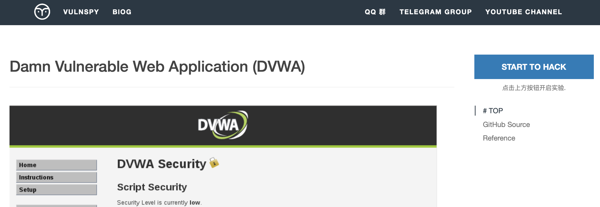

$$
\text{Figure 1. 创建靶场环境}
$$

创建环境以后，在 `LABS` 标签下，点击 `Target Address` 下的链接即可进入环境，一次创建有效期为 `2` 个小时，结束后可以再次创建，最多能够同时创建`5`个实验环境。

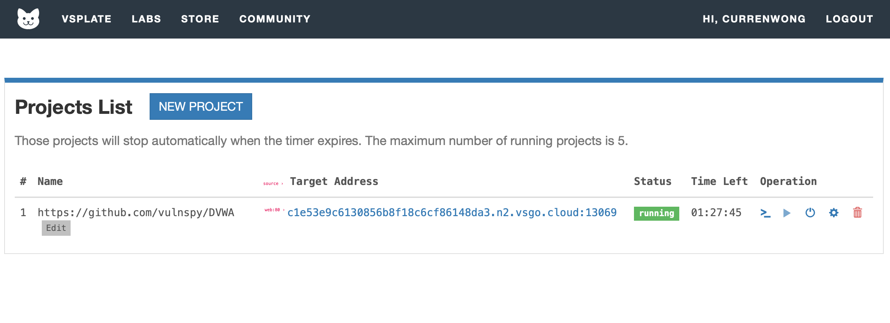

$$
\text{Figure 2. 进入靶场环境}
$$

进入页面以后，账号密码都是默认的，点击登陆。

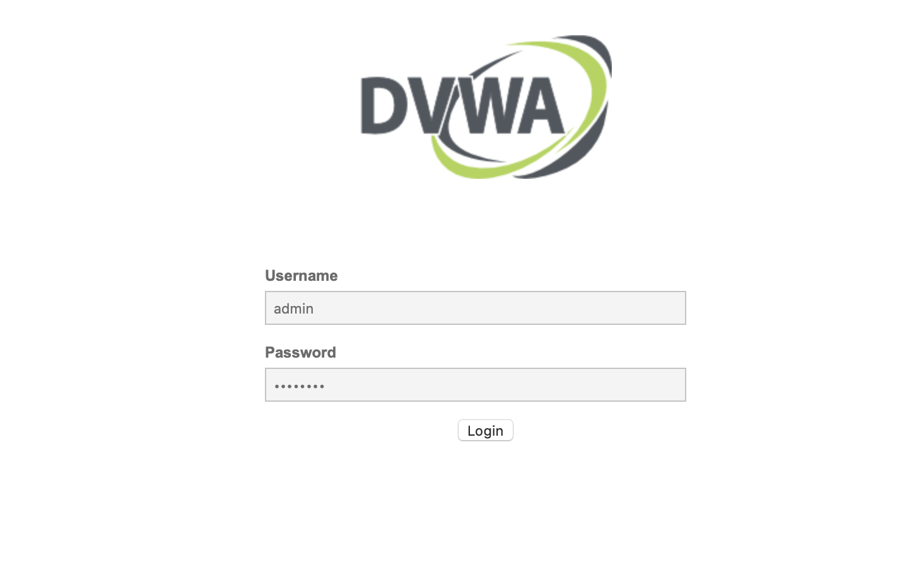

$$
\text{Figure 3. 登陆}
$$

拉到页面底部，点击创建数据库。

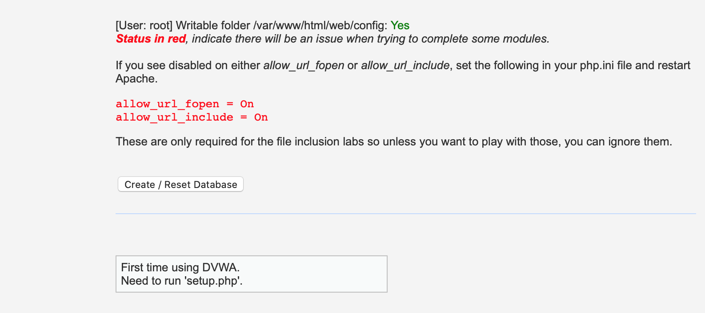

$$
\text{Figure 4. 创建数据库}
$$

创建完成后，会回到登陆页面要求重新登陆，再次登陆即可。

默认的难度是 `impossible`，基本没有安全漏洞，我们要点击左边的 `DVWA Security` 设置难度。

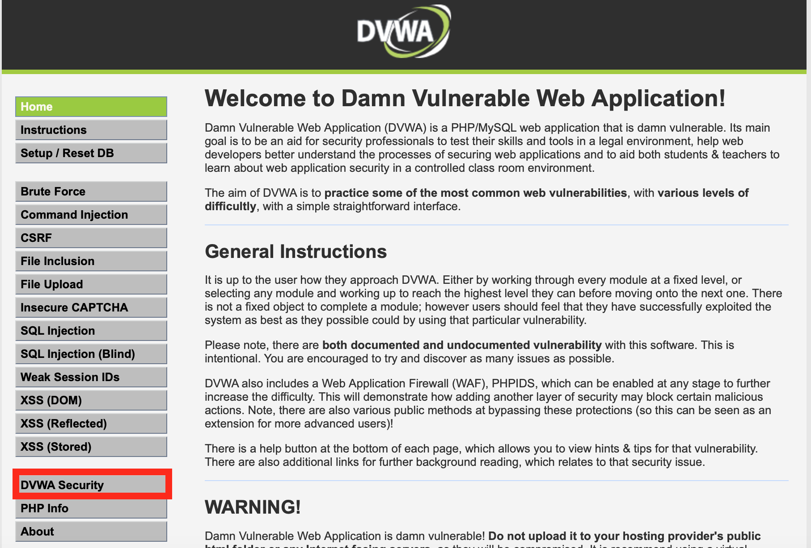

$$
\text{Figure 5. 进入设置难度页面}
$$

页面上也有相应的难度说明，我们先从 `Low` 的难度开始训练。

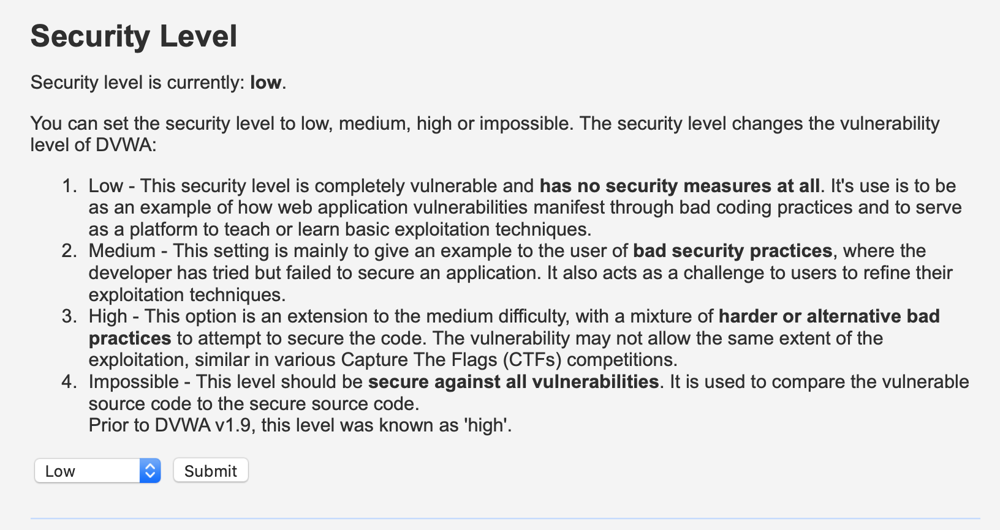

$$
\text{Figure 6. 设置难度为Low}
$$

点击左边的`Brute Force`标签，我们就进入到密码破解的训练页面了。

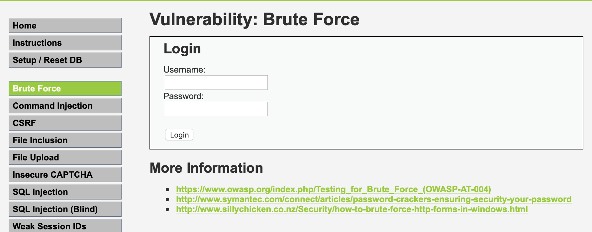

$$
\text{Figure 7. Brute Force}
$$

### 2.2. 安装破解工具

下载 [Burp Suite Community 免费版本](https://portswigger.net/burp/releases/professional-community-2020-5-1?requestededition=community) ，图形界面安装。下载有点慢，`Mac` 系统的同学可以从百度网盘下载。

链接:[https://pan.baidu.com/s/1fXM7uKv2lE5KoEDgCVnazQ](https://pan.baidu.com/s/1fXM7uKv2lE5KoEDgCVnazQ)  密码:x7sj

安装完成以后，就可以开始我们的破解了。

## 3. 破解过程

### 3.1. 代理请求

首先设置浏览器的代理，在`Safari`中操作路径为为`偏好设置 - 高级 - 代理 - 更改设置`，设置HTTP代理，将代理服务器地址设置为`127.0.0.1:8000`。

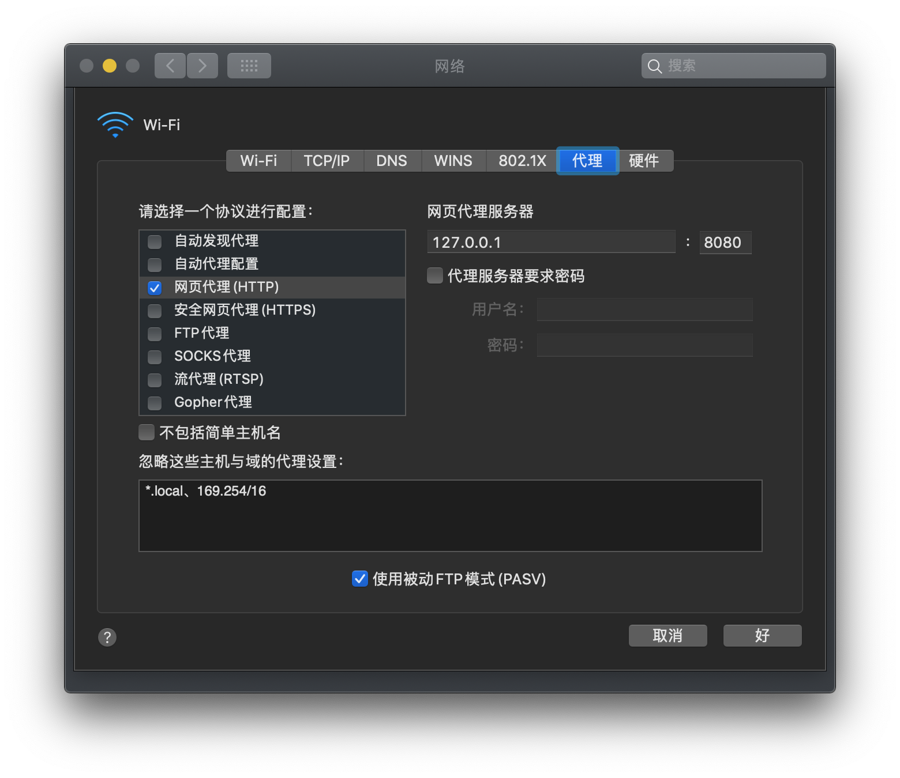

$$
\text{Figure 8. 代理}
$$

与`Proxy - Option`中的设置保持一致。

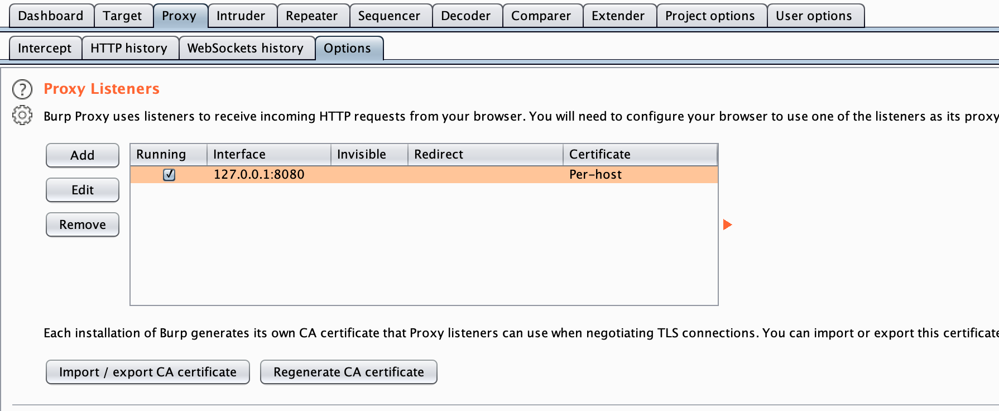

$$
\text{Figure 9. Proxy - Option}
$$

我们再对 `Burp Proxy` 进行一些了解。内容参考自[《Web安全攻防：渗透测试实战指南》](https://m.igetget.com/hybrid/v2/ebook/detail?bid=rEQKv6PKN7rEo2Gxg96ZjApyMvQVlw5OndWXb14PJzDkYaReqd8n5LOmB8d7egBx)中对`Burp Proxy`的介绍。

`Burp Proxy` 是利用 `Burp` 开展测试流程的核心，通过代理模式，可以让我们拦截、查看、修改所有在客户端与服务端之间传输的数据。

`Burp Proxy` 的拦截功能主要由 `Intercept` 选项卡中的 `Forward、Drop、Interception is on/off和Action` 构成，它们的功能如下所示。

- `Forward` 表示将拦截的数据包或修改后的数据包发送至服务器端。
- `Drop` 表示丢弃当前拦截的数据包。
- `Interception is on` 表示开启拦截功能，单击后变为`Interception is off`，表示关闭拦截功能。
- 单击`Action`按钮，可以将数据包进一步发送到`Spider、Scanner、Repeater、Intruder`等功能组件做进一步的测试，同时也包含改变数据包请求方式及其body的编码等功能。

打开浏览器，输入需要访问的`URL`并按回车键，这时将看到数据流量经过`Burp Proxy`并暂停，直到单击 `Forward` 按钮，才会继续传输下去。如果单击了 `Drop` 按钮，这次通过的数据将丢失，不再继续处理。

当 `Burp Suite` 拦截的客户端和服务器交互之后，我们可以在`Burp Suite`的消息分析选项中查看这次请求的实体内容、消息头、请求参数等信息。`Burp`有四种消息类型显示数据包：`Raw、Params、Headers`和`Hex`。

- `Raw` 主要显示`Web`请求的`raw`格式，以纯文本的形式显示数据包，包含请求地址、`HTTP`协议版本、主机头、浏览器信息、`Accept`可接受的内容类型、字符集、编码方式、`cookie`等，可以通过手动修改这些信息，对服务器端进行渗透测试。
- `Params` 主要显示客户端请求的参数信息，包括GET或者POST请求的参数、`cookie`参数。可以通过修改这些请求参数完成对服务器端的渗透测试。
- `Headers` 中显示的是数据包中的头信息，以名称、值的形式显示数据包。
- `Hex` 对应的是Raw中信息的二进制内容，可以通过Hex编辑器对请求的内容进行修改，在进行00截断时非常好用。[1](#bib-1)

---

### 3.2. 拦截请求

接下来我们要开始拦截请求，在 `Burp Suite` 点击`Intercept is off` 中打开请求拦截。

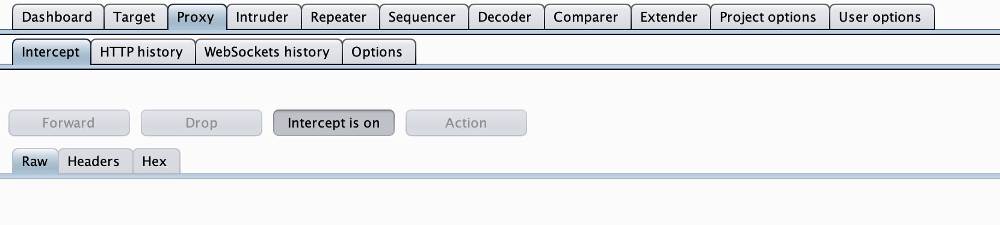

$$
\text{Figure 10. 请求拦截}
$$

在靶场的`Brute Force`页面中输入任意的账号密码，点击登陆。在 `Burp Suite` 的 `Proxy - Intecept` 界面中显示拦截成功，点击 `Intercept is on` 关闭拦截。

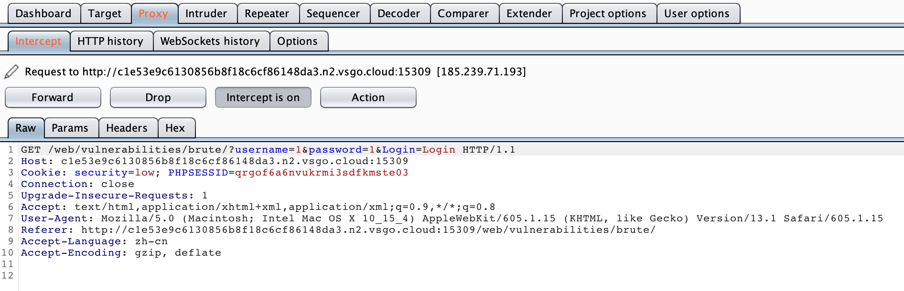

$$
\text{Figure 11. 拦截成功}
$$

在Http History中找到带账号密码的请求。

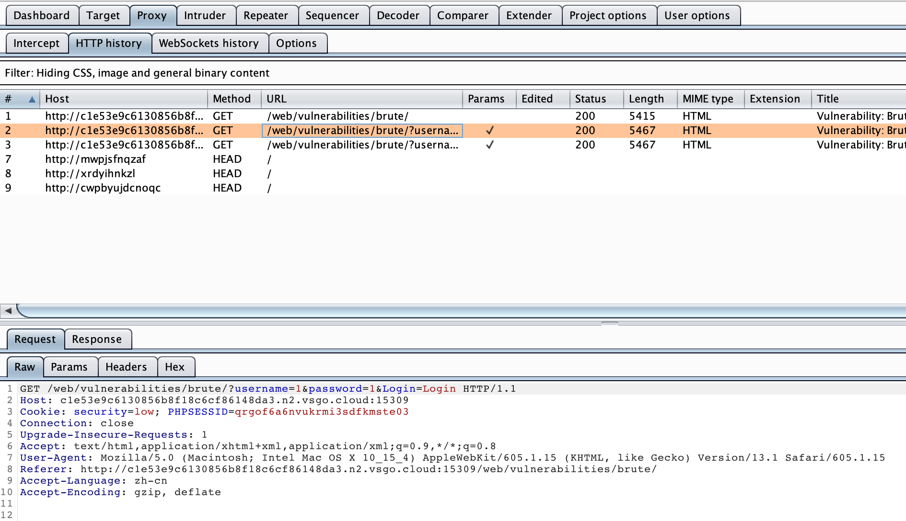

$$
\text{Figure 12. Http History}
$$

全选后，右键选择 `Send To Intruder`。

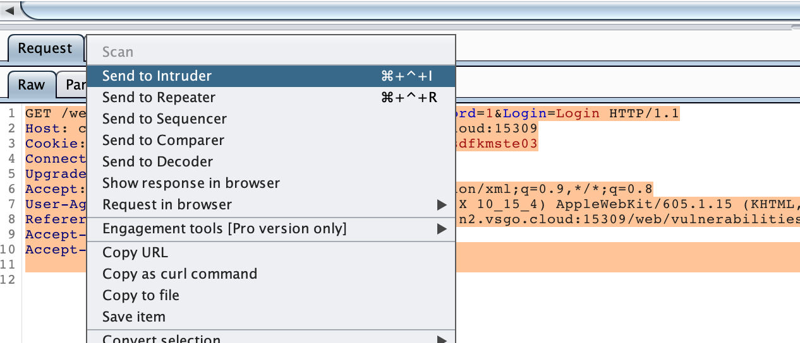

$$
\text{Figure 13. Send To Intruder}
$$

在 `Intruder - 2 - Position` 界面中，将用户名和密码以外的变量去除，选择 `Attack type` 为 `Pitchfork`。

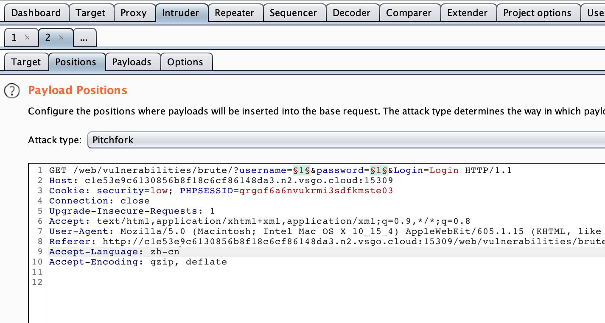

$$
\text{Figure 14. Intruder}
$$

各种模式的区别可以参考[《Web安全攻防：渗透测试实战指南》](https://m.igetget.com/hybrid/v2/ebook/detail?bid=rEQKv6PKN7rEo2Gxg96ZjApyMvQVlw5OndWXb14PJzDkYaReqd8n5LOmB8d7egBx)中的内容，具体如下。

- `Sniper`模式使用**单一**的`Payload`组。它会针对每个位置设置`Payload`。这种攻击类型适用于对常见漏洞中的请求参数单独进行`Fuzzing`测试的情景。攻击中的请求总数应该是`position`数量和`Payload`数量的乘积。
- `Battering ram`模式使用**单一**的`Payload`组。它会重复`Payload`并一次性把所有相同的`Payload`放入指定的位置中。这种攻击适用于需要在请求中把相同的输入放到多个位置的情景。请求的总数是`Payload`组中`Payload`的总数。
- `Pitchfork`模式使用**多个**`Payload`组。攻击会同步迭代所有的`Payload`组，把`Payload`放入每个定义的位置中。这种攻击类型非常适合在不同位置中需要插入不同但相似输入的情况。请求的数量应该是最小的`Payload`组中的`Payload`数量。
- `Cluster bomb`模式会使用**多个**`Payload`组。每个定义的位置中有不同的`Payload`组。攻击会迭代每个`Payload`组，每种`Payload`组合都会被测试一遍。这种攻击适用于在位置中需要不同且不相关或者未知输入攻击的情景。攻击请求的总数是各`Payload`组中`Payload`数量的乘积。[1](#bib-1)

---

### 3.3. 填装弹药

要通过暴力来破解密码，遍历所有符号的排列组合是比较低效的，因为每种情况并非等可能地出现，人们为了要记忆自己的密码，一般都会遵循某些规律，比如在密码中包含姓名、生日等等字段。所以我们就需要一份包含高频用户名和密码的词典作为弹药，从而对系统进行轰炸。

我选择的是[Github上的SecLists项目](https://github.com/danielmiessler/SecLists)，上面有许多在暗网或者其他渠道泄露出来的用户名和密码，有些按照频率进行了排序，更加方便我们使用。

我也选了一些放在了百度网盘上。

链接:[https://pan.baidu.com/s/1NbOkmIbhBXOvejwSyoCF2A](https://pan.baidu.com/s/1NbOkmIbhBXOvejwSyoCF2A)  密码:74gz

在这里我使用的是 `xato-net-10-million-passwords-dup.txt` 和 `xato-net-10-million-usernames-dup.txt` 两份基于频率排序的词典。

在 `Payload` 界面通过`Load`按钮将词典引入，`Payload set 为 1 时`引入的是**账号**，`Payload set 为 2 时`引入的是**密码**。

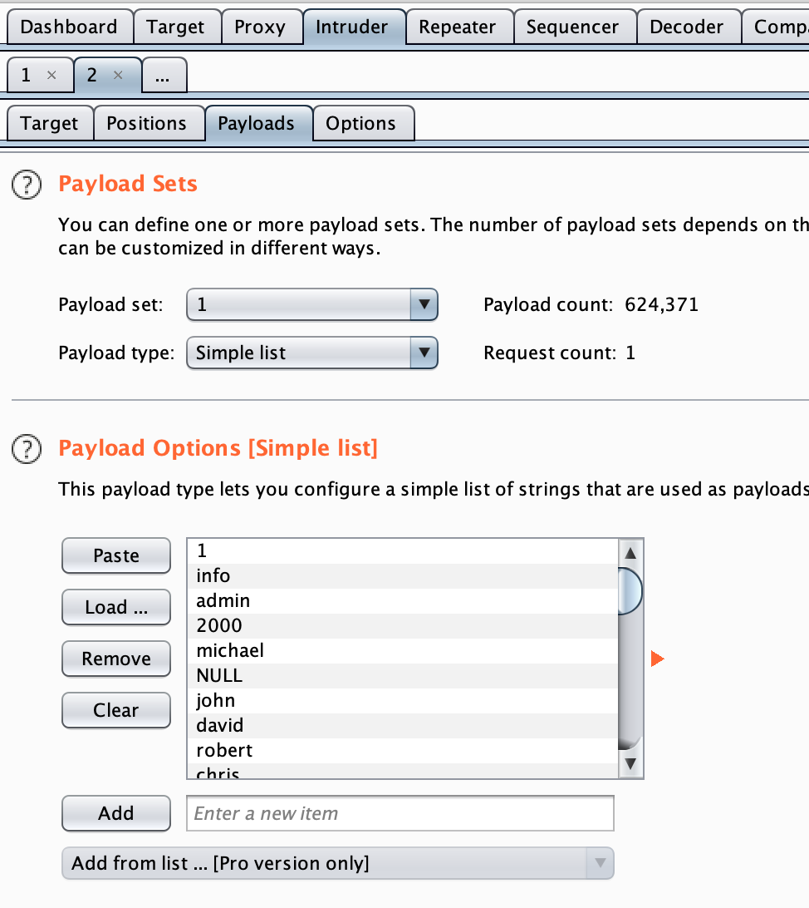

$$
\text{Figure 15. Payload}
$$

### 3.4. 设置岗哨

填装好弹药以后，我们还需要知道在什么情况下破解算成功了。我们先随意填写一次账号密码，发现当用户名或密码错误时，页面会显示`Username and/or password incorrect.` 那么当页面没有显示这条信息时，说明我们破解成功了。

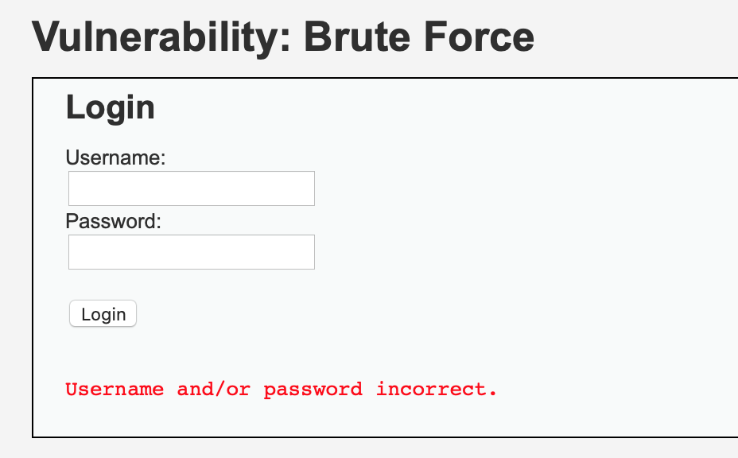

$$
\text{Figure 16. Incorrect Page}
$$

所以我们要在`Intruder - 2 - Option - Grep Match` 中添加 `incorrect` 关键词，并且勾选`Flag`。

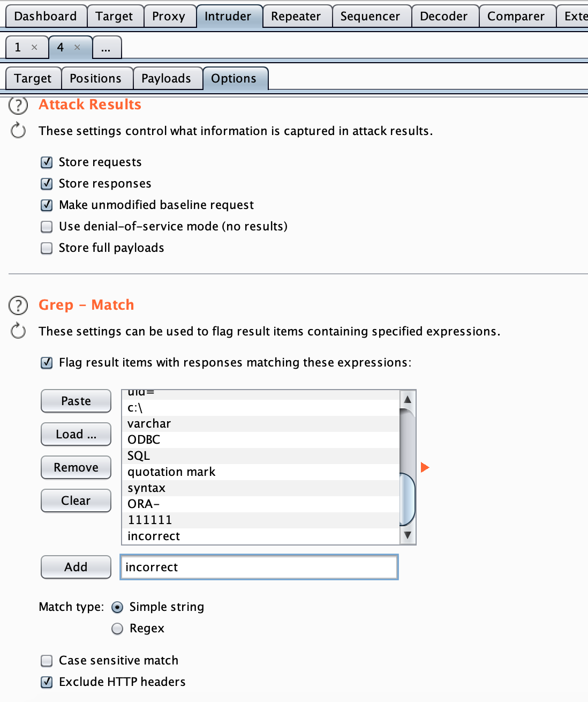

$$
\text{Figure 17. Grep Match}
$$

### 3.5. 开始攻击

接下来，在 `Payload` 界面点击 `Start Attack` 开始攻击。点击后会有一个提示说免费版的攻击时长受限，点 `OK` 即可。

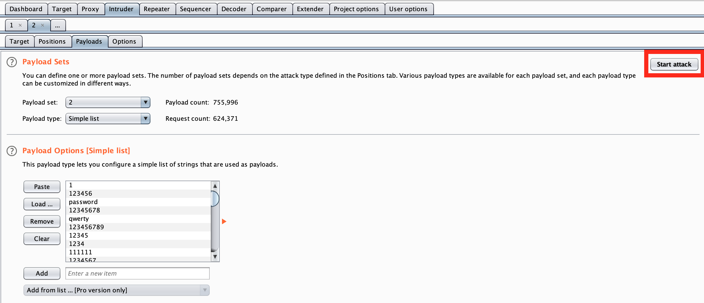

$$
\text{Figure 18. Attack}
$$

很快，我们就发现了有一条攻击请求的 `Response` 中没有`incorrect` 关键词。

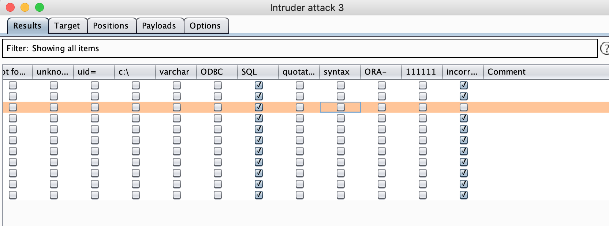

$$
\text{Figure 19. Sign}
$$

查看该次攻击的账号密码，发现其账号为 `admin`，密码为`password`。到此，我们就成功地通过暴力方式破解了`DVWA Brute Force` 安全等级为 `Low` 的密码。

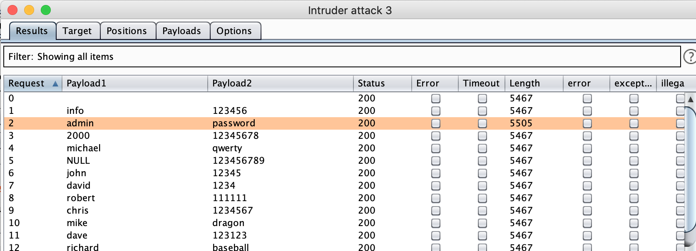

$$
\text{Figure 20. Password}
$$

## 4. 参考文献

[1] [徐焱, 李文轩, 王东亚. Web 安全攻防:渗透测试实战指南 [M]. 北京: 电子工业出版社, 2018.](https://m.igetget.com/hybrid/v2/ebook/detail?bid=rEQKv6PKN7rEo2Gxg96ZjApyMvQVlw5OndWXb14PJzDkYaReqd8n5LOmB8d7egBx)

---

**联系邮箱**：curren_wong@163.com

**CSDN**：[https://me.csdn.net/qq_41729780](https://me.csdn.net/qq_41729780)

**知乎**：[https://zhuanlan.zhihu.com/c_1225417532351741952](https://zhuanlan.zhihu.com/c_1225417532351741952)

**公众号**：**复杂网络与机器学习**

欢迎关注/转载，有问题欢迎通过邮箱交流。

