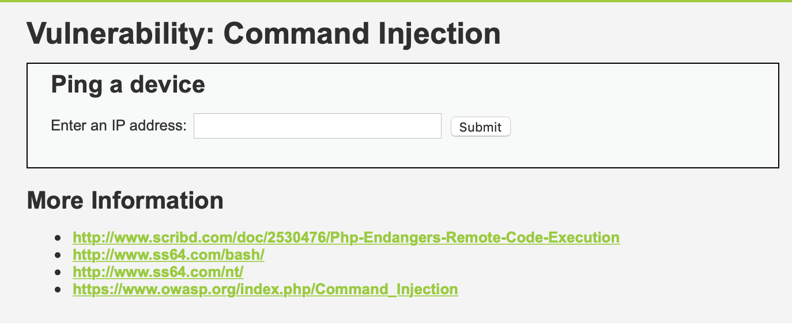
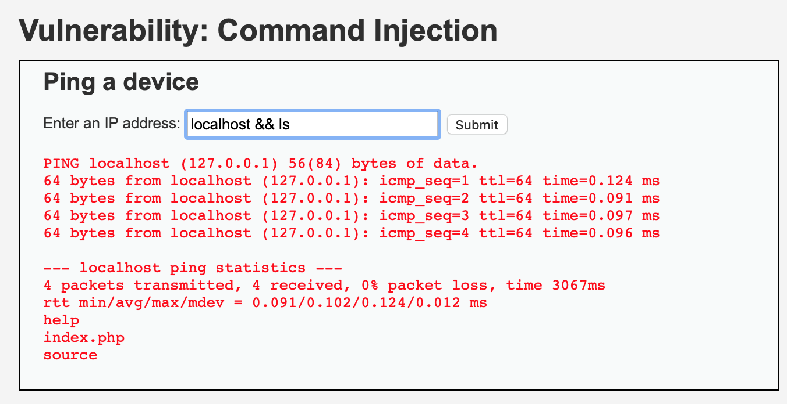
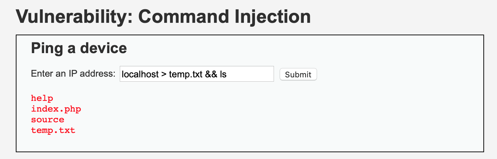
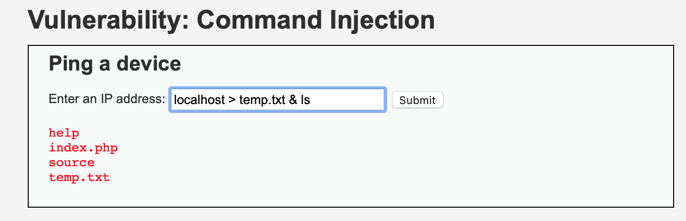
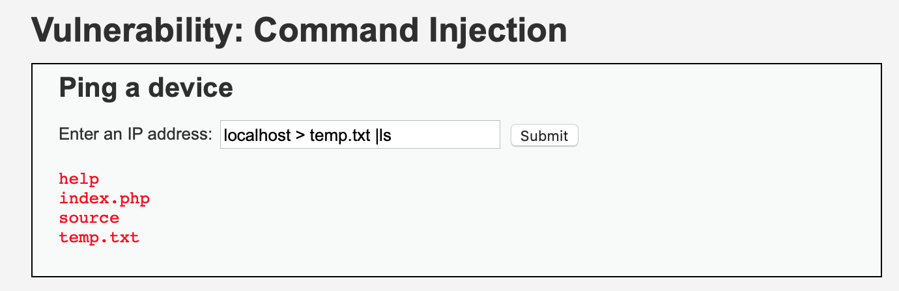

DVWA Command Injection All
====

目录
---

[TOC]

## 1. 背景

最近需要补充一下网络安全方面的知识，于是就从基础的靶场 `DVWA (Damn Vulnerable Web Application)` 开始刷起，这一篇是关于从`Low`到`High`难度的命令行注入的内容。

和我一样希望学习网络安全知识的同学，推荐学习[《Web安全攻防实战》](http://gk.link/a/10jxi)和[《安全攻防技能30讲》](http://gk.link/a/10juL)。

## 2. 环境搭建

参考上一篇[关于 Brute Force 暴力破解密码的博客](https://blog.csdn.net/qq_41729780/article/details/107071363)。

## 3. 命令行注入

### 3.1. Low



$$
\text{Figure 1. Command Injection}
$$

先从 `Low` 难度开始，我们参考一下源码。

```php

<?php

if( isset( $_POST[ 'Submit' ]  ) ) {
    // Get input
    $target = $_REQUEST[ 'ip' ];

    // Determine OS and execute the ping command.
    if( stristr( php_uname( 's' ), 'Windows NT' ) ) {
        // Windows
        $cmd = shell_exec( 'ping  ' . $target );
    }
    else {
        // *nix
        $cmd = shell_exec( 'ping  -c 4 ' . $target );
    }

    // Feedback for the end user
    echo "<pre>{$cmd}</pre>";
}

?>
```

我们可以看到，这里没有对我们的输入做任何的限制，我们输入的命令会被拼接在 `ping` 命令的后面，直接在命令行执行，并返回输出。

于是，我们可以通过 `&&` 命令拼接我们想让服务器执行的命令，在服务器上为所欲为。

比如拼接`ls` 命令显示当前目录下的文件。

```cpp
localhost && ls
```



$$
\text{Figure 2. Low}
$$

输出有一点乱，我们可以把 `ping` 命令的输出重定向到 `temp.txt` 文件中。

```cpp
localhost > temp.txt && ls
```



$$
\text{Figure 3. Redirect Output}
$$

我们可以看到，当前目录下有4个文件，一个是我们刚创建的`temp.txt`。

```cpp
help
index.php
source
temp.txt
```

如果这是一场 `CTF` 夺旗赛的话，`flag` 应该就在当前目录下，可以通过 `cat` 命令获取密钥了。

### 3.2. Medium

接下来是 `Medium` 难度。

```php
<?php

if( isset( $_POST[ 'Submit' ]  ) ) {
    // Get input
    $target = $_REQUEST[ 'ip' ];

    // Set blacklist
    $substitutions = array(
        '&&' => '',
        ';'  => '',
    );

    // Remove any of the charactars in the array (blacklist).
    $target = str_replace( array_keys( $substitutions ), $substitutions, $target );

    // Determine OS and execute the ping command.
    if( stristr( php_uname( 's' ), 'Windows NT' ) ) {
        // Windows
        $cmd = shell_exec( 'ping  ' . $target );
    }
    else {
        // *nix
        $cmd = shell_exec( 'ping  -c 4 ' . $target );
    }

    // Feedback for the end user
    echo "<pre>{$cmd}</pre>";
}

?>
```

从源码中我们发现代码中多了两个替换规则，建立了输入的黑名单。

```php
// Set blacklist
$substitutions = array(
    '&&' => '',
    ';'  => '',
);
```

但是，这个黑名单非常得脆弱，我们只要把 `&&` 换成 `&` 命令就能绕开黑名单了。

`&&` 和 `&` 都能起到命令拼接的作用，`a && b` 在 `a` 命令执行成功的情况下执行 `b` 命令，`a & b` 则无论 `a` 是否执行成功都会执行 `b`。

```cpp
localhost > temp.txt & ls
```



$$
\text{Figure 4. Medium}
$$

### 3.3. High

接下来就是 `High` 难度了。

```php
<?php

if( isset( $_POST[ 'Submit' ]  ) ) {
    // Get input
    $target = trim($_REQUEST[ 'ip' ]);

    // Set blacklist
    $substitutions = array(
        '&'  => '',
        ';'  => '',
        '| ' => '',
        '-'  => '',
        '$'  => '',
        '('  => '',
        ')'  => '',
        '`'  => '',
        '||' => '',
    );

    // Remove any of the charactars in the array (blacklist).
    $target = str_replace( array_keys( $substitutions ), $substitutions, $target );

    // Determine OS and execute the ping command.
    if( stristr( php_uname( 's' ), 'Windows NT' ) ) {
        // Windows
        $cmd = shell_exec( 'ping  ' . $target );
    }
    else {
        // *nix
        $cmd = shell_exec( 'ping  -c 4 ' . $target );
    }

    // Feedback for the end user
    echo "<pre>{$cmd}</pre>";
}

?>
```

`High` 难度的黑名单更加完善了，`&` 命令也被替换掉了。逻辑上好像没有什么问题，但是仔细看的话，我们会发现替换规则中的一个漏洞，`'｜ '` 右边多了一个空格，这就给了我们机会了。

```php
// Set blacklist
$substitutions = array(
    '&'  => '',
    ';'  => '',
    '| ' => '',
    '-'  => '',
    '$'  => '',
    '('  => '',
    ')'  => '',
    '`'  => '',
    '||' => '',
);
```

`a | b` 表示将 `a` 命令的输出作为 `b` 命令的输入。如果 `b` 命令不接受输入的话，可以可以当作连接符号使用。

```cpp
localhost > temp.txt |ls
```



$$
\text{Figure 5. High}
$$

### 3.4. Impossible

`Impossible` 难度使用了白名单，要求输入为`xxx.xxx.xxx.xxx`的格式，`xxx`还要求是数字，基本上就没有什么安全漏洞了。

```php
<?php

if( isset( $_POST[ 'Submit' ]  ) ) {
    // Check Anti-CSRF token
    checkToken( $_REQUEST[ 'user_token' ], $_SESSION[ 'session_token' ], 'index.php' );

    // Get input
    $target = $_REQUEST[ 'ip' ];
    $target = stripslashes( $target );

    // Split the IP into 4 octects
    $octet = explode( ".", $target );

    // Check IF each octet is an integer
    if( ( is_numeric( $octet[0] ) ) && ( is_numeric( $octet[1] ) ) && ( is_numeric( $octet[2] ) ) && ( is_numeric( $octet[3] ) ) && ( sizeof( $octet ) == 4 ) ) {
        // If all 4 octets are int's put the IP back together.
        $target = $octet[0] . '.' . $octet[1] . '.' . $octet[2] . '.' . $octet[3];

        // Determine OS and execute the ping command.
        if( stristr( php_uname( 's' ), 'Windows NT' ) ) {
            // Windows
            $cmd = shell_exec( 'ping  ' . $target );
        }
        else {
            // *nix
            $cmd = shell_exec( 'ping  -c 4 ' . $target );
        }

        // Feedback for the end user
        echo "<pre>{$cmd}</pre>";
    }
    else {
        // Ops. Let the user name theres a mistake
        echo '<pre>ERROR: You have entered an invalid IP.</pre>';
    }
}

// Generate Anti-CSRF token
generateSessionToken();

?>
```

---

**联系邮箱**：curren_wong@163.com

**CSDN**：[https://me.csdn.net/qq_41729780](https://me.csdn.net/qq_41729780)

**知乎**：[https://zhuanlan.zhihu.com/c_1225417532351741952](https://zhuanlan.zhihu.com/c_1225417532351741952)

**公众号**：**复杂网络与机器学习**

欢迎关注/转载，有问题欢迎通过邮箱交流。


