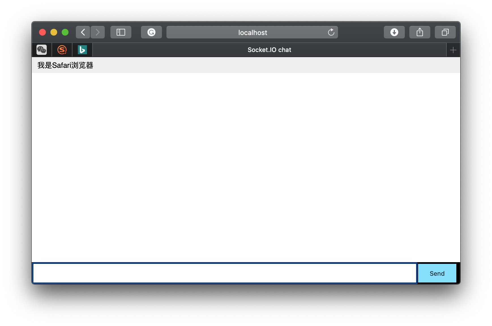
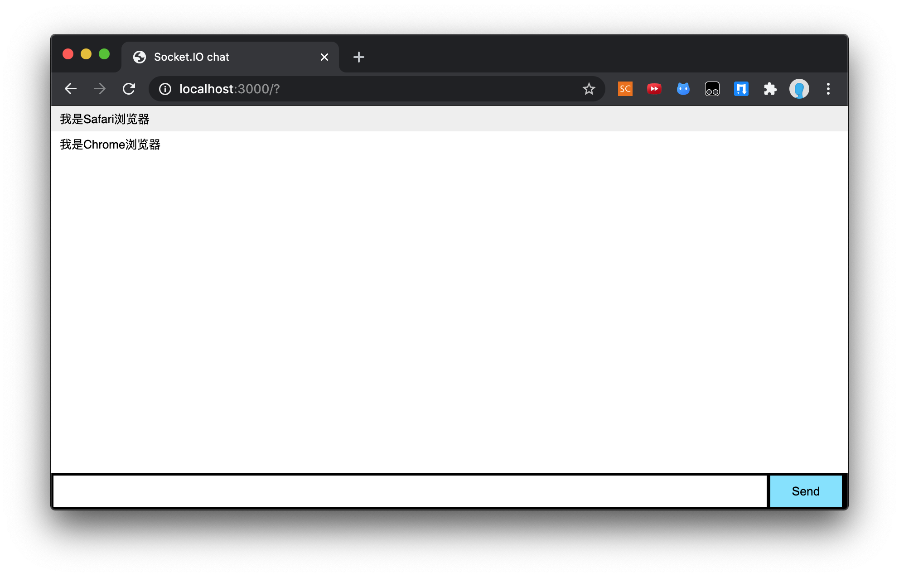

使用 Node.js 搭建聊天系统
===

目录
---

[TOC]

## 1. 背景

这学期选了一门短学期课程，《计算机专业课程设计》，我们需要单独完成一个完整的项目并汇报给老师。我准备借鉴 [CodiMD](https://github.com/codimd/server) 来实现一个基于 `Node.js` 的`MarkDown`文档协同编辑平台。

在我浏览CodiMD的源码时，发现项目中实现实时协同编辑的一个关键模块是[Socket.IO](https://socket.io/docs/)，于是先从它开始学起，这篇博客是`Socket.IO`的一个入门项目，基于 `Node.js` 的聊天系统。

## 2. 前期准备

### 2.1. 安装Node.js

前往官网[https://nodejs.org/en/download/](http://nodejs.cn/download/)进行下载，图形界面安装，按照提示进行即可

Mac OS也可以用brew安装

```cmd
brew install node
```

### 2.2. 安装Express和`Socket.IO`

先创建项目文件夹，将它命名为`myapp`。

```cmd
mkdir myapp
cd myapp
```

然后安装库文件。

```cmd
npm install express socket.io --save
```

### 2.3. 服务端

创建`index.js`。获取某一客户端传入的聊天消息，并返回给所有客户端。

```javascript
// index.js
// 获取Express并创建服务
var app = require('express')();
// 获取http模块
var http = require('http').Server(app);
// 获取socket.io模块
var io = require('socket.io')(http);
// 设置监听端口为进程端口或3000端口
var port = process.env.PORT || 3000;
// 请求根路径时，返回index.html
app.get('/', function(req, res){
  res.sendFile(__dirname + '/index.html');
});
// 建立新的 TCP 流时会触发connection事件，执行回调函数
io.on('connection', function(socket){
    // 获取传入的'chat message'信息
  socket.on('chat message', function(msg){
    // 将'chat message'向所有客户端进行广播
    io.emit('chat message', msg);
  });
});
// 监听端口
http.listen(port, function(){
  console.log('listening on *:' + port);
});

```

### 2.4. 客户端

创建`index.html`，向服务端发送聊天消息，并将服务端返回的消息显示在界面中。

```html
<!doctype html>
<html>

    <head>
        <title>Socket.IO chat</title>
        <!-- css样式文件 -->
        <style>
            * {
                margin: 0;
                padding: 0;
                box-sizing: border-box;
            }

            body {
                font: 13px Helvetica, Arial;
            }

            form {
                background: #000;
                padding: 3px;
                position: fixed;
                bottom: 0;
                width: 100%;
            }

            form input {
                border: 0;
                padding: 10px;
                width: 90%;
                margin-right: .5%;
            }

            form button {
                width: 9%;
                background: rgb(130, 224, 255);
                border: none;
                padding: 10px;
            }

            #messages {
                list-style-type: none;
                margin: 0;
                padding: 0;
            }

            #messages li {
                padding: 5px 10px;
            }

            #messages li:nth-child(odd) {
                background: #eee;
            }

            #messages {
                margin-bottom: 40px
            }

        </style>
    </head>

    <body>
        <ul id="messages"></ul>
        <form action="">
            <input id="m" autocomplete="off" /><button>Send</button>
        </form>
        <!-- 加载socket.io和jquery -->
        <script src="https://cdnjs.cloudflare.com/ajax/libs/socket.io/2.3.0/socket.io.js"></script>
        <script src="https://cdnjs.cloudflare.com/ajax/libs/jquery/3.5.1/jquery.min.js"></script>
        <script>
            $(function () {
                var socket = io();
                // 用户点击Send触发Submit事件
                $('form').submit(function () {
                    // 向服务端发送文本框中的内容
                    socket.emit('chat message', $('#m').val());
                    // 清空文本框
                    $('#m').val('');
                    return false;
                });
                // 接受到服务端发送的'chat message'时
                socket.on('chat message', function (msg) {
                    // 将接受到的消息显示在消息界面
                    $('#messages').append($('<li>').text(msg));
                    // 屏幕向下滚动
                    window.scrollTo(0, document.body.scrollHeight);
                });
            });

        </script>
    </body>

</html>

```

## 3. 测试效果

完成上述步骤，目录树应该是这样的。

```cpp
xxx/myapp
├── index.html
├── index.js
├── node_modules
├── package-lock.json
└── package.json
```

在myapp文件夹下执行以下命令。

```cmd
node index.js
```

当命令行显示 `listening on *:3000`，就成功运行了。

接下来分别打开两个浏览器，在聊天窗口中进行对话。



$$
\text{Figure 1. Safari}
$$



$$
\text{Figure 2. Chrome}
$$

测试成功。

项目的完整代码可以参考[Github](https://github.com/CurrenWong/chat-example)。

---

**联系邮箱**：curren_wong@163.com

**CSDN**：[https://me.csdn.net/qq_41729780](https://me.csdn.net/qq_41729780)

**知乎**：[https://zhuanlan.zhihu.com/c_1225417532351741952](https://zhuanlan.zhihu.com/c_1225417532351741952)

**公众号**：**复杂网络与机器学习**

欢迎关注/转载，有问题欢迎通过邮箱交流。


