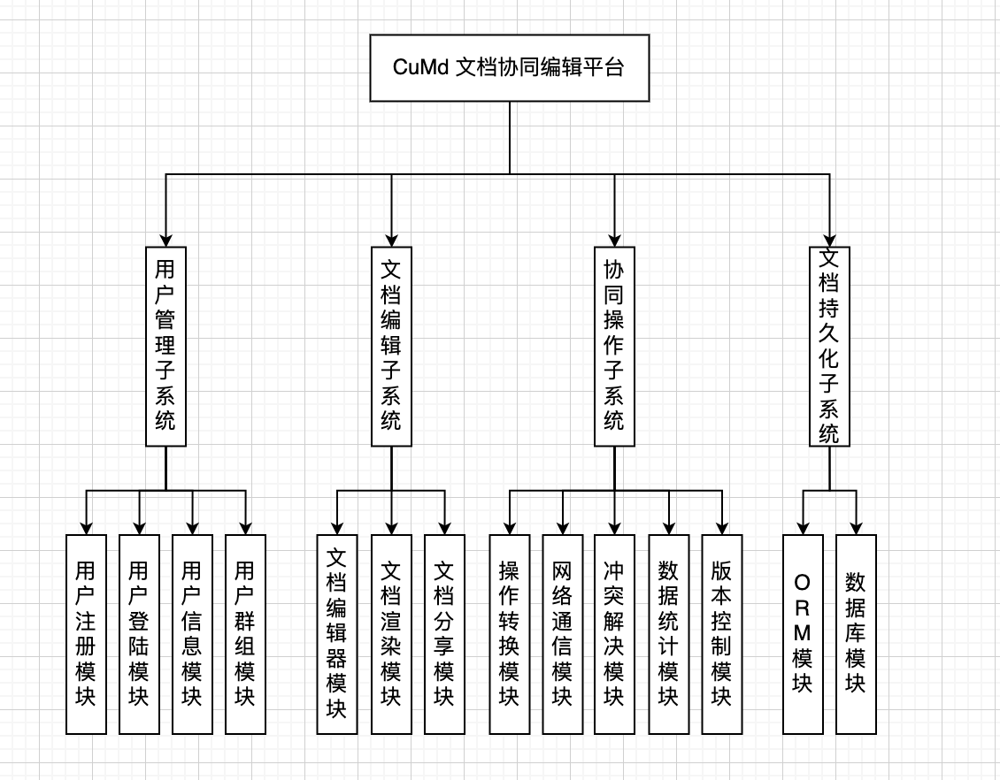
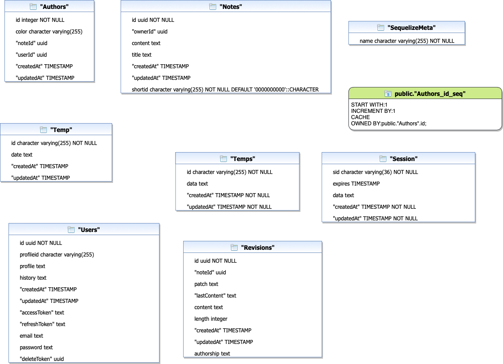

CuMd 文档协同编辑平台需求分析
===

目录
---

[TOC]

## 1. 背景

这学期选了一门短学期课程，《计算机专业课程设计》，我们需要单独完成一个完整的项目并汇报给老师。我准备借鉴 [CodiMD](https://github.com/codimd/server) 来实现一个基于 `Node.js` 的`MarkDown`文档协同编辑平台。

这篇笔记是项目的需求分析文档。

## 2. 需求描述

### 2.1. 项目描述

在软件设计、需求分析、软件设计的报告撰写与修改中，常需要多个同学在同一个文档上进行撰写、修改、完善。然后把各同学对同一个文档的修改合成一个文档。本项目要求设计一个文档协同编辑系统

### 2.2. 基本需求

1. 报告的初始划分

每个同学撰写某个报告中的一部分，撰写报告片段，然后提交报告片段

2. 报告的整合

系统提供整合按钮，把每个同学提交的报告整合成一个完整的报告。

3. 修改老报告

在老报告的基础上，每个同学都可以把老报告导出，然后在老报告的基础上修改，修改后然后提交。当每个同学都把报告提交完后。然后整合为一个完整的文档。在整合的文档中，标出每段文字是老文档中的还是由哪个同学修改的。

4. 报告的贡献统计

能够统计每个人对文档修改的贡献，如修改文档被接受的比例。

5. 报告查看

每个人可以查看自己提交的报告、本组其他成员提交的报告

### 2.3. 拓展需求

1. 实时协同编辑

平台支持多个用户同时编辑同一份文档，结果实时同步。

2. `Markdown`编辑

文档能够使用`Markdown`语法进行编辑，页面左半边为文本编辑器，右半边进行实时渲染。

3. 图片上传功能

用户可以将本地图片上传，由服务器自动传到图床中，方便`Markdown`文本的传播与分享。

4. 文档分享功能

支持用户生成在线分享页面，他人可以通过链接看到最新版本的文档，用户可以设置参与者是否具备编辑权限。

5. PPT分享功能

支持用户通过`reveal.js`格式将Markdown转换为在线PPT，并同步分享给观看者。

## 3. 系统功能模块图

如`图1`所示，我们根据功能将系统划分为了`4`个子系统，共`14`个功能模块。

$$
\text{Figure 1. 功能模块图}
$$

## 4. ER 图

我们采用的数据库为`PostgreSQL`，用以支持更加灵活的文本存储。

如`图2`所示，为了支持更高的并发用户数量，我们没有在数据库设置外键约束，外键的检查在应用层解决。

$$
\text{Figure 2. ER Diagram}
$$
