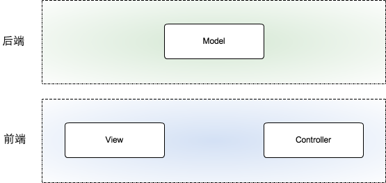
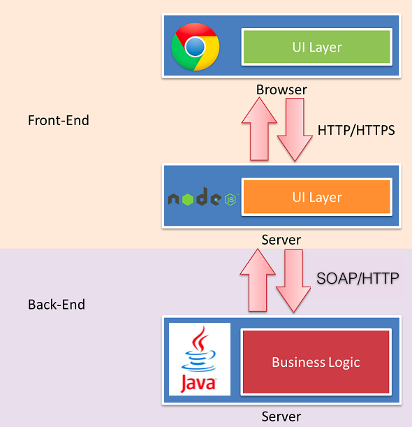
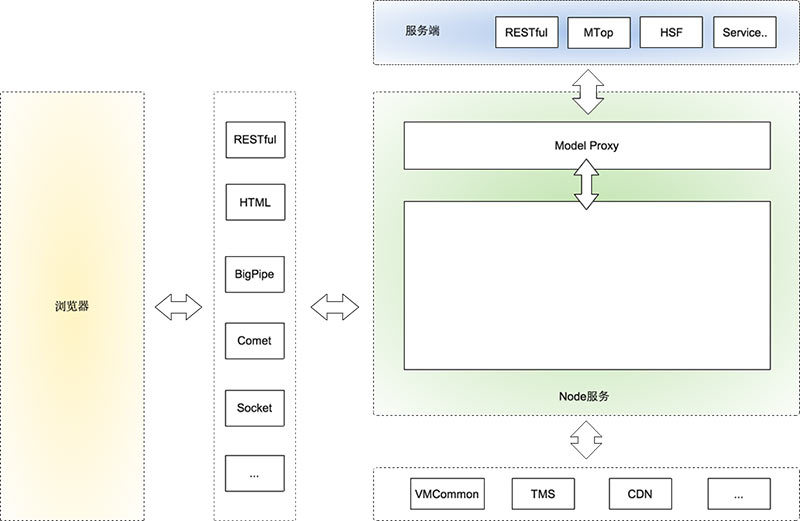

前后端分离的思考与实践（一）
====

也谈基于 Node.js 的全栈式开发（基于 Node.js 的前后端分离）
---

目录
---

[TOC]

背景
---

这学期选修了一门课《软件协同设计》，这门课主要的目的，就是让我们能够在学校里拥有通过团队合作开发一个产品的经验。一个小组5个人，从需求分析、软件开发、测试到交付的过程我们都会经历。

我在思考我们应该用什么样的技术来做这个项目的时候遇到了一些问题。

1. 我们熟悉的技术，只有在上学期做JavaWeb开发的时候用到的JSP + Servlet。但我感觉这个架构无论是在前端和服务端的交互上，还是在服务端和数据库的交互上都非常地麻烦。
2. 于是我希望能够了解目前互联网企业常用的一些前后端技术，在我的搜索过程中，我发现`前后端分离`和`Node.js`这两个关键词经常出现，但我并不理解它们是什么。

所以，我又对这两个关键词进行了搜索，最终找到了阿里巴巴[淘系前端团队](https://fed.taobao.org/?spm=taofed.bloginfo.header.1.15205ac8JbKdW2)所写的文章[《前后端分离的思考与实践》](https://fed.taobao.org/blog/taofed/do71ct/practice-of-separation-of-front-end-from-back-end/?spm=taofed.blogs.blog-list.4.3e295ac8O7YSGJ)，它让我对前后端分离也有了一些了解，于是我想要转载过来，方便学习和记录。

这个系列的文章一共有6个章节，以下是对[第一章](https://fed.taobao.org/blog/taofed/do71ct/practice-of-separation-of-front-end-from-back-end/?spm=taofed.blogs.blog-list.4.3e295ac8O7YSGJ)的全文转载。

---

前言
---

> 为了解决传统 Web 开发模式带来的各种问题，我们进行了许多尝试，但由于前/后端的物理鸿沟，尝试的方案都大同小异。痛定思痛，今天我们重新思考了“前后端”的定义，引入前端同学都熟悉的 Node.js，试图探索一条全新的前后端分离模式。

随着不同终端（Pad/Mobile/PC）的兴起，对开发人员的要求越来越高，纯浏览器端的响应式已经不能满足用户体验的高要求，我们往往需要针对不同的终端开发定制的版本。为了提升开发效率，前后端分离的需求越来越被重视，后端负责业务/数据接口，前端负责展现/交互逻辑，同一份数据接口，我们可以定制开发多个版本。
这个话题最近被讨论得比较多，阿里有些 BU 也在进行一些尝试。讨论了很久之后，我们团队决定探索一套基于 Node.js 的前后端分离方案，过程中有一些不断变化的认识以及思考，记录在这里，也希望看到的同学参与讨论，帮我们完善。

## 1. 什么是前后端分离

最开始组内讨论的过程中我发现，每个人对前后端分离的理解不一样，为了保证能在同一个频道讨论，先就什么是”前后端分离”达成一致。

大家一致认同的前后端分离的例子就是 SPA(Single Page Application)，所有用到的展现数据都是后端通过异步接口（AJAX/JSONP）的方式提供的，前端只管展现。

从某种意义上来说，SPA 确实做到了前后端分离，但这种方式存在两个问题：

- WEB 服务中，SPA 类占的比例很少。很多场景下还有同步/同步+异步混合的模式，SPA 不能作为一种通用的解决方案。
- 现阶段的 SPA 开发模式，接口通常是按照展现逻辑来提供的，有时候为了提高效率，后端会帮我们处理一些展现逻辑，这就意味着后端还是涉足了 View 层的工作，不是真正的前后端分离。

SPA 式的前后端分离，是从物理层做区分（认为只要是客户端的就是前端，服务器端的就是后端），这种分法已经无法满足我们前后端分离的需求，我们认为从职责上划分才能满足目前我们的使用场景：

- 前端：负责 View 和 Controller 层。
- 后端：只负责 Model 层，业务处理/数据等。
为什么去做这种职责的划分，后面会继续探讨。

## 2. 为什么要前后端分离

关于这个问题，玉伯的文章[《Web 研发模式演变》](https://github.com/lifesinger/blog/issues/184?spm=taofed.bloginfo.blog.1.15205ac8JbKdW2)中解释得非常全面，我们再大概理一下：

### 2.1. 现有开发模式的适用场景

玉伯提到的几种开发模式，各有各的适用场景，没有哪一种完全取代另外一种。

- 比如后端为主的 MVC，做一些同步展现的业务效率很高，但是遇到同步异步结合的页面，与后端开发沟通起来就会比较麻烦。
- AJAX 为主 SPA 型开发模式，比较适合开发 APP 类型的场景，但是只适合做 APP，因为 SEO 等问题不好解决，对于很多类型的系统，这种开发方式也过重。

### 2.2. 前后端职责不清

在业务逻辑复杂的系统里，我们最怕维护前后端混杂在一起的代码，因为没有约束，M-V-C 每一层都可能出现别的层的代码，日积月累，完全没有维护性可言。

虽然前后端分离没办法完全解决这种问题，但是可以大大缓解。因为从物理层次上保证了你不可能这么做。

### 2.3. 开发效率问题

淘宝的 Web 基本上都是基于 MVC 框架 webx，架构决定了前端只能依赖后端。

所以我们的开发模式依然是，前端写好静态 demo，后端翻译成 VM 模版，这种模式的问题就不说了，被吐槽了很久。直接基于后端环境开发也很痛苦，配置安装使用都很麻烦。

为了解决这个问题，我们发明了各种工具，比如 VMarket，但是前端还是要写 VM，而且依赖后端数据，效率依然不高。另外，后端也没法摆脱对展现的强关注，从而专心于业务逻辑层的开发。

### 2.4. 对前端发挥的局限

性能优化如果只在前端做空间非常有限，于是我们经常需要后端合作才能碰撞出火花，但由于后端框架限制，我们很难使用 `Comet`、`Bigpipe` 等技术方案来优化性能。

为了解决以上提到的一些问题，我们进行了很多尝试，开发了各种工具，但始终没有太多起色，主要是因为我们只能在后端给我们划分的那一小块空间去发挥。只有真正做到前后端分离，我们才能彻底解决以上问题。

## 3. 怎么做前后端分离

怎么做前后端分离，其实第一节中已经有了答案：

- 前端：负责 View 和 Controller 层。
- 后端：负责 Model 层，业务处理/数据等。

$$
\text{Figure 1. 怎么做前后端分离}
$$

试想一下，如果前端掌握了`Controller`，我们可以做 URL design，我们可以根据场景决定在服务端同步渲染，还是根据 View 层数据输出 JSON 数据，我们还可以根据表现层需求很容易的做 Bigpipe，Comet，Socket 等等，完全是需求决定使用方式。

### 3.1. 基于NodeJS“全栈”式开发

如果想实现上图的分层，就必然需要一种web服务帮我们实现以前后端做的事情，于是就有了标题提到的“基于NodeJS的全栈式开发”。

$$
\text{Figure 2. 基于NodeJS“全栈”式开发}
$$

这张图看起来简单而且很好理解，但没尝试过，会有很多疑问。

- SPA 模式中，后端已供了所需的数据接口，View 前端已经可以控制，为什么要多加 Node.js 这一层？
- 多加一层，性能怎么样？
- 多加一层，前端的工作量是不是增加了？
- 多加一层就多一层风险，怎么破？
- Node.js 什么都能做，为什么还要 Java？

这些问题要说清楚不容易，下面说下我的认识过程。

### 3.2. 为什么要增加一层 Node.js

现阶段我们主要以后端 MVC 的模式进行开发，这种模式严重阻碍了前端开发效率，也让后端不能专注于业务开发。

解决方案是让前端能控制`Controller`层，但是如果在现有技术体系下很难做到，因为不可能让所有前端都学 Java，安装后端的开发环境，写 VM。
Node.js 就能很好的解决这个问题，我们无需学习一门新的语言，就能做到以前开发帮我们做的事情，一切都显得那么自然。

### 3.3. 性能问题

分层就涉及每层之间的通讯，肯定会有一定的性能损耗。但是合理的分层能让职责清晰、也方便协作，会大大提高开发效率。分层带来的损失，一定能在其他方面的收益弥补回来。

另外，一旦决定分层，我们可以通过优化通讯方式、通讯协议，尽可能把损耗降到最低。

举个例子：
淘宝宝贝详情页静态化之后，还是有不少需要实时获取的信息，比如物流、促销等等，因为这些信息在不同业务系统中，所以需要前端发送 5，6 个异步请求来回填这些内容。

有了 Node.js 之后，前端可以在 Node.js 中去代理这 5 个异步请求，还能很容易的做 Bigpipe，这块的优化能让整个渲染效率提升很多。

可能在 PC 上你觉得发 5、6 个异步请求也没什么，但是在无线端，在客户手机上建立一个 HTTP 请求开销很大，有了这个优化，性能一下提升好几倍。

淘宝详情基于 Node.js 的优化我们正在进行中，上线之后我会分享一下优化的过程。

### 3.4. 前端的工作量是否增加了

相对于只切页面/做 demo，肯定是增加了一点，但是当前模式下有联调、沟通环节，这个过程非常花时间，也容易出 bug，还很难维护。所以，虽然工作量会增加一点，但是总体开发效率会提升很多。

另外，测试成本可以节省很多。以前开发的接口都是针对表现层的，很难写测试用例。如果做了前后端分离，甚至测试都可以分开，一拨人专门测试接口，一拨人专注测试 UI（这部分工作甚至可以用工具代替）。

### 3.5. 增加 Node.js 层带来的风险怎么控制

随着 Node.js 大规模使用，系统/运维/安全部门的同学也一定会加入到基础建设中，他们会帮助我们去完善各个环节可能出现的问题，保障系的稳定性。

### 3.6. Node.js 什么都能做，为什么还要 Java

我们的初衷是做前后端分离，如果考虑这个问题就有点违背我们的初衷了。即使用 Node.js 替代 Java，我们也没办法保证不出现今天遇到的种种问题，比如职责不清。我们的目的是分层开发，专业的人，专注做专业的事。基于 Java 的基础架构已经非常强大而且稳定，而且更适合做现在架构的事情。

## 4. 淘宝基于 Node.js 的前后端分离

$$
\text{Figure 3. 淘宝基于Node.js的前后端分离}
$$

上图是我理解的淘宝基于 Node.js 的前后端分离分层，以及 Node.js 的职责范围。简单解释下：

- 最上端是服务端，就是我们常说的后端。后端对于我们来说，就是一个接口的集合，服务端提供各种各样的接口供我们使用。因为有 Node.js 层，也不用局限是什么形式的服务。对于后端开发来说，他们只用关心业务代码的接口实现。
- 服务端下面是 Node.js 应用。
- Node.js 应用中有一层 Model Proxy 与服务端进行通讯。这一层主要目前是抹平我们对不同接口的调用方式，封装一些 View 层需要的 Model。
- Node.js 层还能轻松实现原来 vmcommon, tms（引用淘宝内容管理系统）等需求。
- Node.js 层要使用什么框架由开发者自己决定。不过推荐使用 Express + XTemplate 的组合，XTemplate 能做到前后端公用。
- 怎么用 Node.js 大家自己决定，但是令人兴奋的是，我们终于可以使用 Node.js 轻松实现我们想要的输出方式： JSON/JSONP/RESTful/HTML/BigPipe/Comet/Socket/同步、异步，想怎么整就怎么整，完全根据你的场景决定。
- 浏览器层在我们这个架构中没有变化，也不希望因为引入 Node.js 改变你以前在浏览器中开发的认知。
引入 Node.js，只是把本该就前端控制的部分交由前端掌控。

这种模式我们已经有两个项目在开发中，虽然还没上线，但是无论是在开发效率，还是在性能优化方面，我们都已经尝到了甜头。

## 5. 我们还需要要做什么

- 把 Node.js 的开发流程集成到淘宝现有的 SCM 流程中。
- 基础设施建设，比如 session, logger 等通用模块。
- 最佳开发实践
- 线上成功案例
- 大家对 Node.js 前后端分离概念的认识
- 安全
- 性能
- …

技术上不会有太多需要去创新和研究的，已经有非常多现成的积累。其实关键是一些流程的打通和通用解决方案的积累，相信随着更多的项目实践，这块慢慢会变成一个稳定的流程。

## 6. “中途岛”

虽然“基于 Node.js 的全栈式开发”模式很让人兴奋，但是把基于 Node.js 的全栈开发变成一个稳定，让大家都能接受的东西还有很多路要走，我们正在进行的“中途岛”项目就是为了解决这个问题。虽然我们起步不久，但是离目标已经越来越近！！
