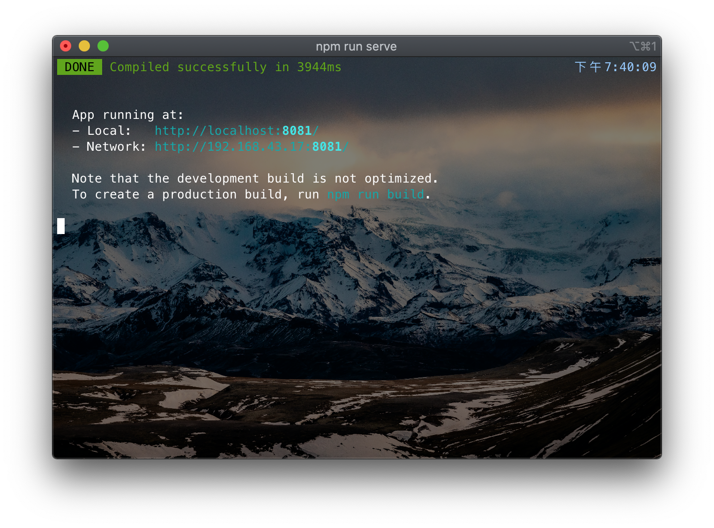
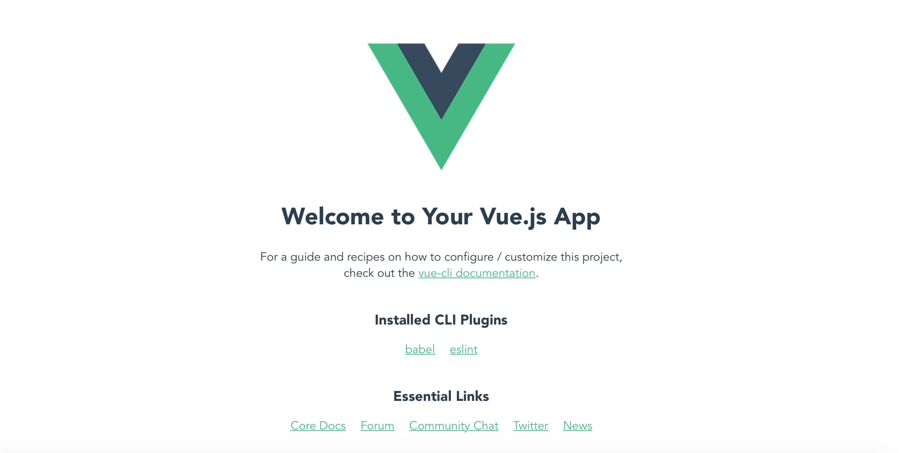
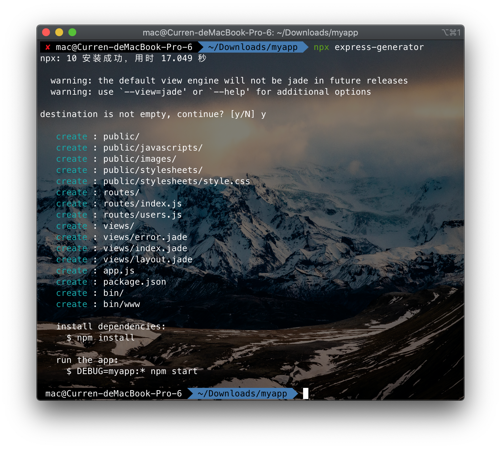

使用Express部署Vue项目
===

目录
---

[TOC]

## 1. 背景

我们想要做一个前后端分离的课程项目，前端框架准备使用`Vue.js`，并使用`Express`作为`Node.js`中间件进行部署，后端使用`Java Servlet`与数据库交互。

但我在尝试根据网络上的一些教程将`Vue.js`构建好的项目部署到`Express`上时，发现页面总是显示不出来，HTML里的提示是

> We're sorry but hello-world doesn't work properly without JavaScript enabled. Please enable it to continue.

所以我尝试在[Vue CLI的官网](https://cli.vuejs.org/zh/guide/deployment.html#本地预览)寻找部署方案。发现[官方推荐的部署在Express上的方案](https://router.vuejs.org/zh/guide/essentials/history-mode.html#后端配置例子)是使用[`connect-history-api-fallback`中间件](https://github.com/bripkens/connect-history-api-fallback#usage)。于是我把具体的部署流程写成了这篇笔记，方便学习和记录。

## 2. 配置Vue CLI

此部分参考自[Vue CLI 官方文档](https://cli.vuejs.org/zh/guide/creating-a-project.html#vue-create)

### 2.1. 安装Node.js

前往官网[https://nodejs.org/en/download/](http://nodejs.cn/download/)进行下载，图形界面安装，按照提示进行即可

Mac OS也可以用brew安装

```cmd
brew install node
```

### 2.2. 安装Vue CLI

```cmd
npm install -g @vue/cli
# OR
yarn global add @vue/cli
```

查看是否安装成功

```cmd
vue --version
```

### 2.3. 创建Vue项目

命令行进入一个你想安装的文件夹，运行以下命令

```cmd
vue create hello-world
```

你会被提示选取一个 preset。你可以选默认的包含了基本的 Babel + ESLint 设置的 preset，也可以选“手动选择特性”来选取需要的特性。


$$
\text{Figure 1. CLI new project}
$$

这个默认的设置非常适合快速创建一个新项目的原型，而手动设置则提供了更多的选项，它们是面向生产的项目更加需要的。


$$
\text{Figure 2. CLI select features}
$$

运行项目

```cmd
cd hello-world
npm run server
```



$$
\text{Figure 3. Npm run server}
$$

访问显示的url会出现Vue的欢迎界面



$$
\text{Figure 4. Web index}
$$

### 2.4. 构建Vue项目

通过`Ctrl-C`停止运行后，构建项目。打包好的文件会存放在dist文件夹下。

```cmd
npm run build
```

但是dist文件夹下的`index.html`我们通过本地浏览器是打不开的，所以我们需要一个`Node.js`服务器，我使用的是`Express`。下面就进入`Express`的配置。

## 3. 配置Express

此部分内容参考自[Express官方文档](https://www.expressjs.com.cn/starter/installing.html)。

### 3.1. 安装Express

首先退出刚才创建的Vue项目文件夹

```cmd
cd ..
```

然后创建Express文件夹并进入其中

```cmd
mkdir myapp
cd myapp
```

通过 npm init 命令为你的应用创建一个 package.json 文件。

```cmd
npm init
```

此命令将要求你输入几个参数，例如此应用的名称和版本。 你可以直接按“回车”键接受大部分默认设置即可，下面这个除外：

```cmd
entry point: (index.js)
```

键入 app.js 或者你所希望的名称，这是当前应用的入口文件。如果你希望采用默认的 index.js 文件名，只需按“回车”键即可。

接下来在 myapp 目录下安装 Express 并将其保存到依赖列表中。如下：

```cmd
npm install express --save
```

### 3.2. 创建项目

通过应用生成器工具 express-generator 可以快速创建一个应用的骨架。

```cmd
npx express-generator
```

对于较老的 Node 版本，请通过 npm 将 Express 应用程序生成器安装到全局环境中并执行即可。

```cmd
npm install -g express-generator
express
```

安装时会提示文件夹非空，是否确定安装，输入y然后回车即可



$$
\text{Figure 5. Express generator}
$$

然后安装所有依赖包：

```cmd
npm install
```

在 MacOS 或 Linux 中，通过如下命令启动此应用：

```cmd
DEBUG=myapp:* npm start
```

在 Windows 中，通过如下命令启动此应用：

```cmd
set DEBUG=myapp:* & npm start
```

然后在浏览器中打开 [http://localhost:3000/](http://localhost:3000/) 网址就可以看到这个应用了。


$$
\text{Figure 6. Express index}
$$

同样使用`Ctrl-C`停止运行，下面将Vue项目构建的文件部署到Express。

## 4. 使用Express部署Vue项目

将Vue项目`hello-world`目录中的dist文件夹复制到
Express项目`myapp`文件夹。

直接复制过去也可以，通过下面的命令行复制也可以。

```cmd
mkdir dist
cp -a ../hello-world/dist/ ./dist
```

复制完成后，myapp文件夹的目录树应该是这样的

```cmd
xxx/myapp
├── app.js
├── bin
├── dist
├── node_modules
├── package-lock.json
├── package.json
├── public
├── routes
└── views
```

安装`connect-history-api-fallback`中间件

```cmd
npm install --save connect-history-api-fallback
```

安装完成以后，修改app.js

```javascript
var createError = require('http-errors');
var express = require('express');
var path = require('path');
var cookieParser = require('cookie-parser');
var logger = require('morgan');

var indexRouter = require('./routes/index');
var usersRouter = require('./routes/users');

var app = express();

// view engine setup
app.set('views', path.join(__dirname, 'views'));
app.set('view engine', 'jade');

app.use(logger('dev'));
app.use(express.json());
app.use(express.urlencoded({ extended: false }));
app.use(cookieParser());
app.use(express.static(path.join(__dirname, 'public')));

// ----------------这两行被我们注释掉了-----------
// app.use('/', indexRouter);
// app.use('/users', usersRouter);
//---------------------------------------------

// ----------------这三行是我们新添加的-----------
var history = require('connect-history-api-fallback');
app.use(express.static(path.join(__dirname, 'dist')));
app.use(history());
//---------------------------------------------

// catch 404 and forward to error handler
app.use(function(req, res, next) {
  next(createError(404));
});

// error handler
app.use(function(err, req, res, next) {
  // set locals, only providing error in development
  res.locals.message = err.message;
  res.locals.error = req.app.get('env') === 'development' ? err : {};

  // render the error page
  res.status(err.status || 500);
  res.render('error');
});

module.exports = app;
```

在我标记的地方加入了下面3条语句，将中间件加入了其中。并且注释掉了前面的两条语句，让页面自动访问`index.html`。

```javascript
// ----------------这两行被我们注释掉了-----------
// app.use('/', indexRouter);
// app.use('/users', usersRouter);
//---------------------------------------------

// ----------------这三行是我们新添加的-----------
var history = require('connect-history-api-fallback');
app.use(express.static(path.join(__dirname, 'dist')));
app.use(history());
//---------------------------------------------
```

启动Express

```cmd
npm start
```

在浏览器中打开 [http://localhost:3000/](http://localhost:3000/)，看到Vue的界面就大功告成了。


$$
\text{Figure 7. Vue index在Express中显示成功}
$$

---

联系邮箱：curren_wong@163.com

Github：[https://github.com/CurrenWong](https://github.com/CurrenWong)

欢迎转载/Star/Fork，有问题欢迎通过邮箱交流。
