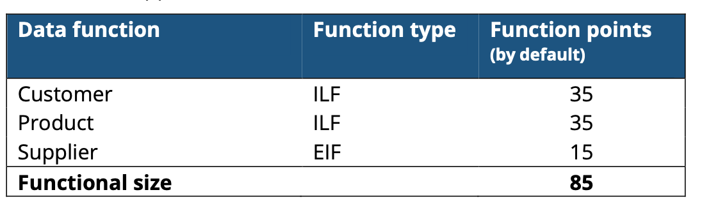
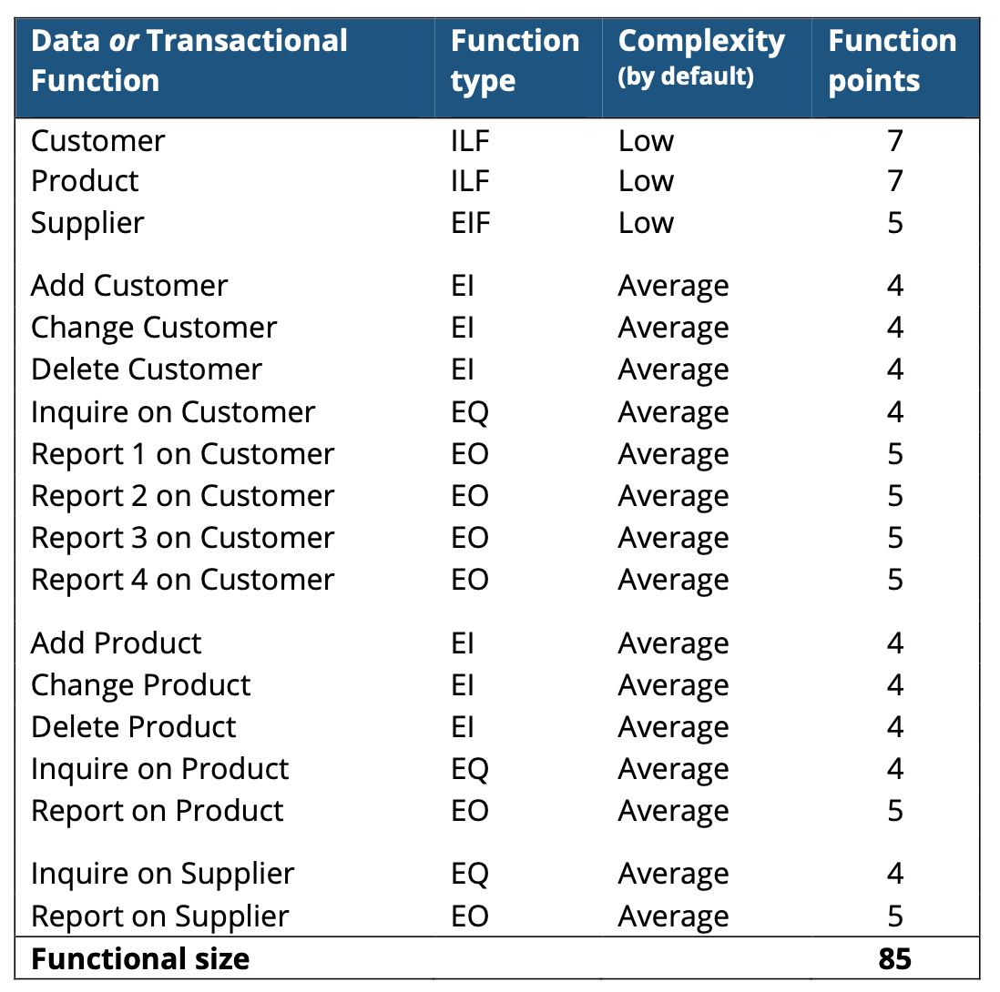
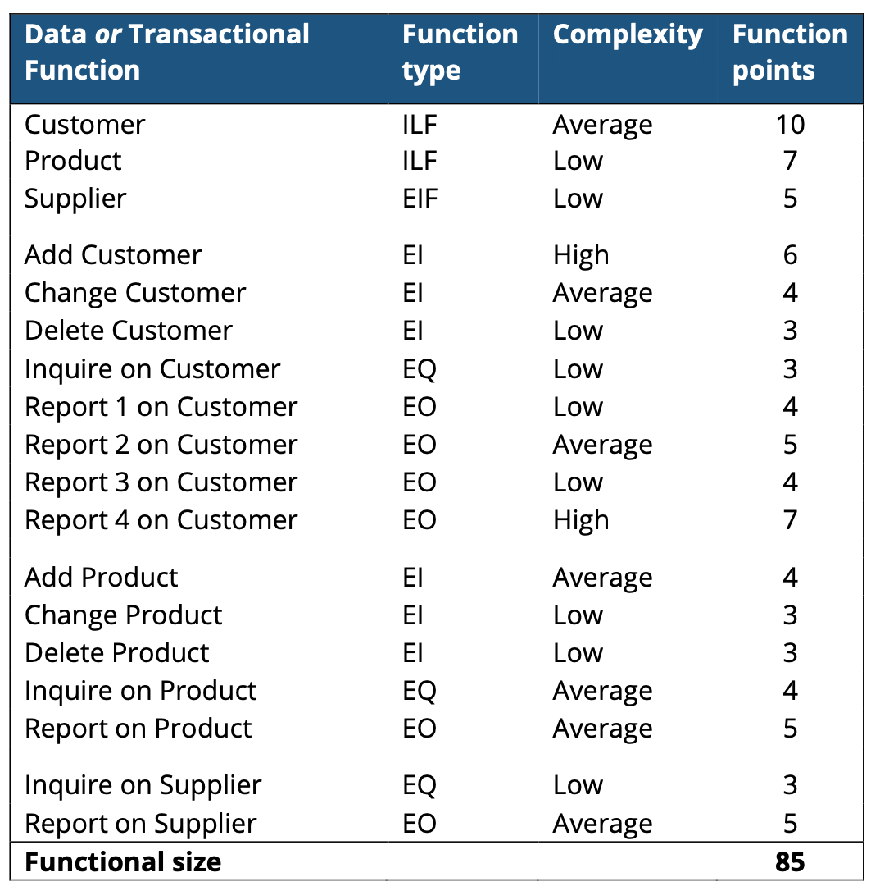

NESMA功能点估计方法
===

目录
---

[TOC]

## 1. 背景

最近在《软件协同设计》课程中学习了功能点估计方法，在此进行总结。

## 2. 概述

功能点分析法 `FPA(Function Point Analysis)` 是由 IBM 的 工程师 `Alan JAlbrecht`于 2O世纪7O年代末提出的 ，是一种与程序语言无关，能够有效衡量软件规模的方法。荷兰软件度量协会 (`Netherland Software Measurement Asociation`)推出了 `NESMA` 功能点，都是 `Albrech` 功能点分析理论的发展和细化。

## 3. 方法定义

在NESMA的官方文档中对`NESMA` 功能点估计方法进行了定义。

Nesma recognizes three function point analysis methods:

- Detailed FPA
- High Level FPA (also called Estimated FPA)
- Indicative FPA

All these three methods are a self-contained Functional Size Measurement (FSM) method on their own. The high level FPA method and the indicative FPA method do not require detailed user requirements, while the functional size determined using these methods is very close to the functional size determined using the detailed FPA method. That’s why these two methods are very suited to be applied early in de software development life cycle or in case the functional size needs to be determined fast.

This document discusses these three methods, their accuracy and applicability.

### 3.1. Detailed FPA method

This is the usual function point analysis method and is performed as follows:

- determine all functions of all function types (ILF, EIF, EI, EO, EQ)
- rate the complexity of every function (Low, Average, High)
- calculate the total number of function points

### 3.2. High Level FPA method

The high level function point analysis method is performed as follows:

- determine all functions of all function types (ILF, EIF, EI, EO, EQ)
- rate the complexity of every data function (ILF, EIF) as Low, and of every transactional function (EI, EO, EQ) as Average
- calculate the total number of function points

So, the only difference with the detailed function point analysis method is that the complexity is not determined per individual function, but by default.

### 3.3. Indicative FPA method

The indicative function point analysis method is performed as follows:

- Determine all data functions (ILF and EIF)
- Calculate the number of function points as follows:
    - functional size (fp) = 35 x number of ILFs + 15 x number of EIFs

So the functional size is based solely on the logical files (ILFs and EIFs).

The indicative function point analysis method is based on the assumption that there will be about three EIs (to add, change, and delete information in the ILF), two EOs, and one EQ on average for every ILF, and about one EO and one EQ for every EIF.

论文《基于NESMA功能点分析方法》中对`ILF`和`EIF`也进行了定义。

## 4. 概念定义

### 4.1. 外部接口文件 (EIF External Interface File)

被一应用程序引用但在另一应用程序边界内被维护的，用户可识别的逻辑相关数据组或控制信息，其主要目的是保存由被计数的应用程序边界内的一个或多个基本处理所引用的数据。

### 4.2. 内部逻辑文件 (ILF Internal Logical File)

在应用程序边界内维护的用户可识别的逻辑相关数据组或控制信息。其主要目的是保存由被计数的应用程序的一个或多个基本处理所维护的数据。

---

`NESMA` 官方文档中对 `ILF` 的定义。

**The definition of an ILF is:**

An internal logical file is a logical group of permanent data seen from the perspective of the user that meets each of the following criteria:

- It is used by the application to be counted
- It is maintained by the application to be counted

The aforementioned entities meet the listed criteria: they are both used and maintained by the information system to be counted. However, the phrase, "from the perspective of the user" is crucial. The guideline states the following on this subject:

"... a group of data that an experienced user considers as a significant and useful unit or object. An equivalent to this kind of logical group of data is an object type in data modeling."

For users, the four different types of taxes are also four different things. Taxes and the accompanying regulations are indeed mutually substantively totally different. The designer of the above model has wanted to connect to the different taxes and opted to accommodate four types of payments in four separate tables; these are largely similar in structure. Logically, however, they all concern one object type PAYMENT, of which one of the data element types could be: TaxType. For the valuation of the logical file the additional data element type will be counted and no additional record types are distinguished.

In a situation like this it is recommended to adjust the functional design in order to avoid discrepancy between the count and the design.

### 4.3. 外部查询(EQ External Inquiry)

发送数据或控制信息到应用程序边界外的一个基本处理，其主要目的是通过检索来自内部逻辑文件或外部接口文件的数据或控制信息，向用户提供信息。处理逻辑既不包含数学公式或计算，也不创建新的数据。处理期间不维护内部逻辑文件，也不改变系统行为。

### 4.4. 外部输入(EI Extemal Input)

数据或控制信息由外向内穿越应用程序边界的一个基本处理过程，其主要目的是维护一个或多个内部逻辑文件和/或改变系统行为。

### 4.5. 外部输出 (EO External Output)

发送数据或控制信息到应用程序边界外的一个基本处理，其主要目的是通过检索数据或控制信息，此外还通过处理逻辑来向用户提供信息，其处理逻辑必须包含至少一个数学公式或计算，或创建派生的数据。一个外部输出也可以维护一个或多个内部逻辑文件，和/或改变系统行为。

其中 :

1. 数 据 类 型 : ILF、 EIF
2. 事务类型 : El、EO、EQ

## 5. 功能点数参考值

| Complexity |  ILF  |  EIF  |  EI   |  EO   |  EQ   |
| :--------: | :---: | :---: | :---: | :---: | :---: |
|    Low     |   7   |   5   |   3   |   4   |   3   |
|  Average   |  10   |   7   |   4   |   5   |   4   |
|    High    |  15   |  10   |   6   |   7   |   5   |

## 6. 举例

### 6.3. Indicative FPA method

For an indicative function point analysis just information about the data functions is needed.

User requirements:

- user wants to maintain Customer data and Product data, and to reference Supplier data
This (rough) specification is enough for an indicative function point analysis:
- ILF: Customer and Product
- EIF: Supplier

### 6.2. High Level FPA method

To perform a high level function point analysis also information about the transactional functions is needed, so more detailed user requirements are necessary.
User requirements:

- user wants to add, change, delete Customer data, wants to inquire on Customer, and also requires four different reports on Customer with calculated data
- user wants to add, change, delete Product data, wants to inquire on Product, and also requires a report on Product with calculated data
- user wants to inquire on Supplier using supplier number, and also requires a report on Supplier with totaling results

This more detailed specification of functions, and therefore enables a
the user requirements contains also the transactional high level function point analysis:

### 6.1. Detailed FPA method

To carry out a detailed function point analysis, one does not only need the number of functions of each function type (EI, EO, EQ, ILF, EIF), but one also needs to determine the functional complexity of each individual function (Low, Average, High).

In a detailed FPA, the functional complexity of a (data or transactional) function is determined, based on the number of DETs, RETs and File Types Referenced that are relevant to this function. That's why the user requirements (as they were stated above when the high level function point analysis was discussed) need to be analyzed in more detail: which data elements (DETs) and logical files (File Types Referenced) are used by a transactional function (EI, EO, EQ), and which logical data groups (RETs) and data elements (DETs) a data function (ILF, EIF) consists of.

This detailed analysis of the user requirements could result in the following (detailed) function point analysis:

---

**联系邮箱**：curren_wong@163.com

**CSDN**：[https://me.csdn.net/qq_41729780](https://me.csdn.net/qq_41729780)

**知乎**：[https://zhuanlan.zhihu.com/c_1225417532351741952](https://zhuanlan.zhihu.com/c_1225417532351741952)

**公众号**：**复杂网络与机器学习**

欢迎关注/转载，有问题欢迎通过邮箱交流。

